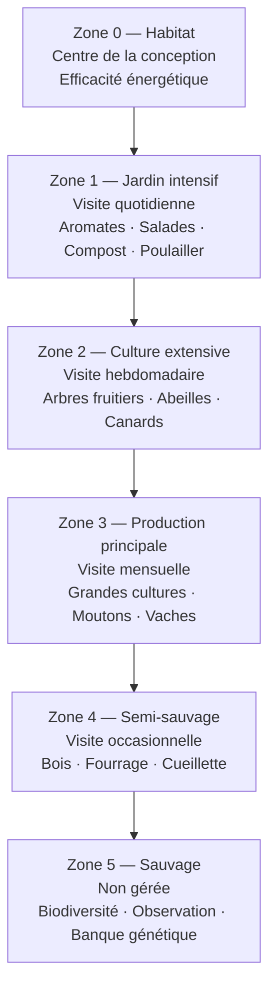
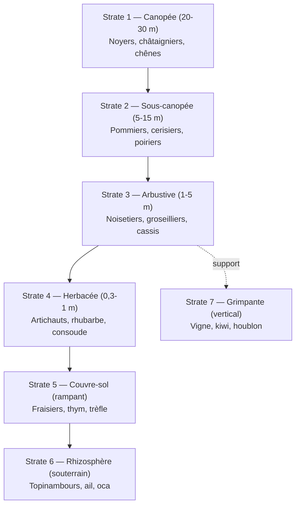
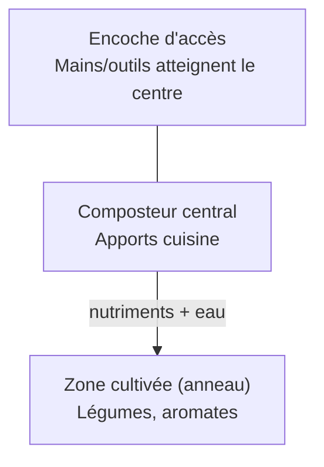

# Permaculture

## Objectifs d'apprentissage

À la fin de cette note, vous devriez être capable de :
- Situer l'origine historique et philosophique de la permaculture
- Énoncer les 3 éthiques fondatrices et les 12 principes de Holmgren avec un exemple chacun
- Cartographier un terrain selon le zonage 0-5
- Identifier la technique adaptée à un contexte donné (eau, sol, climat)
- Discuter les limites et critiques scientifiques de la démarche

## Origine et contexte

La permaculture est formalisée dans les années 1970 en Tasmanie par **Bill Mollison** (biologiste, 1928-2016) et son étudiant **David Holmgren**. Premier ouvrage commun : *Permaculture One* (1978). Le terme contracte initialement *permanent agriculture* puis s'élargit à *permanent culture* : la démarche dépasse la production alimentaire pour englober l'habitat, l'économie et l'organisation sociale.

**Définition** — Approche de conception (*design*) écologique fondée sur l'observation des écosystèmes naturels pour créer des systèmes humains durables, productifs et résilients. Ce n'est ni une technique agricole, ni un label, mais une **méthodologie de conception**.

**Filiations** — agroécologie, agroforesterie japonaise (Fukuoka), agriculture biologique, biomimétisme, écologie systémique d'Odum.

## Éthique fondatrice

Trois principes éthiques constituent le socle non négociable. Toute décision de conception doit y être conforme.

| Éthique | Portée | Exemple d'application |
|---|---|---|
| **Prendre soin de la Terre** | Sols, eaux, climat, biodiversité | Refus des intrants de synthèse, restauration de zones humides |
| **Prendre soin des humains** | Besoins fondamentaux pour tous | Habitat sain, sécurité alimentaire, lien social |
| **Partager équitablement** | Surplus, savoirs, ressources | Mutualisation d'outils, banques de semences libres |

## Les 12 principes de Holmgren

Chaque principe est accompagné d'un exemple concret pour ancrer la notion.

1. **Observer et interagir** — Suivre la course du soleil et les vents dominants pendant un an avant d'implanter une serre.
2. **Capter et stocker l'énergie** — Cuves de récupération d'eau de pluie, mare d'irrigation, mur trombe solaire.
3. **Créer une production** — Une haie brise-vent qui nourrit (fruits), abrite (oiseaux auxiliaires) et fertilise (feuilles mortes).
4. **Appliquer l'autorégulation et accepter le feedback** — Limiter la densité d'un poulailler pour éviter l'épuisement du sol.
5. **Utiliser et valoriser les ressources renouvelables** — Traction animale, BRF local, énergie solaire plutôt que mécanisation fossile.
6. **Ne pas produire de déchets** — Toilettes sèches → compost → arbres fruitiers ; eaux grises → phytoépuration.
7. **Concevoir des motifs avant les détails** — Tracer le bassin versant et les courbes de niveau avant de placer les parcelles.
8. **Intégrer plutôt que séparer** — Canards dans la rizière (anti-limaces + fumure + désherbage).
9. **Solutions lentes et petites** — Démarrer par 100 m² maîtrisés plutôt qu'un hectare ingérable.
10. **Utiliser et valoriser la diversité** — Cultiver 12 variétés anciennes de pommes plutôt qu'une monoculture de Golden.
11. **Utiliser les bordures et valoriser la marge** — La lisière forêt/prairie héberge plus d'espèces que chacun des milieux séparément (*effet de lisière*).
12. **Utiliser le changement et y réagir avec créativité** — Adapter les cultures aux nouvelles vagues de chaleur (variétés méridionales, ombrage agrivoltaïque).

## Zonage permaculturel

Les zones rayonnent depuis l'habitat selon la **fréquence de visite** et l'**intensité de gestion**. Plus on s'éloigne du centre, moins on intervient.



| Zone | Fréquence visite | Intensité gestion | Surface typique | Exemples |
|---|---|---|---|---|
| 0 | Permanente | Très forte | Habitat | Maison bioclimatique, atelier |
| 1 | Quotidienne | Forte | 50-200 m² | Aromates, salades, compost, poulailler |
| 2 | Hebdomadaire | Moyenne | 200 m² - 0,2 ha | Verger, ruches, petits élevages |
| 3 | Mensuelle | Modérée | 0,2 - 2 ha | Céréales, pâturages, gros élevage |
| 4 | Occasionnelle | Faible | Variable | Taillis, fourrage, cueillette |
| 5 | Quasi nulle | Aucune | Variable | Écosystème témoin, biodiversité |

Le zonage n'est pas une règle rigide : en milieu urbain, les zones se télescopent (un balcon = Z1 + Z2).

## Techniques de conception

### Guildes de plantes

Associations végétales mutualistes. La guilde mime la **niche écologique** : chaque plante remplit une fonction (support, fertilisation, protection, attraction de pollinisateurs).

**Les Trois Sœurs** (peuples amérindiens) :
- **Maïs** : tuteur vertical pour les haricots
- **Haricot** : fixation symbiotique d'azote (rhizobium) → fertilise le maïs
- **Courge** : couvre-sol → rétention d'humidité, suppression des adventices

**Guilde du pommier** (climat tempéré) : pommier + consoude (mobilisation potassium) + capucine (répulsif puceron) + ail (anti-fongique) + trèfle (azote) + bourrache (pollinisateurs).

### Forêt comestible (forest gardening)

Mimétisme d'une lisière forestière sur 7 strates étagées verticalement : auto-fertilité, biodiversité, résilience.



### Keyhole garden (jardin trou de serrure)

Butte circulaire (1,5-2 m de diamètre) avec une encoche d'accès en forme de clé et un composteur central. Optimise l'accès, la fertilisation et l'économie d'eau.



### Hugelkultur (buttes auto-fertiles)

Butte montée sur du bois en décomposition. Profil en coupe :

```
            ╱──────╲           ← Terre + paillage (10-20 cm)
           ╱ humus  ╲          ← Compost / fumier (20-30 cm)
          ╱  brindi  ╲         ← Petites branches, feuilles
         ╱  branches  ╲        ← Bois moyen
        ╱   troncs     ╲       ← Bois lourd, parfois enterré
       ─────sol décapé──────
```

**Bénéfices** : bois = éponge (rétention d'eau), chaleur de décomposition (saison allongée), libération lente de nutriments, durée 15-25 ans. **Limites** : faim d'azote la 1re année, à compenser par engrais verts.

### Swales (fossés de niveau)

Fossé creusé strictement perpendiculairement à la pente, sur une courbe de niveau. Ralentit le ruissellement, force l'infiltration, recharge les nappes. Souvent associé à une butte en aval plantée d'arbres.

```
   ▲ amont (pente)
   │
   │   ░░░░░░░░░░░░░  ← ruissellement ralenti
   │  ╱──fossé────╲   ← swale (creux)
   │ │    eau      │
   │  ╲___________╱
   │   🌳🌳🌳🌳🌳     ← butte plantée (en aval)
   ▼ aval
```

### Mulching (paillage)

Couverture permanente du sol par matière organique : paille, feuilles mortes, BRF, tontes.

**Bénéfices** : rétention d'humidité (-50 % d'arrosage), suppression des adventices, fertilisation progressive, protection thermique du sol, vie microbienne stimulée.

**Vigilance** : BRF de résineux à éviter (acidifiant), épaisseur 5-15 cm selon matériau.

## Glossaire

- **BRF** (*Bois Raméal Fragmenté*) : copeaux de jeunes branches feuillues (< 7 cm Ø), riches en lignine, qui régénèrent l'humus.
- **Guilde** : groupe d'espèces végétales aux relations mutualistes, organisé fonctionnellement.
- **Hugelkultur** : *culture sur butte* en allemand ; technique d'origine est-européenne.
- **Rhizosphère** : zone de sol (quelques millimètres) directement influencée par les exsudats racinaires.
- **Swale** : fossé d'infiltration sur courbe de niveau (terme anglais sans équivalent français unique).
- **Zonage** : organisation spatiale concentrique d'un site selon l'intensité de gestion.

## Limites et critiques

Pour développer un regard critique :

- **Base scientifique inégale** — peu d'études contrôlées sur certaines techniques (Hugelkultur, swales). La permaculture fonctionne mieux comme cadre de conception que comme corpus expérimental.
- **Scalabilité contestée** — modèle adapté aux petites exploitations diversifiées ; difficile à transposer en grandes cultures céréalières (logistique, mécanisation).
- **Main-d'œuvre intensive** — productivité par hectare souvent élevée, mais productivité par heure travaillée faible → modèle économique fragile sans circuit court ni travail bénévole.
- **Risque de dogmatisme** — les 12 principes peuvent devenir des slogans appliqués mécaniquement, à rebours du principe n°1 (observer).
- **Adaptation urbaine** — le zonage 0-5 perd sens en ville dense ; nécessite réinterprétation (toits, balcons, communs).

## Exercices d'application

1. **Cartographie** — Dessinez le zonage 0-5 d'une parcelle imaginaire de 5 000 m² incluant maison, verger, potager et bois.
2. **Conception de guilde** — Proposez une guilde de 5 espèces autour d'un cerisier en climat tempéré, en justifiant la fonction de chaque plante.
3. **Audit de déchets** — Listez 5 « déchets » de votre quotidien et trouvez pour chacun un usage cohérent avec le principe n°6.
4. **Analyse critique** — Choisissez 3 principes de Holmgren et utilisez-les pour analyser un échec agricole connu (Dust Bowl, monoculture de bananier Cavendish…).
5. **Comparaison** — Tableau comparatif permaculture / agriculture biologique / agroécologie selon 5 critères (intrants, échelle, certification, base scientifique, conception).

## Bibliographie

- Mollison, B. & Holmgren, D. (1978). *Permaculture One*. Transworld.
- Mollison, B. (1988). *Permaculture: A Designer's Manual*. Tagari Publications.
- Holmgren, D. (2002). *Permaculture: Principles and Pathways Beyond Sustainability*. Holmgren Design Services.
- Hemenway, T. (2009). *Gaia's Garden: A Guide to Home-Scale Permaculture*. Chelsea Green.
- Fukuoka, M. (1975). *La Révolution d'un seul brin de paille*. Guy Trédaniel.
- Hervé-Gruyer, P. & C. (2014). *Permaculture : Guérir la terre, nourrir les hommes*. Actes Sud.

## Liens

- [[Principes Fondamentaux]] — fondements de l'écologie (interactions, niches, successions) qui sous-tendent la conception permaculturelle
- [[Cycles Biogéochimiques]] — comprendre les cycles N, C, P, eau pour concevoir des systèmes auto-fertiles
- [[Biodiversité et Extinction]] — enjeu central du principe n°10 (valoriser la diversité)
- [[Cascades Trophiques et Espèces Clés]] — base théorique du rôle des auxiliaires dans les guildes
- [[Écosystèmes Majeurs]] — référentiels naturels imités par la forêt comestible
- [[Écologie Humaine]] — cadre d'analyse pour le volet *prendre soin des humains*
