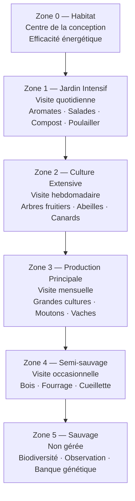

# Permaculture

### Principes Fondamentaux

**Définition**
La permaculture (permanent agriculture/culture) est une approche de conception écologique basée sur l'observation de la nature pour créer des systèmes durables, productifs et auto-suffisants.

**Éthique de la Permaculture**
1. **Prendre Soin de la Terre** : Préserver ressources, biodiversité
2. **Prendre Soin des Humains** : Besoins fondamentaux pour tous
3. **Partager Équitablement** : Distribution juste ressources, surplus

### 12 Principes de David Holmgren

1. **Observer et Interagir** : Comprendre avant d'agir
2. **Capter et Stocker l'Énergie** : Récolte eau pluie, solaire
3. **Créer une Production** : Chaque élément productif
4. **Appliquer l'Autorégulation** : Feedback, limites naturelles
5. **Utiliser Ressources Renouvelables** : Minimiser fossiles
6. **Ne Pas Produire de Déchets** : Tout déchet = ressource
7. **Conception d'Ensemble** : Patterns, détails secondaires
8. **Intégrer plutôt que Séparer** : Synergies entre éléments
9. **Solutions Lentes et Petites** : Changements progressifs
10. **Utiliser et Valoriser Diversité** : Résilience, stabilité
11. **Utiliser les Bordures** : Zones transition riches
12. **Créativité Face au Changement** : Adaptation, opportunités

### Zonage Permaculturel

Les zones rayonnent depuis l'habitat en fonction de la fréquence de visite et de l'intensité de gestion. Plus on s'éloigne du centre, moins on intervient.

**Zone 0** : Maison/habitat
- Centre design, efficacité énergétique

**Zone 1** : Jardin Intensif
- Visite quotidienne
- Herbes aromatiques, salades, légumes fréquents
- Compost, poulailler

**Zone 2** : Culture Extensive
- Visite hebdomadaire
- Arbres fruitiers, potager principal
- Petits animaux (abeilles, canards)

**Zone 3** : Production Principale
- Visite mensuelle
- Grandes cultures, pâturages
- Animaux pâturage (moutons, vaches)

**Zone 4** : Semi-sauvage
- Visite occasionnelle
- Bois, fourrage, cueillette sauvage
- Gestion minimale

**Zone 5** : Sauvage
- Non gérée
- Observation nature, biodiversité
- Banque génétique, inspiration

### Techniques Permaculturelles

**Guildes de Plantes**
- **Associations Bénéfiques** : Plantes se soutenant mutuellement
- **Exemple Classic** : "Trois Sœurs" (maïs, haricot, courge)
  - Maïs : Support haricots
  - Haricots : Fixation azote (racines)
  - Courge : Couvre-sol, rétention humidité

**Forêt Comestible (Forest Gardening)**
- **7 Strates** :
  1. Canopée : Arbres grands (noyers, châtaigniers)
  2. Sous-canopée : Arbres moyens (pommiers, cerisiers)
  3. Arbustive : Noisetiers, groseilliers
  4. Herbacée : Vivaces (artichauts, rhubarbe)
  5. Couvre-sol : Fraisiers, thym rampant
  6. Rhizosphère : Racines comestibles (topinambours)
  7. Grimpante : Vignes, kiwi, houblon
- **Mimétisme Forêt** : Biodiversité, auto-fertilité, résilience

**Keyhole Garden** (Jardin Trou de Serrure)
- **Forme** : Circulaire avec encoche accès
- **Centre** : Composteur intégré
- **Avantages** : Accès facile, fertilisation continue, économie eau

**Hugelkultur**
- **Technique** : Buttes sur bois décomposé
- **Avantages** : 
  - Rétention eau (bois = éponge)
  - Chaleur décomposition
  - Nutriments libérés lentement
  - Durée : 20+ ans

**Swales** (Fossés de Niveau)
- **Fonction** : Captation eau ruissellement
- **Conception** : Courbes de niveau
- **Bénéfices** : Infiltration eau, recharge nappe phréatique

**Mulching** (Paillage)
- **Matériaux** : Paille, feuilles, BRF (Bois Raméal Fragmenté)
- **Bénéfices** : 
  - Rétention humidité
  - Suppression adventices (mauvaises herbes)
  - Fertilisation (décomposition)
  - Protection sol (érosion, température)
