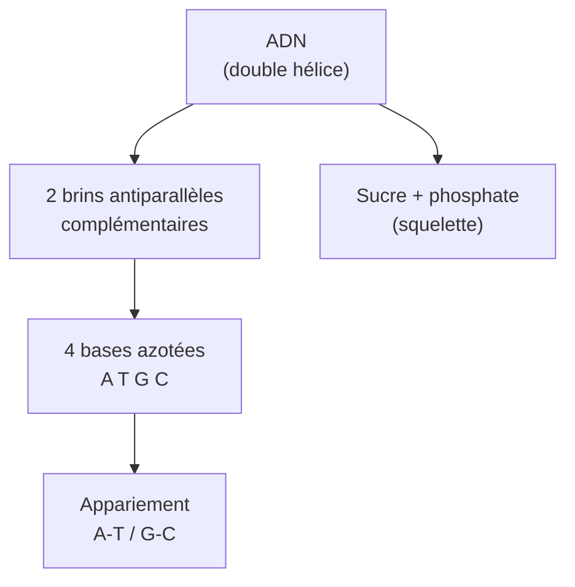
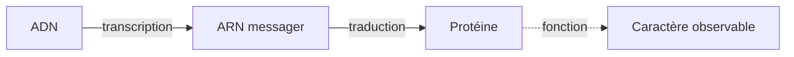

# Génétique

La génétique étudie comment les caractères se transmettent d'une génération à l'autre. Elle naît dans le jardin d'un monastère morave (Mendel, 1865), s'effondre puis renaît au début du XXe siècle, et explose après 1953 avec la découverte de la structure de l'ADN. Aujourd'hui, on sait lire un génome humain pour ~200 €, et on commence à le *réécrire*.

## L'ADN — la molécule de l'hérédité

**Le code à 4 lettres** :
- **A**dénine s'apparie avec **T**hymine (2 liaisons hydrogène)
- **G**uanine s'apparie avec **C**ytosine (3 liaisons hydrogène)

Cette complémentarité explique tout : la réplication (un brin sert de matrice pour l'autre) et la stabilité de l'information.

**Chiffres du génome humain** :
- ~3 milliards de paires de bases
- ~20 000 gènes codants (moins que le riz : ~32 000)
- 23 paires de chromosomes (46 au total)
- 99,9 % d'ADN identique entre deux humains quelconques

## Du gène à la protéine — le dogme central

Énoncé par Francis Crick en 1958. L'information circule dans un sens :

**Transcription** (dans le noyau) : une enzyme (ARN polymérase) recopie un gène d'ADN en ARN messager. L'ARN sort du noyau vers le cytoplasme.

**Traduction** (dans le cytoplasme) : les ribosomes lisent l'ARN par groupes de 3 bases (**codons**), chaque codon spécifiant un acide aminé. Les acides aminés s'enchaînent → protéine.

**Le code génétique** (universel pour presque tout le vivant) :
- 4 bases possibles, 3 par codon → 64 codons
- 20 acides aminés naturels
- Code « dégénéré » : plusieurs codons codent souvent le même acide aminé (redondance protectrice)
- 1 codon « start » (AUG, méthionine) et 3 codons « stop » (UAA, UAG, UGA)

| Codon | Acide aminé | Symbole |
|---|---|---|
| AUG | Méthionine (start) | M |
| UUU, UUC | Phénylalanine | F |
| GGU, GGC, GGA, GGG | Glycine | G |
| UAA, UAG, UGA | Stop | — |

## Génétique mendélienne — les lois de l'hérédité

Gregor Mendel (1822-1884), moine augustin, croise des pois dans son jardin de Brno et établit en 1866 les lois fondamentales — totalement ignoré pendant 35 ans, redécouvert en 1900.

### Les trois lois

**1. Uniformité des hybrides F1** — en croisant deux lignées pures (par ex. fleur pourpre × fleur blanche), tous les descendants F1 sont identiques (toutes pourpres si pourpre est dominant).

**2. Ségrégation des allèles** — quand on croise les F1 entre eux, on retrouve les deux caractères dans la F2 dans un rapport **3:1**.

**3. Assortiment indépendant** — pour deux caractères différents (couleur ET forme), les allèles se transmettent indépendamment (rapport 9:3:3:1 en F2).

### Vocabulaire de base

| Terme | Définition | Exemple |
|---|---|---|
| **Gène** | Séquence d'ADN codant un caractère | Le gène de la couleur des yeux |
| **Allèle** | Variante d'un gène | Allèle « yeux bleus » vs « yeux marron » |
| **Locus** | Emplacement d'un gène sur un chromosome | Locus du gène ABO sur le chromosome 9 |
| **Homozygote** | Deux allèles identiques | AA ou aa |
| **Hétérozygote** | Deux allèles différents | Aa |
| **Génotype** | Combinaison d'allèles | Aa |
| **Phénotype** | Caractère observé | Œil marron |
| **Dominant** | Caractère qui s'exprime à l'état hétérozygote | A (majuscule) |
| **Récessif** | Caractère masqué par le dominant | a (minuscule) |

**Exemple appliqué — Groupe sanguin ABO** :
- 3 allèles : A, B, O
- A et B codominants entre eux ; O récessif
- Génotype AA ou AO → phénotype A
- Génotype BB ou BO → phénotype B
- Génotype AB → phénotype AB (les deux s'expriment)
- Génotype OO → phénotype O

## Mutations — quand le code change

Modification de la séquence d'ADN. Peut être neutre, bénéfique ou pathogène.

| Type | Mécanisme | Conséquence |
|---|---|---|
| **Substitution** | Une base remplacée par une autre | Souvent silencieuse (code dégénéré), parfois grave (drépanocytose : A→T qui change un acide aminé) |
| **Insertion / Délétion** | Ajout/suppression de bases | Décale tout le cadre de lecture (« frameshift ») — généralement catastrophique |
| **Duplication** | Région copiée | Origine de nouveaux gènes au cours de l'évolution |
| **Translocation** | Échange entre chromosomes | Chromosome Philadelphie → leucémie myéloïde chronique |

## Maladies génétiques — exemples

| Maladie | Mode de transmission | Mécanisme |
|---|---|---|
| **Drépanocytose** | Autosomique récessive | Mutation ponctuelle du gène HBB → hémoglobine S → globules rouges en faucille |
| **Mucoviscidose** | Autosomique récessive | Mutation CFTR (delta-F508 surtout) → mucus épais → infections pulmonaires |
| **Maladie de Huntington** | Autosomique dominante | Répétition CAG anormale → dégénérescence neurologique apparaissant à 30-50 ans |
| **Hémophilie A** | Récessive liée à X | Déficit facteur VIII → saignements. Cf. [[Hémophilie]] |
| **Daltonisme** | Récessive liée à X | Gène des opsines → 8 % des hommes, 0,5 % des femmes |
| **Trisomie 21** | Anomalie chromosomique | Trois copies du chromosome 21 (au lieu de 2) |

**Cas particulier des maladies liées à X** : transmises par des mères porteuses saines à leurs fils (qui n'ont qu'un X). Explique pourquoi l'hémophilie a frappé les familles royales d'Europe via la reine Victoria.

## Au-delà de Mendel

### Épigénétique

L'expression des gènes peut être modifiée sans changer l'ADN — par **méthylation** de l'ADN ou modification des **histones** (protéines autour desquelles l'ADN s'enroule). Ces marques épigénétiques peuvent être influencées par l'environnement (stress, alimentation) et parfois être transmises sur une génération.

**Cas célèbre** : étude de l'**hiver de la faim** néerlandais (1944-1945). Les enfants conçus pendant cette famine ont des marques épigénétiques modifiées que l'on retrouve encore chez leurs petits-enfants — preuve d'une transmission transgénérationnelle.

### Génie génétique

La capacité technique à *réécrire* l'ADN :

| Outil | Date | Principe |
|---|---|---|
| **Recombinaison ADN** | 1973 | Coupe-colle avec des enzymes de restriction → bactéries produisant l'insuline humaine (1978) |
| **PCR** (Polymerase Chain Reaction) | 1985 (Mullis, Nobel 1993) | Amplifier exponentiellement un fragment d'ADN — révolutionne les tests génétiques et la criminalistique |
| **CRISPR-Cas9** | 2012 (Doudna & Charpentier, Nobel 2020) | « Ciseaux » programmables guidés par ARN — édition précise du génome |

Première thérapie CRISPR approuvée : *Casgevy* (drépanocytose, 2023). Coût initial : ~2,2 millions de dollars par patient.

### Génomique

Séquencer non plus un gène, mais des génomes entiers.
- **Projet génome humain** (1990-2003) : 3 milliards de $, 13 ans. Premier génome humain complet.
- Aujourd'hui : ~200 €, quelques jours. Diagnostic prénatal, médecine personnalisée, cancérologie.
- **Génome de Néandertal** (Pääbo, Nobel 2022) : reconstruit à partir d'os fossiles, montre que 1-4 % de notre ADN est néandertalien.

## Applications et enjeux

- **Médecine personnalisée** : adapter le traitement au génotype (oncologie de précision, pharmacogénétique)
- **Tests génétiques** : grand public (23andMe, MyHeritage) — débat sur la confidentialité
- **Thérapie génique** : remplacer un gène défectueux (rétinite pigmentaire, atrophie spinale)
- **OGM agricoles** : maïs Bt résistant aux insectes, riz doré enrichi en vitamine A
- **Éthique** : modifications embryonnaires (affaire He Jiankui, 2018), brevets sur le vivant, discrimination génétique

La génétique est passée en un siècle d'une discipline théorique à un outil de transformation du vivant. Voir [[Enjeux Contemporains]] pour les débats éthiques actuels.
