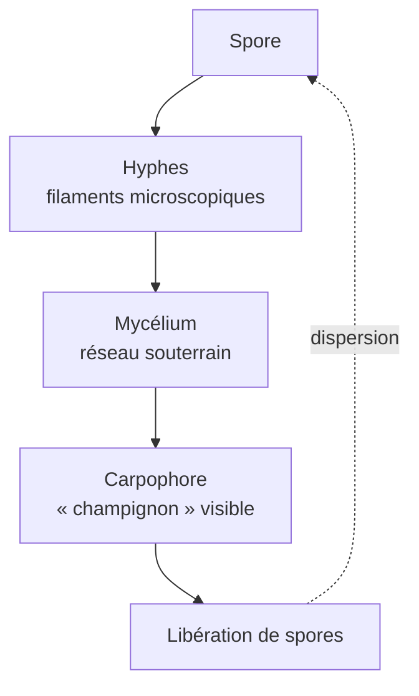
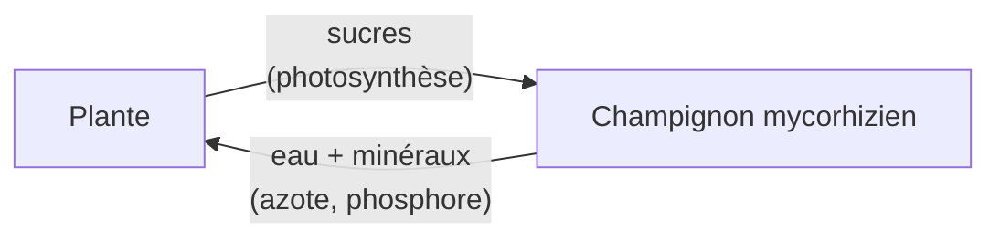

# Mycologie

La mycologie est l'étude des **champignons**. Longtemps classés à tort parmi les plantes, ils forment un **règne biologique à part** (Fungi), plus proche évolutivement des animaux que des végétaux — nous partageons un ancêtre commun avec eux il y a environ 1 milliard d'années. On estime à 2-4 millions le nombre d'espèces fongiques, dont seulement ~150 000 sont décrites.

## Ce qu'est un champignon

Contrairement à l'image populaire (le « champignon » = le chapeau sur tige), ce qu'on cueille n'est que l'**organe reproducteur** — l'organisme entier est un réseau souterrain.

**Caractéristiques uniques** :

| Trait | Champignons | Plantes | Animaux |
|---|---|---|---|
| Type de cellule | Eucaryote | Eucaryote | Eucaryote |
| Paroi cellulaire | **Chitine** (comme les insectes) | Cellulose | Aucune |
| Nutrition | Hétérotrophe par **absorption** | Autotrophe (photosynthèse) | Hétérotrophe par ingestion |
| Mobilité | Immobile | Immobile | Mobile |

Le fait que la paroi soit en chitine — la même molécule que la carapace des crustacés — est un indice de la parenté évolutive entre champignons et animaux.

## Classification des grands groupes

| Embranchement | Caractéristiques | Exemples |
|---|---|---|
| **Zygomycètes** | Hyphes sans cloisons, reproduction par zygospores | Mucor (moisissure du pain), Rhizopus |
| **Ascomycètes** | Spores dans des asques (sacs) | Levures (*Saccharomyces*), morilles, truffes, pénicillium |
| **Basidiomycètes** | Spores sur des basides (massues) | Champignons à chapeau classiques : cèpes, amanites, agarics |
| **Chytridiomycètes** | Spores flagellées, aquatiques | *Batrachochytrium* (responsable du déclin mondial des amphibiens) |

## Rôles écologiques — sans eux, pas de forêt

Les champignons sont les **grands recycleurs** de la biosphère. Sans eux, les feuilles mortes et le bois s'accumuleraient indéfiniment.

### Décomposeurs

Les champignons saprotrophes sécrètent des enzymes (cellulases, ligninases) qui dégradent la matière organique morte. Ils sont les **seuls organismes** capables de décomposer la **lignine** du bois — sans eux, les troncs morts ne pourriraient jamais. Quand cette capacité est apparue (~300 Ma), elle a stoppé l'accumulation de bois qui formait jusque-là le charbon.

### Mycorhizes — la symbiose qui nourrit les forêts

~90 % des plantes terrestres vivent en symbiose avec des champignons à leurs racines.

Le mycélium étend la surface d'absorption racinaire d'un facteur 100 à 1 000. Cas extrême : la **truffe noire du Périgord** (*Tuber melanosporum*) pousse exclusivement en symbiose avec le chêne ou le noisetier — d'où l'impossibilité de la cultiver hors sol.

### Le « Wood Wide Web »

Les recherches de Suzanne Simard (années 1990, confirmées depuis) ont montré que les mycéliums forment un réseau qui **relie les arbres entre eux** : ils s'échangent du carbone, de l'eau, et même des signaux chimiques d'alerte (insectes ravageurs, sécheresse). Une forêt mature n'est pas une collection d'arbres mais un **superorganisme**.

### Lichens

Symbiose champignon + algue (ou cyanobactérie) — le champignon fournit la structure et capte l'eau, l'algue fait la photosynthèse. Les lichens colonisent des milieux extrêmes (toundra, rochers nus) inaccessibles à d'autres organismes.

## Champignons pathogènes

### Pour l'humain

| Maladie | Champignon | Gravité |
|---|---|---|
| Candidose | *Candida albicans* | Bénigne (muqueuses) à mortelle (sang, immunodéprimés) |
| Teigne | *Trichophyton* | Bénigne (peau, cheveux) |
| Aspergillose | *Aspergillus fumigatus* | Grave chez les immunodéprimés |
| Cryptococcose | *Cryptococcus neoformans* | Méningite chez les patients VIH+ |

L'OMS a publié en 2022 sa **première liste de pathogènes fongiques prioritaires** : ~3,8 millions de morts/an liés directement ou indirectement à des infections fongiques.

### Pour les plantes

Beaucoup des grandes famines historiques sont dues à des champignons :
- *Phytophthora infestans* — mildiou de la pomme de terre, **Grande Famine d'Irlande** (1845-1852, ~1 million de morts)
- *Puccinia graminis* — rouille du blé, menace toujours actuelle (souche Ug99)
- *Claviceps purpurea* — ergot du seigle, responsable de l'« ergotisme » médiéval (« feu de Saint-Antoine ») et possiblement des « possessions » de Salem

### Pour les animaux

- **Chytridiomycose** (*Batrachochytrium*) : extinction ou déclin de >500 espèces d'amphibiens depuis les années 1980 — l'une des pires pandémies de l'histoire de la vie sauvage
- **Syndrome du nez blanc** : décime les chauves-souris nord-américaines

## Utilisations humaines

### Alimentation

- **Levures** : pain, bière, vin (fermentation alcoolique et panaire — 8 000 ans d'usage)
- **Champignons comestibles** : cèpes, morilles, truffes, shiitake, pleurotes, champignon de Paris
- **Fermentations asiatiques** : sauce soja, miso, tempeh, koji (*Aspergillus oryzae*)
- **Fromages affinés** : Roquefort (*Penicillium roqueforti*), Camembert (*P. camemberti*)

### Médecine

- **Pénicilline** (Fleming, 1928 — de *Penicillium*) : premier antibiotique, a sauvé des centaines de millions de vies
- **Statines** (anti-cholestérol) : à l'origine isolées d'*Aspergillus*
- **Ciclosporine** : immunosuppresseur indispensable aux greffes, isolée d'un champignon norvégien (1972)
- **Psilocybine** (champignons hallucinogènes) : recherches récentes en psychiatrie (dépression résistante, fin de vie)

### Biotechnologie

Production industrielle d'enzymes (lessives, alimentaire), de biocarburants, de bioplastiques. Le mycélium est étudié comme **matériau de construction** (Ecovative, Mycelium Bricks) — alternative au polystyrène ou au cuir.

## Champignons toxiques — savoir reconnaître

| Espèce | Toxine | Effet |
|---|---|---|
| **Amanite phalloïde** (*Amanita phalloides*) | Amatoxines | Mortelle — détruit le foie en 48-72 h. Pas d'antidote spécifique. Responsable de >90 % des décès par champignons. |
| **Amanite tue-mouches** (*A. muscaria*) | Muscarine, ibotenique | Hallucinogène, rarement mortelle |
| **Cortinaire des montagnes** (*Cortinarius orellanus*) | Orellanine | Insuffisance rénale (effet retardé de plusieurs jours) |
| **Gyromitre** (*Gyromitra esculenta*) | Gyromitrine | Toxique, jadis considéré comestible |

**Règle d'or** : ne jamais consommer un champignon sans identification certaine — la confusion entre l'**amanite phalloïde** (mortelle) et certains **agarics** comestibles est responsable de la majorité des intoxications graves chaque automne en Europe.
