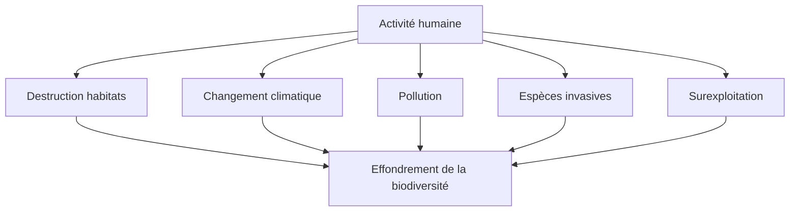

# Enjeux Contemporains en Biologie

La biologie du XXIe siècle est sortie du laboratoire. Elle décide aujourd'hui de débats publics majeurs : peut-on modifier un embryon humain ? Comment ralentir la sixième extinction ? Faut-il breveter une séquence d'ADN ? Quatre grands fronts structurent ces enjeux.

## Biotechnologie — réécrire le vivant

Depuis les années 2010, plusieurs technologies permettent de manipuler le vivant à une précision sans précédent.

| Technologie | Principe | Promesse | Risque |
|---|---|---|---|
| **CRISPR-Cas9** (2012) | « Ciseaux moléculaires » qui coupent l'ADN à un endroit précis | Corriger des maladies génétiques (drépanocytose, mucoviscidose) | Modifications héréditaires non maîtrisées — affaire He Jiankui (Chine, 2018, bébés génétiquement modifiés) |
| **Cellules souches iPSC** (2006, Yamanaka, Nobel 2012) | Reprogrammer une cellule adulte en cellule pluripotente | Médecine régénérative (reconstituer un tissu, une rétine, un cœur) | Risque de tumeurs, coût, délais |
| **Viande cultivée** | Multiplier des cellules musculaires animales en bioréacteur | Viande sans abattage, faible empreinte carbone | Coût, acceptabilité culturelle, dépendance énergétique |
| **Biologie synthétique** | Concevoir des organismes au génome écrit *de novo* | Bactéries qui produisent insuline, biocarburants, médicaments | Dissémination, sécurité, usage militaire |

**Cas emblématique CRISPR** — En 2023, la FDA américaine et la MHRA britannique ont approuvé *Casgevy*, première thérapie CRISPR commercialisée, qui traite la drépanocytose. Coût : ~2,2 millions de dollars par patient. La technologie marche — la question devient *qui y aura accès ?*

## Santé publique — pandémies et résistances

### Pandémies

- **COVID-19** (2020-2023) : ~7 millions de morts officiels, probablement 15-20 millions en surmortalité. Premier déploiement à grande échelle de vaccins ARN messager (Pfizer-BioNTech, Moderna), validant trente ans de recherche de Katalin Karikó (Nobel 2023).
- **Grippe aviaire H5N1** : circule chez les bovins américains depuis 2024, premiers cas humains aux États-Unis — surveillance OMS niveau élevé.
- **Préparation aux futures pandémies** : projet *100 Days Mission* (G7) — avoir un vaccin disponible dans les 100 jours suivant l'identification d'un nouveau pathogène.

### Résistance aux antibiotiques

L'OMS classe la résistance antimicrobienne (AMR) parmi les **dix principales menaces sanitaires mondiales**. Estimation 2024 : ~1,3 million de morts par an directement attribuables à AMR — projection 10 millions/an d'ici 2050 si rien ne change.

**Causes** :
- Usage massif d'antibiotiques en élevage (~70 % de la consommation mondiale)
- Prescriptions humaines abusives (rhumes viraux traités par antibiotiques)
- Sous-investissement R&D (aucune nouvelle classe majeure depuis 1987)

### Maladies chroniques

| Maladie | Cas mondiaux (2024) | Tendance |
|---|---|---|
| Diabète | ~540 millions (1 adulte sur 10) | en hausse, urbanisation, alimentation |
| Cancer | ~20 millions nouveaux cas/an | survie en hausse dans les pays riches, mortalité stable |
| Alzheimer / démences | ~55 millions | x3 d'ici 2050 (vieillissement) — voir [[Alzheimer]] |

## Conservation — la sixième extinction

Les biologistes parlent de **sixième extinction de masse** (après celle du Crétacé-Paléogène qui a éliminé les dinosaures il y a 66 Ma). Cette fois, la cause est une espèce vivante : nous.

**Chiffres clés (rapport IPBES 2019, actualisé 2024)** :
- ~1 million d'espèces menacées d'extinction (sur ~8 millions estimées)
- Populations de vertébrés sauvages : -69 % entre 1970 et 2018 (*Living Planet Report*, WWF)
- Insectes : -75 % de biomasse dans certaines régions allemandes étudiées (Hallmann et al., 2017)

**Réponses internationales** :
- *Convention sur la diversité biologique* — objectif « 30 × 30 » (protéger 30 % des terres et mers d'ici 2030)
- Restauration : reforestation, réintroduction d'espèces (loup, bison d'Europe)
- Banque de semences de Svalbard (Norvège) : sauvegarde génétique des plantes cultivées

## Éthique — qui décide ?

Les biotechnologies posent des questions que ni les scientifiques seuls ni les politiques seuls ne peuvent trancher.

| Sujet | Question | État du débat |
|---|---|---|
| **OGM agricoles** | Sécurité alimentaire vs perte de souveraineté paysanne | Autorisés aux USA et Amérique, restreints en UE (sauf 2024 : assouplissement pour les nouvelles techniques d'édition) |
| **Édition génomique embryonnaire** | Soigner une maladie ou ouvrir la voie aux « bébés sur mesure » ? | Moratoire international de fait depuis 2018 |
| **Clonage humain** | Possibilité technique, mais interdit partout | Pas de cas connu, débat plus théorique |
| **Brevets sur le vivant** | Peut-on s'approprier une séquence d'ADN ? | Arrêt *Myriad* (Cour suprême US, 2013) : l'ADN naturel n'est pas brevetable, l'ADN synthétisé oui |
| **Données génétiques personnelles** | Tests grand public (23andMe, MyHeritage) — qui possède l'info ? | Faille 23andMe 2023 : 6,9 millions de comptes piratés |

Le point commun de ces enjeux : la biologie n'est plus seulement une science *descriptive* de la nature, elle devient une science *prescriptive* qui doit décider quel vivant nous voulons. Le biologiste est désormais aussi un citoyen.
