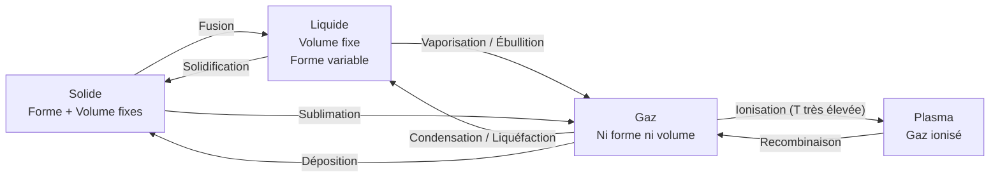
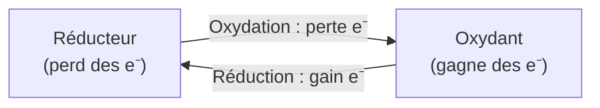

# Concepts fondamentaux


### Structure atomique

- **Atome** : Noyau (protons + neutrons) + électrons
- **Numéro atomique** (Z) : Nombre de protons
- **Masse atomique** (A) : Protons + neutrons
- **Isotopes** : Même Z, A différent

### Tableau périodique

**Organisation des éléments par propriétés**

**Groupes** (colonnes) :
- Groupe 1 : Alcalins (Li, Na, K...)
- Groupe 2 : Alcalino-terreux (Mg, Ca...)
- Groupe 17 : Halogènes (F, Cl, Br, I)
- Groupe 18 : Gaz nobles (He, Ne, Ar...)

**Périodes** (lignes) : Couches électroniques

**Métaux** vs **Non-métaux** vs **Métalloïdes**

### Liaisons chimiques

**Liaison covalente** : Partage d'électrons
- Simple, double, triple
- Polaire ou apolaire

**Liaison ionique** : Transfert d'électrons
- Cation + anion
- Cristaux ioniques (NaCl)

**Liaison métallique** : Mer d'électrons délocalisés

**Liaisons faibles** :
- Liaison hydrogène (H₂O, ADN)
- Forces de Van der Waals
- Interactions dipôle-dipôle

### États de la matière



- **Solide** : Forme et volume définis
- **Liquide** : Volume défini, forme variable
- **Gaz** : Ni forme ni volume définis
- **Plasma** : Gaz ionisé

### Réactions chimiques

**Équation chimique** :
```
Réactifs → Produits
```

**Types de réactions** :
- **Synthèse** : A + B → AB
- **Décomposition** : AB → A + B
- **Substitution** : AB + C → AC + B
- **Double déplacement** : AB + CD → AD + CB
- **Combustion** : CₓHᵧ + O₂ → CO₂ + H₂O

**Loi de conservation de la masse** (Lavoisier) :
"Rien ne se perd, rien ne se crée, tout se transforme"

### Stœchiométrie

**Calculs quantitatifs des réactions**

**Mole** (mol) : 6,022 × 10²³ entités (nombre d'Avogadro)

**Masse molaire** : Masse d'une mole (g/mol)

**Calculs** :
```
n = m / M
n = C × V
```

### Thermochimie

**Énergie des réactions**

**Réaction exothermique** : Dégage de la chaleur (ΔH < 0)
- Combustion

**Réaction endothermique** : Absorbe de la chaleur (ΔH > 0)
- Photosynthèse

**Enthalpie de formation** : Énergie pour former 1 mol à partir des éléments

### Cinétique chimique

**Vitesse des réactions**

**Facteurs** :
- Concentration
- Température
- Catalyseur
- Surface de contact

**Loi de vitesse** :
```
v = k [A]ᵐ [B]ⁿ
```

**Énergie d'activation** (Ea) : Énergie minimale pour réagir

**Catalyseur** : Diminue Ea, accélère la réaction

### Équilibre chimique

**Réaction réversible** :
```
A + B ⇌ C + D
```

**Constante d'équilibre** (K) :
```
K = [C][D] / [A][B]
```

**Principe de Le Chatelier** :
- Système à l'équilibre perturbé → déplacement pour contrer

### Acides et bases

**Théorie de Brønsted-Lowry** :
- **Acide** : Donneur de proton (H⁺)
- **Base** : Accepteur de proton

**pH** :
```
pH = -log[H⁺]
```
- pH < 7 : Acide
- pH = 7 : Neutre
- pH > 7 : Basique

**Acides forts** : HCl, H₂SO₄, HNO₃
**Bases fortes** : NaOH, KOH

**Tampon** : Résiste aux variations de pH

### Oxydoréduction

**Transfert d'électrons**



**Oxydation** : Perte d'électrons
**Réduction** : Gain d'électrons

**Nombre d'oxydation** : Charge apparente

**Demi-réactions** :
```
Oxydation : Fe → Fe²⁺ + 2e⁻
Réduction : Cu²⁺ + 2e⁻ → Cu
```

**Applications** :
- Piles et batteries
- Électrolyse
- Corrosion

