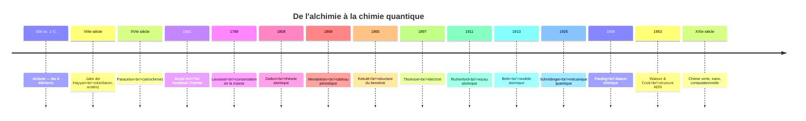

# Histoire de la Chimie

La chimie est l'une des sciences les plus tardives à émerger en tant que discipline rationnelle — il a fallu deux mille ans pour passer de l'alchimie médiévale au tableau de Mendeleïev, et un siècle de plus pour comprendre que les atomes ne sont pas indivisibles. Cette histoire est jalonnée d'observations patientes, de paris théoriques audacieux et de quelques découvertes faites par accident.

## Frise des grandes étapes

## Tableau récapitulatif des découvertes majeures

| Date | Chimiste | Découverte | Impact |
|---|---|---|---|
| ~VIIIe | Jabir ibn Hayyan | Distillation, acides forts | Outils de laboratoire toujours utilisés |
| 1661 | Robert Boyle | Critique des 4 éléments d'Aristote | Naissance de la méthode expérimentale |
| 1774 | Joseph Priestley | Isolation de l'oxygène (« air déphlogistiqué ») | Préfigure Lavoisier |
| 1789 | Antoine Lavoisier | Loi de conservation de la masse, rôle de l'oxygène | Fondation de la chimie moderne |
| 1808 | John Dalton | Théorie atomique moderne | Cadre de toute la chimie ultérieure |
| 1828 | Friedrich Wöhler | Synthèse de l'urée à partir de matière inorganique | Effondrement du vitalisme |
| 1865 | August Kekulé | Structure cyclique du benzène | Fondation de la chimie organique structurale |
| 1869 | Dmitri Mendeleïev | Tableau périodique | Classification prédictive des éléments |
| 1874 | Van 't Hoff & Le Bel | Stéréochimie (carbone tétraédrique) | Compréhension des isomères |
| 1897 | J.J. Thomson | Électron | L'atome n'est pas indivisible |
| 1898 | Marie Curie | Polonium, radium | Chimie nucléaire |
| 1911 | Ernest Rutherford | Noyau atomique | Modèle planétaire de l'atome |
| 1913 | Niels Bohr | Modèle quantique de l'atome | Lien chimie-physique quantique |
| 1928 | Alexander Fleming | Pénicilline (par accident) | Premier antibiotique |
| 1939 | Linus Pauling | *The Nature of the Chemical Bond* | Théorie moderne de la liaison |
| 1953 | Watson, Crick, Franklin | Structure double hélice ADN | Naissance de la biologie moléculaire |
| 2012 | Doudna & Charpentier | CRISPR-Cas9 | Édition génomique (chimie + biologie) |

## Alchimie et débuts (Antiquité - XVIIe siècle)
Les origines de la chimie remontent aux pratiques alchimiques de l'Antiquité et du Moyen Âge. Les alchimistes, bien que motivés par la quête mythique de la transmutation des métaux en or et de l'élixir de vie, développent des techniques fondamentales : distillation, calcination, sublimation, cristallisation.

Les alchimistes arabes comme **Jabir ibn Hayyan** (Geber, VIIIe siècle) perfectionnent les équipements de laboratoire et découvrent des acides importants. **Paracelse** (XVIe siècle) introduit l'idée que la chimie devrait servir la médecine (iatrochimie), préfigurant la chimie pharmaceutique moderne.

## Naissance de la Chimie Moderne (XVIIe - XVIIIe siècle)
**Robert Boyle** (1627-1691) établit les fondements de la méthode scientifique en chimie, rejetant les quatre éléments aristotéliciens au profit d'une approche expérimentale rigoureuse. Son "The Sceptical Chymist" (1661) marque la transition de l'alchimie à la chimie.

**Antoine Lavoisier** (1743-1794), le "père de la chimie moderne", révolutionne la discipline en démontrant la **loi de conservation de la masse** : "Rien ne se perd, rien ne se crée, tout se transforme." En identifiant l'oxygène et en réfutant la théorie du phlogistique, il établit une nomenclature chimique systématique encore en usage. Sa décapitation pendant la Terreur (1794) prive la science d'un génie à l'apogée de sa carrière.

## Théorie Atomique et Structure (XIXe siècle)
**John Dalton** (1766-1844) propose en 1808 la théorie atomique moderne : la matière est composée d'atomes indivisibles, chaque élément possède des atomes identiques, les composés résultent de combinaisons d'atomes en proportions fixes.

**Dmitri Mendeleïev** (1834-1907) révolutionne la chimie en 1869 avec son **tableau périodique**, organisant les éléments par masse atomique croissante et regroupant ceux aux propriétés similaires. Son génie : laisser des cases vides pour des éléments non encore découverts et prédire leurs propriétés. Les découvertes ultérieures du gallium (1875), du scandium (1879) et du germanium (1886) confirment spectaculairement ses prédictions.

**Friedrich Kekulé** (1829-1896) élucide la structure du benzène (C₆H₆) en 1865, introduisant le concept de cycle aromatique fondamental pour la chimie organique. Selon la légende, la structure lui serait apparue en rêve sous forme d'un serpent se mordant la queue (ouroboros).

**Jacobus van 't Hoff** (1852-1911) et **Joseph Le Bel** (1847-1930) proposent indépendamment en 1874 la chimie stéréochimique : les atomes de carbone sont tétraédriques dans l'espace, expliquant les isomères optiques.

## Chimie Quantique et Moderne (XXe siècle)
La découverte de l'électron (Thomson, 1897), du noyau atomique (Rutherford, 1911), et le modèle quantique de l'atome (Bohr, 1913; Schrödinger, 1926) transforment profondément la compréhension de la structure atomique et moléculaire.

**Linus Pauling** (1901-1994) révolutionne la compréhension de la liaison chimique avec son concept d'**électronégativité** et sa théorie de la résonance. Son livre "The Nature of the Chemical Bond" (1939) devient la bible de la chimie structurale. Pauling reste l'un des deux seuls individus (avec Marie Curie) à recevoir deux prix Nobel non partagés (Chimie 1954, Paix 1962).

**Marie Curie** (1867-1934), pionnière de la radioactivité, isole le radium et le polonium, ouvrant l'ère de la chimie nucléaire. Première femme Prix Nobel, seule personne à recevoir des Nobel dans deux sciences différentes (Physique 1903, Chimie 1911).

**Dorothy Hodgkin** (1910-1994) utilise la cristallographie aux rayons X pour élucider les structures tridimensionnelles de molécules complexes comme la pénicilline, la vitamine B12 et l'insuline, révolutionnant la biochimie structurale.

## Ère Contemporaine (XXIe siècle)
La chimie moderne se caractérise par la nanotechnologie, la chimie computationnelle, la chimie verte (durabilité), et la chimie supramoléculaire. La capacité à manipuler la matière à l'échelle atomique et à concevoir des molécules sur ordinateur ouvre des possibilités révolutionnaires en médecine, matériaux et énergie.

