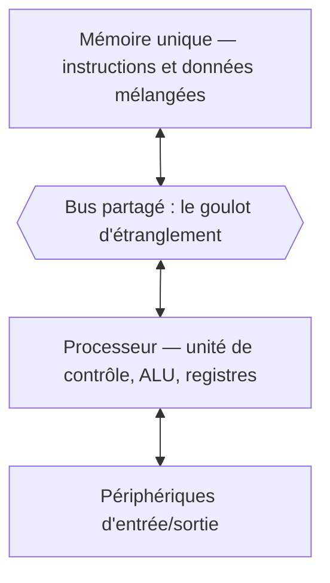

# Architecture des Processeurs

Un processeur exécute des instructions. Dit ainsi, le sujet paraît simple, et il l'était : le 8086 de 1978 lisait une instruction, l'exécutait, passait à la suivante. Un cœur moderne fait la même chose — avec quelque chose comme un milliard de transistors de plus. Cette note cherche à expliquer où sont passés ces transistors.

La réponse tient en un fait unique, et tout le reste en découle.

> [!important] Idée clé — le mur de la mémoire
> Depuis quarante ans, la vitesse des processeurs a crû bien plus vite que celle de la mémoire. Un cœur actuel exécute plusieurs instructions par nanoseconde ; un accès à la mémoire principale coûte environ cent nanosecondes. Le processeur peut donc passer **plusieurs centaines de cycles à ne rien faire** en attendant une donnée.
>
> Presque tout ce qui distingue un processeur moderne d'un 8086 est une réponse à ce déséquilibre. Caches, pipeline, exécution hors ordre, spéculation, préchargement, multithreading matériel, et jusqu'au GPU : ce ne sont pas sept inventions indépendantes, ce sont sept réponses à une seule question — **que faire du processeur pendant qu'il attend ?** Lire la suite comme un catalogue de fonctionnalités, c'est en manquer la logique.

## Le modèle de base et son goulot

L'architecture de von Neumann, proposée en 1945, range instructions et données dans une même mémoire, atteinte par un même bus.



Le **goulot de von Neumann** est là : un seul chemin pour aller chercher l'instruction *et* la donnée sur laquelle elle opère. Tant que processeur et mémoire allaient à la même vitesse, la contrainte restait théorique. Elle est devenue la contrainte dominante.

L'**architecture Harvard** sépare physiquement les deux mémoires, ce qui permet d'y accéder simultanément. Elle reste la règle sur les microcontrôleurs et les DSP, où le déterminisme prime — voir [[Systèmes Embarqués]]. Les processeurs généralistes ont retenu un compromis : une mémoire unique, mais des caches de premier niveau séparés, `L1i` pour les instructions et `L1d` pour les données. Harvard au plus près du cœur, von Neumann au-delà.

## Ce qu'il y a dans un cœur

**L'unité arithmétique et logique (ALU)** effectue les opérations entières : addition, soustraction, opérations booléennes, décalages, comparaisons. Les calculs à virgule flottante reviennent à une unité distincte, la FPU, et les opérations vectorielles à des unités SIMD. Le détail des représentations manipulées figure dans [[Systèmes Numériques]].

**L'unité de contrôle** lit l'instruction désignée par le compteur ordinal, la décode et pilote les autres unités.

**Les registres** sont les seuls emplacements où le processeur calcule réellement. Ils sont peu nombreux — seize registres généraux sur x86-64 — et cette rareté est la contrainte structurante de la programmation bas niveau. La table complète des registres x86-64, de leurs sous-registres et de leurs rôles conventionnels figure dans [[Assembleur x86-64]].

| Registre | Rôle |
|---|---|
| `rax` – `rdx`, `rsi`, `rdi`, `r8` – `r15` | Usage général, avec des conventions d'appel par rôle |
| `rsp` | Sommet de la pile |
| `rbp` | Base du cadre de pile courant |
| `rip` | Compteur ordinal : adresse de la prochaine instruction |
| `rflags` | Drapeaux positionnés par les comparaisons et les calculs |

## Réponse 1 — le pipeline : ne pas attendre la fin pour commencer

Exécuter une instruction se décompose en étapes qui mobilisent des circuits différents. Plutôt que de laisser quatre étages inactifs pendant que le cinquième travaille, on les enchaîne comme une chaîne de montage.

| Cycle | 1 | 2 | 3 | 4 | 5 | 6 | 7 |
|---|---|---|---|---|---|---|---|
| Instruction 1 | IF | ID | EX | MEM | WB | | |
| Instruction 2 | | IF | ID | EX | MEM | WB | |
| Instruction 3 | | | IF | ID | EX | MEM | WB |

`IF` lecture de l'instruction, `ID` décodage et lecture des registres, `EX` exécution, `MEM` accès mémoire, `WB` écriture du résultat.

Le débit, non la latence, est ce que le pipeline améliore : chaque instruction prend toujours cinq cycles, mais il en sort une par cycle. Les cœurs actuels comptent quinze à vingt étages.

### Les aléas

Le pipeline repose sur une hypothèse, et cette hypothèse est fausse une fois sur cinq.

**Aléa de données** — une instruction a besoin d'un résultat qui n'est pas encore écrit.

```assembly
add r1, r2, r3    ; r1 = r2 + r3
sub r4, r1, r5    ; r4 = r1 - r5  →  r1 pas encore disponible
```

Parades : suspendre le pipeline, ou faire suivre le résultat directement de l'étage `EX` vers l'instruction suivante sans passer par les registres — le *forwarding* —, ou laisser le compilateur réordonner.

**Aléa de contrôle** — un branchement conditionnel rend indéterminée l'adresse des instructions suivantes, alors que le pipeline les a déjà chargées. La parade est la **prédiction de branchement** : le processeur parie, et continue. Les prédicteurs actuels dépassent 95 % de réussite ; le prix d'une erreur est la vidange du pipeline, soit dix à vingt cycles perdus.

**Aléa structurel** — deux instructions réclament la même ressource matérielle au même cycle. Parade : dupliquer les unités.

```widget:pipeline
forwarding: true
```

Le programme enchaîne une lecture mémoire puis deux instructions qui en dépendent. Désactiver le renvoi de résultat fait passer l'exécution de 9 à 14 cycles — et la suspension qui subsiste même avec le renvoi est l'**aléa charge-utilisation**, que rien ne peut supprimer : la donnée n'existe qu'après l'étage MEM.

> [!important] Idée clé
> Les trois aléas ont la même cause profonde : le pipeline suppose que les instructions sont indépendantes et peuvent avancer en parallèle. Dès qu'une dépendance réelle existe — de donnée, de contrôle, de ressource —, cette hypothèse se brise, et il ne reste que deux issues : **attendre, ou deviner**. Toute l'histoire des processeurs modernes est celle du déplacement du curseur vers la seconde.

## Réponse 2 — le cache : rapprocher les données

Si la mémoire est lointaine, on en garde une copie proche. Le cache fonctionne parce que les programmes réels n'accèdent pas à la mémoire au hasard : ils reviennent sur les mêmes données, et ils lisent des données voisines. Ces deux régularités — localité temporelle et localité spatiale — sont ce qui rend le cache efficace, et leur absence est ce qui rend certains algorithmes lents malgré une complexité théorique correcte.

La hiérarchie complète, les latences par niveau, les politiques d'écriture et de remplacement sont traitées dans [[Mémoire et Stockage]].

Ce qu'il faut en retenir ici : les caches `L1` et `L2` sont privés à chaque cœur, le `L3` est partagé. Cette asymétrie crée un problème propre au multicœur — deux cœurs peuvent détenir des copies divergentes d'une même ligne —, résolu par un protocole de cohérence matériel de type MESI, dont les conséquences visibles pour le programmeur sont détaillées dans [[Concurrence et Synchronisation]].

## Réponse 3 — exécuter plus, et par avance

**La superscalarité** duplique les unités d'exécution pour émettre plusieurs instructions par cycle. Un cœur haut de gamme actuel en émet six à huit.

**L'exécution hors ordre** va plus loin : le processeur maintient une réserve d'instructions décodées et exécute celles dont les opérandes sont prêts, sans respecter l'ordre du programme. Un tampon de réordonnancement rétablit l'ordre au moment d'écrire les résultats, de sorte que le programme observe une exécution séquentielle qui n'a jamais eu lieu. C'est précisément ce qui permet de continuer à travailler pendant qu'une instruction attend la mémoire.

**L'exécution spéculative** franchit le dernier pas : le processeur exécute des instructions dont il ignore encore si elles seront nécessaires, en se fiant à la prédiction de branchement. Si le pari est perdu, les résultats sont annulés.

> [!warning] Piège
> « Annuler les résultats » n'efface pas tous les effets. Les registres et la mémoire sont restaurés, mais **l'état du cache, lui, garde la trace** des lignes chargées pendant l'exécution spéculative. Spectre et Meltdown (2018) exploitent exactement cette asymétrie : en mesurant les temps d'accès au cache, on déduit indirectement des données qu'on n'avait pas le droit de lire. L'atténuation KPTI, décrite dans [[Appels Système]], est l'une des conséquences durables de cette classe d'attaques — et l'une des rares où une optimisation de performance a dû être partiellement défaite.

## Réponse 4 — plusieurs cœurs, plusieurs fils

**Le multicœur** place plusieurs cœurs complets sur la même puce, chacun avec ses registres et ses caches privés, partageant le `L3` et l'accès à la mémoire. C'est une réponse à la limite de fréquence : la chaleur dissipée croît bien plus vite que la fréquence, ce qui a arrêté la course au gigahertz vers 2005.

**Le multithreading simultané** (Hyper-Threading chez Intel, SMT chez AMD) présente deux fils logiques par cœur physique. Chacun a ses registres propres, mais ils partagent les unités d'exécution.

> [!tip] À retenir
> Le SMT découle directement du mur de la mémoire. Quand un fil bloque sur un défaut de cache, ses unités d'exécution restent inoccupées pendant des centaines de cycles — le second fil s'en sert. Le gain, de 15 à 30 % sur des charges parallèles, mesure donc à peu près **le temps que le premier fil passait à attendre**. Corollaire : sur une charge mono-fil bien optimisée, qui ne rate presque jamais le cache, le SMT n'apporte rien et peut nuire par pollution du cache partagé.

## Le GPU : cacher la latence au lieu de la combattre

Le processeur généraliste dépense l'essentiel de ses transistors à réduire la latence d'un fil unique : caches profonds, prédicteurs, exécution hors ordre. Le GPU fait le pari inverse — il **accepte** la latence et la rend invisible en ayant toujours d'autres fils à exécuter.

| Critère | CPU | GPU |
|---|---|---|
| Cœurs | Quelques dizaines, complexes | Des milliers, simples |
| Stratégie face à la latence | La réduire : caches, spéculation, hors-ordre | La masquer : changer de fil instantanément |
| Cache | Grand, jusqu'à 64 Mo de L3 | Petit, mais bande passante mémoire énorme |
| Mémoire | RAM (DDR5) | VRAM (GDDR6, HBM), de 500 Go/s à plusieurs To/s |
| Modèle d'exécution | Quelques fils rapides, indépendants | Milliers de fils exécutant la même instruction (SIMD) |
| Domaine | Logique générale, branchements, systèmes | Calcul régulier massivement parallèle |

Ce choix a un prix : le GPU n'est performant que si les fils font tous la même chose. Un branchement qui sépare les fils d'un même groupe force l'exécution successive des deux chemins — la *divergence*, principal piège de la programmation GPU.

```c
// CUDA — addition de vecteurs : un fil par élément
__global__ void additionner(float* a, float* b, float* c, int n) {
    int idx = blockIdx.x * blockDim.x + threadIdx.x;
    if (idx < n) c[idx] = a[idx] + b[idx];
}

additionner<<<(n + 1023) / 1024, 1024>>>(d_a, d_b, d_c, n);
```

L'apprentissage automatique tient dans ce cadre presque parfaitement : une multiplication matricielle est régulière, sans branchement, et arbitrairement parallèle. D'où les accélérateurs dédiés — TPU de Google, Neural Engine d'Apple, cartes NVIDIA de série H et B — qui poussent la logique plus loin en abandonnant la généralité restante. Voir [[Machine Learning]] et [[Quantization]].

## RISC contre CISC

| Dimension | RISC | CISC |
|---|---|---|
| Jeu d'instructions | Réduit, taille fixe | Étendu, taille variable |
| Complexité | Dans le compilateur | Dans le matériel |
| Accès mémoire | Load/store uniquement | Opérations directes en mémoire |
| Densité du code | Faible | Élevée |
| Représentants | ARM, RISC-V, MIPS, PowerPC | x86, x86-64 |

> [!tip] À retenir
> L'opposition est largement historique. Les processeurs x86-64 actuels décodent leurs instructions CISC en micro-opérations internes de facture RISC : l'interface visible est CISC, l'exécution ne l'est pas. La question pertinente aujourd'hui n'est plus la philosophie du jeu d'instructions mais le **rapport performance/watt** — où ARM domine, ce qui explique son emprise sur le mobile puis son arrivée sur le portable et le serveur — et l'**inertie de l'écosystème logiciel**, qui explique la persistance de x86 sur le poste de travail. Le cas de RISC-V ajoute une troisième variable, la liberté de licence du jeu d'instructions.

## Mesurer un processeur

**La fréquence** donne le nombre de cycles par seconde. Elle ne dit rien seule : la dissipation thermique croît beaucoup plus vite qu'elle, ce qui borne la montée en fréquence.

**L'IPC**, nombre moyen d'instructions par cycle, mesure l'efficacité de la microarchitecture — donc la qualité des réponses décrites plus haut. Un cœur moderne dépasse largement un Pentium 4 à fréquence égale, uniquement par l'IPC.

**Le TDP** exprime la puissance thermique à évacuer, en watts. C'est le budget dans lequel tout le reste doit tenir.

En première approximation, la performance vaut le produit *fréquence × IPC × nombre de cœurs* — approximation qui ne vaut que pour des charges effectivement parallélisables, la [[Complexité et Big O]] et la part séquentielle du programme fixant le plafond réel.

## Les grandes familles actuelles

Plutôt que de suivre des références commerciales qui changent chaque année, il est plus utile de retenir les partis pris de conception.

| Approche | Principe | Où on la rencontre |
|---|---|---|
| x86-64 haute performance | IPC maximal, grands caches, budget thermique large | Poste de travail, serveur |
| Cœurs hybrides | Cœurs performants et cœurs efficients sur la même puce, l'ordonnanceur répartissant selon la charge | Portables, mobile |
| ARM à mémoire unifiée | CPU, GPU et accélérateur neuronal partageant une même mémoire, sans copie entre eux | Apple Silicon, mobile haut de gamme |
| RISC-V | Jeu d'instructions libre de droits, modulaire | Embarqué, IoT, recherche |

## À lire ensuite

- [[Mémoire et Stockage]] — la hiérarchie complète, des registres au stockage réseau
- [[Systèmes Numériques]] — ce que manipule réellement l'ALU : binaire, complément à deux, IEEE 754
- [[Assembleur x86-64]] — les registres et les instructions vus du côté du programmeur
- [[Composants et Bus]] — comment le processeur est relié au reste de la machine
- [[Concurrence et Synchronisation]] — cohérence des caches et conséquences visibles du multicœur
- [[Appels Système]] — le coût du franchissement noyau et l'héritage de Spectre
- [[Systèmes Embarqués]] — l'architecture Harvard et les processeurs contraints
- [[Binary Exploitation]] — exploitation des canaux auxiliaires ouverts par la spéculation
