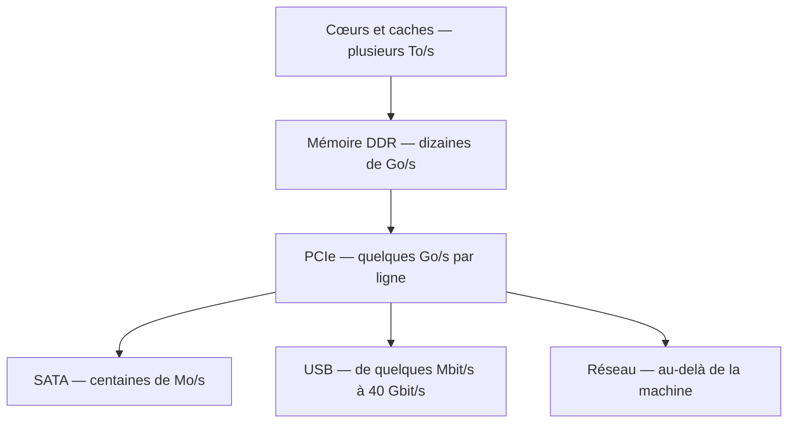

# Composants et Bus

Une machine est un processeur entouré de composants tous plus lents que lui, reliés par des chemins de débits très inégaux. Cette note décrit ces chemins : ce qui relie quoi, à quelle vitesse, et où se forment les goulots.

> [!important] Idée clé
> La logique de la [[Mémoire et Stockage]] se retrouve ici à l'identique. De même qu'il existe une hiérarchie de mémoires de plus en plus lentes à mesure qu'on s'éloigne du cœur, il existe **une hiérarchie de bus** : liaisons internes au processeur, puis PCIe, puis USB, puis le réseau. Assembler une machine cohérente consiste essentiellement à ne pas placer un composant rapide derrière un chemin lent — et la performance réelle d'une chaîne est toujours celle de son maillon le plus étroit, jamais celle du composant le plus cher.



Chaque flèche descendante fait perdre au moins un ordre de grandeur. Un composant placé un cran trop bas dans cette chaîne ne sera jamais rattrapé par sa qualité propre.

## La carte mère et le chipset

La carte mère est le circuit qui porte et relie tout le reste. Son organisation tient en une ressource rare : les **lignes PCIe**.

Le processeur en expose un nombre fixé — typiquement 16 à 28 sur un processeur grand public, davantage sur un processeur serveur. Le **chipset** en exploite quelques-unes pour en redistribuer d'autres vers les ports secondaires, ce qui multiplie les connecteurs mais les fait partager une même liaison vers le processeur. Le chipset détermine donc ce que la carte sait faire : nombre de lignes disponibles, générations USB, possibilité de surcadencer.

> [!warning] Piège
> Un composant annoncé « PCIe 4.0 x16 » n'atteint sa vitesse théorique que si toute la chaîne suit. Branché sur un connecteur physiquement x16 mais câblé en x4, ou sur des lignes issues du chipset déjà saturées par un SSD, il fonctionnera — silencieusement plus lentement. Le symptôme classique est le second connecteur M.2 qui **désactive des ports SATA** ou fait retomber le connecteur graphique en x8 : les lignes n'ont pas été ajoutées, elles ont été empruntées ailleurs. Le manuel de la carte mère, seul, dit ce qui partage quoi.

**Formats** — ATX (305 × 244 mm), Micro-ATX (244 × 244 mm), Mini-ITX (170 × 170 mm). Le format fixe le nombre de connecteurs d'extension autant que la taille du boîtier.

**Connecteurs principaux**

| Connecteur | Destination |
|---|---|
| DIMM | Barrettes mémoire |
| PCIe x16 | Carte graphique, cartes d'acquisition |
| PCIe x1 | Cartes réseau, son, contrôleurs |
| M.2 | SSD NVMe, parfois SATA selon le connecteur |

> [!warning] Piège
> DDR4 et DDR5 ont des détrompeurs physiquement différents, ce qui rend l'erreur d'insertion impossible. L'erreur réelle est ailleurs : croire qu'une carte annoncée compatible DDR5 acceptera de la DDR4 en dépannage. Ce n'est jamais le cas — **le contrôleur mémoire est intégré au processeur et ne gère qu'un seul standard**. Le choix du processeur détermine donc la génération de mémoire, pas la carte mère.

**Firmware** — la carte embarque un BIOS ou un UEFI dans une puce flash, qui initialise le matériel puis cède la main au chargeur d'amorçage. La différence entre les deux, leurs conséquences sur le partitionnement et le démarrage sécurisé sont traitées dans [[Démarrage et Bootloader]].

## PCIe

Bus série point à point, organisé en lignes agrégeables par 1, 4, 8 ou 16. Chaque génération double le débit par ligne.

| Génération | Par ligne | En x4 | En x16 |
|---|---|---|---|
| PCIe 3.0 | ~1 Go/s | ~4 Go/s | ~16 Go/s |
| PCIe 4.0 | ~2 Go/s | ~8 Go/s | ~32 Go/s |
| PCIe 5.0 | ~4 Go/s | ~16 Go/s | ~64 Go/s |
| PCIe 6.0 | ~8 Go/s | ~32 Go/s | ~128 Go/s |

Le point à point est ce qui distingue PCIe du PCI qu'il a remplacé : plus de bus partagé où tous les périphériques se disputent la parole, mais une liaison dédiée par composant, négociée à la plus petite génération commune aux deux extrémités.

## USB et Thunderbolt

| Standard | Débit | Alimentation |
|---|---|---|
| USB 2.0 | 480 Mbit/s | 2,5 W |
| USB 3.2 Gen 1 | 5 Gbit/s | 4,5 W |
| USB 3.2 Gen 2 | 10 Gbit/s | 18 W |
| USB4 | 40 Gbit/s | jusqu'à 100 W |
| Thunderbolt 4 | 40 Gbit/s | jusqu'à 100 W |

Thunderbolt transporte du PCIe sur le câble, ce qui autorise les boîtiers d'extension graphique externes — et explique aussi qu'il donne un accès direct à la mémoire, donc une surface d'attaque physique réelle. Voir [[Physical Security]].

## Interfaces de stockage

| Interface | Connecteur | Débit maximal |
|---|---|---|
| SATA III | SATA | ~550 Mo/s |
| NVMe (PCIe 3.0 x4) | M.2, U.2 | ~3 500 Mo/s |
| NVMe (PCIe 4.0 x4) | M.2 | ~7 000 Mo/s |
| NVMe (PCIe 5.0 x4) | M.2 | ~14 000 Mo/s |

Le plafond de SATA n'est pas électrique, il est **protocolaire** : le jeu de commandes a été conçu pour des disques mécaniques, avec une seule file d'attente de 32 commandes — largement suffisant pour une tête de lecture qui ne peut traiter qu'une requête à la fois. NVMe part de l'hypothèse inverse et autorise des dizaines de milliers de files de dizaines de milliers de commandes, ce qui correspond au parallélisme réel d'une puce NAND. Le gain ne tient donc pas qu'au débit brut : il tient surtout à l'effondrement de la latence et à la tenue en charge aléatoire. Voir [[Mémoire et Stockage]].

## La carte réseau

La carte réseau convertit les données en signaux physiques — électriques, optiques ou radio — et porte une **adresse MAC** de 48 bits dont les trois premiers octets identifient le fabricant.

```bash
ip link show          # interfaces et adresses MAC
ip -s link show eth0  # statistiques, erreurs, paquets rejetés
ethtool eth0          # vitesse négociée, duplex, capacités
ethtool -k eth0       # fonctions déportées sur la carte
```

Une carte moderne ne se contente pas de transmettre : elle **décharge le processeur** d'une partie du travail réseau — calcul des sommes de contrôle, segmentation TCP, répartition des interruptions entre plusieurs cœurs. Sur une liaison à 10 Gbit/s et au-delà, ce déport n'est pas un confort mais une nécessité : traiter chaque paquet en logiciel saturerait un cœur entier.

Le versant protocolaire — couches, adressage, commutation, routage, filtrage — relève de [[Modèles Réseau]], [[Équipements Réseau]] et [[Sécurité Réseau]].

## Quand le bus sort de la machine

Au-delà d'un certain débit, la frontière entre bus interne et réseau s'efface : il s'agit dans les deux cas de transporter des octets vers une mémoire distante, et les technologies de datacenter cherchent à le faire sans déranger le processeur.

| Technologie | Principe | Emploi |
|---|---|---|
| InfiniBand | Réseau à très faible latence, sous la microseconde, jusqu'à 400 Gbit/s | Grappes de calcul et d'entraînement |
| RDMA (RoCE, iWARP) | Écriture directe dans la mémoire d'un serveur distant, sans solliciter son processeur | Stockage et calcul haute performance |
| NVLink | Liaison directe entre cartes graphiques, contournant PCIe | Machines multi-GPU |
| Fibre Channel | Réseau dédié au stockage en mode bloc | SAN d'entreprise |

Le point commun est l'élimination des copies intermédiaires et des interruptions : le déplacement des données ne consomme plus de temps processeur, ce qui n'a de sens que parce que ce temps est devenu la ressource critique — encore le raisonnement de [[Architecture des Processeurs]].

## Alimentation

L'alimentation convertit le courant alternatif du secteur en continu sur trois tensions : 12 V pour le processeur et la carte graphique, qui consomment l'essentiel, 5 V pour l'USB et le SATA, 3,3 V pour une partie de la logique.

| Certification 80 PLUS | Rendement à mi-charge |
|---|---|
| Bronze | 85 % |
| Silver | 88 % |
| Gold | 92 % |
| Platinum | 94 % |
| Titanium | 96 % |

Le rendement se paie deux fois : une alimentation à 85 % consomme 118 W pour en fournir 100, et les 18 W perdus sont dissipés en chaleur dans le boîtier, qu'il faut ensuite évacuer. En fonctionnement continu, l'écart entre Bronze et Platinum se rattrape sur la facture autant que sur la température.

## Silicium spécialisé : ASIC et FPGA

Entre le processeur généraliste, qui sait tout faire lentement, et le circuit figé, qui fait une seule chose très vite, il existe un intermédiaire reprogrammable.

| | ASIC | FPGA |
|---|---|---|
| Nature | Circuit gravé pour une tâche unique | Matrice de cellules logiques reconfigurable |
| Performance et consommation | Optimales | Intermédiaires |
| Coût de conception | Très élevé, non amortissable en petite série | Faible |
| Modifiable après fabrication | Non | Oui |
| Emploi | Grandes séries : accélérateurs neuronaux, puces réseau, minage | Petites séries, prototypage, latence critique |

Le FPGA se décrit dans un langage de description matérielle, qui n'exprime pas une suite d'opérations mais un câblage.

```vhdl
-- Demi-additionneur : deux portes, pas deux instructions
entity demi_add is
  Port (A : in  STD_LOGIC;
        B : in  STD_LOGIC;
        S : out STD_LOGIC;   -- somme
        C : out STD_LOGIC);  -- retenue
end demi_add;

architecture Behavioral of demi_add is
begin
  S <= A XOR B;
  C <= A AND B;
end Behavioral;
```

Ces deux lignes ne s'exécutent pas l'une après l'autre : elles décrivent deux portes qui produisent leurs sorties en permanence et simultanément. C'est le renversement conceptuel central du matériel par rapport au logiciel, et les circuits sous-jacents sont décrits dans [[Systèmes Numériques]].

Le trading à haute fréquence est l'usage le plus révélateur du FPGA : quand la décision doit être prise en centaines de nanosecondes, le seul fait de passer par un système d'exploitation et sa pile réseau est déjà trop lent.

## Matériel embarqué et edge

Traiter les données près de leur source plutôt que dans un datacenter répond à quatre contraintes : la latence, quand une décision ne peut pas attendre un aller-retour réseau ; la bande passante, quand tout transmettre serait absurde ; la confidentialité, quand les données ne doivent pas quitter le site ; la résilience, quand le lien peut tomber.

Le matériel correspondant va de la carte à microcontrôleur au petit serveur durci, en passant par les modules à accélérateur neuronal intégré. Voir [[Systèmes Embarqués]] pour les contraintes propres à ces plateformes, et [[ICS-SCADA Security]] pour leur exposition en milieu industriel.

## À lire ensuite

- [[Architecture des Processeurs]] — ce que le processeur fait des données une fois arrivées
- [[Mémoire et Stockage]] — la hiérarchie mémoire, dont celle des bus est le prolongement
- [[Démarrage et Bootloader]] — BIOS, UEFI et la séquence d'initialisation du matériel
- [[Systèmes Numériques]] — portes et circuits, ce que décrit réellement le VHDL
- [[Systèmes Embarqués]] — microcontrôleurs, bus série et contraintes temps réel
- [[Équipements Réseau]] — commutateurs, routeurs, pare-feu et VLAN
- [[Modèles Réseau]] — les couches au-dessus du signal physique
- [[Physical Security]] — accès direct à la mémoire et attaques par port exposé
