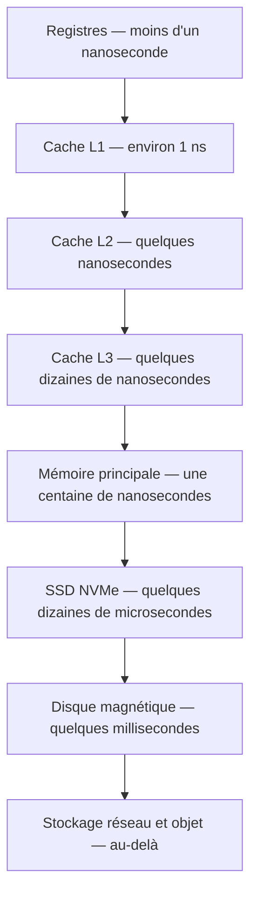

# Mémoire et Stockage

Aucune technologie ne sait être à la fois rapide, vaste et bon marché. Les trois propriétés s'excluent, et c'est de cette impossibilité que naît la hiérarchie mémoire : une succession de niveaux, chacun plus lent, plus vaste et moins cher que le précédent, organisée pour que les données utiles remontent vers le haut.

Cette note décrit les niveaux et ce qui les distingue. La raison pour laquelle le processeur a tant besoin d'eux — l'écart croissant entre sa vitesse et celle de la mémoire — est traitée dans [[Architecture des Processeurs]].

## La hiérarchie



| Niveau | Latence | Capacité typique | Volatile | Portée |
|---|---|---|---|---|
| Registres | < 1 ns | Quelques centaines d'octets | Oui | Par cœur |
| Cache L1 | ~1 ns | 32 à 64 Ko | Oui | Par cœur |
| Cache L2 | ~4 ns | 256 Ko à 2 Mo | Oui | Par cœur |
| Cache L3 | ~30 ns | 8 à 64 Mo | Oui | Partagé |
| RAM (DRAM) | ~80 ns | 8 à 512 Go | Oui | Système |
| SSD NVMe | ~50 µs | 1 à 8 To | Non | Système |
| SSD SATA | ~100 µs | 1 à 8 To | Non | Système |
| Disque dur | 5 à 10 ms | 1 à 20 To | Non | Système |
| Stockage réseau | ms et plus | Sans limite pratique | Non | Réseau |

Les chiffres importent moins que les **écarts d'ordre de grandeur** : du registre au disque dur, sept ordres de grandeur séparent les latences. Ramené à une échelle humaine où un accès registre durerait une seconde, l'accès au cache L3 prendrait une demi-minute, l'accès à la RAM une minute et demie, et l'accès au disque dur plus de quatre mois.

> [!important] Idée clé
> Chaque niveau n'existe que parce que le niveau supérieur est trop cher pour tout contenir. La hiérarchie mémoire est **un compromis économique autant que technique** : vouloir plus de données rapidement accessibles se paie en coût par gigaoctet, vouloir du volume bon marché se paie en latence. Un changement de prix relatif des technologies redessine donc la hiérarchie — c'est exactement ce qu'a fait l'arrivée du SSD, qui a inséré un niveau là où il n'y avait qu'un vide de trois ordres de grandeur entre RAM et disque.

## Localité : pourquoi les caches fonctionnent

Un cache ne serait d'aucune utilité si les programmes accédaient à la mémoire au hasard. Ils ne le font pas, et deux régularités suffisent à tout expliquer.

**Localité temporelle** — une donnée accédée a de fortes chances de l'être à nouveau bientôt. C'est le cas d'une variable de boucle, d'un pointeur de structure, d'une table de constantes. Le cache y répond en conservant ce qui a servi récemment.

**Localité spatiale** — une donnée accédée a de fortes chances d'être suivie par ses voisines. C'est le cas du parcours d'un tableau, de la lecture d'une chaîne, du champ suivant d'une structure. Le cache y répond en chargeant non pas l'octet demandé mais une **ligne entière de 64 octets** sur x86-64.

> [!warning] Piège
> La localité spatiale n'est pas une propriété du code, c'est une propriété de **la disposition des données en mémoire**. Deux programmes de complexité algorithmique identique peuvent différer d'un facteur dix selon l'ordre dans lequel ils parcourent la même structure. C'est la raison pour laquelle la [[Complexité et Big O]] ne suffit pas à prédire les performances réelles : elle compte les opérations, pas les défauts de cache.

### Le mesurer

Un tableau bidimensionnel en C est contigu, rangé ligne par ligne. Une ligne de cache de 64 octets contient donc huit `double` consécutifs de la même ligne du tableau.

```c
#define N 4096
static double m[N][N];

// Parcours ligne par ligne : une ligne de cache chargée sert 8 accès
double par_lignes(void) {
    double s = 0;
    for (int i = 0; i < N; i++)
        for (int j = 0; j < N; j++)
            s += m[i][j];
    return s;
}

// Parcours colonne par colonne : chaque accès tombe dans une ligne différente
double par_colonnes(void) {
    double s = 0;
    for (int j = 0; j < N; j++)
        for (int i = 0; i < N; i++)
            s += m[i][j];
    return s;
}
```

Les deux fonctions effectuent exactement le même nombre d'additions. La première provoque un défaut de cache tous les huit accès ; la seconde en provoque un à chaque accès dès que le tableau dépasse la taille du cache, soit huit fois plus de trafic mémoire pour un travail identique. L'écart mesuré se situe couramment entre cinq et dix.

```bash
gcc -O1 -o bench bench.c                    # -O1 : optimiser sans éliminer les boucles
perf stat -e cache-misses,cache-references ./bench
```

> [!warning] Piège
> Cette démonstration ne fonctionne pas en Python. Une liste de listes n'est pas un bloc contigu — c'est un tableau de pointeurs vers des objets dispersés dans le tas — et surtout le coût de l'interpréteur domine si largement celui des accès mémoire que l'effet de cache en devient invisible. Il faut un langage compilé opérant sur des données contiguës, ou `numpy`, qui alloue bien un bloc unique. Chercher à illustrer le cache en Python pur enseigne le bon principe avec un outil qui ne peut pas le montrer.

## Cache : politiques

**Écriture immédiate** (*write-through*) — chaque écriture est propagée aussitôt vers le niveau inférieur. Cohérence simple, écritures lentes.

**Écriture différée** (*write-back*) — l'écriture n'a lieu que dans le cache ; le niveau inférieur n'est mis à jour qu'à l'éviction de la ligne. Nettement plus rapide, au prix d'une gestion de cohérence.

C'est là qu'intervient le multicœur : les caches L1 et L2 étant privés, deux cœurs peuvent détenir des copies divergentes d'une même ligne. Un protocole matériel de cohérence, de type **MESI**, fait transiter chaque ligne entre les états *Modified*, *Exclusive*, *Shared* et *Invalid* pour que cela n'arrive pas. Ses conséquences visibles pour le programmeur — notamment le faux partage, où deux cœurs se disputent une ligne sans partager aucune donnée — relèvent de [[Concurrence et Synchronisation]].

**Politiques de remplacement** — quelle ligne évincer quand le cache est plein : la moins récemment utilisée (LRU), la moins fréquemment utilisée (LFU), ou le plus souvent une approximation de LRU, moins coûteuse à câbler.

## RAM

### SRAM et DRAM

| Critère | SRAM | DRAM |
|---|---|---|
| Cellule | Bascule, 6 transistors par bit | Condensateur, 1 transistor par bit |
| Densité | Faible | Élevée |
| Coût par bit | Élevé | Faible |
| Rafraîchissement | Non | Oui, toutes les quelques millisecondes |
| Emploi | Caches du processeur | Mémoire principale |

Tout est dans le nombre de transistors par bit : la SRAM est six fois plus encombrante, donc six fois plus chère à capacité égale. C'est la raison matérielle pour laquelle les caches restent petits — et donc, en dernière analyse, la raison pour laquelle la hiérarchie existe.

Le condensateur de la DRAM se décharge, d'où un **rafraîchissement** périodique pendant lequel la mémoire est indisponible. C'est une part du coût d'accès.

### DDR

La DDR transfère sur les deux fronts de l'horloge, doublant le débit à fréquence égale.

| Standard | Fréquence effective | Bande passante, simple canal |
|---|---|---|
| DDR3 | 1333 – 2133 MT/s | 10,6 – 17 Go/s |
| DDR4 | 2133 – 3200 MT/s | 17 – 25,6 Go/s |
| DDR5 | 4800 – 8400 MT/s | 38,4 – 67,2 Go/s |
| LPDDR5 (mobile) | 3200 – 6400 MT/s | 25,6 – 51,2 Go/s |

**Latence CAS** — délai en cycles entre la demande et la donnée. Une CL16 à 3200 MT/s correspond à 10 ns. Un débit plus élevé ne signifie donc pas une latence plus faible : les générations successives de DDR augmentent la bande passante bien plus vite qu'elles ne réduisent le délai, qui stagne autour de 10 à 15 ns depuis des années. Encore le mur de la mémoire.

**Canaux multiples** — deux ou quatre barrettes en parallèle multiplient d'autant la bande passante. Déterminant pour les processeurs à partie graphique intégrée, qui prélèvent leur mémoire vidéo sur la RAM système.

**ECC** — bits de contrôle permettant de détecter et corriger les erreurs d'un bit, causées notamment par les rayonnements. Légèrement plus lente et plus chère, indispensable en serveur, où une corruption silencieuse se propage dans les sauvegardes avant d'être remarquée.

## SSD

### Cellules NAND

| Type | Bits par cellule | Endurance (cycles) | Vitesse | Coût |
|---|---|---|---|---|
| SLC | 1 | 100 000+ | Très élevée | Très élevé |
| MLC | 2 | ~10 000 | Élevée | Élevé |
| TLC | 3 | ~3 000 | Standard | Abordable |
| QLC | 4 | ~1 000 | Réduite | Faible |

Stocker plus de bits par cellule revient à distinguer plus de niveaux de charge dans la même cellule : la capacité monte, la marge de tolérance et donc l'endurance s'effondrent. Le tableau se lit comme une seule variable réglable, pas comme quatre technologies distinctes.

**Nivellement d'usure** — les cellules s'usent à l'écriture ; le contrôleur répartit donc les écritures sur l'ensemble de la puce plutôt que de réécrire toujours au même endroit.

**Amplification d'écriture** — la NAND s'écrit par pages mais s'efface par blocs bien plus grands. Modifier quelques octets peut donc imposer de lire, effacer et réécrire un bloc entier. Le rapport entre données écrites physiquement et données demandées est le facteur d'amplification ; un bon contrôleur le maintient proche de 1.

**TRIM** — commande par laquelle le système de fichiers signale au SSD les blocs devenus inutiles, lui permettant de les effacer par avance. Sans elle, les performances en écriture s'effondrent à mesure que le disque se remplit. Voir [[Système de Fichiers]].

> [!tip] Méthode
> Disque magnétique pour le stockage froid à très bas coût par gigaoctet, archives et gros volumes rarement lus ; SSD SATA pour un compromis prix/vitesse ; NVMe pour tout ce qui est sensible à la latence — système, bases de données, compilation. Le détail des interfaces et de leurs débits figure dans [[Composants et Bus]].

## Disque dur

Stockage magnétique sur plateaux tournant entre 5400 et 15000 tours par minute, avec des têtes de lecture en lévitation à quelques nanomètres. Trois délais s'additionnent à chaque accès :

| Composante | Nature | Ordre de grandeur |
|---|---|---|
| Temps de recherche | Déplacer la tête jusqu'à la piste | 3 à 10 ms |
| Latence rotationnelle | Attendre que le secteur passe sous la tête | 0 à 4 ms à 7200 tr/min |
| Temps de transfert | Lire effectivement les données | ~0,1 ms pour 1 Mo |

Les deux premières sont purement mécaniques et n'ont pas progressé depuis trente ans. C'est pourquoi un disque dur s'effondre sur les accès aléatoires tout en restant honorable en lecture séquentielle, et pourquoi la **fragmentation** le pénalise — chaque fragment impose un nouveau déplacement de tête. Un SSD, sans pièce mobile, y est indifférent.

## RAID

| Niveau | Principe | Disques min. | Tolérance | Coût en capacité |
|---|---|---|---|---|
| RAID 0 | Entrelacement | 2 | Aucune | Nul |
| RAID 1 | Miroir | 2 | 1 disque | 50 % |
| RAID 5 | Entrelacement + parité répartie | 3 | 1 disque | 1 disque |
| RAID 6 | Entrelacement + double parité | 4 | 2 disques | 2 disques |
| RAID 10 | Miroirs entrelacés | 4 | 1 disque par miroir | 50 % |

**Reconstruction** — après remplacement d'un disque, le volume recalcule les données manquantes, opération qui dure des heures ou des jours sur de gros volumes et qui sollicite intensément tous les disques survivants, souvent du même âge et du même lot. La probabilité qu'un second disque lâche pendant cette fenêtre n'est pas négligeable : c'est l'argument décisif en faveur du RAID 6 sur les grands volumes. La mise en œuvre sous Linux est traitée dans [[q41-raid-mdadm]].

> [!warning] Piège
> **Le RAID n'est pas une sauvegarde.** Un `rm -rf` malencontreux, une corruption applicative ou un rançongiciel s'écrivent identiquement sur tous les disques de la grappe, miroir comme parité — la redondance recopie fidèlement la destruction. Le RAID protège de la défaillance d'un disque physique, rien d'autre. Seule une sauvegarde véritable, hors ligne ou versionnée, couvre l'erreur logique. Voir [[Ransomware]] et [[Business Continuity et Disaster Recovery]].

## Stockage en réseau

| Modèle | Unité d'accès | Protocoles | Scalabilité | Usage |
|---|---|---|---|---|
| Fichier (NAS) | Fichier, arborescence | NFS, SMB | Limitée | Partage en réseau local |
| Bloc (SAN) | Secteur | iSCSI, Fibre Channel | Élevée | Bases de données, machines virtuelles |
| Objet | Objet + métadonnées | HTTP, API S3 | Quasi illimitée | Médias, sauvegardes, lac de données |

Le **stockage objet** abandonne l'arborescence : chaque objet porte une clé unique et ses métadonnées, sans notion de répertoire ni de modification partielle. C'est cette renonciation qui permet la répartition horizontale sans limite — il n'y a plus d'arbre central à maintenir cohérent.

```
Système de fichiers :  /home/user/documents/rapport.pdf
Stockage objet :       bucket/rapport-2026-alice.pdf  +  métadonnées
```

Voir [[Bucket S3]] pour la mise en œuvre la plus répandue.

## À lire ensuite

- [[Architecture des Processeurs]] — le mur de la mémoire, origine de toute la hiérarchie
- [[Gestion de la Mémoire]] — mémoire virtuelle, pagination, ce que le système fait de la RAM
- [[Système de Fichiers]] — la couche logicielle au-dessus du stockage physique
- [[Concurrence et Synchronisation]] — cohérence des caches et faux partage
- [[Composants et Bus]] — interfaces SATA, NVMe et PCIe qui relient le stockage à la machine
- [[q41-raid-mdadm]] — mise en œuvre du RAID logiciel sous Linux
- [[q18-lvm-storage]] — gestion de volumes logiques
- [[Bucket S3]] — stockage objet en pratique
