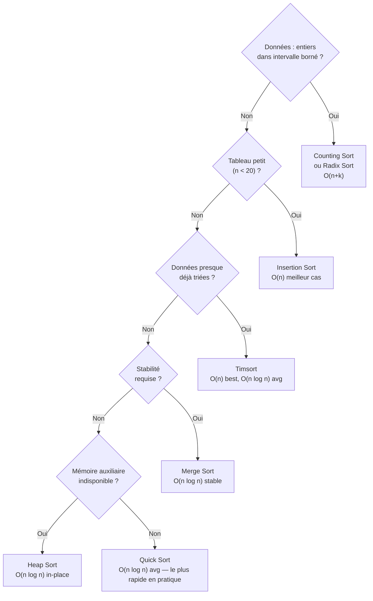

# Algorithmes de Tri

Le tri est l'une des opérations les plus fondamentales en informatique. Comprendre ses algorithmes permet de saisir des concepts clés : récursion, diviser-pour-régner, stabilité, complexité.

## Concepts préliminaires

**Tri en place** : l'algorithme trie sans utiliser de tableau auxiliaire (ou avec O(1) espace supplémentaire).

**Tri stable** : les éléments égaux conservent leur ordre relatif d'origine. Important quand on trie des objets sur plusieurs critères successifs.

**Comparaison-based sorting** : la borne inférieure théorique est O(n log n). Certains algorithmes non basés sur la comparaison (counting sort, radix sort) peuvent faire mieux dans des cas spéciaux.

## Tri à bulles (Bubble Sort)

Principe : comparer des paires adjacentes et les échanger si elles sont dans le mauvais ordre. Répéter jusqu'à ce que tout soit trié.

```python
def tri_bulles(arr):
    n = len(arr)
    for i in range(n):
        echange = False
        for j in range(0, n - i - 1):
            if arr[j] > arr[j + 1]:
                arr[j], arr[j + 1] = arr[j + 1], arr[j]
                echange = True
        if not echange:  # optimisation : sortie anticipée si déjà trié
            break
    return arr
```

| Cas | Complexité |
|---|---|
| Meilleur | O(n) — tableau déjà trié |
| Moyen | O(n²) |
| Pire | O(n²) |

Stable : oui. En place : oui. Usage : pédagogie, petits tableaux.

## Tri par sélection (Selection Sort)

Principe : trouver le minimum dans la partie non triée, le placer en tête, répéter.

```python
def tri_selection(arr):
    n = len(arr)
    for i in range(n):
        idx_min = i
        for j in range(i + 1, n):
            if arr[j] < arr[idx_min]:
                idx_min = j
        arr[i], arr[idx_min] = arr[idx_min], arr[i]
    return arr
```

| Cas | Complexité |
|---|---|
| Tous | O(n²) |

Stable : non (les échanges peuvent perturber l'ordre). En place : oui. Usage : minimise le nombre d'écritures, utile sur mémoires à accès coûteux.

## Tri par insertion (Insertion Sort)

Principe : construire le tableau trié élément par élément, en insérant chaque nouvel élément à sa bonne place.

```python
def tri_insertion(arr):
    for i in range(1, len(arr)):
        cle = arr[i]
        j = i - 1
        while j >= 0 and arr[j] > cle:
            arr[j + 1] = arr[j]
            j -= 1
        arr[j + 1] = cle
    return arr
```

| Cas | Complexité |
|---|---|
| Meilleur | O(n) — tableau déjà trié |
| Moyen | O(n²) |
| Pire | O(n²) |

Stable : oui. En place : oui. Usage : très efficace sur petits tableaux ou presque triés. Utilisé par Timsort pour les petites partitions.

## Tri fusion (Merge Sort)

Principe diviser-pour-régner : diviser en deux moitiés, trier chacune récursivement, fusionner.

```python
def tri_fusion(arr):
    if len(arr) <= 1:
        return arr

    milieu = len(arr) // 2
    gauche = tri_fusion(arr[:milieu])
    droite = tri_fusion(arr[milieu:])
    return fusionner(gauche, droite)

def fusionner(gauche, droite):
    resultat = []
    i = j = 0
    while i < len(gauche) and j < len(droite):
        if gauche[i] <= droite[j]:
            resultat.append(gauche[i])
            i += 1
        else:
            resultat.append(droite[j])
            j += 1
    resultat.extend(gauche[i:])
    resultat.extend(droite[j:])
    return resultat
```

| Cas | Complexité |
|---|---|
| Tous | O(n log n) |

Stable : oui. En place : non — O(n) espace auxiliaire. Usage : tri de listes chaînées, tri externe (données sur disque), garantie O(n log n).

## Tri rapide (Quick Sort)

Principe : choisir un pivot, partitionner le tableau (éléments < pivot à gauche, > pivot à droite), trier récursivement.

```python
def tri_rapide(arr, gauche=0, droite=None):
    if droite is None:
        droite = len(arr) - 1
    if gauche < droite:
        pivot_idx = partitionner(arr, gauche, droite)
        tri_rapide(arr, gauche, pivot_idx - 1)
        tri_rapide(arr, pivot_idx + 1, droite)
    return arr

def partitionner(arr, gauche, droite):
    pivot = arr[droite]
    i = gauche - 1
    for j in range(gauche, droite):
        if arr[j] <= pivot:
            i += 1
            arr[i], arr[j] = arr[j], arr[i]
    arr[i + 1], arr[droite] = arr[droite], arr[i + 1]
    return i + 1
```

| Cas | Complexité |
|---|---|
| Meilleur / Moyen | O(n log n) |
| Pire | O(n²) — pivot toujours min ou max |

Stable : non. En place : oui (O(log n) pile d'appels). Usage : le plus rapide en pratique sur des données aléatoires. Utiliser un pivot aléatoire pour éviter le pire cas.

## Tri par tas (Heap Sort)

Principe : construire un tas-max, extraire successivement le maximum.

```python
def tri_tas(arr):
    n = len(arr)
    # Construction du tas
    for i in range(n // 2 - 1, -1, -1):
        entasser(arr, n, i)
    # Extraction un par un
    for i in range(n - 1, 0, -1):
        arr[0], arr[i] = arr[i], arr[0]
        entasser(arr, i, 0)
    return arr

def entasser(arr, n, i):
    plus_grand = i
    gauche = 2 * i + 1
    droite = 2 * i + 2
    if gauche < n and arr[gauche] > arr[plus_grand]:
        plus_grand = gauche
    if droite < n and arr[droite] > arr[plus_grand]:
        plus_grand = droite
    if plus_grand != i:
        arr[i], arr[plus_grand] = arr[plus_grand], arr[i]
        entasser(arr, n, plus_grand)
```

| Cas | Complexité |
|---|---|
| Tous | O(n log n) |

Stable : non. En place : oui. Usage : quand on veut garantir O(n log n) sans espace auxiliaire.

## Tri par dénombrement (Counting Sort)

Principe : compter les occurrences de chaque valeur (fonctionne uniquement sur des entiers dans un intervalle borné).

```python
def tri_denombrement(arr, max_val):
    compteur = [0] * (max_val + 1)
    for val in arr:
        compteur[val] += 1
    resultat = []
    for val, count in enumerate(compteur):
        resultat.extend([val] * count)
    return resultat
```

Complexité : O(n + k) où k est l'étendue des valeurs. Non basé sur la comparaison.

## Tri Radix

Principe : trier digit par digit, du moins significatif au plus significatif, en utilisant un tri stable à chaque passe.

```python
def tri_radix(arr):
    if not arr:
        return arr
    max_val = max(arr)
    exp = 1
    while max_val // exp > 0:
        tri_denombrement_exp(arr, exp)
        exp *= 10
    return arr
```

Complexité : O(d · (n + k)) où d est le nombre de digits et k la base (10 pour décimal).

## Timsort

Algorithme utilisé par Python (`list.sort()`, `sorted()`) et Java. Combine tri par insertion (pour petites partitions) et tri fusion (pour les runs). Détecte et exploite les séquences déjà triées.

Complexité : O(n) meilleur cas (tableau déjà trié), O(n log n) moyen et pire. Stable.

## Comparaison finale

| Algorithme | Meilleur | Moyen | Pire | Espace | Stable | En place |
|---|---|---|---|---|---|---|
| Tri à bulles | O(n) | O(n²) | O(n²) | O(1) | Oui | Oui |
| Tri sélection | O(n²) | O(n²) | O(n²) | O(1) | Non | Oui |
| Tri insertion | O(n) | O(n²) | O(n²) | O(1) | Oui | Oui |
| Tri fusion | O(n log n) | O(n log n) | O(n log n) | O(n) | Oui | Non |
| Tri rapide | O(n log n) | O(n log n) | O(n²) | O(log n) | Non | Oui |
| Tri par tas | O(n log n) | O(n log n) | O(n log n) | O(1) | Non | Oui |
| Counting sort | O(n+k) | O(n+k) | O(n+k) | O(k) | Oui | Non |
| Radix sort | O(nk) | O(nk) | O(nk) | O(n+k) | Oui | Non |
| Timsort | O(n) | O(n log n) | O(n log n) | O(n) | Oui | Non |

## Règles de choix



- Données aléatoires, taille quelconque : **Timsort** (Python) ou **Quick Sort**
- Garantie O(n log n) sans espace supplémentaire : **Heap Sort**
- Données presque triées : **Insertion Sort** ou **Timsort**
- Entiers dans un intervalle borné : **Counting Sort** ou **Radix Sort**
- Stabilité requise avec O(n log n) : **Merge Sort**
- Tableau très petit (< 20 éléments) : **Insertion Sort**
