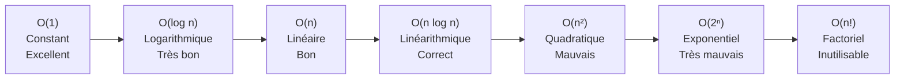

# Complexité et Big O

La complexité algorithmique mesure la quantité de ressources consommées par un algorithme en fonction de la taille de l'entrée. Elle permet de comparer des algorithmes indépendamment du matériel ou du langage.

## Notations asymptotiques

### Big O — borne supérieure (pire cas)

O(f(n)) signifie que le temps d'exécution croît au plus aussi vite que f(n).

Définition formelle : T(n) = O(f(n)) s'il existe des constantes c > 0 et n₀ telles que pour tout n ≥ n₀ : T(n) ≤ c · f(n).

### Big Omega — borne inférieure (meilleur cas)

Ω(f(n)) garantit que l'algorithme prendra au minimum f(n) opérations.

### Big Theta — borne exacte

Θ(f(n)) signifie que l'algorithme croît exactement comme f(n). T(n) = Θ(f(n)) si et seulement si T(n) = O(f(n)) et T(n) = Ω(f(n)).

### Petit o et petit omega

- o(f(n)) : borne supérieure stricte — T(n)/f(n) → 0 quand n → ∞
- ω(f(n)) : borne inférieure stricte — T(n)/f(n) → ∞ quand n → ∞

## Tableau des complexités courantes

| Notation | Nom | Exemple typique |
|---|---|---|
| O(1) | Constant | Accès tableau par index |
| O(log n) | Logarithmique | Recherche binaire |
| O(√n) | Racine carrée | Test de primalité naïf |
| O(n) | Linéaire | Parcours de liste |
| O(n log n) | Linéarithmique | Tri fusion, Tri rapide (moy.) |
| O(n²) | Quadratique | Tri à bulles, Tri par insertion |
| O(n³) | Cubique | Multiplication de matrices naïve |
| O(2^n) | Exponentiel | Énumération de sous-ensembles |
| O(n!) | Factoriel | Problème du voyageur (force brute) |

Ordre de croissance : O(1) < O(log n) < O(√n) < O(n) < O(n log n) < O(n²) < O(2^n) < O(n!)



## Analyse de boucles

### Boucle simple — O(n)

```python
for i in range(n):
    print(i)  # O(1)
# Total : O(n)
```

### Boucles imbriquées indépendantes — O(n²)

```python
for i in range(n):
    for j in range(n):
        print(i, j)  # O(1)
# Total : O(n²)
```

### Boucle logarithmique — O(log n)

```python
i = 1
while i < n:
    i *= 2  # i double à chaque étape
# log₂(n) itérations → O(log n)
```

### Boucle avec réduction de moitié — O(log n)

```python
def recherche_binaire(arr, cible):
    gauche, droite = 0, len(arr) - 1
    while gauche <= droite:
        milieu = (gauche + droite) // 2
        if arr[milieu] == cible:
            return milieu
        elif arr[milieu] < cible:
            gauche = milieu + 1
        else:
            droite = milieu - 1
    return -1
```

### Boucle imbriquée avec dépendance — O(n²)

```python
for i in range(n):
    for j in range(i, n):  # j part de i, pas de 0
        print(i, j)
# Nombre d'opérations : n + (n-1) + ... + 1 = n(n+1)/2 → O(n²)
```

## Meilleur cas, cas moyen, pire cas

```python
def recherche_lineaire(arr, cible):
    for i, val in enumerate(arr):
        if val == cible:
            return i
    return -1
```

| Cas | Description | Complexité |
|---|---|---|
| Meilleur | L'élément est en position 0 | O(1) |
| Cas moyen | L'élément est au milieu | O(n/2) = O(n) |
| Pire | L'élément est absent ou en fin | O(n) |

## Complexité spatiale

La complexité spatiale mesure la mémoire auxiliaire utilisée (hors données d'entrée).

```python
# O(1) en espace — aucune structure supplémentaire
def somme(arr):
    total = 0
    for x in arr:
        total += x
    return total

# O(n) en espace — nouvelle liste de taille n
def doubler(arr):
    return [x * 2 for x in arr]

# O(n) en espace — pile d'appels récursifs de profondeur n
def factorielle(n):
    if n <= 1:
        return 1
    return n * factorielle(n - 1)
```

## Exemples de calcul

### Exemple 1 : deux boucles consécutives

```python
for i in range(n):      # O(n)
    print(i)

for j in range(n * n):  # O(n²)
    print(j)

# Total : O(n) + O(n²) = O(n²)  (on garde le terme dominant)
```

### Exemple 2 : récursion avec mémoïsation

```python
from functools import lru_cache

@lru_cache(maxsize=None)
def fibonacci(n):
    if n <= 1:
        return n
    return fibonacci(n - 1) + fibonacci(n - 2)
# Avec mémoïsation : O(n) en temps, O(n) en espace
# Sans mémoïsation : O(2^n) en temps
```

### Exemple 3 : tri fusion

```python
def tri_fusion(arr):
    if len(arr) <= 1:
        return arr
    milieu = len(arr) // 2
    gauche = tri_fusion(arr[:milieu])   # T(n/2)
    droite = tri_fusion(arr[milieu:])   # T(n/2)
    return fusionner(gauche, droite)    # O(n)
# Récurrence : T(n) = 2T(n/2) + O(n) → O(n log n) par le théorème maître
```

## Théorème maître

Pour les récurrences de la forme T(n) = aT(n/b) + O(n^d) :

| Condition | Complexité |
|---|---|
| d > log_b(a) | O(n^d) |
| d = log_b(a) | O(n^d · log n) |
| d < log_b(a) | O(n^(log_b a)) |

Application au tri fusion : a=2, b=2, d=1 → log₂(2) = 1 = d → O(n log n)

## Pièges courants

**Ignorer les constantes peut induire en erreur en pratique.** O(100n) est O(n), mais peut être plus lent qu'O(n²) pour de petits n.

**L'espace et le temps sont souvent en compromis.** La mémoïsation améliore le temps au prix de l'espace.

**L'amortissement** : certaines opérations coûtent O(n) ponctuellement mais O(1) amorti sur une séquence (ex : ajout en fin de liste dynamique).
