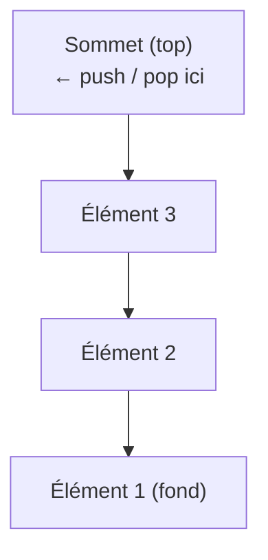
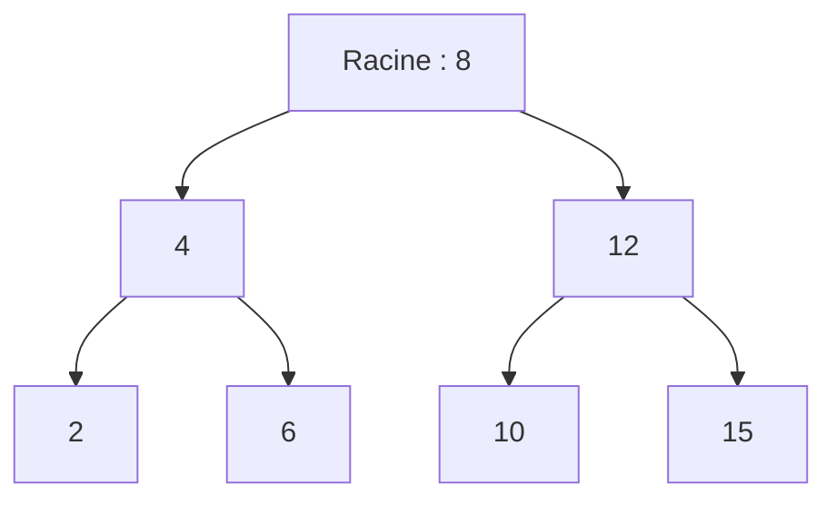

# Structures de Données

Une structure de données est une façon d'organiser et stocker des données pour permettre des opérations efficaces. Le choix de la structure détermine les complexités des opérations fondamentales.

## Tableaux

### Tableau statique

Séquence contiguë d'éléments en mémoire, de taille fixe définie à la création.

```python
arr = [10, 20, 30, 40, 50]
arr[2]       # accès en O(1) — index direct
arr[2] = 99  # modification en O(1)
```

### Tableau dynamique (list Python / ArrayList Java)

Tableau qui se redimensionne automatiquement. Python `list` en est un exemple.

```python
arr = []
arr.append(1)   # O(1) amorti
arr.insert(0, 0)  # O(n) — décalage des éléments
arr.pop()       # O(1)
arr.pop(0)      # O(n) — décalage
```

| Opération | Tableau statique | Tableau dynamique |
|---|---|---|
| Accès par index | O(1) | O(1) |
| Recherche | O(n) | O(n) |
| Insertion en fin | O(1) | O(1) amorti |
| Insertion en début | O(n) | O(n) |
| Suppression | O(n) | O(n) |

## Listes chaînées

### Liste simplement chaînée

Chaque nœud contient une valeur et un pointeur vers le nœud suivant.

```python
class Noeud:
    def __init__(self, valeur):
        self.valeur = valeur
        self.suivant = None

class ListeChainee:
    def __init__(self):
        self.tete = None

    def inserer_debut(self, valeur):  # O(1)
        noeud = Noeud(valeur)
        noeud.suivant = self.tete
        self.tete = noeud

    def supprimer_debut(self):  # O(1)
        if self.tete:
            self.tete = self.tete.suivant

    def rechercher(self, valeur):  # O(n)
        courant = self.tete
        while courant:
            if courant.valeur == valeur:
                return True
            courant = courant.suivant
        return False
```

### Liste doublement chaînée

Chaque nœud a un pointeur vers le suivant ET le précédent. Permet la traversée dans les deux sens.

### Liste circulaire

Le dernier nœud pointe vers le premier. Utile pour les buffers circulaires.

| Opération | Liste chaînée | Tableau |
|---|---|---|
| Accès par index | O(n) | O(1) |
| Insertion en début | O(1) | O(n) |
| Insertion en fin | O(n) / O(1) avec queue | O(1) amorti |
| Insertion au milieu (pointeur connu) | O(1) | O(n) |
| Recherche | O(n) | O(n) |
| Mémoire | Overhead par nœud | Contiguë |

## Piles (Stack)

Structure LIFO (Last In, First Out). Seule l'extrémité supérieure est accessible.



```python
class Pile:
    def __init__(self):
        self.elements = []

    def empiler(self, val):   # push — O(1)
        self.elements.append(val)

    def depiler(self):        # pop — O(1)
        if self.est_vide():
            raise IndexError("Pile vide")
        return self.elements.pop()

    def sommet(self):         # peek — O(1)
        return self.elements[-1]

    def est_vide(self):
        return len(self.elements) == 0
```

Cas d'usage : gestion de l'appel de fonctions (call stack), undo/redo, validation de parenthèses, DFS itératif, évaluation d'expressions.

## Files (Queue)

Structure FIFO (First In, First Out). Les éléments entrent d'un côté et sortent de l'autre.

```python
from collections import deque

file = deque()
file.append(1)      # enqueue — O(1)
file.append(2)
file.popleft()      # dequeue — O(1)
```

### File de priorité (Heap)

Les éléments sont extraits par ordre de priorité, pas d'arrivée.

```python
import heapq

tas = []
heapq.heappush(tas, (1, "urgent"))
heapq.heappush(tas, (3, "normal"))
heapq.heappush(tas, (2, "important"))
print(heapq.heappop(tas))  # (1, "urgent")
```

## Arbres

### Arbre binaire

Chaque nœud a au plus deux enfants (gauche et droite).



Propriété BST : gauche < parent < droite — le parcours **infixe** (gauche → racine → droite) donne les valeurs triées.

```python
class NoeudArbre:
    def __init__(self, valeur):
        self.valeur = valeur
        self.gauche = None
        self.droite = None
```

Parcours :
- **Préfixe** (racine, gauche, droite) : racine traitée en premier
- **Infixe** (gauche, racine, droite) : donne les valeurs triées pour un BST
- **Suffixe** (gauche, droite, racine) : utile pour supprimer des arbres
- **Niveau** (BFS) : parcours par couches

### Arbre Binaire de Recherche (BST)

Propriété : nœuds gauches < racine < nœuds droits.

```python
def inserer(racine, val):
    if racine is None:
        return NoeudArbre(val)
    if val < racine.valeur:
        racine.gauche = inserer(racine.gauche, val)
    else:
        racine.droite = inserer(racine.droite, val)
    return racine

def rechercher(racine, val):  # O(h) où h est la hauteur
    if racine is None or racine.valeur == val:
        return racine
    if val < racine.valeur:
        return rechercher(racine.gauche, val)
    return rechercher(racine.droite, val)
```

| Opération | BST moyen | BST dégénéré (trié) | AVL / Rouge-Noir |
|---|---|---|---|
| Recherche | O(log n) | O(n) | O(log n) |
| Insertion | O(log n) | O(n) | O(log n) |
| Suppression | O(log n) | O(n) | O(log n) |

### Arbre AVL

BST auto-équilibré. Le facteur d'équilibre (hauteur gauche − hauteur droite) reste dans {-1, 0, 1}. Des rotations (simple gauche/droite, double) maintiennent l'équilibre après chaque insertion ou suppression.

### Tas (Heap)

Arbre binaire complet satisfaisant la propriété de tas :
- **Tas-max** : chaque parent ≥ ses enfants
- **Tas-min** : chaque parent ≤ ses enfants

Stocké efficacement dans un tableau : parent de i → (i-1)//2 ; enfants de i → 2i+1 et 2i+2.

## Tables de hachage

Associe des clés à des valeurs via une fonction de hachage.

```python
# En Python, dict est une table de hachage
d = {}
d["clé"] = "valeur"   # O(1) amorti
d["clé"]              # O(1) amorti
del d["clé"]          # O(1) amorti
"clé" in d            # O(1) amorti
```

### Fonctions de hachage

Une bonne fonction de hachage distribue uniformément les clés sur les buckets.

```python
# Exemple simplifié
def hachage(cle, taille):
    return hash(cle) % taille
```

### Gestion des collisions

**Chaînage (Separate Chaining)** : chaque bucket est une liste chaînée. Insertion toujours O(1), recherche O(1) moyen mais O(n) pire cas (toutes les clés dans le même bucket).

**Adressage ouvert (Open Addressing)** : en cas de collision, on cherche un autre bucket libre par sondage (linéaire, quadratique, double hachage).

### Facteur de charge

load_factor = n / capacité. Quand il dépasse un seuil (~0.75), on redimensionne (rehashing) : O(n) ponctuel, O(1) amorti.

## Graphes

Un graphe G = (V, E) est composé de sommets V et d'arêtes E.

### Représentations

**Liste d'adjacence** : chaque sommet stocke la liste de ses voisins.

```python
graphe = {
    0: [1, 2],
    1: [0, 3],
    2: [0],
    3: [1]
}
```

**Matrice d'adjacence** : matrice n×n où M[i][j] = 1 si l'arête (i,j) existe.

```python
matrice = [
    [0, 1, 1, 0],
    [1, 0, 0, 1],
    [1, 0, 0, 0],
    [0, 1, 0, 0]
]
```

| Critère | Liste d'adjacence | Matrice d'adjacence |
|---|---|---|
| Espace | O(V + E) | O(V²) |
| Vérifier arête (u,v) | O(degré(u)) | O(1) |
| Lister voisins de u | O(degré(u)) | O(V) |
| Adapté pour | Graphes creux | Graphes denses |

## Comparaison globale des structures

| Structure | Accès | Recherche | Insertion | Suppression | Usage |
|---|---|---|---|---|---|
| Tableau | O(1) | O(n) | O(n) | O(n) | Données indexées |
| Liste chaînée | O(n) | O(n) | O(1) tête | O(1) avec ptr | Insertions fréquentes |
| Pile | O(1) sommet | O(n) | O(1) | O(1) | LIFO, appels |
| File | O(1) tête | O(n) | O(1) | O(1) | FIFO, BFS |
| BST équilibré | O(log n) | O(log n) | O(log n) | O(log n) | Données triées |
| Table de hachage | O(1) moy. | O(1) moy. | O(1) moy. | O(1) moy. | Lookup rapide |
| Tas | O(1) max/min | O(n) | O(log n) | O(log n) | File de priorité |
