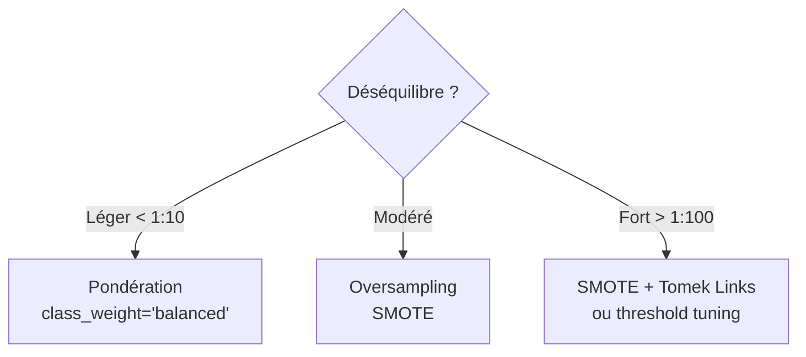

# Feature Engineering et Prétraitement des Données

Le feature engineering est souvent plus déterminant que le choix de l'algorithme. Un bon feature engineering peut transformer un modèle médiocre en un excellent modèle ; un mauvais peut rendre inutile le meilleur des algorithmes.

## Pipeline de prétraitement


## Audit et compréhension des données

Avant tout traitement :

```python
import pandas as pd

df = pd.read_csv("data.csv")
df.info()           # Types, valeurs non-nulles
df.describe()       # Statistiques descriptives
df.isnull().sum()   # Valeurs manquantes par colonne
df.duplicated().sum()  # Doublons
```

**Questions clés :**
- Quelle est la distribution de la variable cible ?
- Y a-t-il un déséquilibre de classes ?
- Quelles features ont des corrélations élevées entre elles ?
- Y a-t-il des outliers ?

## Gestion des valeurs manquantes

### Stratégies

| Méthode | Description | Quand l'utiliser |
|---|---|---|
| Suppression lignes | Supprimer si < 5% manquant | Peu de données manquantes |
| Suppression colonnes | Supprimer si > 50-70% manquant | Colonne quasi-vide |
| Imputation médiane | Remplacer par la médiane | Numériques avec outliers |
| Imputation moyenne | Remplacer par la moyenne | Distribution symétrique |
| Imputation mode | Remplacer par la valeur la plus fréquente | Catégorielles |
| Imputation par modèle | KNN, régression, MICE | Données MNAR |
| Indicateur de manquance | Ajouter colonne booléenne | Si le fait d'être absent est informatif |

```python
from sklearn.impute import SimpleImputer, KNNImputer

# Imputation médiane
imputer = SimpleImputer(strategy='median')
X_filled = imputer.fit_transform(X)

# KNN imputation
knn_imputer = KNNImputer(n_neighbors=5)
X_knn = knn_imputer.fit_transform(X)
```

**Types de manquance :**
- **MCAR** (Missing Completely At Random) : manquance aléatoire, imputation simple possible
- **MAR** (Missing At Random) : conditionnel à d'autres variables, modélisation nécessaire
- **MNAR** (Missing Not At Random) : le fait d'être manquant est lié à la valeur elle-même (ex: revenus élevés non déclarés)

## Gestion des outliers

### Détection

```python
# Méthode IQR (Interquartile Range)
Q1 = df['feature'].quantile(0.25)
Q3 = df['feature'].quantile(0.75)
IQR = Q3 - Q1
lower = Q1 - 1.5 * IQR
upper = Q3 + 1.5 * IQR
outliers = df[(df['feature'] < lower) | (df['feature'] > upper)]

# Z-score (>3 ou <-3 = outlier)
from scipy import stats
z_scores = stats.zscore(df['feature'])
outliers_z = df[abs(z_scores) > 3]
```

### Traitement

| Option | Description |
|---|---|
| Suppression | Supprimer si erreur de saisie évidente |
| Winsorisation | Plafonner à percentile 1% / 99% |
| Transformation log | Compresser les distributions longues |
| Traitement séparé | Modèle différent pour les valeurs extrêmes |
| Conservation | Si l'outlier est réel et informatif |

## Encodage des variables catégorielles

### One-Hot Encoding

Crée une colonne binaire par catégorie. Pour K catégories → K-1 colonnes (éviter la multicolinéarité).

```python
pd.get_dummies(df['couleur'], drop_first=True)
# ou
from sklearn.preprocessing import OneHotEncoder
encoder = OneHotEncoder(drop='first', sparse=False)
```

**Usage :** variables nominales (pas d'ordre). Problème : explosion dimensionnelle si beaucoup de catégories.

### Label Encoding

Assigne un entier à chaque catégorie : `rouge=0`, `vert=1`, `bleu=2`.

**Usage :** variables ordinales (taille: S < M < L < XL) ou arbres de décision (insensibles à l'ordre arbitraire).
**Attention :** induit un ordre artificiel, incompatible avec la régression logistique.

### Target Encoding

Remplace chaque catégorie par la moyenne de la variable cible pour cette catégorie.

```python
# Moyenne de y pour chaque catégorie
target_mean = df.groupby('categorie')['target'].mean()
df['categorie_encoded'] = df['categorie'].map(target_mean)
```

**Usage :** haute cardinalité (pays, code postal, ID). **Risque** : data leakage si mal implémenté → utiliser avec K-Fold.

### Frequency Encoding

Remplace par la fréquence d'apparition. Préserve l'information de rareté.

## Mise à l'échelle (Scaling)

Indispensable pour les algorithmes sensibles à l'échelle : régression, SVM, KNN, réseaux de neurones.
Non nécessaire pour les arbres de décision et forêts aléatoires.

```mermaid
graph TD
    dist{Distribution ?}
    dist -->|Gaussienne| std[Standardisation\nz = (x - μ) / σ]
    dist -->|Non-gaussienne| minmax[Min-Max\nx' = (x - min)/(max - min)]
    dist -->|Beaucoup d'outliers| robust[Robust Scaler\n(IQR)]
    dist -->|Loi de puissance| log[Transformation log]
```

```python
from sklearn.preprocessing import StandardScaler, MinMaxScaler, RobustScaler

# Standardisation : moyenne 0, écart-type 1
scaler = StandardScaler()
X_scaled = scaler.fit_transform(X_train)

# Min-Max : [0, 1]
minmax = MinMaxScaler()
X_minmax = minmax.fit_transform(X_train)

# Robust : utilise médiane et IQR
robust = RobustScaler()
X_robust = robust.fit_transform(X_train)
```

**Règle critique** : `fit` uniquement sur le train set, `transform` sur train et test. Sinon data leakage.

## Feature Engineering

### Variables numériques

**Transformations de distribution :**
```python
import numpy as np
df['log_revenu'] = np.log1p(df['revenu'])        # log(1+x), gère x=0
df['sqrt_age'] = np.sqrt(df['age'])
df['revenu_carré'] = df['revenu'] ** 2
```

**Interactions :**
```python
df['surface_par_piece'] = df['surface'] / df['nb_pieces']
df['age_x_revenu'] = df['age'] * df['revenu']
```

**Discrétisation (Binning) :**
```python
df['age_bin'] = pd.cut(df['age'], bins=[0, 18, 35, 60, 100],
                        labels=['mineur', 'jeune', 'adulte', 'senior'])
```

### Variables temporelles

```python
df['heure'] = df['timestamp'].dt.hour
df['jour_semaine'] = df['timestamp'].dt.dayofweek
df['mois'] = df['timestamp'].dt.month
df['est_weekend'] = df['jour_semaine'].isin([5, 6]).astype(int)
df['trimestre'] = df['timestamp'].dt.quarter

# Encodage cyclique (heure 23 est proche de heure 0)
import numpy as np
df['heure_sin'] = np.sin(2 * np.pi * df['heure'] / 24)
df['heure_cos'] = np.cos(2 * np.pi * df['heure'] / 24)
```

### Variables textuelles

```python
# Longueur, complexité
df['nb_mots'] = df['texte'].apply(lambda x: len(x.split()))
df['nb_caracteres'] = df['texte'].str.len()
df['ratio_majuscules'] = df['texte'].apply(lambda x: sum(c.isupper() for c in x) / len(x))
df['nb_ponctuation'] = df['texte'].apply(lambda x: sum(c in '.,!?' for c in x))
```

## Sélection de features

Trop de features → surajustement, coût computationnel, bruit.

### Méthodes de filtre (Filter Methods)

Calculées indépendamment du modèle, rapides.

```python
# Variance faible → feature peu informative
from sklearn.feature_selection import VarianceThreshold
sel = VarianceThreshold(threshold=0.01)

# Corrélation avec la cible
correlations = df.corr()['target'].abs().sort_values(ascending=False)

# Test χ² pour catégorielles
from sklearn.feature_selection import chi2, SelectKBest
selector = SelectKBest(chi2, k=10)
```

### Méthodes wrapper (Wrapper Methods)

Utilisent le modèle comme oracle, plus précises mais coûteuses.

```python
from sklearn.feature_selection import RFE
from sklearn.ensemble import RandomForestClassifier

rfe = RFE(estimator=RandomForestClassifier(), n_features_to_select=10)
rfe.fit(X_train, y_train)
selected = X.columns[rfe.support_]
```

### Méthodes embedded

Sélection intégrée à l'entraînement :

```python
# Importance des features (RandomForest, XGBoost)
importances = model.feature_importances_
top_features = pd.Series(importances, index=X.columns).sort_values(ascending=False).head(20)

# Lasso (L1) : annule les coefficients des features inutiles
from sklearn.linear_model import LassoCV
lasso = LassoCV(cv=5)
lasso.fit(X_train, y_train)
selected = X.columns[lasso.coef_ != 0]
```

## Gestion du déséquilibre de classes

Problème courant en détection de fraude, maladies rares, etc.



```python
from imblearn.over_sampling import SMOTE
from imblearn.combine import SMOTETomek

# SMOTE : génère des exemples synthétiques de la classe minoritaire
smote = SMOTE(sampling_strategy=0.5, random_state=42)
X_resampled, y_resampled = smote.fit_resample(X_train, y_train)

# Pondération dans le modèle
from sklearn.ensemble import RandomForestClassifier
model = RandomForestClassifier(class_weight='balanced')
```

**Attention** : appliquer le resampling uniquement sur le train set, jamais sur le test set.

## Erreurs courantes (Data Leakage)

Le data leakage se produit lorsque des informations du futur contaminent l'entraînement.

| Type | Exemple | Solution |
|---|---|---|
| Leakage de target | Utiliser une feature calculée à partir de la cible | Vérifier les corrélations suspectes > 0.9 |
| Leakage temporel | Entraîner sur des données futures par rapport au test | Toujours faire un split temporel chronologique |
| Leakage de preprocessing | Scaler sur train + test avant de splitter | Toujours splitter avant de scaler |
| Feature identifiant | ID client → corrélé à la cible par hasard | Supprimer les identifiants |
