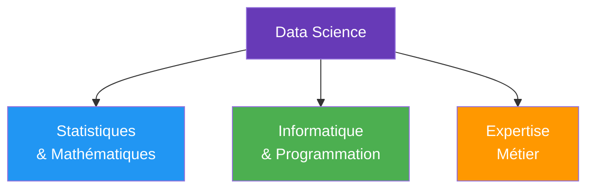
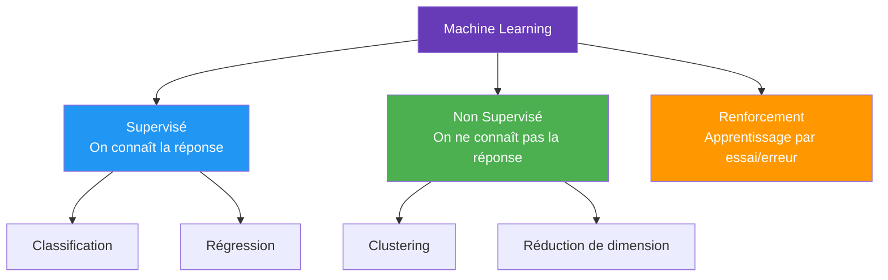

# Les bases de la Data Science

La **Data Science** combine statistiques, informatique et expertise métier pour **extraire des connaissances** à partir de données.

## Types d'apprentissage

| Supervisé | Non-Supervisé |
|:-:|:-:|
| Données **étiquetées** (on connaît y) | Données **non étiquetées** (pas de y) |
| Apprend à **prédire** | Apprend à **structurer** |
| K-NN, SVM, CART, Random Forest, Régression Linéaire, LDA, Naive Bayes | K-means, CAH, DBSCAN, PCA |

## Statistiques vs Data Mining

| Statistiques | Data Mining |
|:-:|:-:|
| Peu de données | Millions de données |
| Quelques paramètres | Beaucoup de paramètres |
| Modèles interprétables | Modèles prédictifs (boîte noire possible) |
| Hypothèses sur les données | Laisse les données "parler" |

## Normalisation

**But :** éviter que des variables avec des plages très différentes dominent le modèle.

**Min-Max Scaling** (ramène les valeurs entre 0 et 1) :
$$x_{norm} = \frac{x - x_{min}}{x_{max} - x_{min}}$$

**Standardisation** (moyenne 0, écart-type 1) :
$$x_{std} = \frac{x - \mu}{\sigma}$$

| Méthode | Quand l'utiliser |
|---------|-----------------|
| **Min-Max** | Quand on veut une plage fixe [0, 1], pas d'outliers |
| **Standardisation** | Quand les données suivent une distribution normale, ou avec des outliers |

## Évaluation

### Accuracy (Taux de précision)
$$\text{Accuracy} = \frac{\text{Prédictions correctes}}{\text{Total des prédictions}}$$

### Matrice de confusion (classification binaire)

|  | **Prédit Positif** | **Prédit Négatif** |
|---|:---:|:---:|
| **Réel Positif** | Vrai Positif (VP) | Faux Négatif (FN) |
| **Réel Négatif** | Faux Positif (FP) | Vrai Négatif (VN) |

- **Precision** = $\frac{VP}{VP + FP}$ — Parmi les prédits positifs, combien le sont vraiment ?
- **Recall** = $\frac{VP}{VP + FN}$ — Parmi les réels positifs, combien a-t-on trouvés ?
- **F1-Score** = $2 \times \frac{Precision \times Recall}{Precision + Recall}$ — Moyenne harmonique

## Réflexions sur l'IA

### Comment utiliser l'IA

Les devoirs, la capacité de rédaction servent à nous rendre plus intelligents. Déléguer ce travail à une IA ne sert à rien. Il faut utiliser l'IA comme un **outil pour avoir accès à l'information** de manière plus pertinente.

C'est le **chemin** qui compte, pas la fin. Cela va servir à développer son esprit critique, organiser sa pensée et ses capacités personnelles.

### Le "Descaling" en IA

La capacité à perdre des compétences de raisonnement et d'esprit critique du fait de l'IA. Nous nous simplifions tellement la vie et demandons tout le temps de l'aide à l'IA que l'on perd cette capacité de raisonnement.

## Idées de projets

- Visualiser l'histoire et les déplacements de troupes pendant les guerres napoléoniennes : se déplacer dans l'espace et comparer l'histoire avec l'état physique actuel du lieu
