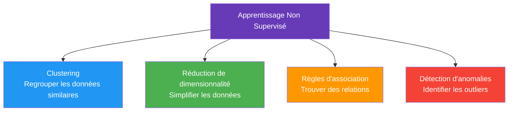
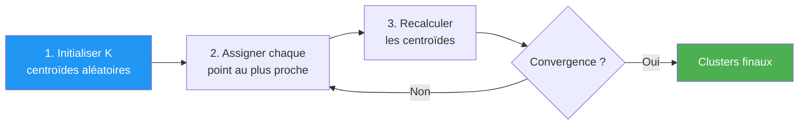
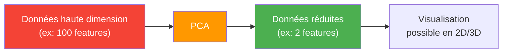
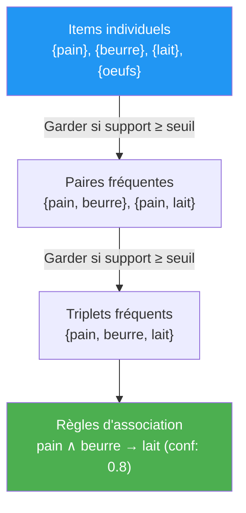
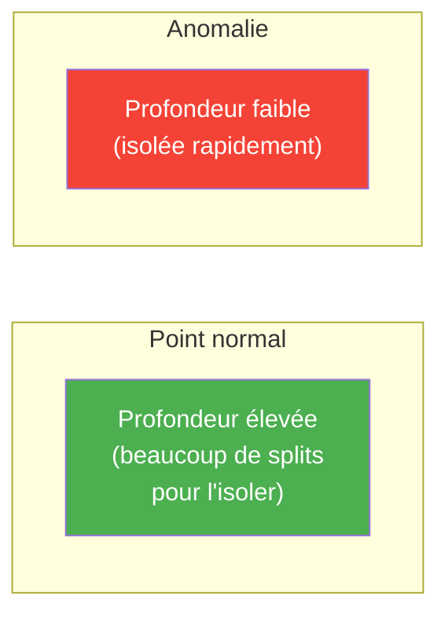
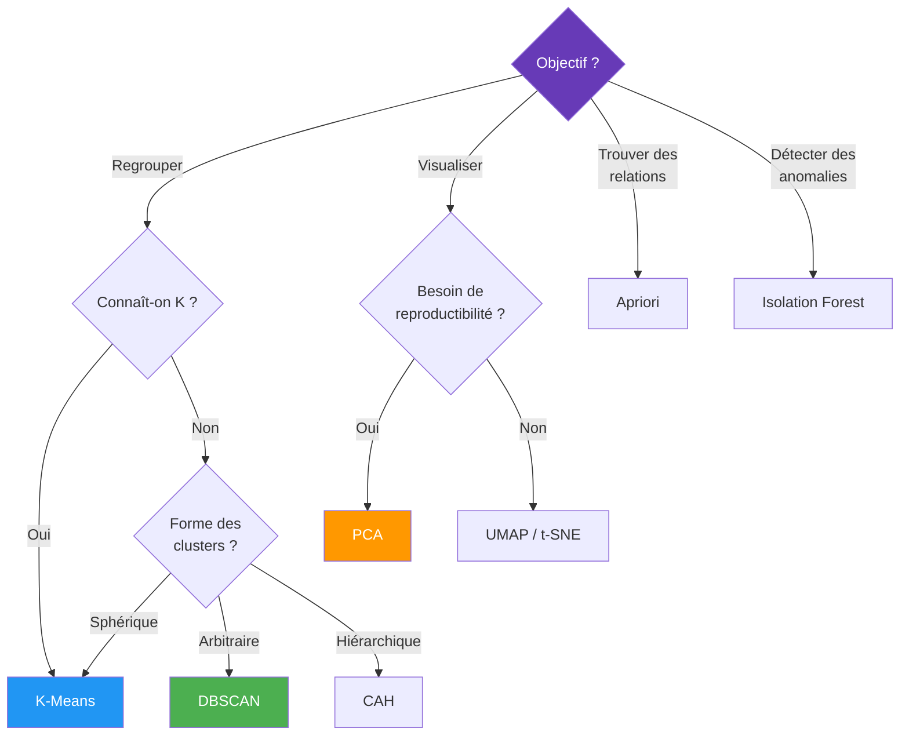

# Apprentissage Non Supervisé

L'apprentissage **non supervisé** est un type d'apprentissage où l'on ne dispose **d'aucune étiquette** (label). Le modèle doit découvrir par lui-même la **structure cachée** des données.

## Clustering (Regroupement)

Le clustering consiste à **regrouper** des données similaires en **clusters** sans connaître les groupes à l'avance.

### K-Means

L'algorithme de clustering le plus populaire.

**Principe :**
1. Choisir $k$ centroïdes aléatoirement
2. Assigner chaque point au centroïde le plus proche
3. Recalculer les centroïdes (moyenne des points du cluster)
4. Répéter 2-3 jusqu'à convergence

**Choisir le bon K :**
- **Méthode du coude (Elbow method)** : tracer l'inertie en fonction de K, chercher le "coude"
- **Silhouette Score** : mesure la qualité de séparation des clusters (entre -1 et 1, plus c'est haut mieux c'est)

| Avantages | Inconvénients |
|-----------|---------------|
| Simple et rapide | Il faut choisir K à l'avance |
| Fonctionne bien avec des clusters sphériques | Sensible aux outliers |
| Scalable | Ne gère pas les clusters de formes complexes |

### DBSCAN (Density-Based Spatial Clustering)

Clustering basé sur la **densité** : un cluster est une zone dense séparée d'autres zones denses par des zones de faible densité.

**Paramètres :**
- $\varepsilon$ (epsilon) : rayon de voisinage
- **MinPts** : nombre minimum de points pour former un cluster

**Types de points :**
| Type | Définition |
|------|-----------|
| **Core point** | A au moins MinPts voisins dans son rayon $\varepsilon$ |
| **Border point** | Dans le voisinage d'un core point mais a moins de MinPts voisins |
| **Noise point** | N'est dans le voisinage d'aucun core point |

| Avantages | Inconvénients |
|-----------|---------------|
| Pas besoin de choisir K | Sensible au choix de $\varepsilon$ et MinPts |
| Détecte des clusters de forme arbitraire | Difficulté avec des densités variables |
| Identifie automatiquement les outliers | Moins performant en haute dimension |

### Classification Ascendante Hiérarchique (CAH)

Construit une **hiérarchie** de clusters, visualisée sous forme de **dendrogramme**.

**Principe (agglomératif) :**
1. Chaque point est un cluster
2. Fusionner les deux clusters les plus proches
3. Répéter jusqu'à n'avoir qu'un seul cluster
4. Couper le dendrogramme au niveau souhaité

**Méthodes de liaison :**
| Méthode | Distance entre clusters |
|---------|----------------------|
| **Single linkage** | Distance minimale entre deux points |
| **Complete linkage** | Distance maximale entre deux points |
| **Average linkage** | Distance moyenne entre toutes les paires |
| **Ward** | Minimise l'augmentation de la variance intra-cluster |

## Réduction de dimensionnalité

Réduire le nombre de **features** tout en conservant l'information essentielle.

### PCA (Principal Component Analysis)

Trouve les **axes de variance maximale** dans les données et projette sur ces axes.

**Principe :**
1. Centrer les données
2. Calculer la matrice de covariance
3. Trouver les vecteurs propres (composantes principales)
4. Projeter sur les $k$ premiers vecteurs propres

**Utilisation :**
- **Visualisation** : projeter en 2D/3D pour explorer les données
- **Compression** : réduire la taille sans trop perdre d'information
- **Prétraitement** : réduire le bruit et accélérer l'entraînement

### t-SNE (t-distributed Stochastic Neighbor Embedding)

Technique de visualisation en 2D/3D qui préserve les **distances locales**.

| Critère | PCA | t-SNE |
|---------|-----|-------|
| **Type** | Linéaire | Non-linéaire |
| **Préserve** | Variance globale | Relations locales |
| **Vitesse** | Rapide | Lent |
| **Reproductibilité** | Déterministe | Stochastique (varie selon le seed) |
| **Utilisation** | Réduction + analyse | Visualisation uniquement |

### UMAP (Uniform Manifold Approximation and Projection)

Alternative moderne à t-SNE :
- Plus **rapide**
- Préserve mieux la **structure globale**
- Résultats plus **stables** entre les runs
- Fonctionne aussi pour la réduction de dimensionnalité (pas juste la visualisation)

## Règles d'association

Trouver des **relations fréquentes** entre des items dans des transactions.

**Exemple classique (Market Basket Analysis) :**
"Les clients qui achètent du pain et du beurre achètent souvent du lait."

### Métriques clés

| Métrique | Formule | Interprétation |
|----------|---------|---------------|
| **Support** | $\frac{\text{Transactions contenant A et B}}{\text{Total transactions}}$ | Fréquence de l'ensemble — filtre les itemsets rares |
| **Confiance** | $\frac{\text{Support}(A \cup B)}{\text{Support}(A)}$ | Si A est acheté, quelle probabilité que B le soit aussi ? |
| **Lift** | $\frac{\text{Confiance}(A \to B)}{\text{Support}(B)}$ | Lift > 1 = association positive, Lift = 1 = indépendant, Lift < 1 = association négative |

### Algorithme Apriori

L'algorithme fonctionne en deux étapes :

1. **Génération d'itemsets fréquents** : trouver tous les ensembles d'items dont le support dépasse un seuil minimum
2. **Extraction de règles** : à partir des itemsets fréquents, générer des règles dont la confiance dépasse un seuil

**Principe clé (propriété anti-monotone) :** si un itemset est rare, tous ses sur-ensembles le sont aussi. Cela permet d'**élaguer** l'espace de recherche massivement.

## Détection d'anomalies

Identifier des points de données qui **dévient significativement** du comportement normal. Utilisé en détection de fraude, monitoring de systèmes, contrôle qualité, cybersécurité.

### Isolation Forest

Idée : les anomalies sont **faciles à isoler**. L'algorithme construit des arbres de décision aléatoires et mesure combien de splits il faut pour isoler un point. Les anomalies nécessitent **moins de splits**.

### Comparaison des méthodes

| Méthode | Principe | Avantages | Inconvénients |
|---------|---------|-----------|---------------|
| **Isolation Forest** | Isolation rapide via arbres aléatoires | Rapide, scalable, pas d'hypothèse sur la distribution | Sensible à la contamination du dataset |
| **One-Class SVM** | Apprend la frontière des données "normales" | Fonctionne bien en haute dimension | Lent sur les grands datasets, choix du kernel |
| **[[Autoencoders]]** | Erreur de reconstruction élevée = anomalie | Capture les relations non-linéaires complexes | Nécessite un réseau de neurones, plus complexe |
| **LOF (Local Outlier Factor)** | Compare la densité locale d'un point à ses voisins | Détecte les anomalies locales | Lent sur les grands datasets, choix de K |
| **DBSCAN** | Les points classés "bruit" sont des anomalies | Détection intégrée au clustering | Sensible aux paramètres $\varepsilon$ et MinPts |

## Quand utiliser quel algorithme ?

