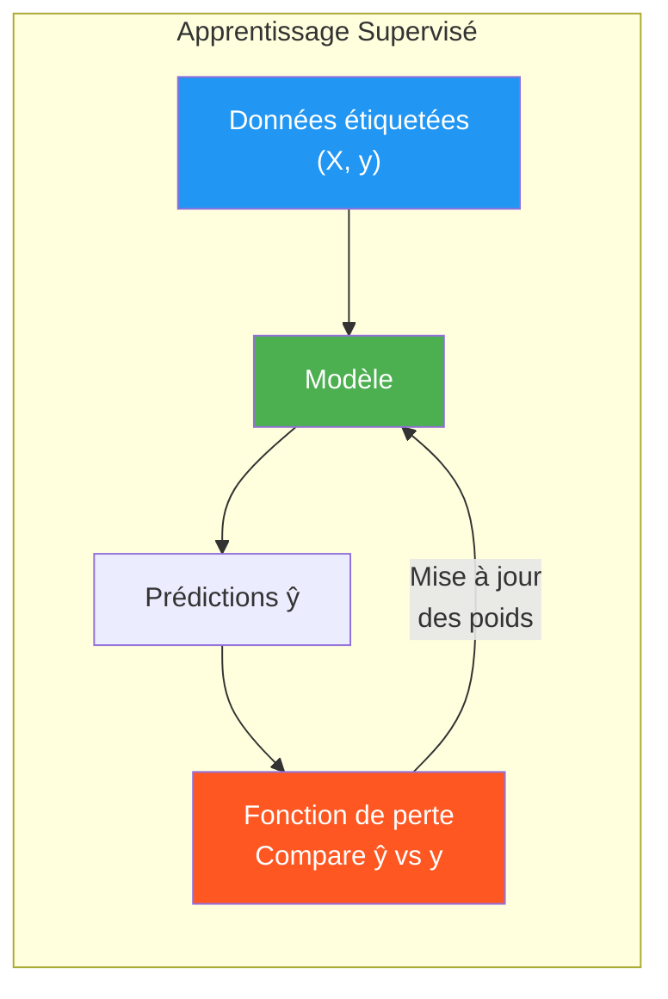
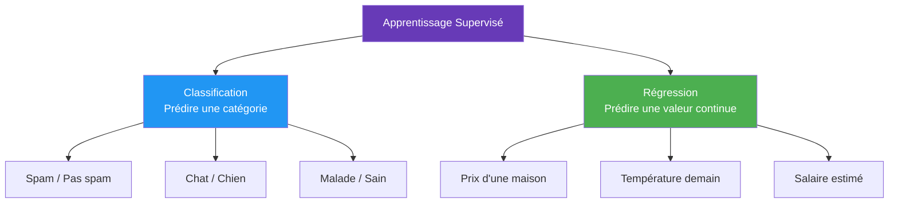
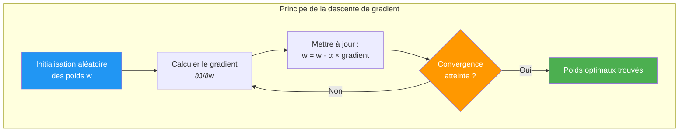
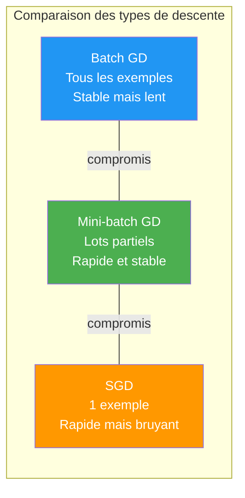

# Apprentissage Supervisé

L'apprentissage supervisé est un type d'apprentissage où l'on connaît déjà le résultat. On fournit au modèle des **données étiquetées** (input + output attendu) et il apprend à prédire la bonne réponse.



Les deux grands types de problèmes supervisés :


## La classification
Prédiction d'une étiquette de classe discrète ou d'une catégorie. Pour classifier notre résultat nous utilisons la **Régression Logistique**. Cette fonction va donner en valeur de retour soit 1 soit 0 sous forme d'une  fonction sigmoid.
- Régression Logistique 
	- **Description** : Utilisée pour des problèmes de classification binaire mais techniquement considérée comme une régression.


### Exemple
Toute les classification pouvant donner un résultat booléen.
	- Prédire si un email est spam ou non.
	- Male ou Female
	- Chaud ou Froid
	- Bon ou Mauvais
## La régression
La régression est la prédiction d'une valeur continue.
L'objectif est de trouver une courbe minimisant au maximum la distance entre les différents points. Nous pouvons utiliser plusieurs types de régressions :
- Régression Linéaire
	- **Description** : Modèle simple qui établit une relation linéaire entre les variables indépendantes (features) et la variable dépendante (cible).
	- **Exemple** : Prédire le prix d'une maison en fonction de sa superficie et de son emplacement.
	
- Régression Linéaire Multiple
	- **Description** : Extension de la régression linéaire simple avec plusieurs variables indépendantes.
	- **Exemple** : Prédire le prix d'une maison en tenant compte de la superficie, du nombre de chambres et de l'année de construction.
	
- Régression Polynomiale
	- **Description** : Modèle qui capture les relations non linéaires en ajoutant des puissances des variables indépendantes.
	- **Exemple** : Prédire l'évolution des ventes d'un produit en fonction du temps.
	


### Exemples
- Prédiction des prix d'une maison
- Prédiction des prix d'une action
- Estimation de la consommation de carburant

## Descente de gradient

La **descente de gradient** est un **algorithme d'optimisation** utilisé pour **ajuster les coefficients** (ou poids) dans les modèles de régression linéaire. Son objectif est de **minimiser la fonction de coût** (généralement l'**erreur quadratique moyenne**, MSE) en ajustant progressivement les coefficients dans la direction qui réduit cette erreur.



### Principe de la descente de gradient
L'idée est de **mettre à jour les coefficients** $w_0, w_1, \dots, w_n$ dans la direction opposée au **gradient** de la fonction de coût pour atteindre un minimum global ou local.

#### Mise à jour des coefficients

$$w_j := w_j - \alpha \frac{\partial J(w)}{\partial w_j}$$

- $w_j$ : Coefficient à mettre à jour.
- $\alpha$ : **Taux d'apprentissage** (step size).
- $\frac{\partial J(w)}{\partial w_j}$ : Dérivée partielle de la fonction de coût par rapport à $w_j$.

Choix du taux d'apprentissage ($\alpha$)
- **Petit $\alpha$** : Convergence **lente** mais sûre.
- **Grand $\alpha$** : Convergence **rapide** mais risque de **divergence**.

Types de descente de gradient
1. **Descente de gradient par lot (Batch Gradient Descent)** :
    - Utilise **tous les exemples** à chaque étape.
    - Stable mais **lent** pour les grandes bases de données.
2. **Descente de gradient stochastique (SGD)** :
    - Met à jour les coefficients pour **chaque exemple** individuellement.
    - **Rapide** mais plus **bruyant** (oscillations).
3. **Descente de gradient mini-batch** :
    - Compromis entre les deux, avec des **lots partiels** (mini-batchs).
    - **Rapide et stable**.



## Algorithmes classiques

### k-NN (k-Nearest Neighbors)

Classification ou régression par vote majoritaire parmi les $k$ voisins les plus proches.

**Distance** : Euclidienne $d = \sqrt{\sum (x_i - y_i)^2}$ ou Manhattan $\sum |x_i - y_i|$.

```python
from sklearn.neighbors import KNeighborsClassifier
from sklearn.preprocessing import StandardScaler

scaler = StandardScaler()
X_train_scaled = scaler.fit_transform(X_train)
X_test_scaled = scaler.transform(X_test)

knn = KNeighborsClassifier(n_neighbors=5, metric='euclidean')
knn.fit(X_train_scaled, y_train)
```

**Hyperparamètres** : `k` (plus grand = frontière + lisse, risque underfitting), métrique de distance. **Normaliser** les features est essentiel (sinon les features à grande échelle dominent).

### Arbres de décision (Decision Trees)

Partitionnement récursif de l'espace des features selon des seuils maximisant la pureté des nœuds.

**Critères de division** :
- **Gini impurity** : $G = 1 - \sum_k p_k^2$ (classification)
- **Entropy** : $H = -\sum_k p_k \log_2(p_k)$ (classification)
- **MSE** : pour la régression

```python
from sklearn.tree import DecisionTreeClassifier, export_text

dt = DecisionTreeClassifier(max_depth=5, min_samples_leaf=10, criterion='gini')
dt.fit(X_train, y_train)

# Visualiser la structure
print(export_text(dt, feature_names=feature_names))
```

**Problème** : overfitting si arbre trop profond. **Solutions** : pruning (max_depth, min_samples), ou passer aux méthodes ensemblistes.

### Random Forest

Ensemble de $N$ arbres de décision entraînés sur des sous-ensembles aléatoires des données et features. La prédiction finale est la moyenne (régression) ou le vote majoritaire (classification).

**Avantages** :
- Robuste à l'overfitting (bagging)
- Gère bien les valeurs manquantes
- Donne l'importance des features

```python
from sklearn.ensemble import RandomForestClassifier

rf = RandomForestClassifier(
    n_estimators=100,   # Nombre d'arbres
    max_depth=None,     # Profondeur illimitée (chaque arbre overfits, ensemble lisse)
    max_features='sqrt',# Nb features par split (sqrt(p) pour classification)
    min_samples_leaf=1,
    n_jobs=-1,          # Parallélisation
    random_state=42
)
rf.fit(X_train, y_train)

# Importance des features
import pandas as pd
feat_importance = pd.Series(rf.feature_importances_, index=feature_names).sort_values(ascending=False)
```

### SVM (Support Vector Machine)

Trouve l'hyperplan qui maximise la marge entre les classes. Les **vecteurs de support** sont les points les plus proches de l'hyperplan.

**Kernel trick** : projeter dans un espace de dimension supérieure pour rendre les données linéairement séparables.

| Kernel | Formule | Usage |
|--------|---------|-------|
| Linear | $K(x,y) = x^T y$ | Données linéairement séparables, texte |
| RBF (Gaussian) | $K(x,y) = e^{-\gamma \|x-y\|^2}$ | Usage général (défaut) |
| Polynomial | $K(x,y) = (x^T y + c)^d$ | Données polynomiales |
| Sigmoid | $K(x,y) = \tanh(\alpha x^T y + c)$ | Réseaux de neurones |

```python
from sklearn.svm import SVC, SVR
from sklearn.preprocessing import StandardScaler

# Normaliser OBLIGATOIRE pour SVM
scaler = StandardScaler()
X_train_scaled = scaler.fit_transform(X_train)

# Classification
svm = SVC(kernel='rbf', C=1.0, gamma='scale', probability=True)
svm.fit(X_train_scaled, y_train)

# Régression
svr = SVR(kernel='rbf', C=1.0, epsilon=0.1)
```

**Hyperparamètres** :
- `C` : coût de la violation de marge (grand C = moins de violations, risque overfitting)
- `gamma` : rayon du kernel RBF (grand gamma = décision très locale, overfitting)

### Gradient Boosting (XGBoost, LightGBM)

Construction séquentielle d'arbres où chaque arbre corrige les erreurs du précédent. Algorithme dominant sur les données tabulaires.

```python
import xgboost as xgb
from sklearn.model_selection import cross_val_score

xgb_model = xgb.XGBClassifier(
    n_estimators=500,
    learning_rate=0.05,     # Taux d'apprentissage (shrinkage)
    max_depth=6,            # Profondeur des arbres
    subsample=0.8,          # Fraction des données par arbre
    colsample_bytree=0.8,   # Fraction des features par arbre
    reg_alpha=0.1,          # Régularisation L1
    reg_lambda=1.0,         # Régularisation L2
    eval_metric='logloss',
    early_stopping_rounds=50,
    random_state=42
)

xgb_model.fit(
    X_train, y_train,
    eval_set=[(X_val, y_val)],
    verbose=False
)
```

**LightGBM** : plus rapide que XGBoost sur les grands datasets (croissance par feuille au lieu de par niveau).

```python
import lightgbm as lgb

lgb_model = lgb.LGBMClassifier(
    n_estimators=1000,
    learning_rate=0.05,
    num_leaves=31,
    subsample=0.8,
    colsample_bytree=0.8
)
```

## Comparaison des algorithmes

| Algorithme | Avantages | Inconvénients | Cas d'usage |
|-----------|-----------|---------------|-------------|
| Régression Logistique | Interprétable, rapide | Linéaire seulement | Baseline, features bien engineerées |
| k-NN | Simple, pas d'entraînement | Lent à l'inférence, sensible à l'échelle | Petits datasets, recommandation |
| Decision Tree | Interprétable, pas de normalisation | Overfitting, instable | Règles métier explicites |
| Random Forest | Robuste, feature importance | Mémoire, moins interprétable | Usage général, robustesse |
| SVM | Efficace haute dimension, kernel trick | Lent sur grands datasets | Texte, images (avec features) |
| XGBoost/LGBM | Meilleur sur données tabulaires | Hyperparamètres nombreux | Compétitions Kaggle, données structurées |
| Réseaux de neurones | Flexible, feature learning | Beaucoup de données, compute | Images, texte, séries temporelles |

## Pipeline ML pratique

### Split des données

```python
from sklearn.model_selection import train_test_split, StratifiedKFold

# Split 60/20/20 : train / validation / test
X_temp, X_test, y_temp, y_test = train_test_split(X, y, test_size=0.2, random_state=42, stratify=y)
X_train, X_val, y_train, y_val = train_test_split(X_temp, y_temp, test_size=0.25, random_state=42, stratify=y_temp)

# Stratification = préserver la proportion des classes dans chaque split
```

### Cross-validation

```python
from sklearn.model_selection import cross_val_score, StratifiedKFold

cv = StratifiedKFold(n_splits=5, shuffle=True, random_state=42)
scores = cross_val_score(model, X, y, cv=cv, scoring='roc_auc')
print(f"CV AUC: {scores.mean():.4f} ± {scores.std():.4f}")
```

### Métriques d'évaluation

**Classification** :

```python
from sklearn.metrics import (classification_report, confusion_matrix,
                              roc_auc_score, roc_curve, precision_recall_curve)

y_pred = model.predict(X_test)
y_prob = model.predict_proba(X_test)[:, 1]

print(classification_report(y_test, y_pred))
print(f"ROC-AUC: {roc_auc_score(y_test, y_prob):.4f}")
```

| Métrique | Formule | Quand l'utiliser |
|---------|---------|----------------|
| Accuracy | TP+TN / Total | Classes équilibrées |
| Precision | TP / (TP+FP) | Minimiser les faux positifs |
| Recall | TP / (TP+FN) | Minimiser les faux négatifs (médecine) |
| F1-Score | 2 × P×R / (P+R) | Compromis Precision/Recall |
| ROC-AUC | Aire sous courbe ROC | Comparaison de modèles |
| PR-AUC | Aire sous courbe PR | Classes déséquilibrées |

**Régression** :

| Métrique | Formule | Interprétation |
|---------|---------|---------------|
| MSE | $\frac{1}{n}\sum(y-\hat{y})^2$ | Sensible aux outliers |
| RMSE | $\sqrt{MSE}$ | Même unité que y |
| MAE | $\frac{1}{n}\sum|y-\hat{y}|$ | Robuste aux outliers |
| R² | $1 - \frac{SS_{res}}{SS_{tot}}$ | 1 = parfait, 0 = modèle nul |

### Recherche d'hyperparamètres

```python
from sklearn.model_selection import GridSearchCV, RandomizedSearchCV
from scipy.stats import randint, uniform

# Grid Search (exhaustif)
param_grid = {'max_depth': [3, 5, 7], 'n_estimators': [100, 200, 500]}
grid = GridSearchCV(rf, param_grid, cv=5, scoring='roc_auc', n_jobs=-1)
grid.fit(X_train, y_train)
print(f"Best params: {grid.best_params_}")

# Random Search (plus rapide pour grands espaces)
param_dist = {'max_depth': randint(3, 15), 'learning_rate': uniform(0.01, 0.2)}
random = RandomizedSearchCV(xgb_model, param_dist, n_iter=50, cv=5, n_jobs=-1)
random.fit(X_train, y_train)

# Optuna (optimisation bayésienne — le plus efficace)
import optuna
def objective(trial):
    params = {
        'max_depth': trial.suggest_int('max_depth', 3, 10),
        'learning_rate': trial.suggest_float('learning_rate', 1e-3, 0.3, log=True),
    }
    model = xgb.XGBClassifier(**params)
    return cross_val_score(model, X_train, y_train, cv=3, scoring='roc_auc').mean()

study = optuna.create_study(direction='maximize')
study.optimize(objective, n_trials=100)
```
