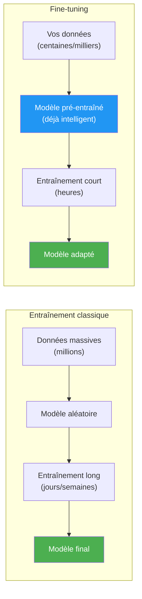
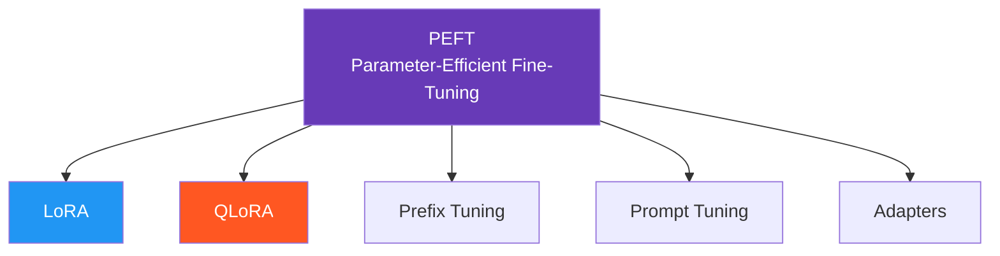
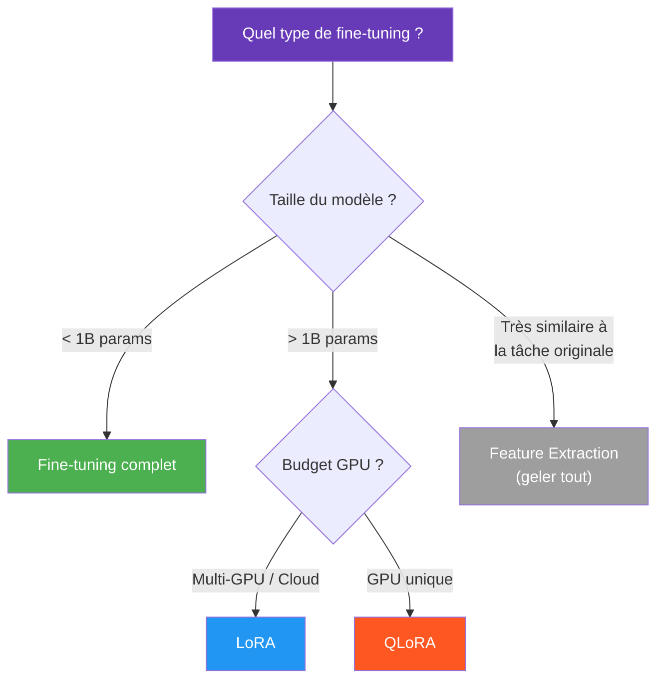

# Fine Tuning

Le **fine-tuning** (ajustement fin) consiste à prendre un modèle **pré-entraîné** sur une grande quantité de données et à l'adapter à une **tâche spécifique** en continuant l'entraînement sur un dataset plus petit et ciblé.

## Pourquoi faire du fine-tuning ?

Entraîner un modèle de deep learning depuis zéro nécessite :
- Des **millions de données**
- Des **centaines d'heures de GPU**
- Un **budget conséquent**

Le fine-tuning permet de **réutiliser les connaissances** déjà acquises par un modèle existant et de les adapter à moindre coût.

## Transfer Learning vs Fine-Tuning

Ces deux termes sont liés mais distincts :

| | Transfer Learning | Fine-Tuning |
|---|---|---|
| **Principe** | Réutiliser les features d'un modèle pré-entraîné | Sous-catégorie du transfer learning |
| **Couches gelées** | Toutes les couches du backbone sont gelées | On dégèle certaines couches pour les ré-entraîner |
| **Ce qu'on entraîne** | Uniquement les nouvelles couches ajoutées | Couches existantes + nouvelles couches |
| **Données requises** | Très peu | Un peu plus |
| **Quand l'utiliser** | Tâche très similaire à celle du pré-entraînement | Tâche différente ou données spécifiques |

## Stratégies de fine-tuning

### 1. Fine-tuning complet (Full Fine-Tuning)
- On ré-entraîne **tous les poids** du modèle
- Nécessite plus de données et de calcul
- Risque d'**overfitting** si le dataset est petit
- Utile quand la tâche cible est très différente

### 2. Fine-tuning partiel (Gradual Unfreezing)
- On dégèle les couches **progressivement**, de la dernière vers la première
- Permet un contrôle fin de l'adaptation
- Les premières couches (features génériques) restent souvent gelées
- Les dernières couches (features spécifiques) sont ré-entraînées

### 3. Discriminative Learning Rates
- On applique des **learning rates différents** selon les couches :
  - Couches profondes (début) : learning rate très faible
  - Couches superficielles (fin) : learning rate plus élevé
- Préserve les features génériques tout en adaptant les features spécifiques

## Fine-tuning des LLM

Le fine-tuning des grands modèles de langage (LLM) pose des défis spécifiques en raison de leur **taille** (des milliards de paramètres).

### Le problème

| Modèle | Paramètres | VRAM requise (FP16) |
|--------|-----------|---------------------|
| LLaMA 7B | 7 milliards | ~14 Go |
| LLaMA 13B | 13 milliards | ~26 Go |
| LLaMA 70B | 70 milliards | ~140 Go |

Un fine-tuning complet de ces modèles est **hors de portée** pour la plupart des praticiens.

### Solutions : Parameter-Efficient Fine-Tuning (PEFT)

Les méthodes PEFT ne modifient qu'une **petite fraction** des paramètres, réduisant drastiquement les besoins en mémoire et en calcul.

#### LoRA (Low-Rank Adaptation)

**Idée clé :** au lieu de modifier les poids originaux $W$, on ajoute une modification de **rang faible** :

$$W' = W + \Delta W = W + BA$$

- $W$ : matrice de poids originale ($d \times d$) — **gelée**
- $B$ : matrice ($d \times r$) — **entraînée**
- $A$ : matrice ($r \times d$) — **entraînée**
- $r$ : rang, typiquement 4 à 64 (très petit par rapport à $d$)

**Avantages :**
- Réduit les paramètres entraînables de **~10 000x**
- Pas de latence supplémentaire en inférence (on fusionne $W + BA$)
- Facilement interchangeable (on peut stocker plusieurs adaptateurs LoRA)

#### QLoRA (Quantized LoRA)

Combine la **quantification** du modèle de base avec LoRA :
1. Le modèle de base est quantifié en **4-bit** (NormalFloat4)
2. Les adaptateurs LoRA restent en **16-bit**
3. Rétro-propagation à travers le modèle quantifié

**Résultat :** fine-tuner un modèle de 65B paramètres sur un **seul GPU de 48 Go**.

#### Prefix Tuning
- Ajoute des **vecteurs apprenables** au début de chaque couche d'attention
- Le modèle original reste complètement gelé
- Très peu de paramètres supplémentaires (~0.1%)

#### Prompt Tuning
- Ajoute des **tokens virtuels apprenables** au début de l'entrée
- Encore plus simple que le prefix tuning
- Efficace pour les très grands modèles (>10B paramètres)

## Bonnes pratiques

### Préparation des données
- **Qualité > Quantité** : un petit dataset propre vaut mieux qu'un grand dataset bruité
- **Format cohérent** : structurer les données de manière uniforme
- **Diversité** : couvrir les cas d'usage réels attendus
- **Validation** : toujours garder un jeu de test séparé

### Hyperparamètres recommandés
| Paramètre | Valeur typique | Notes |
|-----------|---------------|-------|
| **Learning rate** | 1e-5 à 5e-5 | Plus faible que l'entraînement from scratch |
| **Epochs** | 2 à 5 | Surveiller l'overfitting |
| **Batch size** | Le plus grand possible | Limité par la VRAM |
| **Warmup** | 5-10% des steps | Montée progressive du learning rate |
| **Weight decay** | 0.01 à 0.1 | Régularisation |

### Pièges à éviter

- **Catastrophic forgetting** : le modèle oublie ses connaissances d'origine en s'adaptant trop à la nouvelle tâche
  - Solution : learning rate faible, régularisation, dégel progressif
- **Overfitting** : le modèle mémorise le dataset de fine-tuning
  - Solution : data augmentation, early stopping, dropout
- **Learning rate trop élevé** : détruit les poids pré-entraînés
  - Solution : commencer très bas, utiliser un warmup

## Quand choisir quelle méthode ?

## Ressources

- [Fine-tuning LLaMA 2 — Notebook complet](https://github.com/brevdev/notebooks/blob/main/llama2-finetune-own-data.ipynb)
- [Hugging Face PEFT](https://huggingface.co/docs/peft) — Librairie officielle pour LoRA, QLoRA, etc.
- [LoRA: Low-Rank Adaptation of Large Language Models](https://arxiv.org/abs/2106.09685) — Article original
