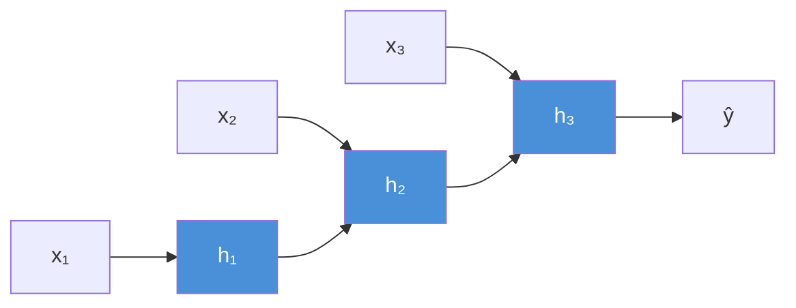
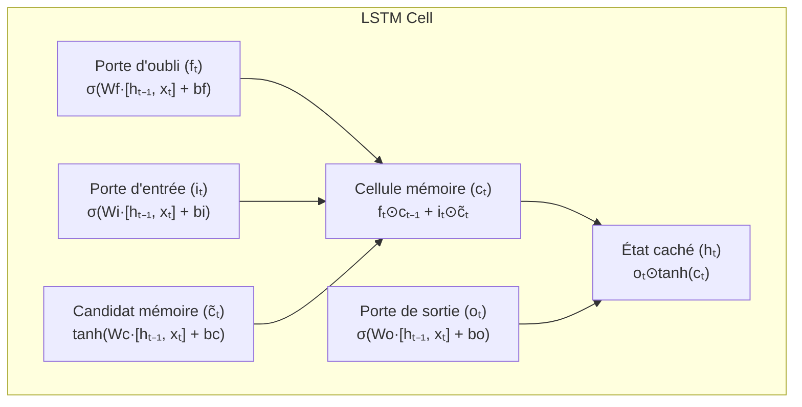
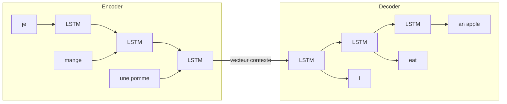
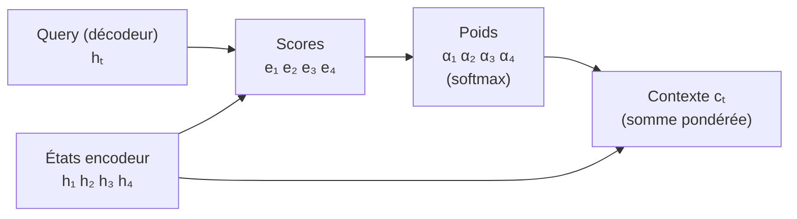

# NLP et Traitement du Langage Naturel

Le NLP (Natural Language Processing) est le domaine de l'IA qui permet aux machines de comprendre, interpréter et générer du langage humain. Il constitue le socle historique des modèles de langage modernes.

## Prétraitement du texte

Avant tout modèle, le texte brut doit être transformé en représentations numériques.

### Pipeline standard

```
Texte brut → Tokenisation → Normalisation → Vectorisation → Modèle
```

**Tokenisation**
Découpage du texte en unités (tokens) :
- **Mots** : `"chat noir"` → `["chat", "noir"]`
- **Sous-mots** (BPE, WordPiece) : `"tokenisation"` → `["token", "##isa", "##tion"]`
- **Caractères** : robustesse aux fautes, vocabulaire minimal

**Normalisation**
- Lowercasing : `"Chat"` → `"chat"`
- Stemming : `"mangeons"` → `"mang"` (racine brute)
- Lemmatisation : `"mangeons"` → `"manger"` (forme canonique, plus précise)
- Suppression des stop words : `"le"`, `"et"`, `"est"` ignorés selon le contexte

### Représentations vectorielles (Embeddings)

**Bag of Words (BoW)**
Vecteur de fréquence de chaque mot du vocabulaire. Simple, perd l'ordre.

**TF-IDF**
Pondère les mots rares (plus informatifs) par rapport aux mots communs :

```
TF-IDF(t, d) = TF(t, d) × log(N / df(t))
```

- TF : fréquence du terme dans le document
- IDF : inverse de la fréquence dans le corpus

**Word2Vec (2013)**
Réseau de neurones entraîné à prédire un mot depuis son contexte (CBOW) ou le contexte depuis un mot (Skip-gram). Produit des vecteurs denses qui encodent des relations sémantiques :

```
roi - homme + femme ≈ reine
```

**GloVe, FastText**
- GloVe : statistiques globales de co-occurrence
- FastText : embeddings au niveau sous-mot, gère les mots inconnus

## Réseaux Récurrents (RNN)

Les RNN traitent les séquences en maintenant un état caché qui propage l'information dans le temps.



**Équation de mise à jour :**
```
hₜ = tanh(Wₕ · hₜ₋₁ + Wₓ · xₜ + b)
```

**Problème du gradient qui disparaît**
Lors de la rétropropagation dans le temps (BPTT), les gradients sont multipliés à chaque pas. Pour de longues séquences, ils tendent vers 0 → le réseau "oublie" les dépendances lointaines.

## LSTM — Long Short-Term Memory

Le LSTM résout le problème du gradient disparu avec un mécanisme de portes (gates) et une cellule mémoire séparée.



| Porte | Rôle |
|---|---|
| Oubli (f) | Décide quelles informations effacer de la cellule |
| Entrée (i) | Décide quelles nouvelles infos écrire |
| Sortie (o) | Décide quelles infos exposer en sortie |
| Cellule (c) | Mémoire long terme, flux direct → gradients stables |

**Avantages :** Capture les dépendances à longue distance, gradient stable
**Inconvénients :** Lent à entraîner, séquentiel (non parallélisable)

## GRU — Gated Recurrent Unit

Version simplifiée du LSTM avec seulement 2 portes (reset, update). Performances comparables, moins de paramètres.

```
zₜ = σ(Wz · [hₜ₋₁, xₜ])          # Porte de mise à jour
rₜ = σ(Wr · [hₜ₋₁, xₜ])          # Porte de reset
h̃ₜ = tanh(W · [rₜ ⊙ hₜ₋₁, xₜ])  # État candidat
hₜ = (1 - zₜ) ⊙ hₜ₋₁ + zₜ ⊙ h̃ₜ  # État final
```

| Modèle | Paramètres | Vitesse | Mémoire long terme |
|---|---|---|---|
| RNN | Faible | Rapide | Faible |
| GRU | Moyen | Moyen | Bonne |
| LSTM | Élevé | Lent | Excellente |

## Architectures séquence-à-séquence (Seq2Seq)

Pour les tâches où l'entrée et la sortie sont toutes deux des séquences de longueurs différentes (traduction, résumé, dialogue).



**Encodeur** : compresse la séquence source en un vecteur de contexte fixe
**Décodeur** : génère la séquence cible token par token, conditionné par ce vecteur

**Limitation** : le vecteur de contexte est un goulot d'étranglement — toute l'information de l'entrée doit tenir dans un seul vecteur.

## Mécanisme d'attention (Bahdanau, 2015)

L'attention résout le goulot d'étranglement : au lieu d'un seul vecteur de contexte, le décodeur peut "regarder" tous les états cachés de l'encodeur à chaque pas.

```
Attention(Q, K, V) = softmax(QKᵀ / √dₖ) · V
```

- **Query (Q)** : état actuel du décodeur — "ce que je cherche"
- **Keys (K)** : états de l'encodeur — "ce qui est disponible"
- **Values (V)** : contenu associé aux keys
- **Score** : similarité Q·K → poids softmax → moyenne pondérée des V



## Applications majeures du NLP

| Tâche | Description | Exemple |
|---|---|---|
| Classification de texte | Catégoriser un document | Détection de spam, analyse de sentiments |
| NER | Identifier entités nommées | Personnes, lieux, organisations dans un texte |
| Traduction automatique | Seq2Seq entre langues | DeepL, Google Translate |
| Résumé automatique | Extractif ou abstractif | Résumer un article |
| Question-Answering | Trouver une réponse dans un contexte | Moteurs de recherche, assistants |
| Génération de texte | Produire du texte cohérent | ChatGPT, Copilot |
| Reconnaissance vocale | Audio → texte | Whisper, DeepSpeech |

## Évolution vers les Transformers

```
RNN (1986) → LSTM (1997) → GRU (2014) → Attention (2015)
→ Transformer (2017) → BERT (2018) → GPT-2/3 (2019/2020) → LLM modernes
```

Les Transformers ont supplanté les RNN/LSTM pour la plupart des tâches NLP car :
- **Parallélisables** : pas de dépendance séquentielle pendant l'entraînement
- **Attention globale** : chaque token peut "voir" tous les autres en une seule couche
- **Scalables** : bénéficient directement de plus de données et de paramètres
