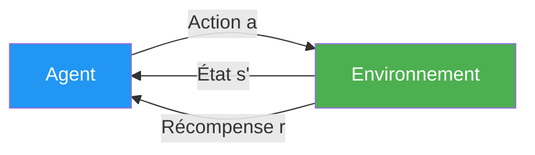
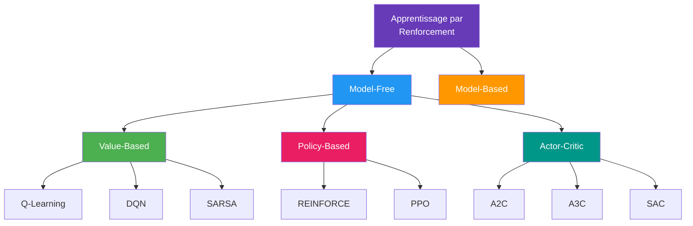
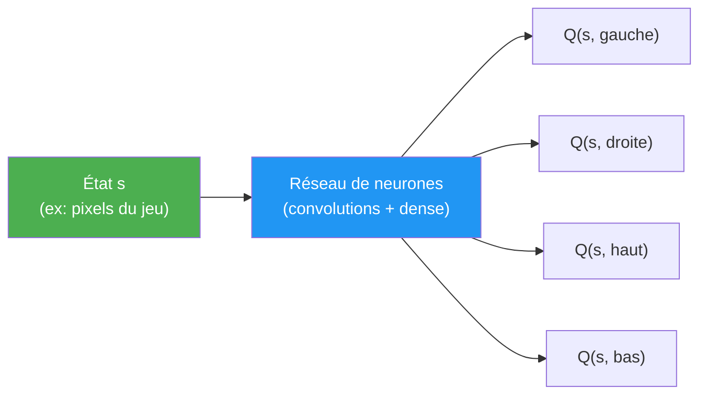
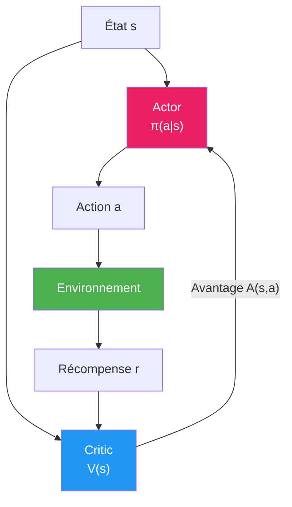

# Apprentissage par Renforcement

L'**apprentissage par renforcement** (Reinforcement Learning, RL) permet à un **agent** d'apprendre par **essais et erreurs** en interagissant avec un **environnement**. L'agent reçoit des **récompenses** ou des **pénalités** en fonction de ses actions, et son objectif est de maximiser la récompense cumulée sur le long terme.

## Concepts fondamentaux

| Concept | Description | Exemple (jeu vidéo) |
|---------|-------------|---------------------|
| **Agent** | L'entité qui prend des décisions | Le personnage joueur |
| **Environnement** | Le monde dans lequel l'agent évolue | Le niveau du jeu |
| **État ($s$)** | La situation actuelle de l'agent | Position, vie, inventaire |
| **Action ($a$)** | Ce que l'agent peut faire | Sauter, tirer, avancer |
| **Récompense ($r$)** | Signal de feedback après une action | +10 pour un ennemi tué, -1 par seconde |
| **Politique ($\pi$)** | La stratégie de l'agent : quel action prendre dans quel état | $\pi(a \mid s)$ |
| **Valeur ($V$)** | Récompense cumulée attendue depuis un état | "Ce couloir mène probablement au trésor" |

## Le processus de décision markovien (MDP)

Le RL est formalisé comme un **MDP** (Markov Decision Process), défini par :
- $S$ : ensemble des **états** possibles
- $A$ : ensemble des **actions** possibles
- $P(s' \mid s, a)$ : probabilité de **transition** vers l'état $s'$ en prenant l'action $a$ dans l'état $s$
- $R(s, a)$ : **récompense** obtenue
- $\gamma$ : facteur de **discount** ($0 \leq \gamma \leq 1$)

**Propriété de Markov :** l'état futur ne dépend que de l'état présent, pas de l'historique.

### Le facteur de discount $\gamma$

Le facteur de discount contrôle l'importance des récompenses **futures** par rapport aux récompenses **immédiates** :

$$G_t = r_t + \gamma r_{t+1} + \gamma^2 r_{t+2} + \dots = \sum_{k=0}^{\infty} \gamma^k r_{t+k}$$

| Valeur de $\gamma$ | Comportement |
|:---:|---|
| $\gamma \approx 0$ | L'agent est **myope**, il ne voit que la récompense immédiate |
| $\gamma \approx 1$ | L'agent est **prévoyant**, il planifie sur le long terme |
| $\gamma = 0.99$ | Valeur typique pour la plupart des problèmes |

## Exploration vs Exploitation

Un dilemme fondamental en RL :

| | Exploration | Exploitation |
|---|---|---|
| **Quoi ?** | Essayer des actions **nouvelles** | Répéter les actions qui **marchent** |
| **Pourquoi ?** | Découvrir de meilleures stratégies | Maximiser la récompense connue |
| **Risque** | Perdre du temps sur des mauvaises actions | Rater de meilleures options |

### Stratégie epsilon-greedy ($\varepsilon$-greedy)

La méthode la plus simple pour équilibrer exploration et exploitation :

$$a = \begin{cases} \text{action aléatoire} & \text{avec probabilité } \varepsilon \\ \arg\max_a Q(s, a) & \text{avec probabilité } 1 - \varepsilon \end{cases}$$

- $\varepsilon$ commence **haut** (beaucoup d'exploration) et **décroît** au fil du temps
- Exemple : $\varepsilon = 1.0 \to 0.01$ sur 100 000 étapes

## Fonctions de valeur

### Fonction de valeur d'état $V(s)$

Récompense cumulée attendue en partant de l'état $s$ et en suivant la politique $\pi$ :

$$V^\pi(s) = \mathbb{E}_\pi \left[ \sum_{k=0}^{\infty} \gamma^k r_{t+k} \mid s_t = s \right]$$

### Fonction de valeur action-état $Q(s, a)$

Récompense cumulée attendue en prenant l'action $a$ dans l'état $s$ puis en suivant $\pi$ :

$$Q^\pi(s, a) = \mathbb{E}_\pi \left[ \sum_{k=0}^{\infty} \gamma^k r_{t+k} \mid s_t = s, a_t = a \right]$$

### Équation de Bellman

Relation récursive fondamentale qui lie la valeur d'un état à celle des états suivants :

$$V^\pi(s) = \sum_a \pi(a \mid s) \sum_{s'} P(s' \mid s, a) \left[ R(s, a) + \gamma V^\pi(s') \right]$$

## Les grandes familles d'algorithmes

### Méthodes Value-Based

#### Q-Learning

Algorithme **off-policy** qui apprend la fonction $Q$ optimale sans suivre une politique fixe.

**Règle de mise à jour :**

$$Q(s, a) \leftarrow Q(s, a) + \alpha \left[ r + \gamma \max_{a'} Q(s', a') - Q(s, a) \right]$$

- $\alpha$ : taux d'apprentissage
- $r + \gamma \max_{a'} Q(s', a')$ : cible (target)
- $Q(s, a)$ : estimation actuelle
- La différence entre les deux est l'**erreur TD** (Temporal Difference)

**La table Q :**

| | Gauche | Droite | Haut | Bas |
|---|:---:|:---:|:---:|:---:|
| État A | 0.2 | **0.8** | 0.1 | 0.3 |
| État B | **0.9** | 0.1 | 0.4 | 0.2 |
| État C | 0.3 | 0.5 | **0.7** | 0.1 |

L'agent choisit l'action avec la plus haute valeur Q (en gras).

#### SARSA (State-Action-Reward-State-Action)

Similaire au Q-Learning mais **on-policy** : il utilise l'action réellement prise par la politique actuelle.

$$Q(s, a) \leftarrow Q(s, a) + \alpha \left[ r + \gamma Q(s', a') - Q(s, a) \right]$$

Différence clé : utilise $Q(s', a')$ (action réelle) au lieu de $\max_{a'} Q(s', a')$ (meilleure action).

#### Deep Q-Network (DQN)

Quand l'espace d'états est trop grand pour une table Q (ex: pixels d'un jeu), on utilise un **réseau de neurones** pour approximer $Q(s, a)$.

**Innovations clés de DQN :**
- **Experience Replay** : stocker les transitions $(s, a, r, s')$ dans un buffer et entraîner sur des échantillons aléatoires
- **Target Network** : un second réseau mis à jour moins fréquemment pour stabiliser l'entraînement

### Méthodes Policy-Based

Au lieu d'apprendre une fonction de valeur, on apprend **directement la politique** $\pi_\theta(a \mid s)$.

#### REINFORCE (Monte Carlo Policy Gradient)

- On joue un épisode complet
- On calcule la récompense cumulée pour chaque action
- On met à jour les paramètres pour **renforcer** les bonnes actions

$$\nabla J(\theta) = \mathbb{E}_\pi \left[ \nabla \log \pi_\theta(a \mid s) \cdot G_t \right]$$

**Avantage :** peut gérer des espaces d'actions continus.
**Inconvénient :** haute variance, convergence lente.

### Méthodes Actor-Critic

Combinent le meilleur des deux mondes :
- **Actor** (acteur) : apprend la politique $\pi_\theta(a \mid s)$
- **Critic** (critique) : apprend la fonction de valeur $V(s)$ pour évaluer les actions de l'acteur

#### PPO (Proximal Policy Optimization)

L'algorithme le plus populaire aujourd'hui (utilisé pour entraîner ChatGPT via RLHF).
- Limite les mises à jour de politique pour éviter les changements trop brusques
- Stable et performant
- Fonctionne bien dans la plupart des environnements

## Applications

| Domaine | Application | Exemple notable |
|---------|-------------|----------------|
| **Jeux** | Maîtriser des jeux complexes | AlphaGo (Go), AlphaZero (échecs), OpenAI Five (Dota 2) |
| **Robotique** | Locomotion, manipulation d'objets | Robots marcheurs, bras robotiques |
| **Conduite autonome** | Décisions de navigation | Gestion des intersections, changements de voie |
| **Finance** | Trading algorithmique | Gestion de portefeuille, market making |
| **Santé** | Traitements personnalisés | Dosage de médicaments, plans de radiothérapie |
| **NLP** | Alignement des LLM | RLHF (ChatGPT, Claude) |
| **Industrie** | Contrôle de processus | Refroidissement data centers (Google), gestion d'énergie |

## Résumé des différences

| Critère | Value-Based | Policy-Based | Actor-Critic |
|---------|-------------|-------------|--------------|
| **Apprend** | $Q(s, a)$ ou $V(s)$ | $\pi(a \mid s)$ | Les deux |
| **Actions** | Discrètes uniquement | Discrètes ou continues | Discrètes ou continues |
| **Variance** | Faible | Haute | Modérée |
| **Biais** | Plus élevé | Faible | Équilibré |
| **Exemple** | DQN | REINFORCE | PPO, A3C |
