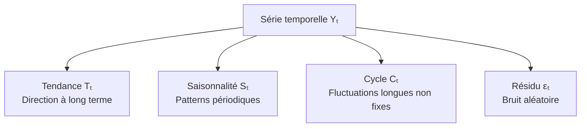
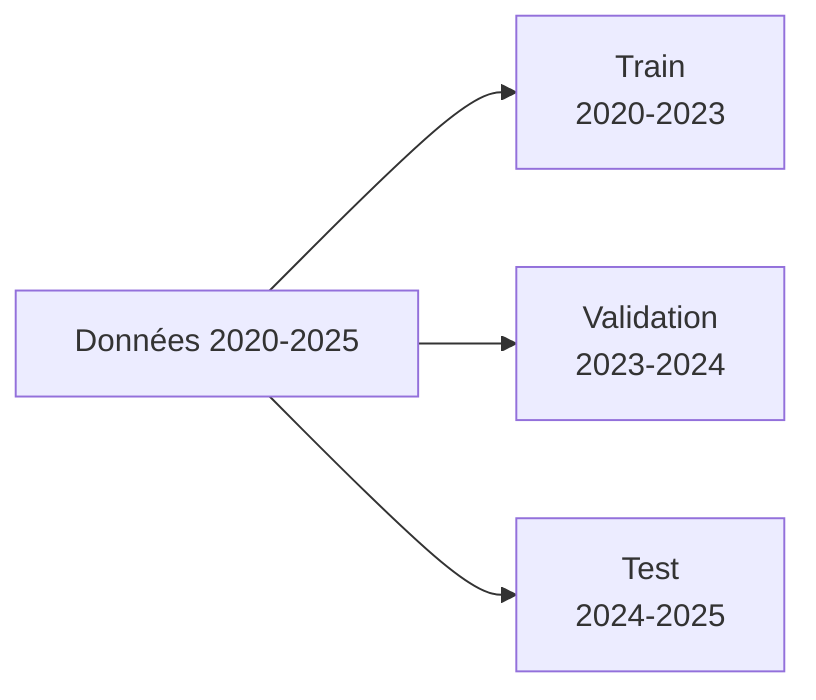

# Séries Temporelles

Une série temporelle est une séquence de valeurs indexées dans le temps. La prévision de séries temporelles est une tâche fondamentale en finance, météorologie, logistique, surveillance système, et bien d'autres domaines.

## Composantes d'une série temporelle



**Décomposition additive :**
```
Yₜ = Tₜ + Sₜ + Cₜ + εₜ
```

**Décomposition multiplicative** (quand l'amplitude de la saisonnalité augmente avec la tendance) :
```
Yₜ = Tₜ × Sₜ × Cₜ × εₜ
```

```python
from statsmodels.tsa.seasonal import seasonal_decompose

result = seasonal_decompose(df['valeur'], model='additive', period=12)
result.plot()  # Affiche les 4 composantes
```

## Stationnarité

Un processus est **stationnaire** si sa moyenne, variance et autocovariance ne dépendent pas du temps. C'est une hypothèse requise par de nombreux modèles statistiques.

**Test ADF (Augmented Dickey-Fuller) :**
```python
from statsmodels.tsa.stattools import adfuller

result = adfuller(df['valeur'])
print(f"p-value: {result[1]:.4f}")
# p < 0.05 → stationnaire (rejette H0 : racine unitaire)
```

**Rendre une série stationnaire :**
- **Différenciation** : `Δyₜ = yₜ - yₜ₋₁` (ordre 1)
- **Log-transformation** : stabilise la variance
- **Détrending** : régresser sur le temps et prendre les résidus

## Corrélogrammes

**ACF (Autocorrelation Function)** : corrélation entre yₜ et yₜ₋ₖ (lag k). Indique l'ordre MA.

**PACF (Partial ACF)** : corrélation directe entre yₜ et yₜ₋ₖ, en éliminant les effets des lags intermédiaires. Indique l'ordre AR.

```python
from statsmodels.graphics.tsaplots import plot_acf, plot_pacf

plot_acf(df['valeur'], lags=40)
plot_pacf(df['valeur'], lags=40)
```

## Modèles statistiques classiques

### ARIMA (AutoRegressive Integrated Moving Average)

Modèle paramétrique avec trois composantes :

| Paramètre | Signification | Déterminé par |
|---|---|---|
| p (AR) | Ordre autorégressif | Pic sur PACF |
| d (I) | Ordre de différenciation | Nombre de diff pour stationnarité |
| q (MA) | Ordre Moving Average | Pic sur ACF |

```
ARMA(p,q) : yₜ = c + Σᵢφᵢyₜ₋ᵢ + εₜ + Σⱼθⱼεₜ₋ⱼ
ARIMA(p,d,q) = ARMA sur la série différenciée d fois
```

```python
from statsmodels.tsa.arima.model import ARIMA

model = ARIMA(train, order=(2, 1, 2))  # p=2, d=1, q=2
result = model.fit()
forecast = result.forecast(steps=30)
print(result.summary())
```

**Sélection automatique des paramètres (AIC/BIC) :**
```python
import pmdarima as pm
model = pm.auto_arima(train, seasonal=False, information_criterion='aic')
```

### SARIMA (Seasonal ARIMA)

Ajoute une composante saisonnière : SARIMA(p,d,q)(P,D,Q,m) où m est la période.

```python
from statsmodels.tsa.statespace.sarimax import SARIMAX

model = SARIMAX(train, order=(1,1,1), seasonal_order=(1,1,1,12))
result = model.fit()
```

### Lissage exponentiel (ETS)

Moyenne pondérée des observations passées, avec poids décroissant exponentiellement.

| Modèle | Composantes |
|---|---|
| SES (Simple) | Niveau seulement |
| Double (Holt) | Niveau + tendance |
| Triple (Holt-Winters) | Niveau + tendance + saisonnalité |

```python
from statsmodels.tsa.holtwinters import ExponentialSmoothing

model = ExponentialSmoothing(train, trend='add', seasonal='add', seasonal_periods=12)
result = model.fit()
```

## Prophet (Meta, 2017)

Modèle additif conçu pour la prévision à grande échelle, robuste aux données manquantes et aux outliers.

```
y(t) = g(t) + s(t) + h(t) + εₜ
```
- g(t) : tendance (linéaire ou logistique)
- s(t) : saisonnalité (séries de Fourier)
- h(t) : jours fériés et événements

```python
from prophet import Prophet

df_prophet = df.rename(columns={'date': 'ds', 'valeur': 'y'})
model = Prophet(yearly_seasonality=True, weekly_seasonality=True)
model.add_country_holidays(country_name='FR')
model.fit(df_prophet)

future = model.make_future_dataframe(periods=365)
forecast = model.predict(future)
model.plot(forecast)
```

## Approches Deep Learning

### LSTM pour séries temporelles

```python
import numpy as np
from tensorflow.keras.models import Sequential
from tensorflow.keras.layers import LSTM, Dense

# Création de séquences glissantes
def create_sequences(data, seq_length):
    X, y = [], []
    for i in range(len(data) - seq_length):
        X.append(data[i:i+seq_length])
        y.append(data[i+seq_length])
    return np.array(X), np.array(y)

X, y = create_sequences(scaled_data, seq_length=30)
X = X.reshape((X.shape[0], X.shape[1], 1))  # (samples, timesteps, features)

model = Sequential([
    LSTM(64, return_sequences=True, input_shape=(30, 1)),
    LSTM(32),
    Dense(1)
])
model.compile(optimizer='adam', loss='mse')
```

### Temporal Convolutional Network (TCN)

CNN avec convolutions causales et dilatées. Plus rapide que les LSTM, parallélisable.

```
Causalité : yₜ dépend uniquement de yₜ₋₁, yₜ₋₂, ... (pas du futur)
Dilatation : champ réceptif exponentiel avec peu de couches
```

### Transformers pour séries temporelles

**Informer, Autoformer, PatchTST** : adaptent l'architecture Transformer aux séries temporelles avec des mécanismes d'attention efficaces pour les longues séquences.

**PatchTST** (2023) : découpe la série en patches (comme ViT pour les images), réduit la complexité de O(L²) à O(L²/P²).

## Validation et métriques

### Split temporel



**Jamais de validation croisée K-Fold classique** : violerait la causalité temporelle.

**Walk-forward validation** :
```
Train: [1..n]     → Predict: [n+1]
Train: [1..n+1]   → Predict: [n+2]
Train: [1..n+2]   → Predict: [n+3]
```

### Métriques

| Métrique | Formule | Usage |
|---|---|---|
| MAE | Σ\|yₜ - ŷₜ\| / n | Interprétable, robuste |
| RMSE | √(Σ(yₜ-ŷₜ)²/n) | Pénalise les grandes erreurs |
| MAPE | Σ\|yₜ-ŷₜ\|/yₜ × 100 | Erreur relative en % |
| sMAPE | Symétrique MAPE | Évite asymétrie MAPE |
| MASE | MAE / MAE(naïf) | Comparaison au modèle naïf |

**Modèle naïf** : prédire yₜ = yₜ₋₁. Benchmark minimal à battre.

## Comparaison des approches

| Modèle | Données | Interprétabilité | Saisonnalité | Scalabilité |
|---|---|---|---|---|
| ARIMA | Peu | Élevée | Non (SARIMA) | Faible |
| Prophet | Peu-moyen | Élevée | Oui | Bonne |
| LSTM | Beaucoup | Faible | Implicite | Bonne |
| TCN | Beaucoup | Faible | Implicite | Excellente |
| Transformer | Beaucoup | Faible | Implicite | Très bonne |

**Règle pratique :**
- < 1000 points et interprétabilité requise → ARIMA / Prophet
- Données complexes, multi-variables → LSTM / TCN
- Production à grande échelle → TCN / Transformer
