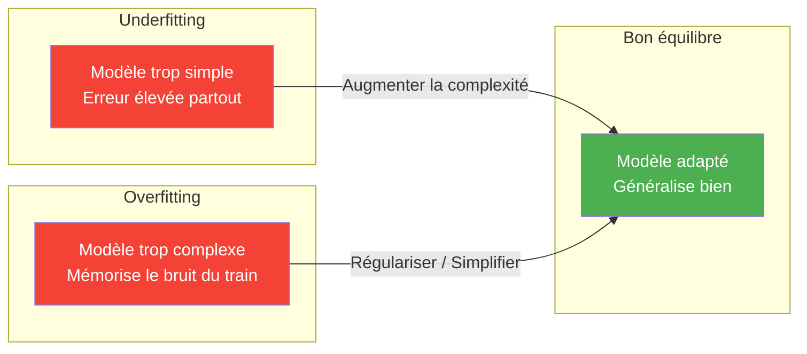
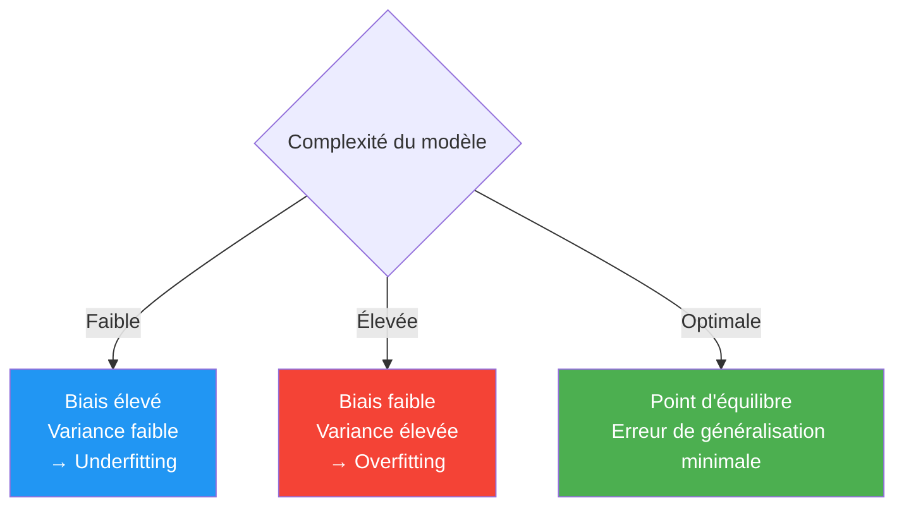
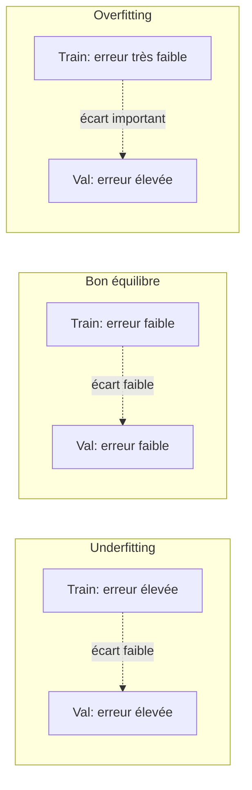
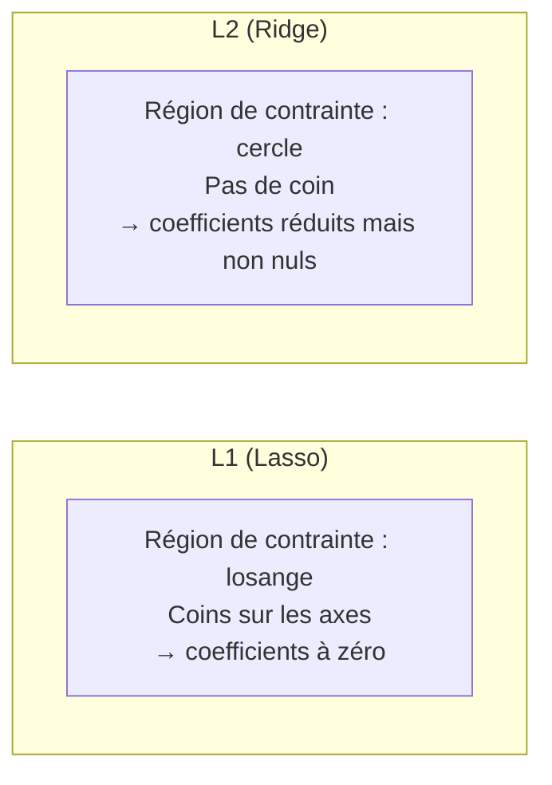
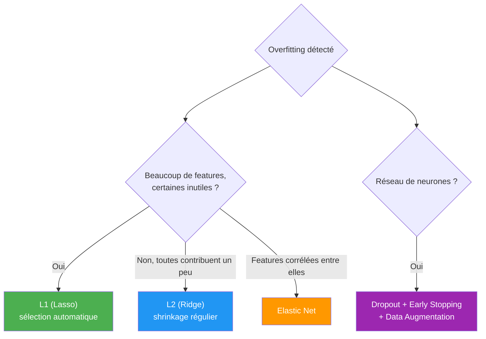

# Biais-Variance et Régularisation

Un modèle qui obtient un excellent score sur ses données d'entraînement mais s'effondre sur des données nouvelles n'a rien appris d'utile. Comprendre **pourquoi** un modèle généralise mal — et pas seulement le constater — est la clé pour choisir le bon remède : plus de données, un modèle différent, ou de la régularisation.

## Sous-apprentissage et sur-apprentissage : rappel



| Symptôme | Diagnostic |
|---|---|
| Erreur élevée sur train **et** validation | Underfitting |
| Erreur faible sur train, élevée sur validation (écart important) | Overfitting |
| Erreur faible sur train **et** validation, écart faible | Bon équilibre |

## La décomposition biais-variance

L'erreur de généralisation d'un modèle se décompose formellement en trois termes :

$$\text{Erreur} = \underbrace{\text{Biais}^2}_{\text{modèle trop simple}} + \underbrace{\text{Variance}}_{\text{modèle trop sensible}} + \underbrace{\text{Bruit irréductible}}_{\text{aléa inhérent aux données}}$$

- **Biais** : erreur due à des hypothèses trop simplificatrices du modèle. Un modèle très biaisé "rate" systématiquement les patterns réels, quelles que soient les données d'entraînement fournies (underfitting).
- **Variance** : erreur due à une sensibilité excessive aux fluctuations de l'échantillon d'entraînement. Un modèle à forte variance change radicalement de comportement selon les données vues, y compris en mémorisant leur bruit (overfitting).
- **Bruit irréductible** : incertitude inhérente aux données elles-mêmes (erreurs de mesure, facteurs non observés) — aucun modèle, aussi bon soit-il, ne peut l'éliminer.

**Analogie du tir à la cible :**

| | Biais faible | Biais élevé |
|---|---|---|
| **Variance faible** | Tirs groupés au centre — bon modèle | Tirs groupés, mais loin du centre — sous-apprentissage |
| **Variance élevée** | Tirs dispersés, centrés en moyenne — sur-apprentissage | Tirs dispersés et loin du centre — pire cas |



**Le compromis** : réduire le biais (modèle plus complexe, plus de features) augmente presque toujours la variance, et inversement. Il n'existe pas de modèle qui minimise les deux simultanément sans contrainte — c'est précisément ce que la régularisation vient arbitrer.

## Courbes d'apprentissage

Tracer l'erreur d'entraînement et de validation en fonction de la **taille du dataset** (ou de la complexité du modèle) permet de diagnostiquer la situation sans ambiguïté :

| Situation | Erreur train | Erreur validation | Écart | Diagnostic |
|---|---|---|---|---|
| Les deux erreurs restent élevées et proches, même avec plus de données | Élevée | Élevée | Faible | **Underfitting** — plus de données ne suffira pas, il faut un modèle plus riche |
| Erreur train très faible, erreur validation élevée | Très faible | Élevée | Important | **Overfitting** — plus de données ou de régularisation aide |
| Les deux erreurs convergent vers une valeur faible avec plus de données | Faible | Faible | Faible | **Bon ajustement** |



## Diagnostiquer et corriger

| Diagnostic | Solutions |
|---|---|
| **Underfitting** (biais élevé) | Modèle plus complexe, plus de features, plus d'epochs, réduire la régularisation |
| **Overfitting** (variance élevée) | Plus de données, régularisation (ci-dessous), simplifier le modèle, cross-validation, dropout, early stopping |

## Régularisation : le principe général

La régularisation ajoute une **contrainte ou une pénalité** au modèle pour réduire sa variance, au prix d'un léger biais supplémentaire — un échange délibéré, presque toujours favorable quand le modèle overfit.

### Régularisation L2 (Ridge)

Ajoute à la fonction de perte une pénalité proportionnelle au **carré** des poids :

$$\mathcal{L}_{\text{ridge}} = \mathcal{L}_{\text{originale}} + \lambda \sum_{i} w_i^2$$

**Effet** : rétrécit (*shrinkage*) tous les coefficients vers zéro de façon régulière, sans jamais les annuler exactement. Utile quand on pense que la plupart des features contribuent un peu.

### Régularisation L1 (Lasso)

Ajoute une pénalité proportionnelle à la **valeur absolue** des poids :

$$\mathcal{L}_{\text{lasso}} = \mathcal{L}_{\text{originale}} + \lambda \sum_{i} |w_i|$$

**Effet** : pousse certains coefficients **exactement à zéro** — Lasso réalise donc une **sélection de features** automatique (voir [[Feature Engineering et Prétraitement]]).

**Pourquoi L1 produit de la parcimonie et pas L2 ?** Intuition géométrique : la région de contrainte de L1 est un losange (des coins pointus sur les axes), celle de L2 est un cercle. Le point optimal de la fonction de perte, projeté sur cette région, tombe plus souvent exactement sur un axe (coefficient nul) avec le losange qu'avec le cercle.



### Elastic Net

Combine L1 et L2 :

$$\mathcal{L}_{\text{elastic}} = \mathcal{L}_{\text{originale}} + \lambda_1 \sum_i |w_i| + \lambda_2 \sum_i w_i^2$$

Utile quand plusieurs features sont fortement corrélées entre elles : Lasso seul aurait tendance à n'en garder qu'une arbitrairement, Elastic Net les traite plus équitablement.

```python
from sklearn.linear_model import Ridge, Lasso, ElasticNet

ridge = Ridge(alpha=1.0)          # L2
lasso = Lasso(alpha=0.1)          # L1
elastic = ElasticNet(alpha=0.1, l1_ratio=0.5)  # mix L1/L2
```

### Early Stopping

Arrêter l'entraînement dès que l'erreur de **validation** cesse de s'améliorer, même si l'erreur d'entraînement continue de baisser — évite au modèle de continuer à mémoriser le bruit du train après avoir atteint son meilleur point de généralisation.

```python
from tensorflow.keras.callbacks import EarlyStopping

early_stop = EarlyStopping(monitor='val_loss', patience=5, restore_best_weights=True)
model.fit(X_train, y_train, validation_data=(X_val, y_val), callbacks=[early_stop])
```

### Autres leviers de régularisation

| Technique | Principe | Domaine |
|---|---|---|
| **Dropout** | Désactive aléatoirement des neurones à l'entraînement | Deep learning — voir [[Perceptron et Rétropropagation]] |
| **Data Augmentation** | Multiplie artificiellement les variations du dataset d'entraînement | Vision, NLP — voir [[Vision par Ordinateur]] |
| **Réduction de features** | Moins de features = moins de capacité à mémoriser le bruit | Voir [[Feature Engineering et Prétraitement]] |
| **Simplifier le modèle** | Réduire la profondeur d'un arbre, le nombre de couches, etc. | Tous modèles |
| **Plus de données** | La solution la plus fiable, mais pas toujours disponible | Tous modèles |

## Quand utiliser quelle régularisation ?



## Liens

- [[Apprentissage Supervisé]] — les algorithmes concernés par ce compromis (régression, arbres, SVM...)
- [[Feature Engineering et Prétraitement]] — Lasso comme méthode de sélection de features
- [[Perceptron et Rétropropagation]] — dropout et régularisation spécifiques au deep learning
- [[Fonctions de pertes]] — la pénalité de régularisation s'ajoute à la fonction de perte originale
- [[Métriques d'Évaluation]] — validation croisée pour détecter l'overfitting
