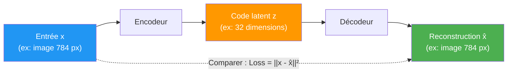
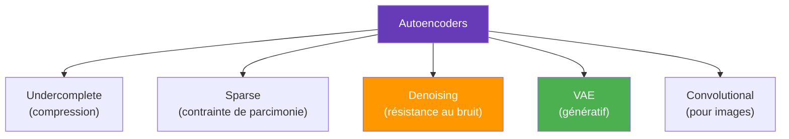
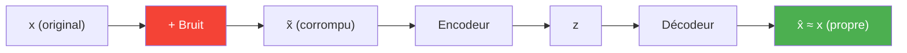
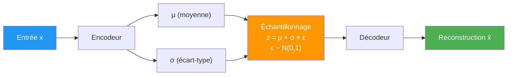

# Autoencoders

Un **autoencoder** est un réseau de neurones entraîné à **reconstruire son entrée** en passant par une représentation compressée (le **code latent**). Il apprend à compresser les données de manière non-linéaire, puis à les reconstruire.

## Architecture de base

| Composant | Rôle | Analogie |
|-----------|------|----------|
| **Encodeur** | Compresse l'entrée en un code latent de dimension réduite | Un résumé d'un livre |
| **Code latent (z)** | Représentation compressée — le "goulot d'étranglement" | Le résumé lui-même |
| **Décodeur** | Reconstruit l'entrée à partir du code latent | Réécrire le livre à partir du résumé |

**Fonction de perte :** erreur de reconstruction
$$\mathcal{L} = ||x - \hat{x}||^2 = \sum_i (x_i - \hat{x}_i)^2$$

Le réseau apprend les features les plus **importantes** pour pouvoir reconstruire — c'est une forme de **compression avec perte**.

## Types d'autoencoders

### Undercomplete Autoencoder

Le type le plus simple : la dimension du code latent est **inférieure** à celle de l'entrée, forçant le réseau à apprendre une compression efficace.

- Si l'encodeur et le décodeur sont linéaires → équivalent à la **PCA**
- Avec des non-linéarités → capture des relations non-linéaires que PCA ne peut pas

### Sparse Autoencoder

Ajoute une **contrainte de parcimonie** : seuls quelques neurones du code latent doivent être activés simultanément.

$$\mathcal{L} = ||x - \hat{x}||^2 + \lambda \sum_j |z_j|$$

- Force le réseau à apprendre des features **distinctes** et **interprétables**
- Le code latent peut être de dimension supérieure à l'entrée (overcomplete)

### Denoising Autoencoder

L'entrée est **corrompue** (bruit ajouté), mais le réseau doit reconstruire l'entrée **originale** propre.

- Apprend des représentations **robustes** au bruit
- Utilisé en **restauration d'images** et **débruitage**

### Convolutional Autoencoder

Utilise des couches de **convolution** (encodeur) et de **convolution transposée** (décodeur) au lieu de couches denses. Adapté aux **images**.

## Variational Autoencoder (VAE)

Le VAE est la variante la plus importante. Contrairement à un autoencoder classique, il apprend une **distribution** dans l'espace latent, ce qui en fait un **modèle génératif**.

### Différence fondamentale

| | Autoencoder classique | VAE |
|---|---|---|
| **Code latent** | Un point fixe $z$ | Une distribution $q(z \mid x) = \mathcal{N}(\mu, \sigma^2)$ |
| **Espace latent** | Désordonné, pas de structure | **Continu et structuré** |
| **Génération** | Difficile (pas de structure) | Échantillonner $z \sim \mathcal{N}(\mu, \sigma^2)$ et décoder |
| **Utilisation** | Compression, débruitage | Génération de nouvelles données |

### Architecture du VAE

### Fonction de perte du VAE

La loss du VAE combine deux termes :

$$\mathcal{L} = \underbrace{||x - \hat{x}||^2}_{\text{Reconstruction}} + \underbrace{D_{KL}\big(q(z|x) \;\|\; p(z)\big)}_{\text{Régularisation}}$$

| Terme | Rôle |
|-------|------|
| **Reconstruction** | La sortie doit ressembler à l'entrée |
| **KL Divergence** | L'espace latent doit ressembler à une distribution normale $\mathcal{N}(0, 1)$ |

La **KL Divergence** est cruciale : elle force l'espace latent à être **régulier** et **continu**, ce qui permet de **générer** de nouvelles données en échantillonnant.

### Le reparameterization trick

Problème : l'échantillonnage $z \sim q(z|x)$ n'est **pas différentiable** — on ne peut pas rétro-propager.

Solution : réécrire l'échantillonnage comme :
$$z = \mu + \sigma \odot \varepsilon, \quad \varepsilon \sim \mathcal{N}(0, I)$$

Le caractère aléatoire est isolé dans $\varepsilon$ (qui ne dépend pas des paramètres), et $\mu$ et $\sigma$ restent différentiables.

## Applications

| Application | Type d'autoencoder | Description |
|-------------|-------------------|-------------|
| **Réduction de dimensionnalité** | Undercomplete | Alternative non-linéaire à PCA |
| **Détection d'anomalies** | Tous types | Erreur de reconstruction élevée = anomalie |
| **Débruitage d'images** | Denoising | Restaurer des images corrompues |
| **Génération de données** | VAE | Créer de nouveaux visages, molécules, musique |
| **Interpolation** | VAE | Transitions fluides entre deux images dans l'espace latent |
| **Compression** | Convolutional | Compresser des images avec moins de perte que JPEG |
| **Apprentissage de représentations** | Tous types | Pré-entraîner des features pour d'autres tâches |

## VAE vs GAN

| Critère | VAE | GAN |
|---------|-----|-----|
| **Entraînement** | Stable (une seule loss) | Instable (jeu à 2 joueurs) |
| **Qualité des images** | Floues (tendance à moyenner) | Nettes et réalistes |
| **Diversité** | Bonne (espace latent régulier) | Risque de mode collapse |
| **Espace latent** | Structuré, interprétable | Non structuré |
| **Évaluation** | ELBO (objectif clair) | Pas de métrique simple |

> Les VAE produisent des images plus **floues** mais offrent un espace latent **structuré**. Les GAN produisent des images plus **nettes** mais sont plus difficiles à entraîner.
