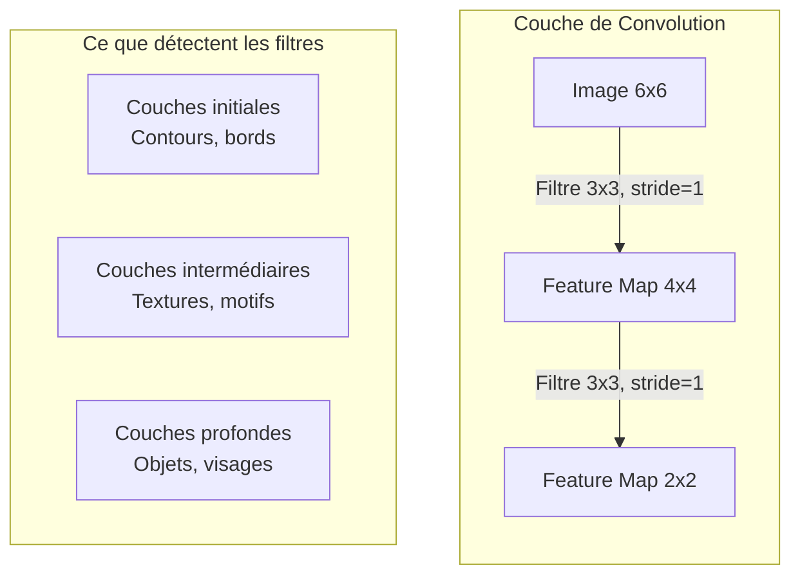
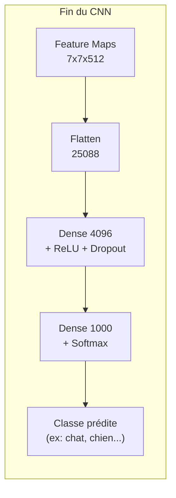
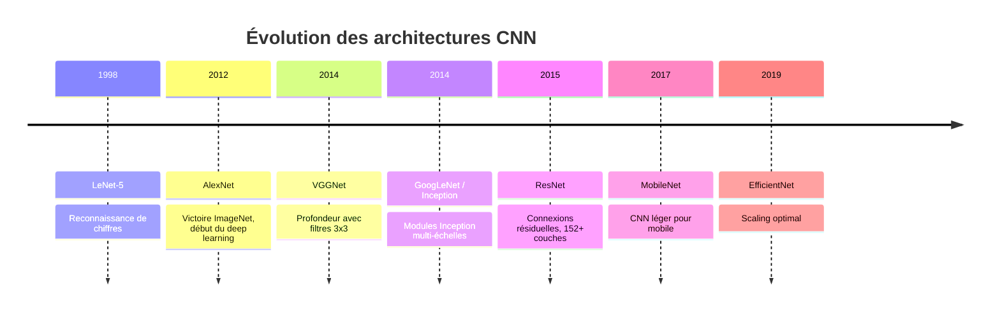
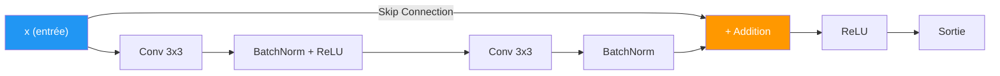

# Réseaux de Neurones Convolutifs (CNN)

Les **CNN** (Convolutional Neural Networks) sont une catégorie de réseaux de neurones profonds spécialement conçus pour traiter des données ayant une structure en grille, comme les **images**. Ils sont au coeur de la **vision par ordinateur**.

## Pourquoi les CNN ?

Un réseau de neurones classique (fully connected) ne peut pas traiter efficacement des images : une image de 256x256 pixels en couleur représente **196 608 paramètres** par neurone de la première couche. Les CNN résolvent ce problème grâce au **partage de poids** et aux **connexions locales**.

## Les couches fondamentales

### 1. Couche de Convolution

La convolution applique un **filtre** (ou noyau/kernel) qui glisse sur l'image pour détecter des **motifs locaux** (contours, textures, formes).

**Principe :**
- Un filtre de taille $k \times k$ parcourt l'image
- À chaque position, il effectue un **produit élément par élément** puis une somme
- Le résultat est une **feature map** (carte de caractéristiques)

**Formule :**
$$S(i, j) = (I * K)(i, j) = \sum_m \sum_n I(i+m,\; j+n) \cdot K(m, n)$$

- $I$ : image d'entrée
- $K$ : filtre/kernel
- $S$ : feature map de sortie

**Paramètres importants :**

| Paramètre | Description |
|-----------|-------------|
| **Taille du filtre** | Généralement 3x3 ou 5x5 |
| **Stride** | Pas de déplacement du filtre (1 = pixel par pixel) |
| **Padding** | Ajout de zéros autour de l'image pour conserver la taille |
| **Nombre de filtres** | Détermine le nombre de feature maps en sortie |

**Taille de sortie :**
$$O = \frac{W - K + 2P}{S} + 1$$
- $W$ : taille de l'entrée, $K$ : taille du filtre, $P$ : padding, $S$ : stride

### 2. Fonction d'activation (ReLU)

Après chaque convolution, on applique une **fonction d'activation non-linéaire**, le plus souvent **ReLU** (Rectified Linear Unit) :

$$f(x) = \max(0, x)$$

Elle met à zéro toutes les valeurs négatives, ce qui :
- Introduit de la **non-linéarité** (sans cela, empiler des couches linéaires ne servirait à rien)
- Accélère la **convergence**
- Réduit le problème du **vanishing gradient**

**Variantes :**
- **Leaky ReLU** : $f(x) = \max(0.01x, x)$ — évite les neurones "morts"
- **ELU** : lisse autour de zéro, meilleure convergence
- **GELU** : utilisée dans les Transformers modernes

### 3. Couche de Pooling

Le pooling réduit la **dimensionnalité spatiale** des feature maps tout en conservant les informations les plus importantes.

**Types de pooling :**

| Type | Description | Utilisation |
|------|-------------|-------------|
| **Max Pooling** | Prend la valeur maximale dans la fenêtre | Le plus courant, conserve les caractéristiques dominantes |
| **Average Pooling** | Prend la moyenne dans la fenêtre | Utilisé parfois en fin de réseau |
| **Global Average Pooling** | Moyenne sur toute la feature map | Remplace les couches denses finales dans les architectures modernes |

**Avantages du pooling :**
- Réduit le nombre de paramètres (moins de calcul)
- Apporte une certaine **invariance à la translation** (petits déplacements)
- Aide à combattre l'**overfitting**

### 4. Couche Fully Connected (Dense)

En fin de réseau, les feature maps sont **aplaties** (flatten) en un vecteur 1D, puis passées dans des couches denses classiques pour la **classification finale**.

## Batch Normalization

La **Batch Normalization** (normalisation par lot) normalise les activations de chaque couche pendant l'entraînement.

**Principe :**
Pour chaque mini-batch, on normalise les activations :

$$\hat{x}_i = \frac{x_i - \mu_B}{\sqrt{\sigma_B^2 + \epsilon}}$$

Puis on applique une transformation apprise :

$$y_i = \gamma \hat{x}_i + \beta$$

- $\mu_B$ : moyenne du batch
- $\sigma_B^2$ : variance du batch
- $\gamma, \beta$ : paramètres appris (scale et shift)

**Avantages :**
- **Accélère l'entraînement** (permet des learning rates plus élevés)
- **Régularise** légèrement le modèle
- Réduit la sensibilité à l'**initialisation des poids**
- Combat le **vanishing/exploding gradient**

**Où la placer ?**
Généralement entre la convolution et la fonction d'activation : `Conv → BatchNorm → ReLU`

## Les architectures célèbres

### LeNet-5 (1998)
- **Pionnier** des CNN, conçu par Yann LeCun
- Utilisé pour la reconnaissance de **chiffres manuscrits** (MNIST)
- Architecture simple : 2 convolutions + 2 pooling + 3 couches denses
- ~60 000 paramètres

### AlexNet (2012)
- A **révolutionné** la vision par ordinateur en gagnant ImageNet 2012
- Premier CNN profond entraîné sur **GPU**
- Innovations : ReLU, Dropout, Data Augmentation
- 5 couches de convolution + 3 couches denses
- ~60 millions de paramètres

### VGGNet (2014)
- Philosophie : **empiler des filtres 3x3** plutôt qu'utiliser de grands filtres
- Deux filtres 3x3 successifs = un champ réceptif de 5x5 avec moins de paramètres
- VGG-16 (16 couches) et VGG-19 (19 couches)
- ~138 millions de paramètres — très lourd

### GoogLeNet / Inception (2014)
- Introduit les **modules Inception** : appliquer en parallèle des filtres de tailles différentes (1x1, 3x3, 5x5) et concaténer les résultats
- Beaucoup plus efficace : 22 couches mais seulement ~5 millions de paramètres
- Utilise des convolutions 1x1 pour la **réduction de dimensionnalité**

### ResNet (2015)
- Innovation majeure : les **connexions résiduelles** (skip connections)
- Permet d'entraîner des réseaux très profonds (50, 101, 152+ couches)
- Résout le problème de **dégradation** (un réseau plus profond qui performe moins bien)

**Connexion résiduelle :**
$$y = F(x) + x$$
Le réseau n'apprend que le **résidu** $F(x)$, ce qui est plus facile à optimiser.

### MobileNet (2017)
- Conçu pour les **appareils mobiles** et embarqués
- Utilise des **convolutions séparables en profondeur** (depthwise separable convolutions)
- Réduit drastiquement le nombre de calculs
- Compromis performance / efficacité contrôlé par un facteur de largeur

### EfficientNet (2019)
- Méthode de **scaling composé** : augmenter simultanément profondeur, largeur et résolution
- Meilleures performances avec moins de paramètres
- EfficientNet-B0 à B7 : du plus petit au plus performant

## Cas d'utilisation

| Domaine | Application | Exemple |
|---------|-------------|---------|
| **Classification d'images** | Catégoriser une image | Chat vs Chien, diagnostic médical |
| **Détection d'objets** | Localiser et identifier des objets | YOLO, Faster R-CNN pour la conduite autonome |
| **Segmentation sémantique** | Classifier chaque pixel | Imagerie médicale, cartographie satellite |
| **Reconnaissance faciale** | Identifier des visages | FaceNet, DeepFace |
| **Transfert de style** | Appliquer le style d'une image à une autre | Neural Style Transfer |
| **Super-résolution** | Augmenter la résolution d'une image | SRGAN, ESRGAN |

## Techniques d'entraînement

### Data Augmentation
Augmenter artificiellement la taille du dataset en appliquant des transformations :
- **Rotation**, **retournement** (flip horizontal/vertical)
- **Zoom**, **recadrage** (crop)
- **Modification de luminosité/contraste**
- **Ajout de bruit**

### Transfer Learning
Réutiliser un modèle pré-entraîné (sur ImageNet par exemple) et l'adapter à son propre problème :
1. **Feature extraction** : geler les couches convolutives, n'entraîner que les couches denses
2. **Fine-tuning** : dégeler progressivement les dernières couches et ré-entraîner

### Dropout
Désactiver aléatoirement un pourcentage de neurones pendant l'entraînement pour **régulariser** et réduire l'overfitting.

## Résumé visuel

```mermaid
graph TB
    subgraph "Architecture CNN typique"
        direction LR
        IN["🖼️ Image<br/>224x224x3"] --> CONV1["Conv 3x3<br/>64 filtres"]
        CONV1 --> BN1["BN + ReLU"]
        BN1 --> POOL1["Max Pool 2x2<br/>112x112x64"]
        POOL1 --> CONV2["Conv 3x3<br/>128 filtres"]
        CONV2 --> BN2["BN + ReLU"]
        BN2 --> POOL2["Max Pool 2x2<br/>56x56x128"]
        POOL2 --> CONV3["Conv 3x3<br/>256 filtres"]
        CONV3 --> BN3["BN + ReLU"]
        BN3 --> POOL3["Max Pool 2x2<br/>28x28x256"]
        POOL3 --> FLAT["Flatten"]
        FLAT --> FC1["Dense 512 + ReLU"]
        FC1 --> DROP["Dropout 0.5"]
        DROP --> FC2["Dense N classes"]
        FC2 --> SOFT["Softmax"]
        SOFT --> OUT["Prédiction"]
    end

    style IN fill:#4CAF50,color:#fff
    style OUT fill:#FF5722,color:#fff
```

