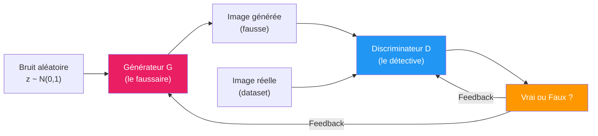
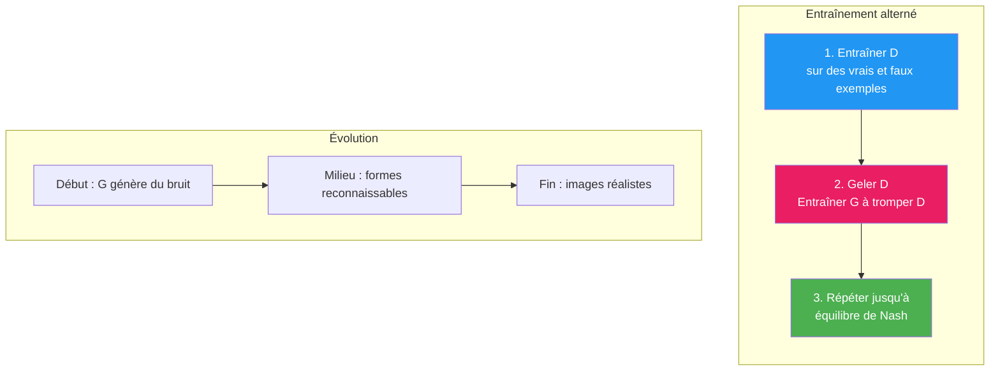
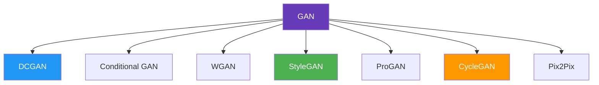

# GAN (Generative Adversarial Networks)

Les **GAN** (Réseaux Antagonistes Génératifs) sont une architecture de deep learning où **deux réseaux** s'affrontent pour apprendre à **générer des données réalistes** (images, sons, textes). Introduits par **Ian Goodfellow** en 2014.

## Le principe : un jeu à deux joueurs

| Rôle | Réseau | Objectif |
|------|--------|----------|
| **Générateur (G)** | Crée des données à partir de bruit aléatoire | **Tromper** le discriminateur |
| **Discriminateur (D)** | Distingue les données réelles des fausses | **Détecter** les contrefaçons |

**Analogie :** un faussaire essaie de créer de faux billets, et un détective essaie de les repérer. Au fil du temps, le faussaire s'améliore et ses faux deviennent indiscernables des vrais.

## Formulation mathématique

Les deux réseaux jouent un **jeu minimax** :

$$\min_G \max_D \; V(D, G) = \mathbb{E}_{x \sim p_{data}}[\log D(x)] + \mathbb{E}_{z \sim p_z}[\log(1 - D(G(z)))]$$

- $D(x)$ : probabilité que $x$ soit réel (le discriminateur veut maximiser)
- $D(G(z))$ : probabilité que l'image générée soit classée comme réelle (le générateur veut maximiser)
- $p_{data}$ : distribution des données réelles
- $p_z$ : distribution du bruit (généralement gaussien)

## Le processus d'entraînement

**Équilibre de Nash :** l'entraînement converge quand D ne peut plus distinguer le vrai du faux ($D(x) = 0.5$ partout) et G produit des données indiscernables de la réalité.

## Variantes principales

### DCGAN (Deep Convolutional GAN)
- Remplace les couches denses par des **convolutions**
- Architecture stable pour la génération d'images
- Guidelines : pas de pooling, utiliser BatchNorm, ReLU pour G, LeakyReLU pour D

### Conditional GAN (cGAN)
- Ajoute une **condition** (label, texte, image) au générateur et au discriminateur
- Permet de **contrôler** ce que l'on génère (ex: "génère un chat roux")

### WGAN (Wasserstein GAN)
- Remplace la log-loss par la **distance de Wasserstein**
- Entraînement beaucoup plus **stable**
- Réduit le problème de mode collapse

### StyleGAN (Nvidia)
- Génère des visages de **qualité photographique**
- Contrôle le **style** à différentes échelles (forme du visage, couleur des cheveux, texture de peau)
- StyleGAN2 et StyleGAN3 : améliorations successives

### CycleGAN
- **Traduction d'image non appariée** (unpaired image-to-image translation)
- Pas besoin de paires d'exemples
- Ex : transformer des photos en peintures, des chevaux en zèbres

### Pix2Pix
- **Traduction d'image appariée** (paired)
- Nécessite des paires (input, output)
- Ex : sketch → photo, carte satellite → plan

## Problèmes courants

| Problème | Description | Solutions |
|----------|-------------|----------|
| **Mode Collapse** | G ne génère que quelques types d'images | WGAN, mini-batch discrimination, unrolled GAN |
| **Instabilité d'entraînement** | D ou G domine, oscillations | WGAN-GP, spectral normalization, progressive training |
| **Vanishing Gradients** | D trop fort, G ne reçoit plus de signal | Utiliser des loss alternatives (Wasserstein, least squares) |
| **Évaluation difficile** | Pas de métrique de perte simple | FID (Fréchet Inception Distance), IS (Inception Score) |

## Applications

| Application | Description | Exemple |
|-------------|-------------|---------|
| **Génération de visages** | Visages réalistes qui n'existent pas | StyleGAN (thispersondoesnotexist.com) |
| **Super-résolution** | Augmenter la résolution d'images | SRGAN, ESRGAN |
| **Transfert de style** | Convertir une image dans un autre style | CycleGAN |
| **Inpainting** | Remplir des parties manquantes d'une image | DeepFill |
| **Génération de données** | Augmenter un dataset d'entraînement | Data augmentation avec GAN |
| **Text-to-Image** | Générer des images à partir de texte | StackGAN (précurseur des modèles de diffusion) |
| **Drug discovery** | Générer des molécules candidates | MolGAN |

## GAN vs [[Modèles de Diffusion]]

Les modèles de **diffusion** (Stable Diffusion, DALL-E, Midjourney) ont largement remplacé les GAN pour la génération d'images depuis 2022 :

| Critère | GAN | Diffusion |
|---------|-----|-----------|
| **Qualité** | Haute | Très haute |
| **Diversité** | Risque de mode collapse | Excellente |
| **Stabilité d'entraînement** | Difficile | Stable |
| **Vitesse de génération** | Très rapide (1 passe) | Lent (nombreuses étapes) |
| **Contrôlabilité** | Limitée | Très bonne (prompts textuels) |

Les GAN restent pertinents pour les applications nécessitant une **génération en temps réel**.
