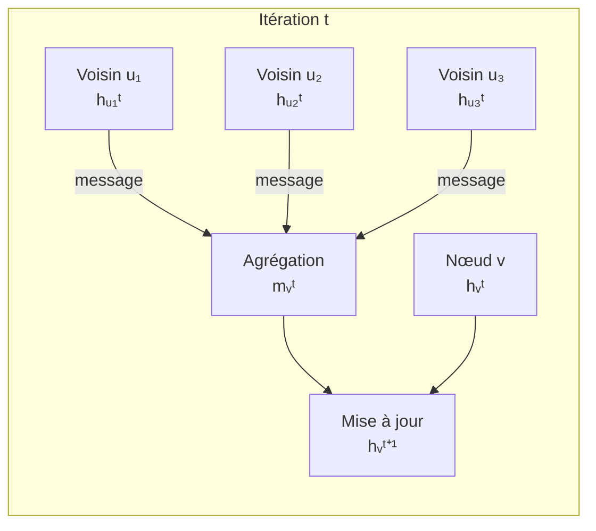

# Graph Neural Networks (GNN)

Les Graph Neural Networks sont des réseaux de neurones conçus pour opérer directement sur des structures de graphes. La plupart des données du monde réel sont naturellement des graphes : réseaux sociaux, molécules, codes source, connaissances, routage réseau.

## Pourquoi les graphes ?

Les architectures classiques (CNN, RNN) supposent des données structurées (grilles, séquences). Les graphes brisent ces hypothèses :

| Propriété | Grille (image) | Séquence (texte) | Graphe |
|---|---|---|---|
| Structure | Régulière, fixe | Ordonnée | Irrégulière, variable |
| Voisinage | Fixe (3×3) | Fixe (gauche/droite) | Variable (degrés différents) |
| Ordre | Défini | Défini | Arbitraire (permutation-invariant) |

**Applications :**
- Chimie/biologie : prédiction de propriétés moléculaires, découverte de médicaments
- Réseaux sociaux : détection de communautés, recommandation
- Systèmes de recommandation : utilisateurs × items = graphe biparti
- Détection de fraude : transactions bancaires
- Trafic réseau : prédiction de congestion
- Code : analyse de dépendances, détection de bugs

## Représentation d'un graphe

Un graphe G = (V, E) comprend :
- **V** : ensemble de nœuds (vertices), chacun avec un vecteur de features **h**
- **E** : ensemble d'arêtes (edges), éventuellement pondérées et dirigées
- **A** : matrice d'adjacence (N×N), Aᵢⱼ = 1 si arête entre i et j
- **X** : matrice de features des nœuds (N × d)

## Principe fondamental : Message Passing

L'idée centrale de la plupart des GNN est le **message passing** : chaque nœud agrège les informations de ses voisins pour mettre à jour sa représentation.



**Formule générale :**
```
mᵥᵗ = AGGREGATE({hᵤᵗ : u ∈ N(v)})   # Agrégation des voisins
hᵥᵗ⁺¹ = UPDATE(hᵥᵗ, mᵥᵗ)            # Mise à jour du nœud
```

Après K couches, chaque nœud encode l'information de son voisinage à distance K.

## GCN — Graph Convolutional Network (Kipf & Welling, 2017)

Variante spectrale simplifiée. Agrégation par somme pondérée normalisée.

```
H⁽ˡ⁺¹⁾ = σ( D̃⁻¹/² Ã D̃⁻¹/² H⁽ˡ⁾ W⁽ˡ⁾ )
```

- Ã = A + I : matrice d'adjacence + auto-boucles (chaque nœud se considère lui-même)
- D̃ : matrice de degrés de à (normalisation)
- W⁽ˡ⁾ : matrice de poids apprenables
- H⁽⁰⁾ = X : features initiales

```python
import torch
import torch.nn.functional as F
from torch_geometric.nn import GCNConv

class GCN(torch.nn.Module):
    def __init__(self, input_dim, hidden_dim, output_dim):
        super().__init__()
        self.conv1 = GCNConv(input_dim, hidden_dim)
        self.conv2 = GCNConv(hidden_dim, output_dim)

    def forward(self, x, edge_index):
        x = F.relu(self.conv1(x, edge_index))
        x = F.dropout(x, p=0.5, training=self.training)
        x = self.conv2(x, edge_index)
        return F.log_softmax(x, dim=1)
```

**Limitation** : agrégation non différenciée → tous les voisins ont le même poids.

## GAT — Graph Attention Network (Veličković et al., 2018)

Introduit un mécanisme d'attention pour pondérer différemment les voisins.

```
αᵢⱼ = softmax( LeakyReLU( aᵀ [Whᵢ ‖ Whⱼ] ) )
h'ᵢ = σ( Σⱼ αᵢⱼ · Whⱼ )
```

- αᵢⱼ : coefficient d'attention entre nœuds i et j
- **‖** : concaténation
- Multi-head attention : K têtes d'attention en parallèle → stabilité

**Avantage** : apprend quels voisins sont importants, interprétable.

## GraphSAGE (Hamilton et al., 2017)

Conçu pour l'inductive learning : capable de généraliser à des nœuds non vus pendant l'entraînement (scalable aux grands graphes).

```
hᵥˡ = σ( W · CONCAT(hᵥˡ⁻¹, AGG({hᵤˡ⁻¹ : u ∈ N(v)})) )
```

**Agrégateurs disponibles :** Mean, Max, LSTM (sur voisins ordonnés aléatoirement)

**Neighborhood sampling** : au lieu d'utiliser tous les voisins (potentiellement très nombreux), échantillonne un nombre fixe de voisins par couche → passage à l'échelle.

## Tâches sur les graphes

```mermaid
graph TD
    taches[Tâches GNN]
    taches --> node[Classification de nœuds\nex: type d'utilisateur\ndans un réseau social]
    taches --> link[Prédiction de lien\nex: recommandation\nconnexion future]
    taches --> graph[Classification de graphes\nex: molécule toxique\nou non]
    taches --> gen[Génération de graphes\nex: molécule optimale]
```

**Readout (graph-level prediction)** : pour obtenir une représentation du graphe entier, agréger toutes les représentations de nœuds :
```
h_G = READOUT({hᵥ : v ∈ V})
```
(Somme, moyenne, max, ou attention hiérarchique)

## Limites des GNN

**Surissage (Over-smoothing)** : avec trop de couches, toutes les représentations de nœuds convergent vers la même valeur → perte de discrimination. En pratique, 2-3 couches suffisent souvent.

**Goulot d'étranglement (Bottleneck)** : pour atteindre des nœuds distants, l'information doit passer par tous les nœuds intermédiaires, se compressant à chaque couche.

**Over-squashing** : l'information de voisinages exponentiellement larges est compressée dans un vecteur de taille fixe.

**Expressivité** : les GNN à base de message passing ne peuvent pas distinguer certains graphes non-isomorphes (théorème de Weisfeiler-Lehman).

## GNN avancés

| Modèle | Innovation | Usage |
|---|---|---|
| GIN (Graph Isomorphism Network) | Maximise l'expressivité (WL-test) | Classification de graphes |
| MPNN | Framework général pour chimie | Propriétés moléculaires |
| DiffPool | Pooling hiérarchique différentiable | Graphes complexes |
| Graph Transformer | Self-attention globale sur graphe | Longues dépendances |
| SchNet, DimeNet | GNN sur molécules 3D | Drug discovery |

## Comparaison des variantes

| Modèle | Agrégation | Points forts | Limitation |
|---|---|---|---|
| GCN | Somme normalisée | Simple, efficace | Poids égaux |
| GAT | Attention apprise | Interprétable, sélectif | Coût mémoire |
| GraphSAGE | Mean/Max/LSTM | Scalable, inductif | Pas d'attention |
| GIN | Somme + MLP | Maximalement expressif | Plus complexe |
