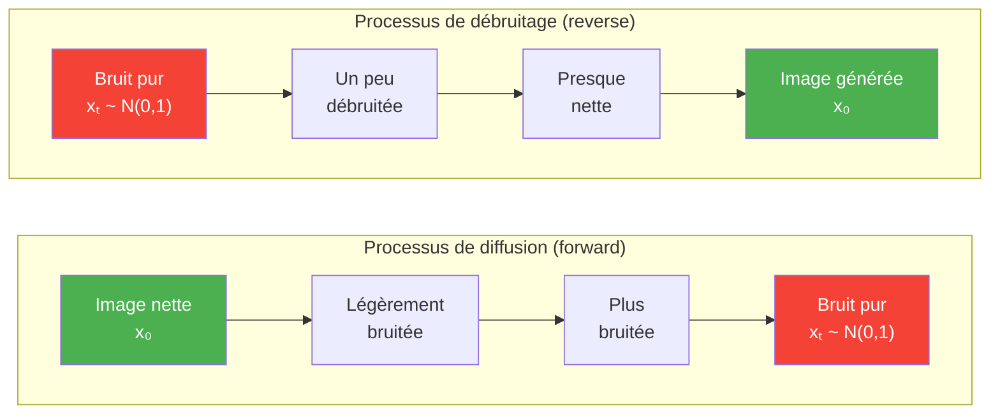
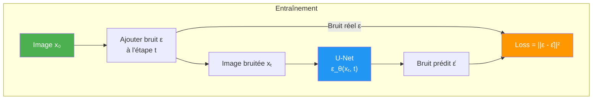
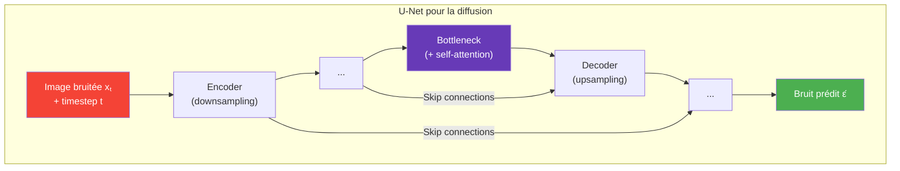
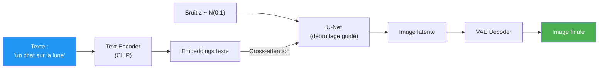
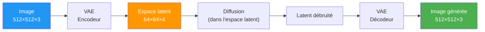

# Modèles de Diffusion

Les **modèles de diffusion** sont une famille de modèles génératifs qui apprennent à générer des données en **inversant un processus de bruitage graduel**. Ils sont derrière Stable Diffusion, DALL-E, Midjourney et Sora. Depuis 2022, ils dominent la génération d'images, dépassant les GAN en qualité et diversité.

## L'idée intuitive

**Analogie :** imaginez une goutte d'encre dans un verre d'eau.
- **Forward** : l'encre se diffuse progressivement jusqu'à disparaître (bruit uniforme)
- **Reverse** : si on savait inverser la diffusion, on pourrait recréer la goutte d'encre à partir de l'eau trouble

Le modèle apprend à **inverser** ce processus de diffusion, étape par étape.

## Les deux processus

### 1. Processus forward (ajout de bruit)

On ajoute du **bruit gaussien** progressivement sur $T$ étapes :

$$q(x_t | x_{t-1}) = \mathcal{N}(x_t ; \sqrt{1-\beta_t}\, x_{t-1},\; \beta_t I)$$

- $\beta_t$ : variance du bruit à l'étape $t$ (schedule de bruit, croissant)
- Après $T$ étapes, $x_T$ est un **bruit gaussien pur**
- Ce processus est **fixe** (pas de paramètres à apprendre)

On peut aussi sauter directement à n'importe quelle étape $t$ :

$$q(x_t | x_0) = \mathcal{N}(x_t ; \sqrt{\bar{\alpha}_t}\, x_0,\; (1-\bar{\alpha}_t) I)$$

où $\bar{\alpha}_t = \prod_{i=1}^{t}(1-\beta_i)$

### 2. Processus reverse (débruitage)

Le modèle apprend à **prédire le bruit** ajouté à chaque étape pour l'enlever :

$$p_\theta(x_{t-1} | x_t) = \mathcal{N}(x_{t-1} ; \mu_\theta(x_t, t),\; \sigma_t^2 I)$$

Un réseau de neurones $\epsilon_\theta$ prédit le bruit $\epsilon$ qui a été ajouté.

### Fonction de perte

Étonnamment simple — c'est une **erreur quadratique** sur le bruit :

$$\mathcal{L} = \mathbb{E}_{t, x_0, \epsilon}\left[ ||\epsilon - \epsilon_\theta(x_t, t)||^2 \right]$$

Le modèle apprend à **prédire le bruit** ajouté, pas directement l'image.

## Le réseau U-Net

Le coeur des modèles de diffusion est un **U-Net** modifié, qui prend en entrée l'image bruitée et le timestep $t$ :

**Ajouts par rapport au U-Net classique :**
- **Timestep embedding** : injecté à chaque couche pour que le réseau sache quelle étape de bruit il traite
- **Self-attention** : permet de capturer des dépendances longue distance dans l'image
- **Cross-attention** : permet le conditionnement sur du texte (text-to-image)

## Génération conditionnelle (Text-to-Image)

Pour générer des images à partir de texte (comme Stable Diffusion), on ajoute du **conditionnement** :

### Classifier-Free Guidance (CFG)

Technique clé pour améliorer la qualité et la fidélité au prompt :

$$\hat{\epsilon} = \epsilon_\theta(x_t, \varnothing) + s \cdot (\epsilon_\theta(x_t, c) - \epsilon_\theta(x_t, \varnothing))$$

- $c$ : le conditionnement (texte)
- $\varnothing$ : pas de conditionnement
- $s$ : guidance scale (typiquement 7-12, plus haut = plus fidèle au prompt mais moins divers)

## Latent Diffusion (Stable Diffusion)

Innovation majeure : faire la diffusion dans un **espace latent compressé** plutôt que dans l'espace des pixels.

**Avantage :** la diffusion opère sur un espace **64x plus petit** (64x64 au lieu de 512x512), réduisant massivement le coût de calcul.

## Modèles marquants

| Modèle | Année | Particularité |
|--------|:-----:|---------------|
| **DDPM** | 2020 | Premier modèle de diffusion performant |
| **DALL-E 2** | 2022 | Text-to-image par OpenAI (diffusion dans l'espace CLIP) |
| **Stable Diffusion** | 2022 | Open-source, latent diffusion, très populaire |
| **Midjourney** | 2022 | Qualité artistique exceptionnelle |
| **SDXL** | 2023 | Stable Diffusion amélioré, plus haute résolution |
| **Sora** | 2024 | Text-to-video par OpenAI |
| **Flux** | 2024 | Modèle open-source à base de flow matching |

## Samplers (méthodes d'échantillonnage)

Le processus de débruitage peut être accéléré avec différents **samplers** :

| Sampler | Étapes | Qualité | Vitesse |
|---------|:------:|:-------:|:-------:|
| **DDPM** | ~1000 | Haute | Très lent |
| **DDIM** | ~50 | Haute | Rapide |
| **Euler** | ~20-30 | Bonne | Rapide |
| **DPM++ 2M Karras** | ~20 | Très haute | Rapide |

Moins d'étapes = génération plus rapide, mais potentiellement moins de qualité.

## Diffusion vs GAN vs VAE

| Critère | Diffusion | GAN | VAE |
|---------|:---------:|:---:|:---:|
| **Qualité** | Excellente | Excellente | Floue |
| **Diversité** | Excellente | Mode collapse possible | Bonne |
| **Entraînement** | Stable | Instable | Stable |
| **Vitesse de génération** | Lent (itératif) | Très rapide (1 passe) | Rapide (1 passe) |
| **Contrôlabilité** | Excellente (prompts) | Limitée | Moyenne |
| **Espace latent** | Structuré (via les étapes) | Non structuré | Structuré |
