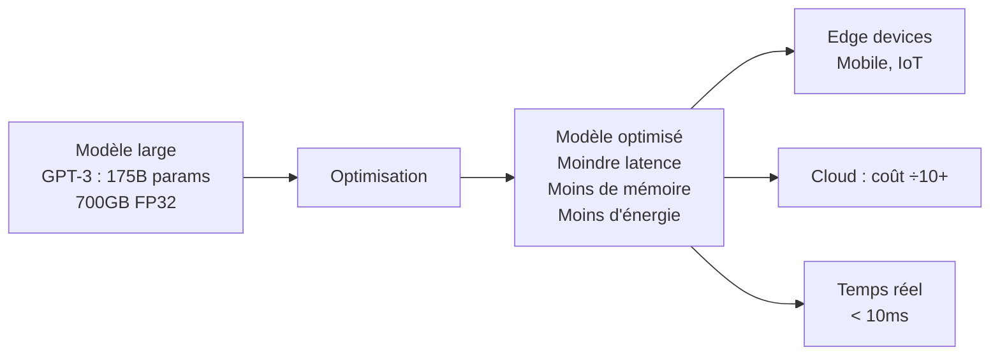
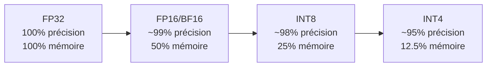

# Optimisation de Modèles

L'optimisation de modèles vise à réduire la taille et le coût computationnel des réseaux de neurones tout en préservant leurs performances. Essentielle pour le déploiement sur appareils contraints (edge AI, mobile) ou pour réduire les coûts d'inférence cloud.

## Pourquoi optimiser ?



**Triangle contraintes — performance, taille, vitesse** : toute optimisation implique des compromis.

## Quantization

Réduire la précision numérique des poids et activations.

**Formats de précision :**

| Format | Bits | Plage | Mémoire (1B params) |
|---|---|---|---|
| FP32 | 32 | [-3.4e38, 3.4e38] | 4 GB |
| FP16 | 16 | [-65504, 65504] | 2 GB |
| BF16 | 16 | [-3.4e38, 3.4e38] | 2 GB |
| INT8 | 8 | [-128, 127] | 1 GB |
| INT4 | 4 | [-8, 7] | 0.5 GB |
| NF4 | 4 | Non-uniforme | 0.5 GB |



### PTQ — Post-Training Quantization

Quantize après entraînement. Aucun réentraînement requis.

```python
import torch

# Dynamic quantization (poids INT8, activations dynamiques)
model_quantized = torch.quantization.quantize_dynamic(
    model,
    {torch.nn.Linear},
    dtype=torch.qint8
)

# Static quantization (calibration nécessaire)
model.qconfig = torch.quantization.get_default_qconfig('fbgemm')
torch.quantization.prepare(model, inplace=True)
# Calibration sur quelques batches représentatifs
calibrate(model, calibration_data)
torch.quantization.convert(model, inplace=True)
```

**Méthodes avancées PTQ :**
- **GPTQ** : quantize couche par couche avec correction des erreurs (LLM INT4)
- **AWQ** : préserve 1% des poids importants en haute précision
- **SmoothQuant** : migre la difficulté de quantization vers les poids (plus faciles à quantizer)

### QAT — Quantization-Aware Training

Simule la quantization pendant l'entraînement → meilleure précision, nécessite réentraînement.

```python
# Fake quantization pendant le forward pass
model.qconfig = torch.quantization.get_default_qat_qconfig('fbgemm')
model_prepared = torch.quantization.prepare_qat(model)
# Entraîner normalement quelques epochs
train(model_prepared, ...)
model_quantized = torch.quantization.convert(model_prepared)
```

**Voir aussi** : [Quantization.md] pour les méthodes spécifiques aux LLM (bitsandbytes, GGUF, AWQ)

## Pruning (Élagage)

Supprimer les poids, neurones ou couches inutiles. Repose sur le principe qu'une grande fraction des poids contribuent peu aux prédictions.

### Pruning non-structuré

Supprime des poids individuels → masque binaire sparse.

```python
import torch.nn.utils.prune as prune

# Supprimer 30% des poids les plus faibles (magnitude)
prune.l1_unstructured(model.fc1, name='weight', amount=0.3)

# Global : 50% de tous les poids du modèle
parameters_to_prune = [(module, 'weight') for name, module
                        in model.named_modules()
                        if isinstance(module, torch.nn.Linear)]
prune.global_unstructured(parameters_to_prune,
                          pruning_method=prune.L1Unstructured,
                          amount=0.5)
```

**Avantage :** taux de compression élevé
**Inconvénient :** la sparsité non-structurée est difficile à accélérer sur GPU standard

### Pruning structuré

Supprime des canaux, têtes d'attention, ou couches entières → accélération réelle.

```
Filtre CNN : supprimer des feature maps entières
Tête d'attention : supprimer des têtes entières dans les Transformers
Couche : supprimer des couches entières (layer dropping)
```

```python
# Supprimer 40% des filtres d'une conv2d (sortie)
prune.ln_structured(model.conv1, name='weight', amount=0.4,
                    n=2, dim=0)  # dim=0 = filtres de sortie
```

### Lottery Ticket Hypothesis (2019)

Un grand réseau contient un sous-réseau "gagnant" (winning ticket) qui, entraîné seul depuis le début, atteint la même performance.

```
Procédure :
1. Entraîner le réseau complet
2. Prune 20% des poids les plus petits
3. Réinitialiser les poids restants à leurs valeurs initiales
4. Répéter jusqu'au taux de sparsité voulu
```

### Magnitude vs Movement Pruning

| Méthode | Critère | Quand |
|---|---|---|
| Magnitude | Supprimer les poids |w| les plus petits | Modèles entraînés de zéro |
| Movement | Supprimer les poids qui bougent peu pendant le fine-tuning | Fine-tuning de modèles pré-entraînés |
| Gradient | Basé sur le gradient × poids (saliency) | Pruning pendant l'entraînement |

## Knowledge Distillation (Distillation de Connaissances)

Entraîner un petit modèle (étudiant) à imiter un grand modèle (enseignant), en tirant parti de ses distributions de sortie "douces".

```mermaid
graph TD
    data[Données] --> teacher[Enseignant\nGrand modèle\nperformant]
    data --> student[Étudiant\nPetit modèle\nà entraîner]
    teacher -->|"Logits doux\n(soft targets)"| loss_kd[Loss Distillation\nKL Divergence]
    data -->|Labels durs| loss_ce[Loss Classification\nCross-Entropy]
    loss_kd --> total[Loss totale\nα·L_CE + (1-α)·L_KD]
    loss_ce --> total
    total --> student
```

**Loss de distillation :**
```python
import torch.nn.functional as F

def distillation_loss(student_logits, teacher_logits, labels, T=4, alpha=0.7):
    # Soft targets : distributions lissées par la température T
    soft_loss = F.kl_div(
        F.log_softmax(student_logits / T, dim=1),
        F.softmax(teacher_logits / T, dim=1),
        reduction='batchmean'
    ) * (T ** 2)

    # Hard targets : labels vrais
    hard_loss = F.cross_entropy(student_logits, labels)

    return alpha * hard_loss + (1 - alpha) * soft_loss
```

**Température T** : T > 1 "ramollit" les probabilités (info sur les classes incorrectes), T = 1 = softmax standard.

### Variantes

**Feature distillation** : l'étudiant imite les représentations intermédiaires (feature maps) de l'enseignant, pas seulement les sorties.

**Self-distillation** : le modèle joue à la fois le rôle d'enseignant et d'étudiant (couches profondes enseignent aux couches superficielles).

**Data-free distillation** : génère des exemples synthétiques depuis l'enseignant quand les données originales sont indisponibles.

**Exemples de modèles distillés :**

| Étudiant | Enseignant | Ratio taille |
|---|---|---|
| DistilBERT | BERT-base | 40% plus petit |
| TinyBERT | BERT-large | 7× plus petit |
| MobileNet | ResNet | 8-9× plus petit |
| Phi-2 (2.7B) | GPT-4 | — (dataset synthétique) |

## Low-Rank Factorization

Décompose une matrice de poids W (m×n) en deux matrices de rang inférieur :

```
W (m×n) ≈ A (m×r) × B (r×n), avec r << min(m,n)

Paramètres : m×n → m×r + r×n = r(m+n)
Gain si r < mn/(m+n)
```

C'est exactement le principe de **LoRA** (Low-Rank Adaptation) pour le fine-tuning efficace des LLM.

## Neural Architecture Search (NAS)

Automatise la recherche de l'architecture optimale pour un budget computationnel donné.

**Approches :**
- **DARTS** : optimise l'architecture et les poids simultanément (différentiable)
- **EfficientNet** : compound scaling (largeur, profondeur, résolution) sur une baseline trouvée par NAS
- **ProxylessNAS** : optimise directement sur le device cible (latence réelle)

## Combinaisons optimales

En pratique, les techniques se combinent :

```
Modèle complet (FP32)
    → Pruning structuré (supprimer 30% canaux)
    → Distillation (réentraîner l'étudiant)
    → Quantization INT8 (déploiement)
```

**Impact typique combiné :**

| Technique | Réduction taille | Accélération | Perte précision |
|---|---|---|---|
| INT8 quantization | ×4 | ×2-4 | < 1% |
| Pruning 50% | ×2 | ×1.5-2 | 1-3% |
| Distillation (×4) | ×4 | ×4 | 2-5% |
| Combinaison | ×10-30 | ×5-15 | 3-8% |
