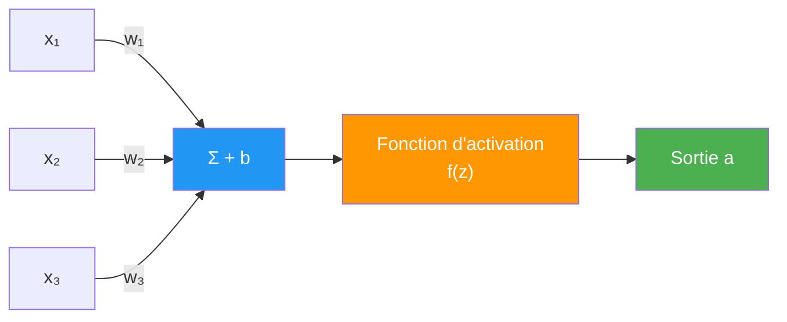
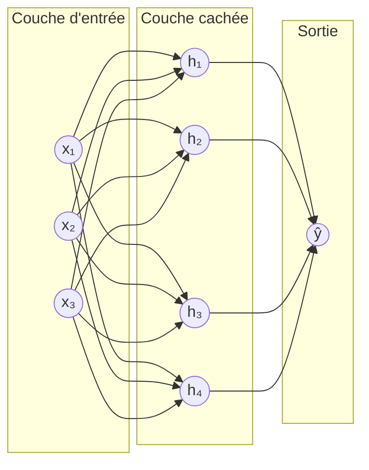
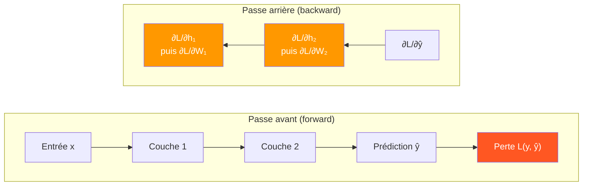

# Perceptron et Rétropropagation

Avant le [[CNN]], le [[Transformers|Transformer]] ou le [[GAN]], il y a l'unité de base commune à tous les réseaux de neurones : le **neurone artificiel**, et l'algorithme qui permet de l'entraîner : la **rétropropagation** (backpropagation). Cette note pose les fondations sur lesquelles reposent toutes les architectures du dossier DeepLearning.

## Le neurone artificiel (Perceptron)

Un neurone reçoit plusieurs entrées, les combine linéairement avec des **poids**, ajoute un **biais**, puis applique une **fonction d'activation** non linéaire.

$$z = \sum_{i=1}^{n} w_i x_i + b, \qquad a = f(z)$$



- $x_i$ : entrées (features ou sorties de la couche précédente)
- $w_i$ : poids — l'importance apprise de chaque entrée
- $b$ : biais — décale le seuil d'activation
- $f$ : fonction d'activation — introduit la **non-linéarité**, sans laquelle empiler des couches reviendrait à une simple combinaison linéaire, quel que soit le nombre de couches

## Repères historiques

- **1958 — Perceptron (Rosenblatt)** : un seul neurone, capable d'apprendre des frontières linéaires
- **1969 — Limite du XOR (Minsky & Papert)** : un perceptron unique ne peut pas résoudre un problème non linéairement séparable comme le XOR — coup d'arrêt temporaire à la recherche sur les réseaux de neurones
- **1986 — Rétropropagation (Rumelhart, Hinton, Williams)** : algorithme permettant d'entraîner efficacement des réseaux **multicouches**, résolvant XOR et ouvrant la voie aux réseaux profonds

## Fonctions d'activation

| Fonction | Formule | Sortie | Problème |
|---|---|---|---|
| **Sigmoïde** | $\sigma(z) = \frac{1}{1+e^{-z}}$ | (0, 1) | Gradient proche de 0 aux extrêmes → vanishing gradient |
| **Tanh** | $\tanh(z) = \frac{e^z - e^{-z}}{e^z + e^{-z}}$ | (-1, 1) | Centrée sur 0 (mieux que sigmoïde), mais même problème aux extrêmes |
| **ReLU** | $\max(0, z)$ | [0, +∞) | Simple, rapide, mais neurones "morts" si $z < 0$ en permanence |
| **Leaky ReLU** | $\max(0.01z, z)$ | (-∞, +∞) | Corrige les neurones morts |
| **GELU** | $z \cdot \Phi(z)$ (approximation lisse de ReLU) | ≈ [-0.17, +∞) | Utilisée dans les Transformers modernes |

**Pourquoi ReLU a supplanté sigmoïde/tanh dans les couches cachées** : son gradient vaut exactement 1 pour $z > 0$ (pas de saturation), ce qui limite le vanishing gradient et accélère considérablement l'entraînement des réseaux profonds. Sigmoïde reste utilisée en sortie pour une probabilité binaire (voir [[Apprentissage Supervisé]]), softmax pour une classification multi-classe.

## Le Perceptron Multicouche (MLP)

Un **MLP** (Multi-Layer Perceptron) empile plusieurs couches de neurones : une couche d'entrée, une ou plusieurs couches **cachées**, une couche de sortie.



**Théorème d'approximation universelle** : un MLP avec une seule couche cachée suffisamment large peut approximer n'importe quelle fonction continue avec une précision arbitraire. En pratique, on préfère des réseaux **profonds** (plusieurs couches plus étroites) à un réseau **large** à une seule couche : ils apprennent des représentations hiérarchiques (les couches profondes combinent les motifs détectés par les couches précédentes) et généralisent souvent mieux pour un nombre de paramètres équivalent.

## La rétropropagation

**Le problème à résoudre** : après une prédiction, on connaît l'erreur en sortie (via la fonction de perte, voir [[Fonctions de pertes]]). Comment savoir de combien ajuster **chaque poids**, y compris ceux des couches profondes, loin de la sortie ?

**L'idée** : la règle de dérivation en chaîne (chain rule) permet de décomposer la dérivée de la perte par rapport à un poids profond en un produit de dérivées locales, couche par couche, en remontant de la sortie vers l'entrée.

$$\frac{\partial \mathcal{L}}{\partial w^{(l)}} = \frac{\partial \mathcal{L}}{\partial a^{(L)}} \cdot \frac{\partial a^{(L)}}{\partial a^{(L-1)}} \cdots \frac{\partial a^{(l+1)}}{\partial a^{(l)}} \cdot \frac{\partial a^{(l)}}{\partial w^{(l)}}$$

Chaque terme est une dérivée simple, locale à une couche. Le produit de ces termes donne le gradient exact, sans jamais recalculer la fonction de perte entière pour chaque poids.



**Déroulement complet d'une itération d'entraînement :**

1. **Forward pass** : propager l'entrée à travers toutes les couches jusqu'à la prédiction
2. Calculer la **perte** entre prédiction et vérité terrain
3. **Backward pass** : appliquer la chain rule pour calculer le gradient de la perte par rapport à **chaque poids**, en remontant de la sortie vers l'entrée
4. **Mise à jour des poids** : utiliser ces gradients avec un optimiseur (descente de gradient, voir [[Apprentissage Supervisé]])

La rétropropagation ne fait que **calculer le gradient** efficacement — c'est ensuite la descente de gradient (batch, SGD, mini-batch, ou un optimiseur plus élaboré ci-dessous) qui l'utilise pour ajuster les poids.

## Optimiseurs

Au-delà de la descente de gradient simple, des optimiseurs plus élaborés accélèrent et stabilisent l'entraînement :

| Optimiseur | Idée clé | Quand l'utiliser |
|---|---|---|
| **SGD** | Descente de gradient stochastique de base | Baseline, souvent avec momentum |
| **Momentum** | Accumule une "vitesse" à partir des gradients passés — traverse les plateaux, amortit les oscillations | Accélère SGD dans les vallées étroites |
| **RMSprop** | Adapte le learning rate par paramètre selon la moyenne mobile des gradients au carré | Séries temporelles, RNN |
| **Adam** | Combine Momentum + RMSprop (moments d'ordre 1 et 2) | Choix par défaut dans la plupart des frameworks modernes |

```python
import torch.optim as optim

optimizer = optim.Adam(model.parameters(), lr=1e-3, betas=(0.9, 0.999))
```

## Initialisation des poids

Initialiser tous les poids à **zéro** est un piège classique : tous les neurones d'une couche calculeraient exactement la même chose et apprendraient de façon identique (symétrie jamais brisée).

| Méthode | Principe | Adaptée à |
|---|---|---|
| **Xavier / Glorot** | Variance des poids calibrée selon le nombre d'entrées et de sorties de la couche | Sigmoïde, tanh |
| **He** | Variante de Xavier adaptée à ReLU (facteur 2 supplémentaire) | ReLU et variantes |

## Problèmes courants

- **Vanishing gradient** : dans un réseau profond avec sigmoïde/tanh, les gradients se multiplient à chaque couche en remontant — s'ils sont chacun < 1, le produit tend vers 0 et les premières couches n'apprennent presque plus. ReLU atténue ce problème ; les connexions résiduelles (voir [[CNN]] — ResNet) et la Batch Normalization le combattent aussi.
- **Exploding gradient** : l'inverse — les gradients grandissent de façon incontrôlée. Solution courante : le **gradient clipping** (plafonner la norme du gradient).
- **Neurones morts (dead ReLU)** : un neurone ReLU dont l'entrée reste négative ne produit plus jamais de gradient et cesse d'apprendre. Leaky ReLU ou GELU limitent ce risque.

## Régularisation spécifique au deep learning

Les techniques générales sont couvertes dans [[Biais-Variance et Régularisation]] ; deux méthodes sont spécifiques aux réseaux de neurones :

- **Dropout** : désactiver aléatoirement un pourcentage de neurones à chaque itération d'entraînement, forçant le réseau à ne pas dépendre excessivement d'un neurone particulier (voir [[CNN]])
- **Batch Normalization** : normalise les activations entre les couches, stabilise et accélère l'entraînement (détaillée dans [[CNN]])

## Exemple minimal

```python
import torch.nn as nn

mlp = nn.Sequential(
    nn.Linear(784, 128),
    nn.ReLU(),
    nn.Linear(128, 64),
    nn.ReLU(),
    nn.Linear(64, 10)
)

# Forward + backward + mise à jour, en une itération
pred = mlp(x)
loss = criterion(pred, y)
loss.backward()      # rétropropagation : calcule tous les gradients
optimizer.step()     # met à jour les poids avec les gradients calculés
optimizer.zero_grad()
```

## Liens

- [[Apprentissage Supervisé]] — descente de gradient, la mise à jour des poids qui utilise le gradient calculé par la rétropropagation
- [[Fonctions de pertes]] — les fonctions de perte dérivées lors du backward pass
- [[CNN]] — Batch Normalization, ReLU et connexions résiduelles en pratique
- [[Biais-Variance et Régularisation]] — dropout, early stopping et régularisation générale
- [[Transformers]] — GELU et architectures modernes construites sur ces fondations
