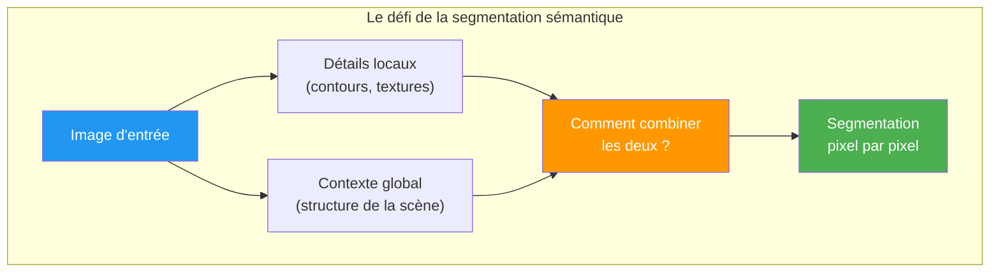
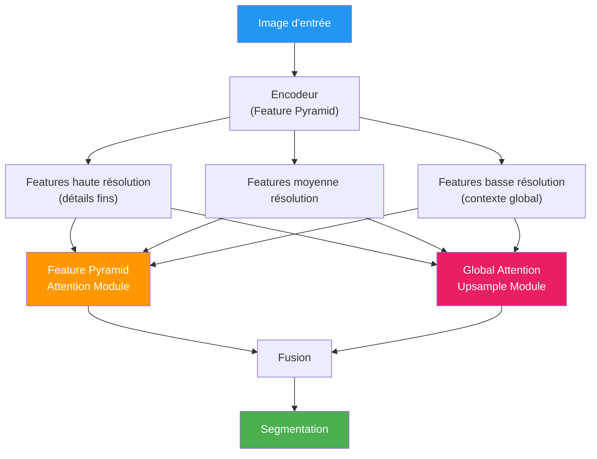

# Pyramid Attention Module (PAM)

Le **Pyramid Attention Network** (PAN) est une architecture de réseau de neurones conçue pour la **segmentation sémantique**. Son composant clé, le **Pyramid Attention Module**, combine des informations à **différentes échelles** grâce à des mécanismes d'attention, permettant de capturer à la fois les détails fins et le contexte global.

## Le problème : capturer le contexte multi-échelle

En segmentation sémantique, il faut comprendre une image à **plusieurs niveaux** :
- **Niveau local** : textures, contours, petits détails
- **Niveau global** : structure de la scène, relations entre objets

Les CNN classiques perdent progressivement les détails fins en empilant les couches. Le PAM résout ce problème.

## Qu'est-ce que l'attention ?

Le mécanisme d'**attention** permet au réseau de se **concentrer** sur les parties les plus pertinentes de l'entrée, plutôt que de traiter toutes les informations de manière égale.

**Analogie :** quand vous lisez une phrase, votre regard se concentre sur certains mots clés plutôt que de traiter chaque mot uniformément. L'attention fait la même chose dans un réseau de neurones.

### Types d'attention

| Type | Description | Où elle opère |
|------|-------------|--------------|
| **Attention spatiale** | Quelles **régions** de l'image sont importantes ? | Sur les positions (H x W) |
| **Attention par canal** | Quelles **feature maps** sont importantes ? | Sur les canaux (C) |
| **Self-attention** | Quelles parties de l'entrée sont liées entre elles ? | Relations globales |

## Architecture du Pyramid Attention Network

Le PAN combine deux modules principaux :

### Feature Pyramid Attention (FPA)

Le module FPA extrait des informations contextuelles à **plusieurs échelles** en utilisant une structure pyramidale :

1. L'image passe par des branches à **différentes résolutions** (comme une pyramide)
2. Chaque branche capture un **niveau de contexte** différent
3. Un mécanisme d'**attention** pondère l'importance de chaque échelle
4. Les résultats sont **fusionnés** pour produire une représentation riche

### Global Attention Upsample (GAU)

Le module GAU utilise l'attention globale pour guider le **sur-échantillonnage** (upsampling) :

1. Les features de **haut niveau** (basse résolution, riche en sémantique) sont utilisées pour générer des poids d'attention
2. Ces poids guident le **sur-échantillonnage** des features de bas niveau
3. Cela permet de récupérer les **détails spatiaux** tout en conservant la compréhension sémantique

## Comparaison avec d'autres approches

| Architecture | Approche multi-échelle | Points forts | Points faibles |
|---|---|---|---|
| **FCN** | Pas de multi-échelle | Simple | Perd les détails fins |
| **U-Net** | Skip connections | Bon pour les détails | Pas d'attention |
| **PSPNet** | Pyramid Pooling | Bon contexte global | Attention limitée |
| **DeepLab** | Atrous convolutions | Flexible | Coûteux en calcul |
| **PAN** | Pyramid Attention | Contexte + détails + attention | Plus complexe |

## Segmentation sémantique : rappel

La segmentation sémantique consiste à attribuer une **classe** à **chaque pixel** d'une image :

| Tâche | Entrée | Sortie |
|-------|--------|--------|
| Classification | Image entière | 1 étiquette ("chat") |
| Détection d'objets | Image entière | Boîtes englobantes + étiquettes |
| **Segmentation sémantique** | Image entière | 1 étiquette **par pixel** |
| Segmentation d'instances | Image entière | 1 étiquette par pixel + distinction entre instances |

## Ressources

- [Repo GitHub — Pyramid Attention Networks](https://github.com/SHI-Labs/Pyramid-Attention-Networks)
- [Review: PAN — Pyramid Attention Network for Semantic Segmentation](https://sh-tsang.medium.com/review-pan-pyramid-attention-network-for-semantic-segmentation-semantic-segmentation-8d94101ba24a)
