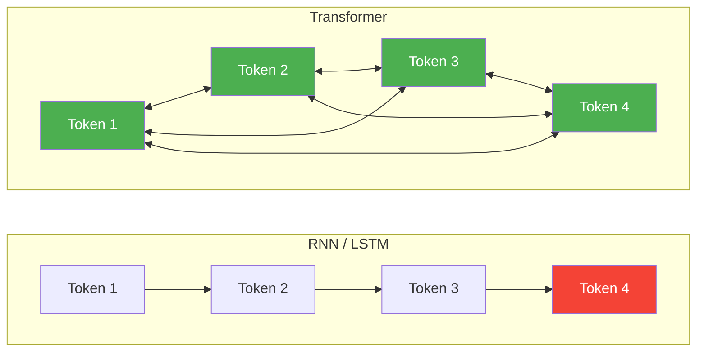
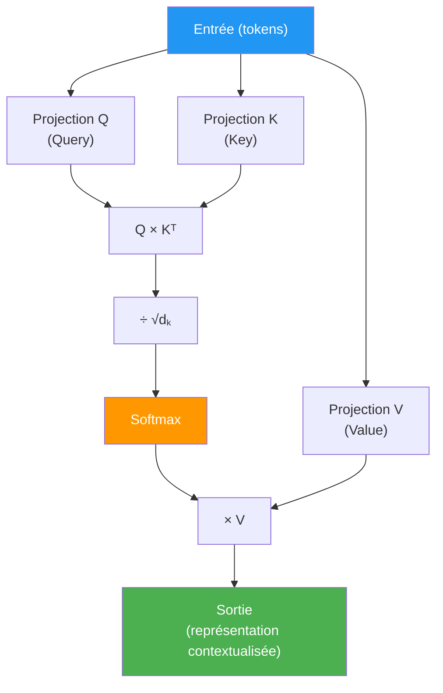
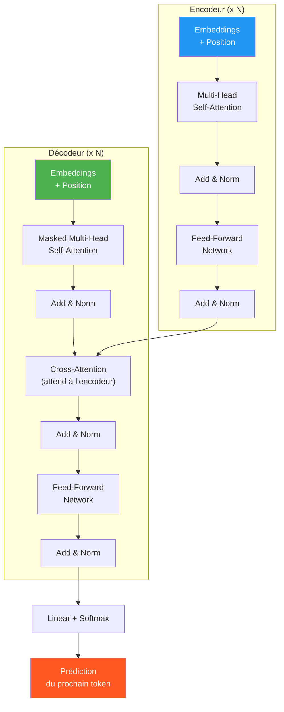
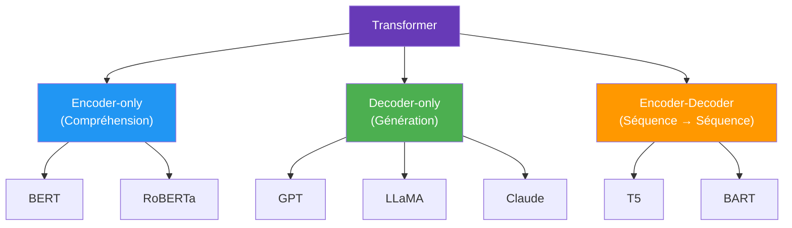

# Transformers

Les **Transformers** sont une architecture de réseau de neurones introduite en 2017 dans l'article *"Attention Is All You Need"*. Ils ont **révolutionné** le traitement du langage naturel (NLP) et sont aujourd'hui la base des modèles les plus performants (GPT, BERT, Claude, LLaMA, etc.).

## Pourquoi les Transformers ?

Avant les Transformers, les modèles de séquences (RNN, LSTM) avaient deux problèmes majeurs :
1. **Traitement séquentiel** : les tokens sont traités un par un, impossible de paralléliser
2. **Mémoire limitée** : difficulté à capturer les dépendances à longue distance

Les Transformers résolvent ces deux problèmes grâce au mécanisme d'**attention**.

| | RNN / LSTM | Transformer |
|---|---|---|
| **Traitement** | Séquentiel | Parallèle |
| **Dépendances longues** | Difficile | Facile (attention) |
| **Vitesse d'entraînement** | Lent | Rapide (GPU) |
| **Scalabilité** | Limitée | Excellente |

## Le mécanisme d'attention (Self-Attention)

L'idée clé : pour comprendre un mot, le modèle **regarde tous les autres mots** de la phrase et décide lesquels sont importants.

### Queries, Keys, Values (Q, K, V)

Chaque token est projeté en trois vecteurs :
- **Query (Q)** : "Que cherche ce token ?"
- **Key (K)** : "Que contient ce token ?"
- **Value (V)** : "Quelle information transmettre ?"

**Formule de l'attention :**

$$\text{Attention}(Q, K, V) = \text{softmax}\left(\frac{QK^T}{\sqrt{d_k}}\right) V$$

- $QK^T$ : score de similarité entre chaque paire de tokens
- $\sqrt{d_k}$ : facteur de normalisation (dimension des clés)
- $\text{softmax}$ : transforme les scores en probabilités
- Multiplication par $V$ : pondérer les valeurs par l'attention

### Multi-Head Attention

Plutôt qu'une seule attention, on en fait **plusieurs en parallèle** (les "heads"), chacune capturant des **relations différentes** :

$$\text{MultiHead}(Q, K, V) = \text{Concat}(\text{head}_1, \dots, \text{head}_h) W^O$$

- Chaque head capture un type de relation différent (syntaxe, sémantique, coréférence...)
- Les résultats sont concaténés puis projetés

## Architecture complète

### Composants clés

| Composant | Rôle |
|-----------|------|
| **Embeddings** | Convertir les tokens en vecteurs numériques |
| **Positional Encoding** | Encoder la position des tokens (le Transformer n'a pas de notion d'ordre) |
| **Self-Attention** | Permettre à chaque token de regarder tous les autres |
| **Masked Attention** | Empêcher le décodeur de "tricher" en regardant les tokens futurs |
| **Cross-Attention** | Le décodeur regarde la sortie de l'encodeur |
| **Feed-Forward** | Réseau dense appliqué indépendamment à chaque position |
| **Add & Norm** | Connexion résiduelle + normalisation (stabilise l'entraînement) |

### Positional Encoding

Les Transformers n'ayant pas de récurrence, il faut **injecter l'information de position** :

$$PE_{(pos, 2i)} = \sin\left(\frac{pos}{10000^{2i/d}}\right)$$
$$PE_{(pos, 2i+1)} = \cos\left(\frac{pos}{10000^{2i/d}}\right)$$

Les modèles modernes utilisent souvent des **positional embeddings apprenables** ou **RoPE** (Rotary Position Embedding).

## Les trois familles de Transformers

| Famille | Principe | Tâches typiques | Exemples |
|---------|---------|-----------------|----------|
| **Encoder-only** | Voit toute la séquence en même temps (bidirectionnel) | Classification, NER, recherche sémantique | BERT, RoBERTa |
| **Decoder-only** | Génère token par token (autorégressif) | Génération de texte, chatbots, code | GPT-4, Claude, LLaMA |
| **Encoder-Decoder** | Encode l'entrée, décode la sortie | Traduction, résumé | T5, BART |

## Les modèles marquants

### BERT (2018)
- **Bidirectional Encoder Representations from Transformers**
- Pré-entraîné avec **Masked Language Modeling** (MLM) : masquer 15% des tokens et prédire les manquants
- Excelle en **compréhension** de texte (classification, QA, NER)
- Bidirectionnel : voit le contexte à gauche ET à droite

### GPT (2018 → GPT-4)
- **Generative Pre-trained Transformer**
- Autorégressif : prédit le **prochain token** à partir des précédents
- Chaque version plus grande et plus performante
- Base des chatbots modernes (ChatGPT)

### LLaMA (2023)
- Modèle **open-source** de Meta
- Performances comparables à GPT-3 avec moins de paramètres
- A lancé l'écosystème des LLM open-source (Mistral, Vicuna, etc.)

## Scaling Laws

Les Transformers suivent des **lois d'échelle** prévisibles :
- Plus de **paramètres** = meilleures performances
- Plus de **données** = meilleures performances
- Plus de **calcul** = meilleures performances

La relation est logarithmique : doubler les performances nécessite ~10x plus de ressources.

## Au-delà du NLP

Les Transformers ne sont plus limités au texte :

| Domaine | Application | Modèle |
|---------|-------------|--------|
| **Vision** | Classification d'images | ViT (Vision Transformer) |
| **Audio** | Transcription | Whisper |
| **Multimodal** | Texte + Image | GPT-4V, LLaVA |
| **Protéines** | Prédiction de structure | AlphaFold 2 |
| **Code** | Génération de code | Codex, StarCoder |
| **Musique** | Génération musicale | MusicLM |
