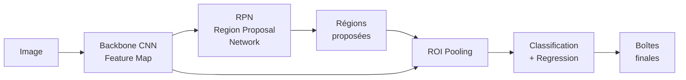
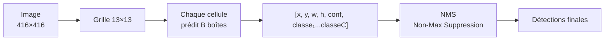
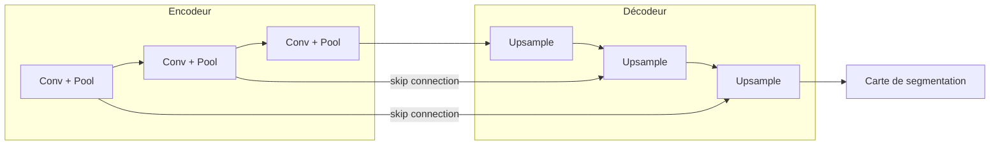

# Vision par Ordinateur

La vision par ordinateur (Computer Vision) est le domaine qui permet aux machines d'interpréter et comprendre des images et des vidéos. Elle s'appuie principalement sur les CNN et leurs évolutions.

## Tâches fondamentales

```mermaid
graph TD
    image[Image d'entrée]
    image --> classif[Classification\n'C'est un chat']
    image --> detect[Détection d'objets\n'Chat à (x,y,w,h)']
    image --> seg[Segmentation sémantique\n'Chaque pixel = classe']
    image --> inst[Segmentation d'instances\n'Chaque instance délimitée']
    image --> pose[Estimation de pose\n'Squelette humain']
    image --> depth[Estimation de profondeur\n'Carte de profondeur']

    style classif fill:#5ba3d9,color:#fff
    style detect fill:#e07b39,color:#fff
    style seg fill:#4caf50,color:#fff
    style inst fill:#9c27b0,color:#fff
```

## Détection d'objets

La détection d'objets consiste à localiser (bounding box) et classifier tous les objets d'une image.

### Approches à deux étapes (Two-stage)

**Faster R-CNN (2015)**



1. **Backbone** (ex: ResNet) extrait une feature map
2. **RPN** propose des régions candidates (anchors)
3. **ROI Pooling** normalise chaque région à taille fixe
4. **Head** classe l'objet et affine la boîte

**Avantages :** haute précision
**Inconvénients :** lent (~5 FPS), deux étapes séquentielles

### Approches à une étape (One-stage)

Régression directe des boîtes depuis l'image → beaucoup plus rapide.

**YOLO — You Only Look Once**

YOLO divise l'image en une grille S×S. Chaque cellule prédit B boîtes et C classes simultanément.



**Évolution des versions YOLO :**

| Version | Année | Innovation principale |
|---|---|---|
| YOLOv1 | 2016 | Concept one-stage, grille unique |
| YOLOv2 | 2017 | Anchor boxes, batch norm, multi-scale |
| YOLOv3 | 2018 | Détection multi-échelle (FPN), Darknet-53 |
| YOLOv5 | 2020 | PyTorch, auto-anchor, plus accessible |
| YOLOv7 | 2022 | ELAN, compound scaling |
| YOLOv8 | 2023 | Architecture unifiée detection/seg/pose |
| YOLOv9/v10 | 2024 | GELAN, NMS-free |

**SSD (Single Shot Detector)** : similaire à YOLO mais utilise des feature maps à plusieurs échelles (comme FPN).

### Feature Pyramid Network (FPN)

Combine des features à différentes résolutions pour détecter des objets de toutes tailles :

```
Image → [C2, C3, C4, C5]   (backbone, résolution décroissante)
                ↓ top-down pathway avec skip connections
         [P2, P3, P4, P5]   (pyramide de features enrichies)
```

- P5 : grands objets (faible résolution, haute sémantique)
- P2 : petits objets (haute résolution, sémantique plus faible)

### Non-Maximum Suppression (NMS)

Élimine les boîtes redondantes qui détectent le même objet :

1. Trier les boîtes par score de confiance
2. Garder la boîte avec le score le plus élevé
3. Supprimer toutes les boîtes avec IoU > seuil (ex: 0.5)
4. Répéter pour les boîtes restantes

**IoU (Intersection over Union) :**
```
IoU = Aire(A ∩ B) / Aire(A ∪ B)
```

## Segmentation

### Segmentation sémantique

Chaque pixel reçoit une étiquette de classe. Pas de distinction entre instances.

**FCN (Fully Convolutional Network)** : remplace les couches denses par des convolutions, préserve la résolution spatiale.

**U-Net** : architecture encodeur-décodeur avec skip connections. Très utilisé en imagerie médicale.



**DeepLab v3+** : utilise des convolutions dilatées (atrous convolutions) pour augmenter le champ réceptif sans perdre de résolution.

```
Convolution standard : filtre 3×3 → champ réceptif 3×3
Convolution dilatée (rate=2) : filtre 3×3 → champ réceptif 5×5
Convolution dilatée (rate=4) : filtre 3×3 → champ réceptif 9×9
```

### Segmentation d'instances

Distingue les instances individuelles d'une même classe.

**Mask R-CNN** : étend Faster R-CNN avec une branche supplémentaire qui prédit un masque binaire pour chaque région proposée.

```
ROI Feature → Branche classification + régression (boîte)
           → Branche masque (FCN sur chaque ROI) → Masque 28×28
```

**SAM (Segment Anything Model, 2023)** : modèle de Meta capable de segmenter n'importe quel objet à partir d'un prompt (point, boîte, texte). Zéro-shot.

## Transfer Learning en vision

Presque tous les projets de vision partent d'un backbone pré-entraîné sur ImageNet :

```python
import torchvision.models as models

# Backbone pré-entraîné
backbone = models.resnet50(pretrained=True)

# Remplacer la dernière couche
backbone.fc = nn.Linear(2048, num_classes)

# Geler le backbone (feature extraction)
for param in backbone.parameters():
    param.requires_grad = False
backbone.fc.requires_grad_(True)  # Seulement la tête

# Fine-tuning complet : dégeler tout après quelques epochs
for param in backbone.parameters():
    param.requires_grad = True
```

**Backbones courants :**

| Modèle | Paramètres | Top-1 ImageNet | Usage |
|---|---|---|---|
| ResNet-50 | 25M | 76% | Baseline robuste |
| EfficientNet-B0 | 5.3M | 77% | Mobile / contrainte mémoire |
| ViT-Base | 86M | 81% | Vision Transformer |
| ConvNeXt-T | 28M | 82% | CNN moderne |
| DINOv2-L | 307M | 86% | Features auto-supervisées |

## Augmentation de données

Essentielle pour la régularisation en vision :

```python
from torchvision import transforms

train_transform = transforms.Compose([
    transforms.RandomResizedCrop(224),      # Découpage aléatoire
    transforms.RandomHorizontalFlip(),      # Miroir horizontal
    transforms.ColorJitter(0.4, 0.4, 0.4), # Couleur, luminosité
    transforms.RandomRotation(15),          # Rotation
    transforms.ToTensor(),
    transforms.Normalize(mean=[0.485, 0.456, 0.406],
                         std=[0.229, 0.224, 0.225]),  # ImageNet stats
])
```

**Techniques avancées :**
- **MixUp** : mélange linéaire de deux images et de leurs labels
- **CutMix** : colle une région d'une image dans une autre
- **RandAugment** : politique d'augmentation automatique
- **Test-Time Augmentation (TTA)** : moyenne des prédictions sur plusieurs augmentations à l'inférence

## Métriques d'évaluation en détection

**mAP (mean Average Precision)** : métrique standard pour la détection.

1. Pour chaque classe, calculer la courbe Précision-Rappel
2. Average Precision (AP) = aire sous la courbe
3. mAP = moyenne des AP sur toutes les classes

**mAP@0.5** : IoU seuil de 0.5
**mAP@[0.5:0.95]** : moyenne sur IoU de 0.5 à 0.95 (standard COCO, plus strict)

## Vision et Transformers

Les Vision Transformers (ViT, 2020) appliquent l'architecture Transformer aux images :

1. Découper l'image en patches de 16×16 pixels
2. Embedder chaque patch (comme un token de texte)
3. Ajouter un token `[CLS]` de classification
4. Passer dans les couches d'attention multi-têtes

**Avantage** : modélisation des dépendances globales dès la première couche (vs champ réceptif local des CNN)
**Inconvénient** : nécessite beaucoup plus de données d'entraînement

**Modèles hybrides** : SWIN Transformer utilise une attention locale glissante, plus efficace sur les grandes images.
