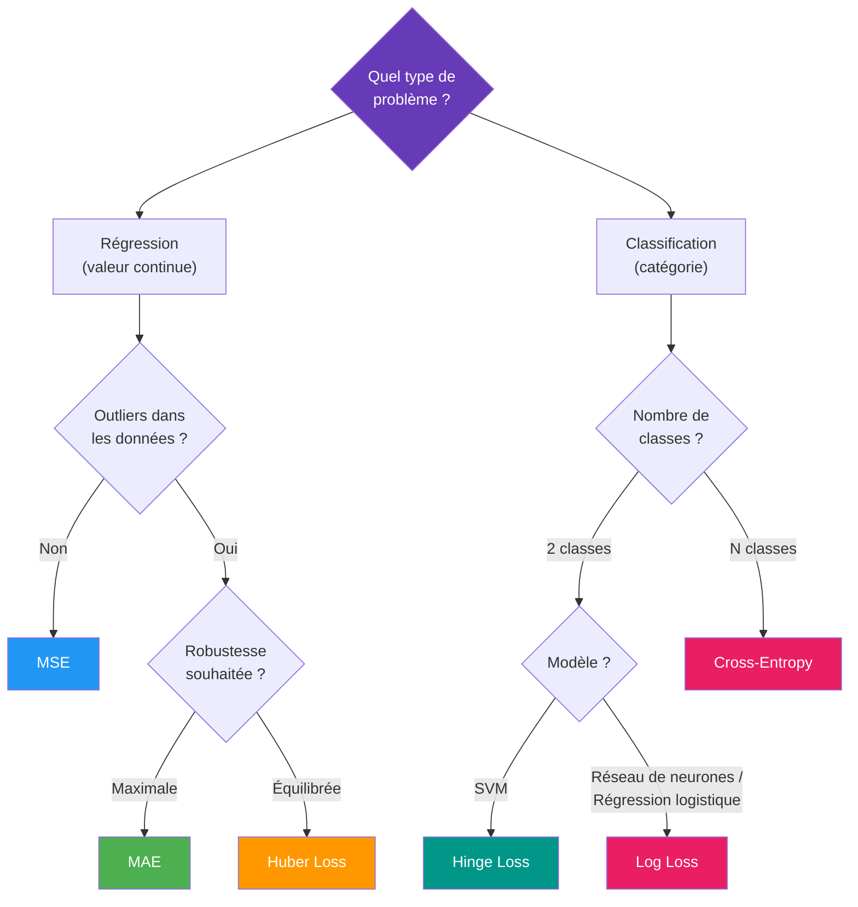

# Fonctions de pertes

Les fonctions de perte en intelligence artificielle (IA) sont des outils essentiels pour entraîner des modèles, notamment dans les domaines de l'apprentissage supervisé et non supervisé. Elles mesurent la différence entre les prédictions du modèle et les résultats réels. Voici une description des principales fonctions de perte utilisées en IA.

## Comment choisir sa fonction de perte ?



## 1. Erreur quadratique moyenne (Mean Squared Error, MSE)

- **Définition** : La MSE mesure la moyenne des carrés des erreurs, c’est-à-dire la différence entre les valeurs prédites et les valeurs réelles.
- **Formule** : 
  $$\text{MSE} = \frac{1}{n} \sum_{i=1}^{n} (y_i - \hat{y_i})^2$$
- **Utilisation** : Principalement utilisée pour les problèmes de régression.
- **Avantages** : Amplifie les grandes erreurs, ce qui peut être bénéfique pour corriger les grosses déviations.
- **Inconvénients** : Sensible aux outliers.

## 2. Erreur absolue moyenne (Mean Absolute Error, MAE)

- **Définition** : La MAE mesure la moyenne des valeurs absolues des erreurs.
- **Formule** : 
  $$
  \text{MAE} = \frac{1}{n} \sum_{i=1}^{n} |y_i - \hat{y_i}|
  $$
- **Utilisation** : Également utilisée pour les problèmes de régression.
- **Avantages** : Moins sensible aux outliers comparé à la MSE.
- **Inconvénients** : Peut sous-estimer l'importance des grandes erreurs par rapport à la MSE.

## 3. Erreur logarithmique (Log Loss) ou Entropie croisée (Cross-Entropy Loss)

- **Définition** : Mesure la performance d’un modèle de classification dont la sortie est une probabilité entre 0 et 1.
- **Formule** : 
  $$
  \text{Log Loss} = -\frac{1}{n} \sum_{i=1}^{n} [y_i \log(\hat{y_i}) + (1 - y_i) \log(1 - \hat{y_i})]
  $$
- **Utilisation** : Utilisée pour les problèmes de classification binaire ou multi-classes.
- **Avantages** : Appropriée pour les modèles de classification probabiliste.
- **Inconvénients** : Peut être difficile à interpréter intuitivement.

## 4. Fonction de perte Hinge (Hinge Loss)

- **Définition** : Utilisée principalement pour les machines à vecteurs de support (SVM), elle pénalise les points mal classés ou se trouvant trop près de la frontière de décision.
- **Formule** : 
  $$
  \text{Hinge Loss} = \frac{1}{n} \sum_{i=1}^{n} \max(0, 1 - y_i \cdot \hat{y_i})
  $$
- **Utilisation** : Principalement dans les SVM pour la classification binaire.
- **Avantages** : Encourage un large margin (marge) de classification.
- **Inconvénients** : Ne fonctionne pas bien avec les probabilités.

## 5. Kullback-Leibler Divergence (KL Divergence)

- **Définition** : Mesure la différence entre deux distributions de probabilité.
- **Formule** : 
  $$
  D_{KL}(P \parallel Q) = \sum_{i} P(i) \log\left(\frac{P(i)}{Q(i)}\right)
  $$
- **Utilisation** : Utilisée dans les modèles génératifs, les réseaux de neurones variational autoencoders (VAE), et pour ajuster des distributions de probabilité.
- **Avantages** : Fournit une mesure asymétrique de la divergence entre deux distributions.
- **Inconvénients** : Peut être infinie si Q(i) = 0 et P(i) ≠ 0.

## 6. Huber Loss

- **Définition** : Combine les avantages de la MSE et de la MAE, étant quadratique pour les petites erreurs et linéaire pour les grandes erreurs.
- **Formule** : 
  $$
  \text{Huber Loss}(a, \delta) = \begin{cases} 
  \frac{1}{2}a^2 & \text{si } |a| \le \delta \\
  \delta (|a| - \frac{1}{2}\delta) & \text{sinon} 
  \end{cases}
  $$
- **Utilisation** : Utilisée dans les problèmes de régression où il y a des outliers.
- **Avantages** : Moins sensible aux outliers que la MSE.
- **Inconvénients** : Nécessite le choix d'un paramètre delta.

## 7. Focal Loss

Variante de la Cross-Entropy pour les problèmes avec fort déséquilibre de classes. Réduit le poids des exemples faciles pour forcer le modèle à se concentrer sur les exemples difficiles (objets rares).

$$\text{Focal Loss} = -\alpha_t (1 - p_t)^\gamma \log(p_t)$$

- $\gamma$ (focusing parameter) : 0 = Cross-Entropy classique, 2 = valeur commune
- $\alpha_t$ : facteur de pondération par classe

**Utilisé dans** : RetinaNet (détection d'objets), classification déséquilibrée.

## 8. Dice Loss (pour la segmentation)

Mesure le chevauchement entre la prédiction et le masque réel. Particulièrement adapté à la segmentation d'images médicales.

$$\text{Dice Loss} = 1 - \frac{2 |P \cap G|}{|P| + |G|}$$

Où $P$ est le masque prédit et $G$ le masque ground truth.

**Utilisé dans** : Segmentation sémantique médicale (tumeurs, organes).

## 9. Contrastive Loss et Triplet Loss

Pour l'apprentissage de représentations (embedding) où l'objectif est de rapprocher des paires similaires et éloigner des paires dissimilaires.

**Contrastive Loss** (paires) :
$$L = (1-y) \frac{1}{2}D^2 + y \cdot \frac{1}{2}\max(0, m-D)^2$$

**Triplet Loss** (anchor, positive, negative) :
$$L = \max(0, \|f_a - f_p\|^2 - \|f_a - f_n\|^2 + \alpha)$$

**Utilisé dans** : FaceNet, Siamese networks, recherche d'images similaires.

## Implémentation PyTorch

```python
import torch
import torch.nn as nn
import torch.nn.functional as F

# MSE
criterion = nn.MSELoss()

# MAE
criterion = nn.L1Loss()

# Huber
criterion = nn.HuberLoss(delta=1.0)

# Cross-Entropy (inclut Softmax)
criterion = nn.CrossEntropyLoss()
# Pour classification binaire
criterion = nn.BCELoss()
criterion = nn.BCEWithLogitsLoss()  # Plus stable (inclut Sigmoid)

# Hinge
criterion = nn.HingeEmbeddingLoss()
# Pour SVM multiclasse
criterion = nn.MultiMarginLoss()

# KL Divergence
criterion = nn.KLDivLoss(reduction='batchmean')

# Focal Loss (implémentation custom)
class FocalLoss(nn.Module):
    def __init__(self, gamma=2, alpha=0.25):
        super().__init__()
        self.gamma = gamma
        self.alpha = alpha

    def forward(self, logits, targets):
        ce_loss = F.cross_entropy(logits, targets, reduction='none')
        p_t = torch.exp(-ce_loss)
        focal_loss = self.alpha * (1 - p_t) ** self.gamma * ce_loss
        return focal_loss.mean()

# Triplet Loss
criterion = nn.TripletMarginLoss(margin=1.0)

# Utilisation type
outputs = model(inputs)
loss = criterion(outputs, targets)
loss.backward()
optimizer.step()
```

## Résumé comparatif

| Fonction | Type de problème | Sensible aux outliers | Quand l'utiliser |
|----------|:---:|:---:|---|
| **MSE** | Régression | Oui | Données propres, pénaliser les grandes erreurs |
| **MAE** | Régression | Non | Données avec outliers |
| **Huber** | Régression | Partiellement | Compromis MSE/MAE |
| **Log Loss** | Classification | — | Classification probabiliste binaire |
| **Cross-Entropy** | Classification | — | Classification multi-classes |
| **Hinge** | Classification | — | SVM, maximiser la marge |
| **KL Divergence** | Distributions | — | VAE, comparaison de distributions |
| **Focal Loss** | Classification déséquilibrée | — | Classes rares, détection d'objets |
| **Dice Loss** | Segmentation | — | Segmentation médicale |
| **Triplet Loss** | Embeddings | — | Reconnaissance faciale, similarité |
