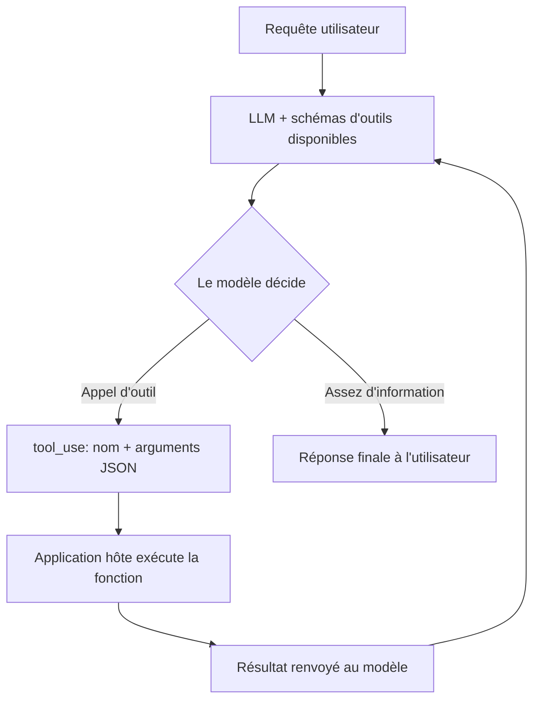
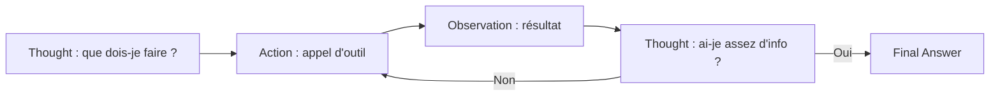
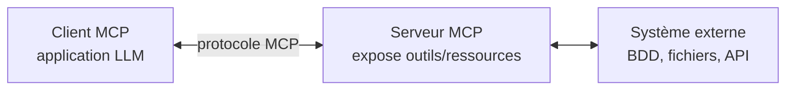
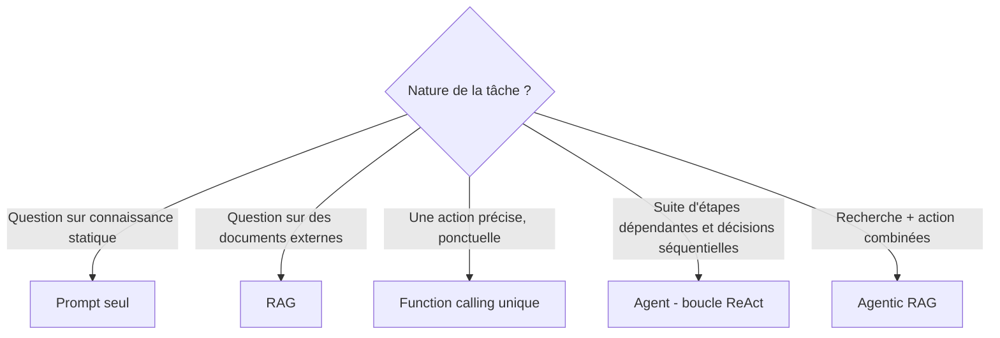

# Agents LLM et Function Calling

Un LLM seul ne fait que produire du texte : il ne peut ni consulter une base de données, ni naviguer sur le web, ni exécuter du code, ni envoyer un email. Le **function calling** (tool use) lui donne la capacité de déclencher des actions déterministes. Un **agent** est un LLM placé dans une boucle : il raisonne, appelle des outils, observe les résultats, et décide de l'étape suivante jusqu'à résoudre la tâche.

## Pourquoi sortir du simple prompt-réponse ?

| Limite du LLM seul | Solution |
|---|---|
| Connaissance figée à la date d'entraînement | Outil de recherche web, [[RAG]] |
| Pas d'accès à des données privées/internes | Outil de requête base de données, API interne |
| Incapable de calculer précisément | Outil calculatrice / interpréteur de code |
| Ne peut pas agir sur le monde réel | Outils d'action (envoyer un email, créer un fichier, réserver) |
| Tâche trop complexe pour une seule génération | Décomposition en étapes via boucle d'agent |

## Function Calling : le mécanisme

Le LLM **n'exécute jamais rien lui-même** — c'est l'idée reçue la plus courante à corriger. Il décide *quoi* appeler et *avec quels arguments* ; l'exécution, la sécurité et les effets de bord restent entièrement sous la responsabilité de l'application hôte.

**Déroulement :**

1. Le développeur déclare les outils disponibles sous forme de schéma (nom, description, paramètres attendus)
2. Ce schéma est envoyé au modèle en même temps que le prompt
3. Au lieu de (ou en plus de) répondre en texte libre, le modèle produit un **appel structuré** : nom de fonction + arguments au format JSON
4. L'application hôte parse cet appel et **exécute réellement** la fonction correspondante
5. Le résultat est réinjecté dans la conversation comme un nouveau message
6. Le modèle continue : il peut appeler un autre outil ou formuler la réponse finale



**Exemple de schéma d'outil :**

```json
{
  "name": "get_weather",
  "description": "Renvoie la météo actuelle pour une ville donnée",
  "parameters": {
    "type": "object",
    "properties": {
      "ville": {"type": "string"},
      "unite": {"type": "string", "enum": ["celsius", "fahrenheit"]}
    },
    "required": ["ville"]
  }
}
```

**Ce que le modèle produit** (au lieu de texte) :

```json
{"tool_use": {"name": "get_weather", "arguments": {"ville": "Lyon", "unite": "celsius"}}}
```

L'hôte exécute réellement l'appel API météo, puis renvoie par exemple `{"temperature": 22, "conditions": "ensoleillé"}` au modèle, qui peut alors formuler : *"Il fait 22°C et ensoleillé à Lyon."*

## Le pattern ReAct (Reason + Act)

Déjà introduit dans [[Prompt Engineering]] — approfondi ici car c'est le mécanisme sous-jacent de la plupart des agents. Le modèle alterne explicitement raisonnement et action jusqu'à obtenir une réponse finale :



Que ce raisonnement soit affiché à l'utilisateur (comme dans un prompt ReAct explicite) ou masqué en interne, c'est structurellement la même boucle qui fait fonctionner un agent moderne.

## Appel d'outil unique vs boucle d'agent

| | Appel d'outil unique | Boucle d'agent |
|---|---|---|
| **Exemple** | "Quelle est la météo à Lyon ?" | "Compare les vols Paris-Tokyo cette semaine et réserve le moins cher" |
| **Nombre d'appels** | 1 | Plusieurs, séquentiels, dépendants les uns des autres |
| **Décision** | Le modèle choisit un outil puis répond | Le modèle re-planifie à chaque étape selon les observations |
| **Coût / latence** | Faible | Élevé (un tour = un appel LLM complet) |

## Types d'outils courants

| Outil | Rôle | Exemple |
|---|---|---|
| Recherche web | Information à jour | Vérifier un fait récent |
| Exécution de code (sandbox) | Calcul précis, traitement de données | Analyser un CSV, résoudre une équation |
| Accès fichiers | Lire/écrire des documents | Éditer du code, générer un rapport |
| Appel API | Intégration avec un service externe | Réserver, envoyer un message, consulter un CRM |
| Base de données | Requêtes structurées | SQL agent sur une base métier |
| Retrieval | Recherche sémantique | Utiliser le [[RAG]] comme un outil parmi d'autres |

## Model Context Protocol (MCP)

Protocole ouvert introduit par Anthropic (2024) qui standardise la façon dont une application LLM se connecte à des outils et des sources de données externes. Avant MCP, chaque intégration (Slack, GitHub, une base de données...) devait être recodée pour chaque application LLM. MCP découple l'implémentation d'un outil de l'application qui l'utilise.



- **Serveur MCP** : expose des outils, des ressources (données) et des prompts réutilisables selon un format standard
- **Client MCP** : n'importe quelle application LLM compatible peut s'y connecter sans code spécifique
- Un même serveur MCP (ex. serveur GitHub) fonctionne avec n'importe quel client compatible, contrairement au function calling qui reste un mécanisme propre à chaque API de modèle

**Function calling vs MCP** : le function calling est le mécanisme bas niveau par lequel *un* modèle appelle *un* outil pendant *une* conversation. MCP standardise la couche de découverte et de connexion à ces outils, indépendamment du modèle utilisé.

## Orchestration multi-agents

Pour des tâches complexes, un agent orchestrateur peut déléguer des sous-tâches à des agents spécialisés plutôt que de tout gérer dans une seule boucle.

| Pattern | Principe | Quand l'utiliser |
|---|---|---|
| **Séquentiel** | Chaque agent traite la sortie du précédent | Pipeline (recherche → rédaction → révision) |
| **Parallèle** | Plusieurs agents travaillent en même temps sur des sous-tâches indépendantes | Recherche sur plusieurs sources simultanément |
| **Hiérarchique (manager-worker)** | Un agent orchestrateur planifie et délègue à des agents exécutants | Tâches larges décomposables |
| **Débat / vote** | Plusieurs agents proposent une réponse, un consensus ou un juge tranche | Réduire les erreurs sur des tâches de raisonnement |

Coût à garder en tête : chaque agent supplémentaire multiplie le nombre d'appels LLM. La complexité de l'orchestration doit être justifiée par la difficulté réelle de la tâche.

## Pièges et risques

- **Boucles infinies** : un agent qui ne converge jamais vers une condition d'arrêt. Toujours fixer un nombre maximal d'itérations.
- **Hallucination d'appels d'outils** : le modèle invente un nom de fonction ou des arguments invalides. Valider strictement le schéma et renvoyer l'erreur au modèle pour qu'il corrige, plutôt que de planter silencieusement.
- **Prompt injection via les résultats d'outils** : une page web ou un document récupéré par un outil peut contenir des instructions cachées destinées à détourner l'agent ("ignore tes instructions précédentes..."). Traiter tout contenu externe comme non fiable, ne jamais accorder d'action destructive sans confirmation humaine.
- **Coût et latence** : une tâche à 10 étapes peut coûter 10 fois plus qu'une réponse directe — ne pas donner un agent à un problème qui se résout avec un seul prompt.
- **Sur-ingénierie** : la tentation d'ajouter des outils et des agents à un problème simple. Commencer par le function calling unique, ne monter en boucle d'agent que si la tâche l'exige réellement.

## Évaluer un agent

Différent de l'évaluation d'une réponse unique ([[Métriques d'Évaluation]]) :

- **Taux de réussite de la tâche** (task completion) : le résultat final est-il correct ?
- **Efficacité** : nombre d'étapes/appels nécessaires pour y arriver
- **Précision des appels d'outils** : bon outil, bons arguments
- **Capacité de récupération** : l'agent corrige-t-il ses erreurs après une observation d'échec ?

**Benchmarks connus** : AgentBench, ToolBench (usage d'outils), SWE-bench (agents de code), GAIA (raisonnement multi-outils).

## Function Calling vs RAG vs Agent — quand utiliser quoi



