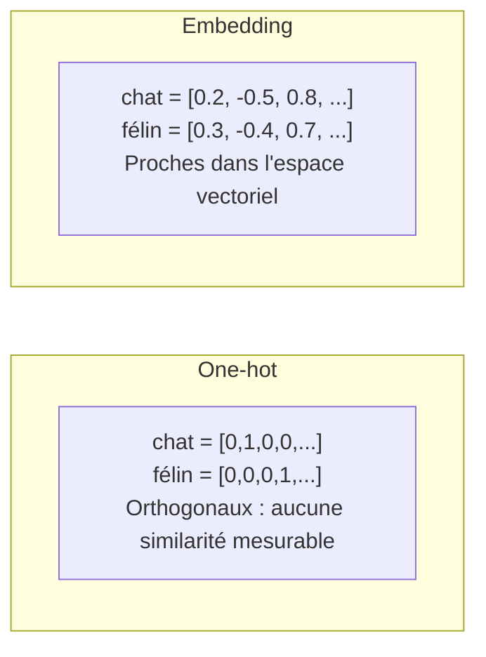
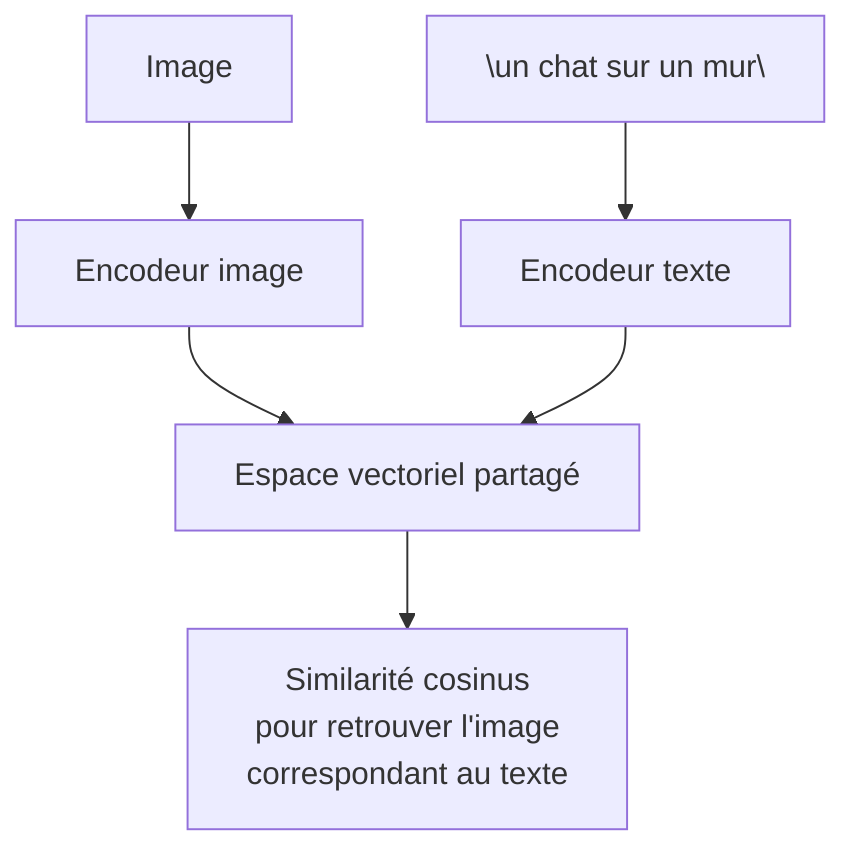

# Embeddings

Un embedding est une représentation **vectorielle dense** d'un objet (mot, phrase, document, image...) dans un espace continu, construite pour que la **proximité géométrique reflète la proximité sémantique**. C'est le pont mathématique qui permet à un système de comparer, rechercher et raisonner sur des données discrètes (texte, image) avec de l'algèbre linéaire.

## Pourquoi représenter en vecteurs ?

Une représentation naïve comme le one-hot encoding échoue à capturer le sens : chaque mot est un vecteur creux orthogonal à tous les autres, donc "chat" est aussi "différent" de "félin" que de "voiture". Un embedding compresse le sens dans un vecteur dense de dimension réduite où les concepts proches sont géométriquement proches.

## Des mots aux phrases : évolution

[[NLP et Traitement du Langage]] couvre déjà Word2Vec, GloVe et FastText — les précurseurs au niveau du mot. Les usages modernes (recherche, [[RAG]]) ont besoin d'embeddings de **phrases ou de documents entiers** :

| Génération | Niveau | Limite résolue |
|---|---|---|
| Word2Vec, GloVe (2013-2014) | Mot | Aucune notion de contexte (le mot "avocat" a un seul vecteur, qu'il s'agisse du fruit ou du métier) |
| ELMo, BERT (2018) | Mot en contexte | Le vecteur d'un mot change selon la phrase |
| Sentence-BERT (2019) | Phrase entière | BERT seul est coûteux à comparer par paires ; SBERT produit directement des embeddings de phrase comparables par cosinus |
| Modèles d'embedding dédiés (text-embedding-3, BGE, E5, Voyage...) | Phrase/document, entraînés spécifiquement pour la recherche | Optimisés pour la similarité, pas seulement pour la prédiction de mots |

**Piège du "bag of vectors"** : faire la moyenne des embeddings de mots d'une phrase perd l'ordre et peut être trompeur ("le chat mange le poisson" et "le poisson mange le chat" auraient presque le même vecteur moyen). Les modèles de phrase modernes évitent ce problème en encodant la séquence entière.

## Comment un modèle d'embedding est entraîné

Le principe dominant est l'**apprentissage contrastif** : entraîner le modèle pour que des paires sémantiquement proches (question/réponse correcte, deux paraphrases, deux traductions) soient rapprochées dans l'espace, et que des paires non liées soient éloignées. C'est directement la logique de la **Contrastive Loss** et de la **Triplet Loss** déjà présentées dans [[Fonctions de pertes]].

**Astuce pratique d'entraînement — in-batch negatives** : plutôt que de construire explicitement des exemples négatifs, chaque exemple positif d'un batch sert automatiquement de négatif pour tous les autres exemples du même batch. Cela permet d'entraîner efficacement sur des batches larges sans annoter des négatifs à la main.

**Hard negative mining** : au-delà des négatifs aléatoires (faciles), on ajoute des négatifs *difficiles* — des exemples proches en surface mais faux sémantiquement — pour forcer le modèle à apprendre une distinction plus fine.

## Mesures de similarité

| Mesure | Formule | Quand l'utiliser |
|---|---|---|
| **Similarité cosinus** | $\cos(\theta) = \dfrac{A \cdot B}{\|A\| \|B\|}$ | Standard pour la plupart des modèles d'embedding — insensible à la magnitude du vecteur |
| **Produit scalaire** | $A \cdot B$ | Équivalent au cosinus si les vecteurs sont déjà normalisés (norme = 1) ; plus rapide à calculer |
| **Distance euclidienne** | $\|A - B\|$ | Utile quand la magnitude porte de l'information (rare en NLP) |

**Règle pratique** : utiliser la mesure pour laquelle le modèle a été entraîné (indiquée dans sa documentation) — mélanger une mesure non prévue avec un modèle donné dégrade silencieusement la qualité des résultats.

## Types d'embeddings

| Type | Description | Exemple |
|---|---|---|
| Texte | Mot, phrase, document | Recherche sémantique, [[RAG]] |
| Multimodal | Image et texte dans le **même** espace vectoriel | CLIP — chercher une image à partir d'une description textuelle |
| Code | Spécialisés sur la syntaxe et la sémantique du code source | Recherche de code par similarité |
| Graphe | Représentation vectorielle de nœuds/graphes entiers | node2vec, embeddings issus de [[Graph Neural Networks]] |

CLIP (Contrastive Language-Image Pre-training, OpenAI 2021) entraîne conjointement un encodeur image et un encodeur texte pour qu'une image et sa légende tombent au même endroit dans l'espace vectoriel — base de la recherche d'image par texte et du guidage texte des [[Modèles de Diffusion]].

## Matryoshka embeddings

Technique récente : le modèle est entraîné avec un objectif qui concentre l'information la plus importante dans les **premières dimensions** du vecteur. Conséquence : on peut tronquer un embedding de 1536 dimensions à 256 sans réentraîner ni changer de modèle, en ne perdant qu'une fraction de la qualité. Utile pour arbitrer stockage/vitesse contre précision selon le cas d'usage, avec un seul modèle.

## Modèles d'embedding courants (repères)

| Modèle | Dimension | Open source | Notes |
|---|---|---|---|
| text-embedding-3-small/large (OpenAI) | 1536 / 3072 | Non | Bon défaut généraliste, API payante |
| Cohere embed-v3 | 1024 | Non | Fort en recherche multilingue |
| Voyage AI | 1024-2048 | Non | Optimisé pour le RAG, spécialisations par domaine |
| BGE-M3 (BAAI) | 1024 | Oui | Multilingue, dense + sparse + multi-vecteur en un seul modèle |
| E5 | 384-1024 | Oui | Bon rapport qualité/taille |
| all-MiniLM-L6-v2 (Sentence-Transformers) | 384 | Oui | Léger, rapide, bon pour prototypage |

## Évaluer la qualité d'un modèle d'embedding

**MTEB (Massive Text Embedding Benchmark)** : référence standard qui évalue les modèles sur la recherche, le clustering, la classification et la similarité sémantique (STS). Un modèle en tête du classement général peut néanmoins mal performer sur un domaine spécifique (jargon juridique, code, langue peu représentée) — toujours valider sur ses propres données quand la qualité du retrieval est critique pour un [[RAG]].

## Cas d'usage

| Usage | Principe |
|---|---|
| Recherche sémantique | Base du [[RAG]] : indexer des chunks, retrouver les plus proches d'une requête |
| Clustering | Regrouper des documents similaires sans labels ([[Apprentissage Non Supervisé]]) |
| Déduplication | Détecter des documents quasi-identiques par similarité élevée |
| Système de recommandation | Rapprocher utilisateurs et items dans le même espace |
| Détection d'anomalies | Un point loin de tous les centroïdes de clusters connus |
| Classification few-shot | Comparer l'embedding d'un nouvel exemple à ceux de quelques exemples par classe, sans entraînement supervisé complet |

## Pièges courants

- **Incompatibilité entre modèles** : un vecteur produit par le modèle A n'est jamais comparable à un vecteur produit par le modèle B — les espaces ne sont pas alignés. Changer de modèle d'embedding impose de **ré-indexer toute la base vectorielle**.
- **Normalisation** : certains modèles exigent une normalisation L2 explicite avant de calculer un simple produit scalaire comme proxy du cosinus — vérifier la documentation du modèle avant d'optimiser les calculs.
- **Troncature silencieuse** : un texte plus long que la fenêtre de contexte du modèle d'embedding est coupé sans avertissement, d'où l'importance du chunking en amont (voir [[RAG]]).
- **Fausse proximité sémantique** : deux phrases peuvent être proches en embedding sans être équivalentes en sens — la négation en est l'exemple classique ("j'aime ce film" et "je n'aime pas ce film" restent souvent très proches car le sujet dominant est identique).

## Liens

- [[RAG]] — usage principal des embeddings : indexation et recherche par similarité
- [[NLP et Traitement du Langage]] — Word2Vec, GloVe, FastText, les précurseurs au niveau mot
- [[Fonctions de pertes]] — Contrastive Loss et Triplet Loss, base de l'entraînement des modèles d'embedding
- [[Graph Neural Networks]] — embeddings de nœuds sur des structures de graphe
- [[Apprentissage Non Supervisé]] — clustering appliqué sur des embeddings
- [[Modèles de Diffusion]] — guidage texte via l'espace CLIP
