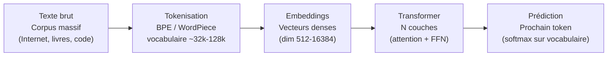
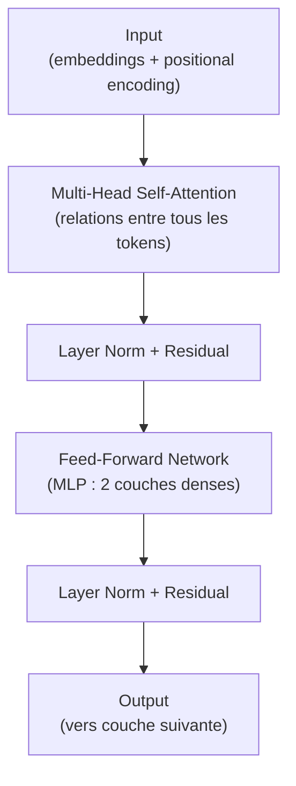

# LLM — Architectures et Fonctionnement

Les Large Language Models (LLM) sont des modèles de deep learning entraînés sur d'immenses corpus de texte pour prédire le prochain token. GPT, Claude, Gemini, LLaMA en sont des exemples.

### Vue d'Ensemble



L'entraînement = **prédire le prochain token** sur des milliards d'exemples. La compréhension du langage émerge de cette tâche simple à grande échelle.

### Tokenisation

Avant d'entrer dans le modèle, le texte est découpé en **tokens** — sous-mots, pas forcément des mots entiers.

```
"Bonjour, monde!" → ["Bon", "jour", ",", " monde", "!"]
"unforgettable"  → ["un", "forget", "table"]
```

**BPE (Byte Pair Encoding)** : algorithme standard (GPT, LLaMA)
- Commence avec caractères individuels
- Fusionne les paires les plus fréquentes itérativement
- Résultat : vocabulaire ~30k-100k tokens

**Impact pratique** :
- 1 token ≈ 0,75 mot en anglais (moins efficace dans d'autres langues)
- La fenêtre de contexte (context window) est mesurée en tokens, pas en mots

### Architecture Transformer

Introduite en 2017 (Vaswani et al., "Attention is All You Need"). Tous les LLM modernes en dérivent.

**Composants principaux d'un bloc Transformer :**



**Self-Attention** : le mécanisme clé
- Chaque token calcule son importance par rapport à tous les autres tokens
- Formule : Attention(Q, K, V) = softmax(QKᵀ / √d_k) · V
- Q (Query), K (Key), V (Value) : projections linéaires de l'embedding
- **Multi-head** : plusieurs têtes d'attention en parallèle → capturer différents types de relations

**Positional Encoding** :
- Les transformers n'ont pas de sens de l'ordre natif → encodage de la position ajouté
- Absolu (GPT-2) ou relatif (RoPE, ALiBi — meilleure généralisation à de longues séquences)

### Entraînement

**Pré-entraînement (Pre-training)**
- Objectif : prédire le prochain token (CLM — Causal Language Modeling)
- Données : billions de tokens (Common Crawl, Wikipedia, GitHub, livres...)
- Coût : des millions de dollars (GPU-heures), plusieurs mois
- Résultat : un modèle de base (base model) — compétent mais non aligné

**Fine-tuning supervisé (SFT)**
- Entraîner sur des exemples (instruction, réponse) de haute qualité
- Transforme le base model en assistant
- Données : quelques milliers à millions d'exemples curatés

**RLHF (Reinforcement Learning from Human Feedback)**
1. Générer plusieurs réponses à une même question
2. Des humains les classent (quelle réponse est meilleure ?)
3. Entraîner un **reward model** à prédire ces préférences
4. Optimiser le LLM avec PPO (Proximal Policy Optimization) pour maximiser le reward

**RLAIF (RL from AI Feedback)** : remplacer les humains par un autre LLM pour scalabilité.

### Paramètres et Échelles

| Modèle | Paramètres | Contexte | Année |
|---|---|---|---|
| GPT-2 | 1,5 B | 1 024 tokens | 2019 |
| GPT-3 | 175 B | 4 096 tokens | 2020 |
| LLaMA 2 | 7B à 70B | 4 096 tokens | 2023 |
| GPT-4 (estimé) | ~1 000 B | 128 000 tokens | 2023 |
| LLaMA 3 | 8B à 405B | 128 000 tokens | 2024 |
| Claude 3.5 | Inconnu | 200 000 tokens | 2024 |

**Lois d'échelle (Scaling Laws — Kaplan 2020, Chinchilla 2022)** :
- La performance croît de façon prévisible avec paramètres × données × compute
- Chinchilla : optimum à ~20 tokens d'entraînement par paramètre
- → LLaMA 3 (8B) entraîné sur 15 000 B tokens dépasse GPT-3 (175B)

### Limites des LLM

**Hallucinations** : génèrent des informations fausses avec confiance
- Cause : optimisent la vraisemblance du texte, pas la vérité factuelle
- Solutions partielles : RAG, grounding, chain-of-thought

**Fenêtre de contexte** : mémoire limitée à la fenêtre courante
- Tout contexte hors fenêtre est oublié
- Extensions : RAG, KV-cache compression, architectures à mémoire longue

**Biais** : reproduisent et amplifient les biais du corpus d'entraînement

**Raisonnement symbolique** : difficultés en arithmétique, logique formelle, planification complexe (amélioration avec chain-of-thought, outils)

**Coût d'inférence** : générer un token = passer par toutes les couches = coûteux à grande échelle

### Techniques d'Inférence Efficace

- **KV-Cache** : stocker les clés et valeurs de l'attention pour éviter de recalculer
- **Beam search vs sampling** : contrôle la diversité vs qualité des générations
- **Temperature** : >1 = plus créatif, <1 = plus déterministe, 0 = greedy
- **Top-p (nucleus sampling)** : choisir parmi les tokens dont la probabilité cumulée ≤ p
- **Quantization** (voir note dédiée) : réduire la précision pour accélérer l'inférence
