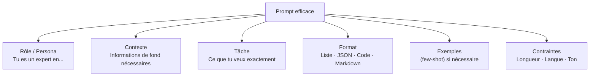

# Prompt Engineering

Le prompt engineering est l'art de formuler les instructions données à un LLM pour obtenir les réponses les plus précises, utiles et cohérentes. C'est une compétence clé pour exploiter les modèles de langage efficacement.

### Anatomie d'un Bon Prompt



**Principe fondamental** : soyez aussi précis qu'une spécification technique. Un humain qui ne connaît pas le contexte doit pouvoir exécuter la tâche en lisant votre prompt.

### Techniques Fondamentales

**Zero-shot** : demander directement sans exemples
```
Traduis ce texte en anglais : "Le soleil brille."
```

**Few-shot** : fournir des exemples pour guider le format ou le style
```
Classifie le sentiment (positif/négatif/neutre) :

"J'adore ce produit" → positif
"Livraison en retard" → négatif
"Le colis est arrivé" → neutre
"Ce service est fantastique" → ?
```

**Chain-of-Thought (CoT)** : demander de raisonner étape par étape
```
Résous ce problème étape par étape :
Si un train roule à 80 km/h et parcourt 240 km, combien de temps dure le trajet ?
```

**Zero-shot CoT** : ajouter "Pense étape par étape" ou "Let's think step by step"
- Améliore significativement le raisonnement arithmétique et logique

### Prompts Système vs Utilisateur

| Type | Rôle | Exemple |
|---|---|---|
| **System prompt** | Définit le comportement global du modèle | "Tu es un assistant juridique expert en droit français. Réponds toujours en citant tes sources." |
| **User message** | La requête de l'utilisateur | "Quelle est la durée de prescription d'une dette commerciale ?" |
| **Assistant message** | Réponse du modèle (peut être préfixée) | Utilisé dans le few-shot pour guider le style |

### Techniques Avancées

**Role prompting** : assigner un persona expert
```
Tu es un ingénieur senior spécialisé en sécurité des systèmes embarqués.
Analyse les risques de ce code C en termes de buffer overflow :
[code]
```

**Prompt chaining** : décomposer une tâche complexe en étapes
```
Étape 1 : Résume ce document en 5 points clés.
Étape 2 : Pour chaque point, génère une question de compréhension.
Étape 3 : Évalue les réponses à ces questions.
```

**Self-consistency** : générer plusieurs réponses et prendre la majorité
- Utile pour les problèmes de raisonnement où les LLM sont inconsistants

**ReAct (Reason + Act)** : alterner raisonnement et appel d'outils
```
Pensée : Je dois chercher le prix actuel de l'or.
Action : [search("prix or aujourd'hui")]
Observation : L'or est à 1950 $/oz.
Pensée : Maintenant je peux calculer...
```

### Paramètres de Génération

| Paramètre | Valeur | Effet |
|---|---|---|
| **Temperature** | 0 | Déterministe, toujours le token le plus probable |
| **Temperature** | 0,7 | Équilibre créativité/cohérence (défaut courant) |
| **Temperature** | 1,5+ | Très créatif, parfois incohérent |
| **Top-p** | 0,9 | Choisit parmi les tokens couvrant 90% de la probabilité |
| **Max tokens** | — | Limite la longueur de la réponse |
| **Stop sequences** | — | Arrêter la génération à certains tokens |

**Règle pratique** : pour des tâches factuelles → temperature basse (0-0.3). Pour des tâches créatives → temperature plus haute (0.7-1.0).

### Pièges Courants

**Prompt trop vague**
```
Mauvais : "Écris quelque chose sur Python."
Bon     : "Écris un tutoriel de 300 mots sur les list comprehensions Python pour débutants,
           avec 3 exemples progressifs en code."
```

**Demander plusieurs choses à la fois**
```
Mauvais : "Explique Docker, Kubernetes et compare-les avec des exemples."
Bon     : Trois prompts séparés, ou prompt chaîné avec étapes définies.
```

**Ne pas donner de format**
```
Mauvais : "Liste les avantages de Linux."
Bon     : "Liste 5 avantages de Linux pour les développeurs.
           Format : tableau markdown avec colonnes Avantage | Description | Exemple."
```

**Ignorer les contraintes de contexte** : les LLM ont des fenêtres de contexte limitées — envoyer trop de texte dégrade la qualité sur les dernières parties.

### Évaluation des Prompts

Un bon prompt se mesure à :
1. **Précision** : la réponse est-elle correcte ?
2. **Format** : respect du format demandé ?
3. **Consistance** : même résultat sur plusieurs runs ?
4. **Robustesse** : fonctionne avec des variations légères ?

Pour les applications en production, créer un **jeu d'évaluation** (eval set) : exemples d'inputs et outputs attendus pour mesurer les régressions lors des changements de prompt.
