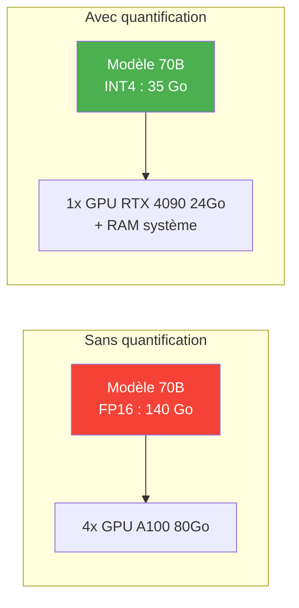
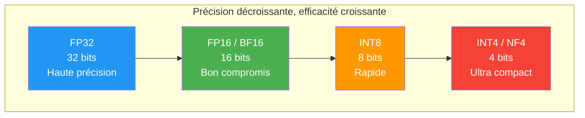
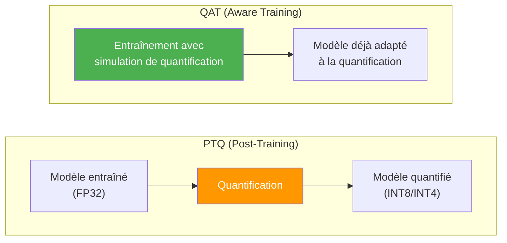

# Quantization (Quantification)

La **quantification** consiste à réduire la **précision numérique** des poids et activations d'un modèle (passer de 32-bit ou 16-bit à 8-bit, 4-bit, voire moins). L'objectif est de rendre les modèles plus **légers** et plus **rapides** sans trop perdre en performance.

## Pourquoi quantifier ?

Les grands modèles de langage (LLM) sont énormes :

| Modèle | Paramètres | Taille FP32 | Taille FP16 | Taille INT8 | Taille INT4 |
|--------|-----------|-------------|-------------|-------------|-------------|
| LLaMA 7B | 7 milliards | ~28 Go | ~14 Go | ~7 Go | ~3.5 Go |
| LLaMA 13B | 13 milliards | ~52 Go | ~26 Go | ~13 Go | ~6.5 Go |
| LLaMA 70B | 70 milliards | ~280 Go | ~140 Go | ~70 Go | ~35 Go |

La quantification rend possible l'exécution de ces modèles sur du **matériel grand public** (GPU gaming, CPU, appareils mobiles).

## Les formats de précision

### Représentation des nombres

| Format | Bits | Plage de valeurs | Utilisation |
|--------|:----:|-----------------|-------------|
| **FP32** (float32) | 32 | $\pm 3.4 \times 10^{38}$ | Entraînement classique |
| **FP16** (float16) | 16 | $\pm 6.5 \times 10^{4}$ | Entraînement mixte, inférence |
| **BF16** (bfloat16) | 16 | $\pm 3.4 \times 10^{38}$ | Entraînement (même plage que FP32) |
| **INT8** | 8 | -128 à 127 | Inférence quantifiée |
| **INT4** | 4 | -8 à 7 | Inférence très compressée |
| **NF4** (NormalFloat4) | 4 | Optimisé pour distributions normales | QLoRA |

## Types de quantification

### 1. Post-Training Quantization (PTQ)

Quantification **après** l'entraînement, sans ré-entraîner le modèle.

**Avantages :** rapide, ne nécessite pas de données d'entraînement
**Inconvénients :** perte de qualité plus importante, surtout en dessous de 8 bits

#### Quantification symétrique
Le zéro correspond exactement au zéro quantifié :
$$x_q = \text{round}\left(\frac{x}{s}\right), \quad s = \frac{\max(|x|)}{2^{b-1} - 1}$$

#### Quantification asymétrique
Utilise un offset (zero-point) pour mieux couvrir la plage de valeurs :
$$x_q = \text{round}\left(\frac{x - z}{s}\right), \quad s = \frac{\max(x) - \min(x)}{2^b - 1}$$

### 2. Quantization-Aware Training (QAT)

Simule la quantification **pendant** l'entraînement pour que le modèle s'adapte.

**Avantages :** meilleure qualité, le modèle apprend à compenser la perte de précision
**Inconvénients :** nécessite un ré-entraînement (coûteux pour les LLM)

## Méthodes populaires

### GPTQ (GPT Quantization)

- Méthode PTQ optimisée pour les **LLM**
- Quantifie les poids colonne par colonne en minimisant l'erreur de reconstruction
- Principalement **4-bit** et **8-bit**
- Nécessite un petit dataset de calibration (~128 exemples)
- Optimisé pour l'inférence sur **GPU**

### GGML / GGUF

- Format de quantification créé par **Georgi Gerganov** (llama.cpp)
- Optimisé pour l'inférence sur **CPU**
- Supporte plusieurs niveaux de quantification (Q2, Q3, Q4, Q5, Q6, Q8)
- Format **GGUF** : successeur de GGML, plus flexible et standardisé
- Permet d'exécuter des LLM sur des **ordinateurs portables** sans GPU

### AWQ (Activation-aware Weight Quantization)

- Observe que tous les poids ne sont pas **également importants**
- Protège les poids les plus critiques (ceux liés aux activations de grande magnitude)
- Souvent meilleur que GPTQ à la même taille de bits
- Rapide à appliquer

### bitsandbytes (Hugging Face)

- Librairie d'intégration simple pour la quantification **8-bit** et **4-bit**
- Utilisée pour **QLoRA**
- Quantification **NF4** (NormalFloat4) : format 4-bit optimisé pour les distributions normales des poids de réseaux de neurones

## Comparaison des méthodes

| Méthode | Bits | Cible | Vitesse d'inférence | Qualité | Facilité |
|---------|:----:|:-----:|:-------------------:|:-------:|:--------:|
| **GPTQ** | 4-8 | GPU | Très rapide | Bonne | Moyenne |
| **GGUF** | 2-8 | CPU | Bonne | Variable selon bits | Facile |
| **AWQ** | 4 | GPU | Très rapide | Très bonne | Moyenne |
| **bitsandbytes** | 4-8 | GPU | Rapide | Bonne | Très facile |

## Impact sur la qualité

La quantification entraîne une perte de qualité, mais elle est souvent **acceptable** :

| Quantification | Perte de qualité | Recommandation |
|:---:|---|---|
| FP16 | Négligeable | Standard pour l'inférence |
| INT8 | Très faible (~0.1-0.5% sur les benchmarks) | Excellent compromis |
| INT4 | Faible à modérée (~1-3%) | Bon pour les modèles > 7B |
| INT3/INT2 | Significative | Uniquement si ressources très limitées |

> **Règle générale :** plus un modèle est grand, mieux il tolère la quantification. Un modèle 70B en 4-bit sera souvent meilleur qu'un modèle 7B en 16-bit.

## Ressources

- [What are Quantized LLMs?](https://www.tensorops.ai/post/what-are-quantized-llms) — Introduction complète
- [llama.cpp](https://github.com/ggerganov/llama.cpp) — Inférence de LLM sur CPU avec GGUF
- [AutoGPTQ](https://github.com/AutoGPTQ/AutoGPTQ) — Quantification GPTQ automatisée
- [bitsandbytes](https://github.com/TimDettmers/bitsandbytes) — Quantification 4/8-bit pour PyTorch
