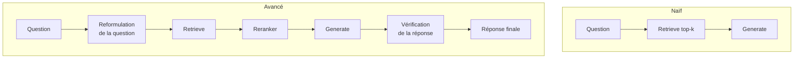
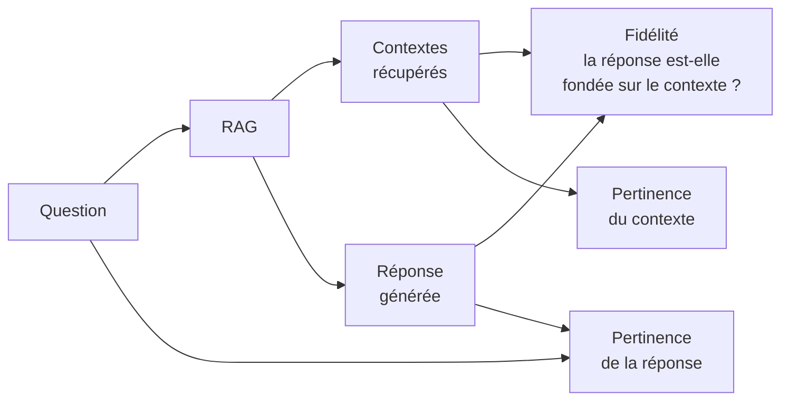

# RAG — Retrieval-Augmented Generation

Le RAG est une architecture qui augmente un LLM avec une base de connaissance externe, récupérée dynamiquement au moment de l'inférence. Il permet de répondre à des questions précises sur des documents que le LLM n'a pas vus pendant l'entraînement, sans nécessiter de fine-tuning.

## Problème résolu

Un LLM seul présente plusieurs limites :

| Problème | Description |
|---|---|
| Connaissance figée | Entraîné jusqu'à une date de coupure |
| Hallucinations | Invente des faits lorsqu'il ne sait pas |
| Absence de sources | Ne peut pas citer d'où vient l'information |
| Contexte limité | Ne peut pas ingérer toute une base documentaire |

Le RAG répond à ces problèmes en récupérant les passages pertinents *avant* de générer.

## Architecture générale

```mermaid
graph LR
    subgraph Indexation (offline)
        docs[Documents\nbruts] --> chunk[Chunking]
        chunk --> embed[Embedding\nModel]
        embed --> vdb[(Vector\nDatabase)]
    end

    subgraph Inférence (online)
        q[Question\nutilisateur] --> qembed[Embedding\nde la question]
        qembed --> search[Recherche\npar similarité]
        vdb --> search
        search --> ctx[Passages\npertinents]
        ctx --> prompt[Prompt\naugumented]
        q --> prompt
        prompt --> llm[LLM]
        llm --> rep[Réponse]
    end
```

## Étape 1 — Indexation

### Chunking

Les documents sont découpés en morceaux (chunks) pour correspondre aux fenêtres de contexte des modèles d'embedding.

| Stratégie | Description | Usage |
|---|---|---|
| Taille fixe | 512 tokens, overlap de 50 | Simple, baseline |
| Par phrase | Découpage au niveau sémantique | Meilleure cohérence |
| Par section | Utilise la structure (titres Markdown) | Documents structurés |
| Récursif | Divise jusqu'à taille cible | LangChain `RecursiveCharacterTextSplitter` |
| Sémantique | Regroupe par similarité | Meilleure qualité, plus coûteux |

**Overlap** : chevaucher les chunks (ex: 10-20%) évite de couper des informations à la frontière.

### Embedding

Chaque chunk est converti en vecteur dense par un modèle d'embedding :

```python
from sentence_transformers import SentenceTransformer

model = SentenceTransformer("all-MiniLM-L6-v2")
embeddings = model.encode(chunks)  # shape: (n_chunks, 384)
```

**Modèles courants :**
- `text-embedding-3-small` / `ada-002` (OpenAI)
- `all-MiniLM-L6-v2`, `all-mpnet-base-v2` (Sentence Transformers)
- `nomic-embed-text`, `bge-m3` (open source)

### Base vectorielle

Les vecteurs sont stockés dans une base vectorielle optimisée pour la recherche par similarité.

| Base | Type | Usage |
|---|---|---|
| FAISS | Bibliothèque in-memory | Prototypage, offline |
| ChromaDB | Local ou serveur | Développement |
| Weaviate | Open source distribué | Production |
| Pinecone | SaaS managé | Production cloud |
| pgvector | Extension PostgreSQL | Déjà sur Postgres |

## Étape 2 — Retrieval (Récupération)

### Recherche par similarité cosinus

```
similarité(A, B) = (A · B) / (‖A‖ × ‖B‖)
```

La question est encodée par le même modèle d'embedding, puis les k chunks les plus proches (top-k) sont récupérés.

### Stratégies avancées

**Hybrid search** : combine recherche vectorielle (sémantique) + BM25 (lexicale). Meilleur rappel lorsque les mots-clés exacts sont importants.

**MMR (Maximal Marginal Relevance)** : sélectionne des résultats diversifiés pour éviter les chunks redondants.

**Reranking** : un modèle de cross-encoder reclasse les candidats récupérés par pertinence fine (ex : `cross-encoder/ms-marco-MiniLM-L-6-v2`).

**HyDE (Hypothetical Document Embedding)** : le LLM génère d'abord une réponse hypothétique, puis on recherche les chunks proches de cette hypothèse plutôt que de la question brute.

## Étape 3 — Génération augmentée

Les chunks récupérés sont injectés dans le prompt :

```
Vous êtes un assistant expert. Répondez à la question en vous basant
uniquement sur les extraits fournis.

Extraits :
[1] {chunk_1}
[2] {chunk_2}
[3] {chunk_3}

Question : {question}

Réponse :
```

**Bonnes pratiques :**
- Indiquer au LLM de ne répondre que depuis les extraits ("grounding")
- Demander de citer la source (`[1]`, `[2]`)
- Ajouter `"Je ne sais pas"` comme réponse acceptable si non trouvé

## Architectures RAG avancées

### RAG naïf vs Avancé



### Self-RAG

Le LLM décide lui-même s'il a besoin de récupérer des informations, génère des critiques sur sa propre réponse, et itère.

### Agentic RAG

Un agent LLM orchestre plusieurs outils de retrieval (web search, base SQL, API) selon la nature de la question.

### FLARE (Forward-Looking Active Retrieval)

Génère token par token et déclenche un retrieval dès que le modèle exprime une incertitude (faible probabilité).

## Évaluation d'un système RAG



| Métrique | Description | Outil |
|---|---|---|
| Faithfulness | La réponse est-elle fondée sur les extraits ? | RAGAS |
| Answer Relevancy | La réponse répond-elle à la question ? | RAGAS |
| Context Precision | Les extraits récupérés sont-ils pertinents ? | RAGAS |
| Context Recall | Les extraits couvrent-ils la bonne réponse ? | RAGAS |

## Comparaison RAG vs Fine-tuning

| Critère | RAG | Fine-tuning |
|---|---|---|
| Mise à jour des données | Immédiate (réindexation) | Réentraînement nécessaire |
| Coût | Faible (inférence) | Élevé (GPU) |
| Transparence | Sources citables | Boîte noire |
| Hallucinations | Réduites (grounding) | Réduites (si données correctes) |
| Compétences comportementales | Non | Oui (format, ton, style) |
| Connaissances factuelles | Oui | Risque de mémorisation erronée |

**Règle pratique** : RAG pour les connaissances, fine-tuning pour les comportements.

## Limitations

- **Chunk-boundary problem** : une information coupée entre deux chunks peut ne jamais être récupérée entière
- **Out-of-context** : si la réponse nécessite de raisonner sur l'ensemble du corpus (pas un seul passage)
- **Qualité des embeddings** : un embedding faible produit un mauvais retrieval même avec un bon LLM
- **Latence** : deux étapes (retrieve + generate) ajoutent de la latence
