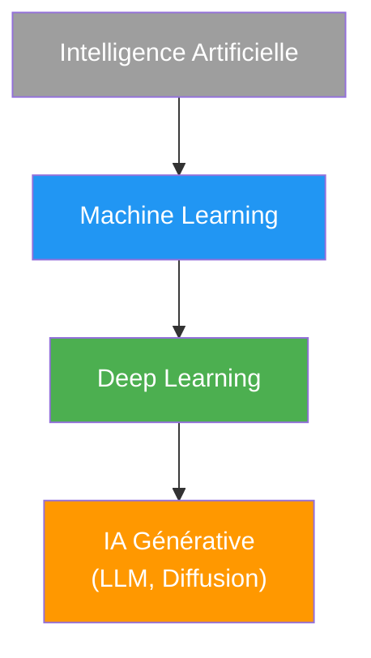
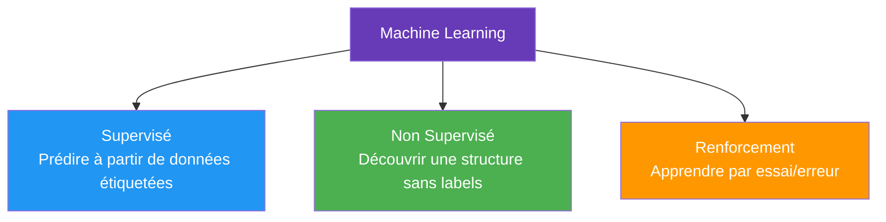
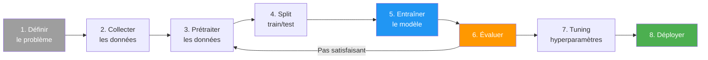

# Machine Learning

Note de synthèse du domaine Machine Learning : vue d'ensemble, workflow type, et point d'entrée vers les notes détaillées du vault. Pour le détail de chaque famille d'algorithmes ou d'architecture, suivre les liens plutôt que de chercher ici — cette note ne duplique pas leur contenu.

## Vue d'ensemble

Le Machine Learning (apprentissage automatique) est une branche de l'intelligence artificielle qui permet aux systèmes d'apprendre et de s'améliorer à partir de l'expérience sans être explicitement programmés.



## Types d'apprentissage



| Type | Principe | Note détaillée |
|---|---|---|
| Supervisé | Classification et régression, données étiquetées | [[Apprentissage Supervisé]] |
| Non supervisé | Clustering, réduction de dimension, détection d'anomalies | [[Apprentissage Non Supervisé]] |
| Par renforcement | Agent, récompenses, MDP, Q-Learning à PPO | [[Renforcement]] |

## Workflow Machine Learning



| Étape | Ce qu'il faut faire | Note détaillée |
|---|---|---|
| 1-2. Problème & données | Définir la tâche, la métrique de succès, collecter suffisamment de données de qualité | — |
| 3. Prétraitement | Nettoyage, valeurs manquantes, outliers, encodage, scaling, sélection de features | [[Feature Engineering et Prétraitement]] |
| 4. Split | `train_test_split`, stratification, split temporel si données séquentielles | [[Apprentissage Supervisé]] (Pipeline ML pratique) |
| 5. Entraînement | Choisir un algorithme adapté à la tâche | [[Apprentissage Supervisé]], [[Apprentissage Non Supervisé]] |
| 6. Évaluation | Accuracy, F1, ROC-AUC, RMSE, R²... selon la tâche | [[Métriques d'Évaluation]] |
| 7. Tuning | Grid Search, Random Search, Optuna | [[Apprentissage Supervisé]] (Recherche d'hyperparamètres) |
| 8. Déploiement | Sauvegarde, API, monitoring | Voir plus bas |

```python
from sklearn.model_selection import train_test_split
from sklearn.ensemble import RandomForestClassifier
from sklearn.metrics import accuracy_score

X_train, X_test, y_train, y_test = train_test_split(X, y, test_size=0.2, random_state=42)
model = RandomForestClassifier()
model.fit(X_train, y_train)
accuracy = accuracy_score(y_test, model.predict(X_test))
```

## Généralisation : overfitting, underfitting, biais-variance

Le compromis fondamental derrière la capacité d'un modèle à bien performer sur des données jamais vues — et les outils (régularisation, early stopping, dropout) pour le maîtriser — sont traités en détail dans [[Biais-Variance et Régularisation]].

## Algorithmes classiques

Chaque algorithme est détaillé avec formules, hyperparamètres et cas d'usage dans les notes dédiées :

| Famille | Algorithmes | Note |
|---|---|---|
| Linéaires / probabilistes | Régression Logistique, Naive Bayes, LDA | [[Apprentissage Supervisé]] |
| Voisinage / arbres | k-NN, Decision Trees, Random Forest | [[Apprentissage Supervisé]] |
| Marges | SVM | [[Apprentissage Supervisé]] |
| Boosting | XGBoost, LightGBM | [[Apprentissage Supervisé]] |
| Clustering | K-Means, DBSCAN, CAH | [[Apprentissage Non Supervisé]] |
| Réduction de dimension | PCA, t-SNE, UMAP, LDA | [[Apprentissage Non Supervisé]] |
| Réseaux de neurones | Perceptron, MLP, rétropropagation | [[Perceptron et Rétropropagation]] |

## Ensemble Methods

Combiner plusieurs modèles pour obtenir une prédiction plus robuste que chacun pris isolément :

| Méthode | Principe | Exemple |
|---|---|---|
| **Bagging** | Entraîner plusieurs modèles en parallèle sur des sous-échantillons aléatoires (bootstrap), moyenner/voter | Random Forest — voir [[Apprentissage Supervisé]] |
| **Boosting** | Entraîner des modèles séquentiellement, chacun corrigeant les erreurs du précédent | AdaBoost, XGBoost, LightGBM — voir [[Apprentissage Supervisé]] |
| **Stacking** | Entraîner un méta-modèle qui apprend à combiner les prédictions de plusieurs modèles de base | Combiner Random Forest + SVM + régression logistique |

```python
from sklearn.ensemble import StackingClassifier
from sklearn.linear_model import LogisticRegression
from sklearn.svm import SVC

estimators = [('rf', RandomForestClassifier()), ('svm', SVC())]
stacking = StackingClassifier(estimators=estimators, final_estimator=LogisticRegression())
```

## Deep Learning

Le dossier `DeepLearning/` couvre les architectures modernes en profondeur :

| Sujet | Note |
|---|---|
| Fondations : neurone, MLP, rétropropagation, optimiseurs | [[Perceptron et Rétropropagation]] |
| Images : convolutions, architectures célèbres | [[CNN]] |
| Détection, segmentation, ViT | [[Vision par Ordinateur]] |
| Séquences, attention | [[Transformers]] |
| Génératif | [[GAN]], [[Modèles de Diffusion]], [[Autoencoders]] |
| Graphes | [[Graph Neural Networks]] |
| Compression de modèles | [[Optimisation de Modèles]] |

Pour les grands modèles de langage spécifiquement, voir le dossier `LLM/` : [[LLM — Architectures et Fonctionnement]], [[Fine Tuning]], [[Quantization]], [[RAG]], [[Embeddings]], [[Agents LLM et Function Calling]], [[Prompt Engineering]].

## Bibliothèques Python

| Librairie | Utilisation |
|---|---|
| **NumPy / Pandas** | Calcul numérique, manipulation de données |
| **Matplotlib / Seaborn** | Visualisation |
| **Scikit-learn** | ML classique — algorithmes, preprocessing, model selection |
| **PyTorch** | Deep Learning, recherche et production |
| **TensorFlow / Keras** | Deep Learning, production et déploiement |
| **XGBoost / LightGBM** | Gradient boosting optimisé |
| **Hugging Face Transformers** | Modèles pré-entraînés NLP, vision, LLM |

## Bonnes pratiques

1. **Toujours splitter les données** (train/validation/test) avant tout prétraitement
2. **Fit le scaler/encoder uniquement sur le train**, jamais sur le test (data leakage — voir [[Feature Engineering et Prétraitement]])
3. **Commencer simple** — un modèle baseline avant d'optimiser
4. **Cross-valider** pour une estimation robuste de la performance
5. **Surveiller les métriques adaptées à la tâche**, pas seulement l'accuracy (voir [[Métriques d'Évaluation]])
6. **Documenter et versionner** — code (Git), données (DVC), expériences (MLflow, Weights & Biases)

## Déploiement de modèles

```python
import joblib

joblib.dump(model, 'model.pkl')
model = joblib.load('model.pkl')
```

```python
from flask import Flask, request, jsonify

app = Flask(__name__)

@app.route('/predict', methods=['POST'])
def predict():
    data = request.json
    prediction = model.predict([data['features']])
    return jsonify({'prediction': prediction[0]})
```

Au-delà du prototype : monitoring de la performance en production, détection de dérive des données (data drift), réentraînement périodique — sujet à part entière (MLOps) non encore couvert dans le vault.

## Liens

- [[Apprentissage Supervisé]] — classification, régression, tous les algorithmes classiques
- [[Apprentissage Non Supervisé]] — clustering, réduction de dimension, anomalies
- [[Renforcement]] — agents, MDP, Q-Learning, PPO
- [[Feature Engineering et Prétraitement]] — nettoyage, encodage, scaling, data leakage
- [[Métriques d'Évaluation]] — choisir la bonne métrique selon la tâche
- [[Fonctions de pertes]] — ce que les modèles minimisent réellement pendant l'entraînement
- [[Biais-Variance et Régularisation]] — diagnostiquer et corriger l'overfitting/underfitting
- [[Perceptron et Rétropropagation]] — fondations du deep learning
- [[Projets]] — idées de projets pour pratiquer
- [[Sites]] — cours, livres, datasets, plateformes de calcul
