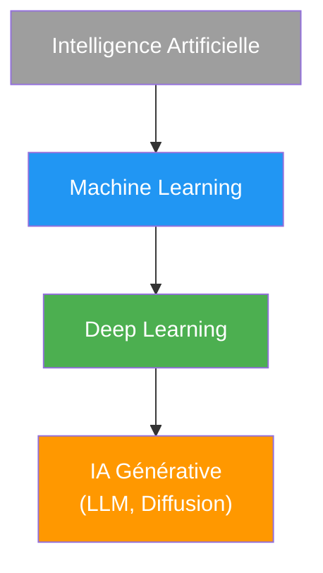
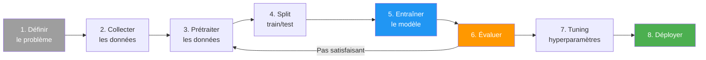
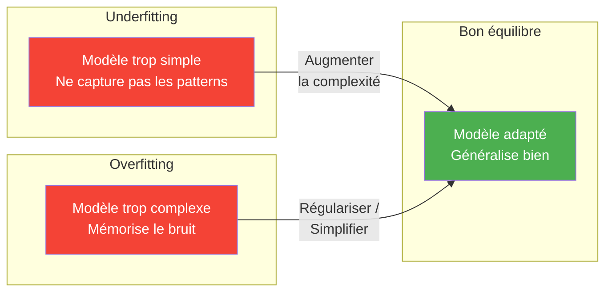

# Machine Learning

## Vue d'ensemble

Le Machine Learning (apprentissage automatique) est une branche de l'intelligence artificielle qui permet aux systèmes d'apprendre et de s'améliorer à partir de l'expérience sans être explicitement programmés.



## Types d'apprentissage

### Supervised Learning (Apprentissage Supervisé)

**Définition**
- Entraînement avec données labelisées
- Input → Output connu
- Apprend à prédire

**Types de problèmes**

*Classification*
- Catégories discrètes
- Exemples: Spam/Not spam, Cat/Dog
- Algorithmes: Logistic Regression, SVM, Decision Trees, Random Forest, Neural Networks

*Régression*
- Valeurs continues
- Exemples: Prix immobilier, température
- Algorithmes: Linear Regression, Polynomial Regression, Ridge/Lasso

### Unsupervised Learning (Apprentissage Non Supervisé)

**Définition**
- Pas de labels
- Découvrir patterns cachés
- Groupement et structure

**Types de problèmes**

*Clustering*
- Regroupement par similarité
- Algorithmes: K-Means, DBSCAN, Hierarchical Clustering

*Dimensionality Reduction*
- Réduction du nombre de features
- Algorithmes: PCA, t-SNE, UMAP

*Association*
- Règles d'association
- Exemple: Market basket analysis

### Reinforcement Learning (Apprentissage par Renforcement)

**Définition**
- Agent apprend par interaction
- Récompenses/pénalités
- Décisions séquentielles

**Exemples**
- Jeux (AlphaGo, Chess)
- Robotique
- Systèmes autonomes

## Workflow Machine Learning



### 1. Problem Definition

- Quel problème résoudre?
- Classification, Regression, Clustering?
- Métriques de succès?

### 2. Data Collection

- Sources de données
- Quantité suffisante
- Qualité des données

### 3. Data Preprocessing

**Cleaning**
```python
# Gestion des valeurs manquantes
df.fillna(df.mean())  # Moyenne
df.dropna()           # Supprimer

# Outliers
from scipy import stats
z_scores = np.abs(stats.zscore(df))
df = df[(z_scores < 3).all(axis=1)]
```

**Feature Engineering**
```python
# Encoding catégories
from sklearn.preprocessing import LabelEncoder, OneHotEncoder

# Scaling
from sklearn.preprocessing import StandardScaler, MinMaxScaler
scaler = StandardScaler()
X_scaled = scaler.fit_transform(X)
```

### 4. Split Data

```python
from sklearn.model_selection import train_test_split

X_train, X_test, y_train, y_test = train_test_split(
    X, y, test_size=0.2, random_state=42
)
```

### 5. Model Selection & Training

```python
from sklearn.ensemble import RandomForestClassifier

model = RandomForestClassifier()
model.fit(X_train, y_train)
```

### 6. Evaluation

```python
from sklearn.metrics import accuracy_score, confusion_matrix

y_pred = model.predict(X_test)
accuracy = accuracy_score(y_test, y_pred)
print(f"Accuracy: {accuracy}")
```

### 7. Hyperparameter Tuning

```python
from sklearn.model_selection import GridSearchCV

param_grid = {
    'n_estimators': [100, 200],
    'max_depth': [10, 20, 30]
}

grid_search = GridSearchCV(model, param_grid, cv=5)
grid_search.fit(X_train, y_train)
best_model = grid_search.best_estimator_
```

### 8. Deployment

- Save model
- API endpoint
- Monitoring

## Algorithmes Classiques

### Linear Regression

```python
from sklearn.linear_model import LinearRegression

model = LinearRegression()
model.fit(X_train, y_train)
predictions = model.predict(X_test)
```

### Logistic Regression

```python
from sklearn.linear_model import LogisticRegression

model = LogisticRegression()
model.fit(X_train, y_train)
```

### Decision Trees

```python
from sklearn.tree import DecisionTreeClassifier

model = DecisionTreeClassifier(max_depth=5)
model.fit(X_train, y_train)
```

### Random Forest

```python
from sklearn.ensemble import RandomForestClassifier

model = RandomForestClassifier(n_estimators=100)
model.fit(X_train, y_train)
```

### Support Vector Machines (SVM)

```python
from sklearn.svm import SVC

model = SVC(kernel='rbf')
model.fit(X_train, y_train)
```

### K-Nearest Neighbors (KNN)

```python
from sklearn.neighbors import KNeighborsClassifier

model = KNeighborsClassifier(n_neighbors=5)
model.fit(X_train, y_train)
```

### K-Means Clustering

```python
from sklearn.cluster import KMeans

kmeans = KMeans(n_clusters=3)
clusters = kmeans.fit_predict(X)
```

### Naive Bayes

```python
from sklearn.naive_bayes import GaussianNB

model = GaussianNB()
model.fit(X_train, y_train)
```

## Métriques d'évaluation

### Classification

**Accuracy**
```python
from sklearn.metrics import accuracy_score
accuracy = accuracy_score(y_true, y_pred)
```

**Precision, Recall, F1**
```python
from sklearn.metrics import precision_score, recall_score, f1_score

precision = precision_score(y_true, y_pred)
recall = recall_score(y_true, y_pred)
f1 = f1_score(y_true, y_pred)
```

**Confusion Matrix**
```python
from sklearn.metrics import confusion_matrix
cm = confusion_matrix(y_true, y_pred)
```

**ROC-AUC**
```python
from sklearn.metrics import roc_auc_score, roc_curve
auc = roc_auc_score(y_true, y_pred_proba)
```

### Régression

**MSE, RMSE**
```python
from sklearn.metrics import mean_squared_error
mse = mean_squared_error(y_true, y_pred)
rmse = np.sqrt(mse)
```

**MAE**
```python
from sklearn.metrics import mean_absolute_error
mae = mean_absolute_error(y_true, y_pred)
```

**R² Score**
```python
from sklearn.metrics import r2_score
r2 = r2_score(y_true, y_pred)
```

## Feature Engineering

### Feature Selection

```python
from sklearn.feature_selection import SelectKBest, f_classif

selector = SelectKBest(f_classif, k=10)
X_new = selector.fit_transform(X, y)
```

### Feature Importance

```python
# Random Forest
importances = model.feature_importances_
```

### Polynomial Features

```python
from sklearn.preprocessing import PolynomialFeatures

poly = PolynomialFeatures(degree=2)
X_poly = poly.fit_transform(X)
```

## Cross-Validation

```python
from sklearn.model_selection import cross_val_score

scores = cross_val_score(model, X, y, cv=5)
print(f"Mean score: {scores.mean()}")
```

## Ensemble Methods

### Bagging

```python
from sklearn.ensemble import BaggingClassifier

bagging = BaggingClassifier(base_estimator=DecisionTreeClassifier())
```

### Boosting

**AdaBoost**
```python
from sklearn.ensemble import AdaBoostClassifier

ada = AdaBoostClassifier()
```

**Gradient Boosting**
```python
from sklearn.ensemble import GradientBoostingClassifier

gb = GradientBoostingClassifier()
```

**XGBoost**
```python
import xgboost as xgb

model = xgb.XGBClassifier()
```

### Stacking

```python
from sklearn.ensemble import StackingClassifier

estimators = [
    ('rf', RandomForestClassifier()),
    ('svm', SVC())
]
stacking = StackingClassifier(estimators=estimators)
```

## Regularization

### L1 (Lasso)

```python
from sklearn.linear_model import Lasso

lasso = Lasso(alpha=0.1)
```

### L2 (Ridge)

```python
from sklearn.linear_model import Ridge

ridge = Ridge(alpha=0.1)
```

### Elastic Net

```python
from sklearn.linear_model import ElasticNet

elastic = ElasticNet(alpha=0.1, l1_ratio=0.5)
```

## Dimensionality Reduction

### PCA

```python
from sklearn.decomposition import PCA

pca = PCA(n_components=2)
X_pca = pca.fit_transform(X)
```

### t-SNE

```python
from sklearn.manifold import TSNE

tsne = TSNE(n_components=2)
X_tsne = tsne.fit_transform(X)
```

## Bibliothèques Python

### Core Libraries

**NumPy**
- Arrays et matrices
- Calculs numériques

**Pandas**
- Manipulation de données
- DataFrames

**Matplotlib / Seaborn**
- Visualisation

### ML Libraries

**Scikit-learn**
- Algorithmes classiques
- Preprocessing
- Model selection

**TensorFlow / Keras**
- Deep Learning
- Neural Networks

**PyTorch**
- Deep Learning
- Research-oriented

**XGBoost / LightGBM**
- Gradient Boosting optimisé

## Deep Learning Basics

### Neural Networks

```python
from tensorflow import keras

model = keras.Sequential([
    keras.layers.Dense(64, activation='relu'),
    keras.layers.Dense(32, activation='relu'),
    keras.layers.Dense(1, activation='sigmoid')
])

model.compile(
    optimizer='adam',
    loss='binary_crossentropy',
    metrics=['accuracy']
)

model.fit(X_train, y_train, epochs=10, batch_size=32)
```

### [[CNN]] (Convolutional Neural Networks)

- Image classification
- Computer vision

### RNN (Recurrent Neural Networks)

- Séquences temporelles
- NLP

### [[Transformers]]

- State of the art NLP
- BERT, GPT

## Problèmes communs



### Overfitting

**Symptômes**
- Haute performance sur train
- Basse performance sur test

**Solutions**
- Plus de données
- Regularization
- Cross-validation
- Simplifier le modèle
- Dropout (Neural Networks)

### Underfitting

**Symptômes**
- Basse performance partout

**Solutions**
- Modèle plus complexe
- Plus de features
- Moins de regularization

### Imbalanced Data

**Solutions**
```python
from imblearn.over_sampling import SMOTE

smote = SMOTE()
X_resampled, y_resampled = smote.fit_resample(X, y)
```

## Best Practices

1. **Always split data** (train/validation/test)
2. **Scale features** quand nécessaire
3. **Handle missing values** avant training
4. **Cross-validate** pour robustesse
5. **Start simple** puis complexifier
6. **Monitor metrics** pendant training
7. **Save models** pour réutilisation
8. **Version data & models**

## Model Deployment

### Save/Load Models

```python
import joblib

# Save
joblib.dump(model, 'model.pkl')

# Load
model = joblib.load('model.pkl')
```

### API with Flask

```python
from flask import Flask, request, jsonify

app = Flask(__name__)

@app.route('/predict', methods=['POST'])
def predict():
    data = request.json
    prediction = model.predict([data['features']])
    return jsonify({'prediction': prediction[0]})
```

## Ressources

### Cours
- Andrew Ng - Machine Learning (Coursera)
- Fast.ai - Practical Deep Learning
- Kaggle Learn

### Livres
- Hands-On Machine Learning (Géron)
- Pattern Recognition and Machine Learning (Bishop)
- The Elements of Statistical Learning

### Pratique
- Kaggle Competitions
- UCI ML Repository
- Google Dataset Search
