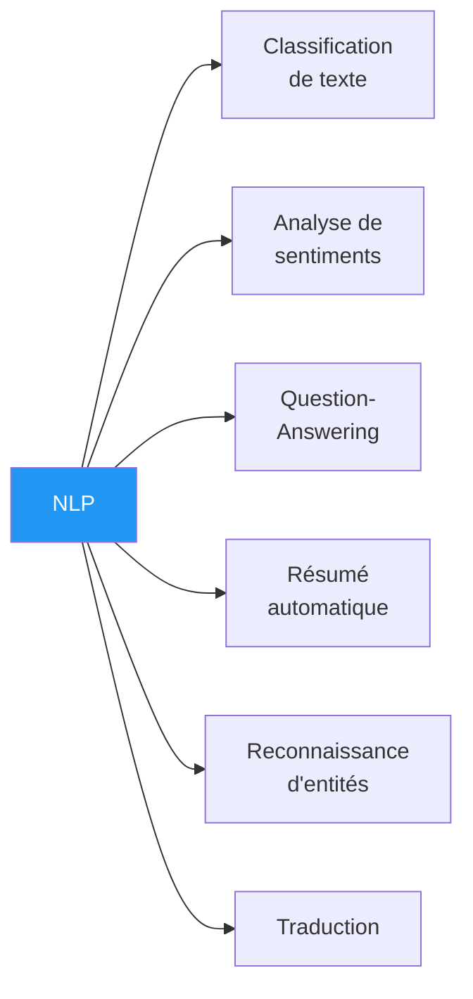
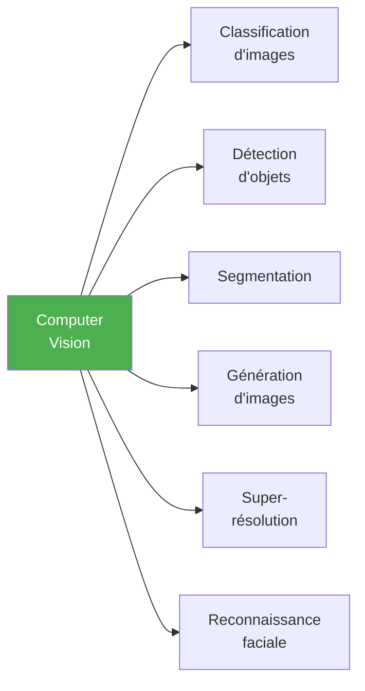

# Projets Machine Learning

Idées de projets classées par domaine et par difficulté pour mettre en pratique les concepts de Machine Learning.

## Projets par niveau

### Débutant

| Projet | Domaine | Techniques | Dataset suggéré |
|--------|---------|------------|-----------------|
| Classifieur de spam | NLP | Naive Bayes, TF-IDF | [SMS Spam Collection](https://archive.ics.uci.edu/dataset/228/sms+spam+collection) |
| Prédiction de prix immobilier | Régression | Linear/Polynomial Regression | [Boston Housing](https://www.kaggle.com/c/boston-housing) |
| Classification de fleurs Iris | Classification | KNN, Decision Tree | [Iris Dataset](https://archive.ics.uci.edu/dataset/53/iris) |
| Analyse de sentiments | NLP | Logistic Regression, BOW | [IMDB Reviews](https://ai.stanford.edu/~amaas/data/sentiment/) |
| Prédiction de survie Titanic | Classification | Random Forest, SVM | [Kaggle Titanic](https://www.kaggle.com/c/titanic) |

### Intermédiaire

| Projet | Domaine | Techniques | Dataset suggéré |
|--------|---------|------------|-----------------|
| Détection de chiffres manuscrits | Vision | [[CNN]], LeNet | [MNIST](http://yann.lecun.com/exdb/mnist/) |
| Système de recommandation de films | RecSys | Collaborative Filtering, SVD | [MovieLens](https://grouplens.org/datasets/movielens/) |
| Prédiction de séries temporelles (actions) | Finance | LSTM, ARIMA | [Yahoo Finance API](https://finance.yahoo.com/) |
| Classification d'images (chats vs chiens) | Vision | [[CNN]], [[Fine Tuning\|Transfer Learning]] (ResNet) | [Kaggle Cats vs Dogs](https://www.kaggle.com/c/dogs-vs-cats) |
| Détection de fraude | Classification | XGBoost, SMOTE | [Credit Card Fraud](https://www.kaggle.com/datasets/mlg-ulb/creditcardfraud) |
| Clustering de clients | [[Apprentissage Non Supervisé\|Non supervisé]] | K-Means, DBSCAN, PCA | [Mall Customers](https://www.kaggle.com/datasets/vjchoudhary7/customer-segmentation-tutorial) |

### Avancé

| Projet | Domaine | Techniques | Dataset suggéré |
|--------|---------|------------|-----------------|
| Détection d'objets en temps réel | Vision | YOLO, Faster R-CNN | [COCO](https://cocodataset.org/) |
| Chatbot question-réponse | NLP | [[Transformers]], BERT, [[Fine Tuning]] | [SQuAD](https://rajpurkar.github.io/SQuAD-explorer/) |
| Génération d'images | Vision | [[GAN]], [[Modèles de Diffusion\|Diffusion]] | [CelebA](https://mmlab.ie.cuhk.edu.hk/projects/CelebA.html) |
| Segmentation d'images médicales | Médecine | U-Net, [[Pyramid Attention Module\|Attention]] | [ISIC Skin Lesion](https://www.isic-archive.com/) |
| Agent jouant à un jeu Atari | [[Renforcement\|RL]] | DQN, PPO | [OpenAI Gymnasium](https://gymnasium.farama.org/) |
| [[Fine Tuning\|Fine-tuning]] d'un LLM | NLP | LoRA, QLoRA | Dataset personnalisé |

## Projets par domaine

### Natural Language Processing (NLP)

- **Classification de texte** : spam, catégorisation d'articles, détection de langue
- **Analyse de sentiments** : avis clients, tweets, commentaires
- **Question-Answering** : chatbots, assistants virtuels
- **Résumé automatique** : résumer des documents, articles
- **NER** : extraire noms, dates, lieux, organisations d'un texte
- **Traduction** : traduction automatique entre langues

### Vision par ordinateur

- **Classification** : diagnostic médical, contrôle qualité industriel, reconnaissance de plantes
- **Détection** : conduite autonome, surveillance, comptage de foule
- **Segmentation** : imagerie satellite, cartographie, imagerie médicale
- **Génération** : art IA, colorisation, inpainting
- **Super-résolution** : amélioration de photos, restauration d'images anciennes

### Médecine et biologie

- **Imagerie médicale** : détection d'anomalies en radiologie (CT, IRM, rayons X)
- **Pathologie** : comptage de caractéristiques dans les lames histologiques
- **Échographie** : mesure automatique de features
- **Protéines** : prédiction de repliement (AlphaFold), classification
- **Génomique** : séquençage tumeur-normal, mutations actionnables

### Autres domaines

- **Systèmes de recommandation** : produits, films, musique, articles
- **Jeux** : échecs, Go, jeux Atari, jeux de stratégie
- **Robotique** : manipulation d'objets, navigation
- **Finance** : prévisions, détection de fraude, scoring de crédit
- **Logistique** : optimisation de routes, prévision de demande

## Conseils pour réussir un projet ML

1. **Commencer simple** — un modèle baseline avant d'optimiser
2. **Comprendre les données** — explorer, visualiser, nettoyer avant de modéliser
3. **Définir une métrique claire** — accuracy, F1, RMSE, etc.
4. **Itérer** — améliorer progressivement plutôt que viser la perfection d'emblée
5. **Documenter** — noter ses expériences, paramètres, résultats
6. **Versionner** — utiliser Git pour le code, DVC pour les données
