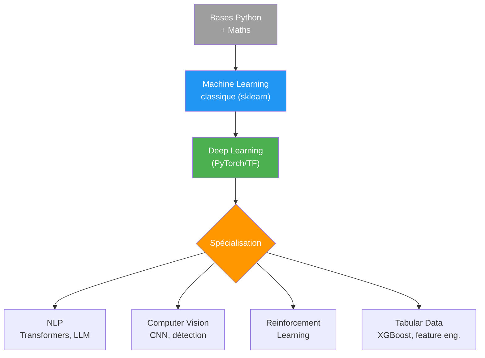

# Ressources Machine Learning

Sélection de ressources pour apprendre et pratiquer le Machine Learning.

## Cours en ligne

| Cours | Plateforme | Niveau | Langue |
|-------|-----------|--------|--------|
| [Machine Learning Specialization](https://www.coursera.org/specializations/machine-learning-introduction) — Andrew Ng | Coursera | Débutant | EN |
| [Deep Learning Specialization](https://www.coursera.org/specializations/deep-learning) — Andrew Ng | Coursera | Intermédiaire | EN |
| [Practical Deep Learning for Coders](https://course.fast.ai/) | fast.ai | Intermédiaire | EN |
| [Introduction to Machine Learning](https://www.kaggle.com/learn/intro-to-machine-learning) | Kaggle Learn | Débutant | EN |
| [Hugging Face NLP Course](https://huggingface.co/learn/nlp-course) | Hugging Face | Intermédiaire | EN |
| [Machine Learning — France Université Numérique](https://www.fun-mooc.fr/) | FUN-MOOC | Débutant | FR |
| [Stanford CS229 — Machine Learning](https://cs229.stanford.edu/) | Stanford | Avancé | EN |
| [Stanford CS231n — Convolutional Neural Networks](https://cs231n.stanford.edu/) | Stanford | Avancé | EN |

## Livres

| Livre | Auteur | Focus |
|-------|--------|-------|
| *Hands-On Machine Learning with Scikit-Learn, Keras, and TensorFlow* | Aurélien Géron | Pratique, code Python |
| *Pattern Recognition and Machine Learning* | Christopher Bishop | Théorie mathématique |
| *The Elements of Statistical Learning* | Hastie, Tibshirani, Friedman | Statistique avancée |
| *Deep Learning* | Ian Goodfellow et al. | Fondements du deep learning |
| *Understanding Deep Learning* | Simon Prince | Deep learning moderne (gratuit en PDF) |
| *Dive into Deep Learning* | Aston Zhang et al. | Interactif, code (gratuit) |

## Datasets

| Source | Description |
|--------|-------------|
| [Kaggle Datasets](https://www.kaggle.com/datasets) | Des milliers de datasets communautaires |
| [UCI ML Repository](https://archive.ics.uci.edu/) | Datasets classiques pour la recherche |
| [Google Dataset Search](https://datasetsearch.research.google.com/) | Moteur de recherche de datasets |
| [Hugging Face Datasets](https://huggingface.co/datasets) | Focus NLP et LLM |
| [Papers With Code — Datasets](https://paperswithcode.com/datasets) | Datasets liés aux publications |
| [COCO](https://cocodataset.org/) | Vision : détection, segmentation |
| [ImageNet](https://www.image-net.org/) | Classification d'images (référence) |

## Outils et frameworks

### Librairies Python essentielles

| Librairie | Utilisation |
|-----------|-------------|
| **scikit-learn** | ML classique (classification, régression, clustering) |
| **PyTorch** | Deep Learning (recherche et production) |
| **TensorFlow / Keras** | Deep Learning (production, déploiement) |
| **XGBoost / LightGBM** | Gradient boosting (compétitions, tabular data) |
| **Hugging Face Transformers** | NLP, LLM, vision (modèles pré-entraînés) |
| **Pandas / NumPy** | Manipulation de données |
| **Matplotlib / Seaborn** | Visualisation |

### Outils d'expérimentation

| Outil | Description |
|-------|-------------|
| [Weights & Biases](https://wandb.ai/) | Tracking d'expériences, visualisation |
| [MLflow](https://mlflow.org/) | Gestion du cycle de vie ML |
| [DVC](https://dvc.org/) | Versionnement de données et modèles |
| [Optuna](https://optuna.org/) | Optimisation d'hyperparamètres |

### Plateformes de calcul

| Plateforme | GPU gratuit ? | Notes |
|------------|:---:|-------|
| [Google Colab](https://colab.research.google.com/) | Oui (limité) | Jupyter dans le cloud |
| [Kaggle Notebooks](https://www.kaggle.com/code) | Oui (30h/semaine) | GPU T4 / P100 |
| [Lightning AI](https://lightning.ai/) | Oui (crédits) | Studios de développement |
| [Lambda Labs](https://lambdalabs.com/) | Non | GPU cloud performant |

## Compétitions et pratique

| Plateforme | Description |
|------------|-------------|
| [Kaggle Competitions](https://www.kaggle.com/competitions) | Compétitions ML, communauté active |
| [DrivenData](https://www.drivendata.org/) | Compétitions à impact social |
| [Zindi](https://zindi.africa/) | Compétitions data science pour l'Afrique |

## Communautés

| Communauté | Plateforme |
|------------|-----------|
| [r/MachineLearning](https://www.reddit.com/r/MachineLearning/) | Reddit |
| [r/learnmachinelearning](https://www.reddit.com/r/learnmachinelearning/) | Reddit (débutants) |
| [Hugging Face Forums](https://discuss.huggingface.co/) | Forum |
| [Papers With Code](https://paperswithcode.com/) | Articles + code |
| [Arxiv Sanity](https://arxiv-sanity-lite.com/) | Veille sur les publications ML |

## Roadmap suggérée

