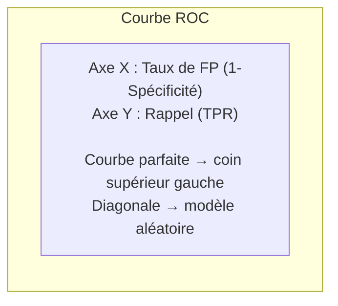
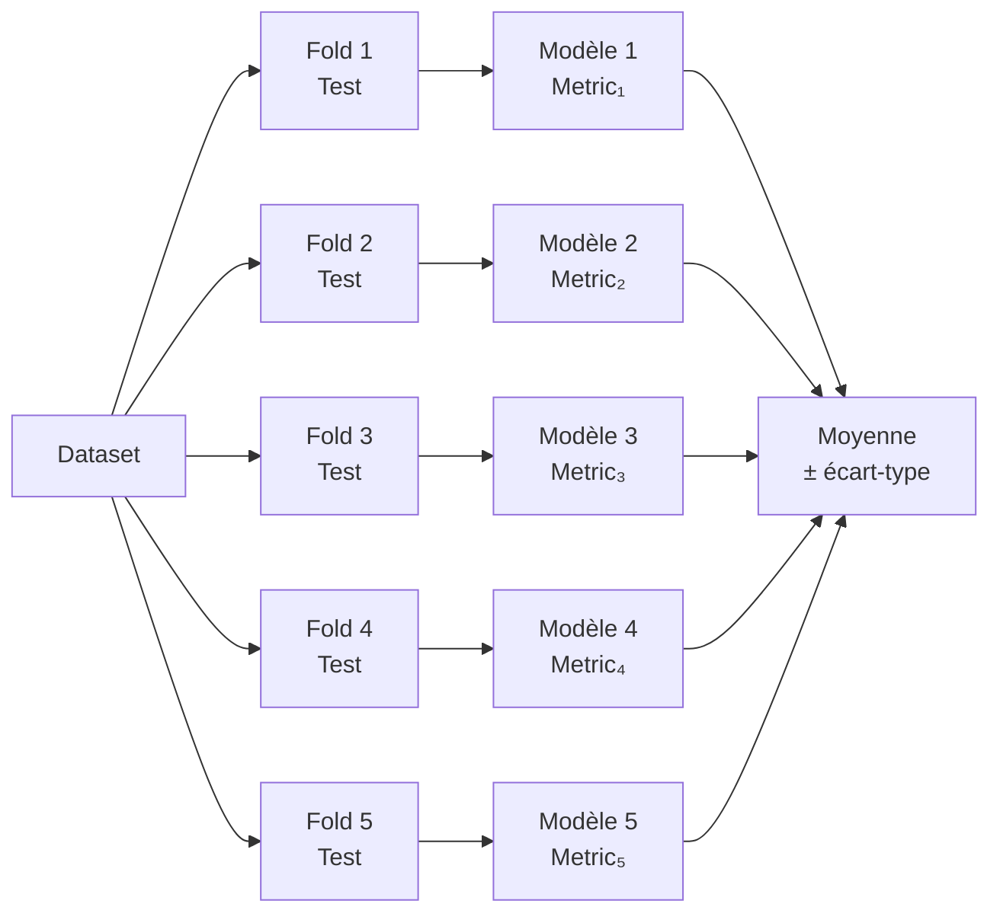
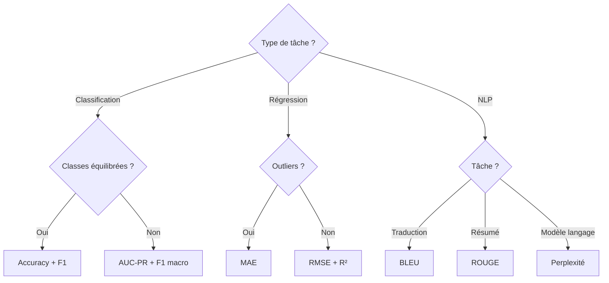

# Métriques d'Évaluation en Machine Learning

Le choix de la bonne métrique est aussi important que le choix du modèle. Une mauvaise métrique peut conduire à optimiser le mauvais objectif.

## Classification

### Matrice de confusion

Base de toutes les métriques de classification binaire :

```
                    Prédit Positif    Prédit Négatif
Réel Positif            TP                FN
Réel Négatif            FP                TN
```

- **TP (Vrai Positif)** : prédit positif, c'est correct
- **TN (Vrai Négatif)** : prédit négatif, c'est correct
- **FP (Faux Positif, erreur de type I)** : prédit positif à tort (fausse alarme)
- **FN (Faux Négatif, erreur de type II)** : manqué un positif (omission)

### Métriques dérivées

**Accuracy (Exactitude)**
```
Accuracy = (TP + TN) / (TP + TN + FP + FN)
```
*Problème* : trompeuse sur les données déséquilibrées. 99% d'accuracy si on prédit toujours la classe majoritaire à 99%.

**Précision**
```
Précision = TP / (TP + FP)
```
"Parmi ce que j'ai prédit positif, combien le sont vraiment ?"
Optimiser quand les faux positifs sont coûteux (spam → ne pas mettre des vrais mails en spam).

**Rappel (Recall / Sensibilité)**
```
Rappel = TP / (TP + FN)
```
"Parmi tous les vrais positifs, combien ai-je détectés ?"
Optimiser quand les faux négatifs sont coûteux (cancer → ne pas manquer un malade).

**F1-Score**
```
F1 = 2 × (Précision × Rappel) / (Précision + Rappel)
```
Moyenne harmonique de la précision et du rappel. Pénalise fortement si l'un des deux est très faible.

**Fβ-Score** : version pondérée. β=2 donne plus de poids au rappel ; β=0.5 à la précision.

**Spécificité**
```
Spécificité = TN / (TN + FP)
```
"Parmi les vrais négatifs, combien ai-je correctement identifiés ?" (opposé du rappel)

### Courbe ROC et AUC

La courbe ROC (Receiver Operating Characteristic) illustre le compromis Rappel / Taux de faux positifs en faisant varier le seuil de décision.



**AUC (Area Under the Curve)** : aire sous la courbe ROC.

| AUC | Interprétation |
|---|---|
| 1.0 | Modèle parfait |
| 0.9 - 1.0 | Excellent |
| 0.8 - 0.9 | Bon |
| 0.7 - 0.8 | Acceptable |
| 0.5 | Modèle aléatoire |
| < 0.5 | Pire qu'aléatoire |

**Interprétation probabiliste** : AUC = probabilité qu'un exemple positif tiré aléatoirement soit mieux classé qu'un négatif.

### Courbe Précision-Rappel (PR Curve)

Préférée à la ROC quand les classes sont très déséquilibrées (peu de positifs). L'AUC-PR est plus informative dans ce cas.

### Classification multiclasse

**Macro-average** : moyenne des métriques par classe, sans pondération. Traite toutes les classes également.
**Weighted-average** : pondère par le nombre d'exemples par classe.
**Micro-average** : agrège tous les TP, FP, FN avant de calculer.

```python
from sklearn.metrics import classification_report
print(classification_report(y_true, y_pred))
# Donne précision, rappel, f1 par classe + moyennes
```

## Régression

### MSE — Mean Squared Error
```
MSE = (1/n) × Σ(yᵢ - ŷᵢ)²
```
Pénalise fortement les grandes erreurs (carré). Sensible aux outliers.

### RMSE — Root Mean Squared Error
```
RMSE = √MSE
```
Même unité que la variable cible. Plus interprétable.

### MAE — Mean Absolute Error
```
MAE = (1/n) × Σ|yᵢ - ŷᵢ|
```
Plus robuste aux outliers. Erreur moyenne absolue.

### R² (Coefficient de détermination)
```
R² = 1 - (Σ(yᵢ - ŷᵢ)²) / (Σ(yᵢ - ȳ)²)
```
"Quelle proportion de la variance est expliquée par le modèle ?"

| R² | Interprétation |
|---|---|
| 1.0 | Parfait |
| 0.8+ | Bon |
| 0.5 | Modèle médiocre |
| 0 | Équivalent à prédire la moyenne |
| < 0 | Pire que la moyenne |

### MAPE — Mean Absolute Percentage Error
```
MAPE = (100/n) × Σ|yᵢ - ŷᵢ| / |yᵢ|
```
Erreur relative en %. Problème : indéfini si yᵢ = 0.

| Tâche | Métriques recommandées |
|---|---|
| Régression standard | RMSE + R² |
| Présence d'outliers | MAE |
| Prévision (erreur relative) | MAPE, SMAPE |
| Comparaison multi-modèles | R² |

## Métriques NLP

### BLEU (Bilingual Evaluation Understudy)

Mesure la correspondance n-gramme entre la traduction générée et les références.

```
BLEU = BP × exp(Σ wₙ × log pₙ)
```

- pₙ : précision des n-grammes (n=1,2,3,4)
- BP : brevity penalty (pénalise les réponses trop courtes)
- wₙ : poids (généralement 1/4 chacun)

**Interprétation :**

| BLEU | Interprétation (traduction) |
|---|---|
| > 40 | Qualité proche de l'humain |
| 30-40 | Bonne traduction |
| 20-30 | Compréhensible |
| < 20 | Mauvaise qualité |

**Limitations** : ne capture pas le sens, sensible à la formulation exacte.

### ROUGE (Recall-Oriented Understudy for Gisting Evaluation)

Mesure le rappel des n-grammes. Utilisé pour le résumé automatique.

- **ROUGE-1** : uni-grammes (mots)
- **ROUGE-2** : bi-grammes
- **ROUGE-L** : sous-séquence commune la plus longue (LCS)

```
ROUGE-N Rappel    = n-grammes communs / n-grammes de la référence
ROUGE-N Précision = n-grammes communs / n-grammes du résumé généré
ROUGE-N F1        = moyenne harmonique
```

### Perplexité

Mesure à quel point un modèle de langage "est surpris" par un texte.

```
Perplexité = exp(-1/N × Σ log P(wᵢ | contexte))
```

- Perplexité faible → modèle assigne des probabilités élevées aux bons mots
- Comparable seulement sur le même vocabulaire et tokenizer
- GPT-3 : ~20 sur WikiText-103

### BERTScore

Utilise les embeddings de BERT pour mesurer la similarité sémantique entre le texte généré et la référence. Plus robuste que BLEU/ROUGE car insensible aux paraphrases.

## Métriques de clustering

**Silhouette Score** : mesure la cohésion intra-cluster vs séparation inter-cluster.
- Valeur entre -1 et 1 (1 = clusters parfaits, 0 = chevauchement, -1 = mauvaise affectation)

**Inertie (WCSS)** : somme des distances au centroïde (méthode du coude pour K-Means).

**Adjusted Rand Index (ARI)** : comparaison avec les vrais labels, corrigé pour le hasard.

## Validation croisée



**K-Fold** : divise en K parties, entraîne sur K-1, teste sur 1.
**Stratified K-Fold** : préserve les proportions de classes dans chaque fold.
**Leave-One-Out (LOO)** : K = n, très coûteux mais sans biais.

```python
from sklearn.model_selection import StratifiedKFold, cross_val_score

skf = StratifiedKFold(n_splits=5, shuffle=True, random_state=42)
scores = cross_val_score(model, X, y, cv=skf, scoring='f1_macro')
print(f"F1: {scores.mean():.3f} ± {scores.std():.3f}")
```

## Choisir la bonne métrique


