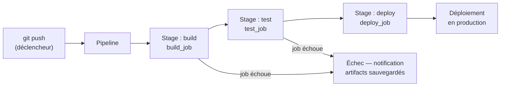

# GitLab CI/CD

GitLab CI/CD est un outil intégré à GitLab pour l'intégration et le déploiement continus. Il repose sur un fichier `.gitlab-ci.yml` à la racine du dépôt.



#### Introduction

GitLab CI/CD est un composant intégré de GitLab qui permet de gérer les processus de build, test et déploiement de vos projets logiciels. Il repose sur un fichier de configuration `.gitlab-ci.yml` situé à la racine de votre dépôt.

#### 1. Configuration de Base
##### 1.3. Fichier .gitlab-ci.yml de Base

Voici un exemple simple de fichier `.gitlab-ci.yml` :

```yaml
stages:
  - build
  - test
  - deploy

build_job:
  stage: build
  script:
    - echo "Building the project..."

test_job:
  stage: test
  script:
    - echo "Running tests..."

deploy_job:
  stage: deploy
  script:
    - echo "Deploying the project..."
```

#### 2. Variables et Secrets

##### 2.1. Définir des Variables

Les variables peuvent être définies dans le fichier `.gitlab-ci.yml` ou dans les paramètres du projet.

```yaml
variables:
  ENV: "production"
  DB_NAME: "my_database"
```

##### 2.2. Utiliser des Variables

```yaml
deploy_job:
  stage: deploy
  script:
    - echo "Deploying to $ENV environment..."
    - echo "Using database $DB_NAME..."
```

##### 2.3. Masquer des Variables

Les variables sensibles (comme les tokens API) peuvent être ajoutées dans les paramètres de projet sous **Settings > CI/CD > Variables** et marquées comme "Protected" ou "Masked".

#### 3. Artifacts et Caches

##### 3.1. Artifacts

Les artifacts sont des fichiers générés par les jobs et transférés entre eux.

```yaml
build_job:
  stage: build
  script:
    - mkdir build
    - echo "Build output" > build/output.txt
  artifacts:
    paths:
      - build/
    expire_in: 1 hour
```

##### 3.2. Caches

Les caches sont utilisés pour accélérer les builds en stockant des fichiers comme les dépendances.

```yaml
cache:
  paths:
    - node_modules/
    - .m2/repository
```

#### 4. Pipelines Multi-Branches

Vous pouvez configurer des pipelines spécifiques pour différentes branches.

```yaml
deploy_job:
  stage: deploy
  script:
    - echo "Deploying to production..."
  only:
    - master
  except:
	- dev
```

#### 5. Before script and After script
```yaml
before_script:
  - echo "This is before script"

after_script:
  - echo "This is after script"
```

#### 5.1. Matrice de Jobs

La matrice de jobs permet d'exécuter un job plusieurs fois avec différentes configurations.

```yaml
test_job:
  stage: test
  script:
    - echo "Running tests on $DB"
  variables:
    DB: "mysql"
  parallel:
    matrix:
      - DB: ["mysql", "postgres", "sqlite"]
```

#### 6. Jobs Dépendants et Environnements

##### 6.1. Dépendances

Les jobs peuvent dépendre d'autres jobs.

```yaml
deploy_job:
  stage: deploy
  script:
    - echo "Deploying..."
  needs:
    - build_job
    - test_job
```

##### 6.2. Environnements

Vous pouvez spécifier des environnements pour vos déploiements.

```yaml
deploy_job:
  stage: deploy
  script:
    - echo "Deploying to production..."
  environment:
    name: production
    url: http://production.example.com
```

#### 7. Avancées et Bonnes Pratiques

##### 7.1. Utiliser des Templates

Pour réutiliser des configurations communes :

```yaml
include:
  - local: '/templates/.gitlab-ci-template.yml'
```

##### 7.2. Optimiser les Pipelines

- **Pipeline Caching** : Utilisez des caches pour éviter de re-télécharger des dépendances.
- **Pipeline Artifacts** : Utilisez des artifacts pour transférer des fichiers entre jobs.
- **Pipeline Stages** : Divisez les pipelines en stages logiques (build, test, deploy).

##### 7.3. Gestion des Erreurs

Utilisez `allow_failure` pour permettre à certains jobs d'échouer sans interrompre tout le pipeline.

```yaml
test_job:
  stage: test
  script:
    - echo "Running tests..."
  allow_failure: true
```


##### 7.4. Runners Spécifiques

Pour des tâches spécifiques, configurez différents types de runners (Docker, Shell, Kubernetes).

#### Conclusion

GitLab CI/CD offre une grande flexibilité et des capacités puissantes pour automatiser vos workflows de développement. En utilisant les fonctionnalités de base et avancées décrites dans ce tutoriel, vous pouvez configurer des pipelines robustes et efficaces pour votre projet.

N'oubliez pas de consulter la [documentation officielle de GitLab CI/CD](https://docs.gitlab.com/ee/ci/) pour des informations plus détaillées et des exemples supplémentaires.
