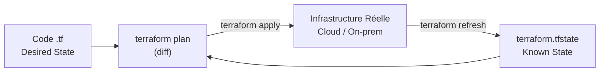

# Terraform — State et Workspaces

Le **state** est le cœur de Terraform : il mappe les ressources déclarées dans le code aux ressources réelles dans le cloud. Comprendre le state est indispensable pour travailler en équipe et éviter les catastrophes.

### Le State Terraform

**Qu'est-ce que le state ?**
- Fichier `terraform.tfstate` (JSON) — enregistre l'état réel de l'infrastructure
- Terraform compare le code (desired state) au state (known state) pour calculer le plan
- Sans state : Terraform ne sait pas ce qui existe déjà



**Risques si le state est mal géré** :
- Deux personnes appliquent simultanément → corruption du state
- State en local → perdu si la machine disparaît
- State contient des secrets (mots de passe, tokens) → ne pas committer dans git

### Remote State (Recommandé en Équipe)

Stocker le state dans un backend distant pour le partager et le verrouiller.

**Backend S3 (AWS)**
```hcl
terraform {
  backend "s3" {
    bucket         = "mon-bucket-terraform-state"
    key            = "prod/terraform.tfstate"
    region         = "eu-west-1"
    encrypt        = true
    dynamodb_table = "terraform-lock"   # Verrouillage concurrent
  }
}
```

**Autres backends courants** :
- **Terraform Cloud / HCP Terraform** : solution officielle HashiCorp
- **Azure Blob Storage**
- **GCS (Google Cloud Storage)**
- **GitLab Managed State**

### Commandes State

```bash
# Lister les ressources dans le state
terraform state list

# Inspecter une ressource
terraform state show aws_instance.my_server

# Importer une ressource existante dans le state
terraform import aws_instance.my_server i-1234567890abcdef0

# Déplacer une ressource (renommage refactoring)
terraform state mv aws_instance.old_name aws_instance.new_name

# Supprimer du state sans détruire la ressource réelle
terraform state rm aws_instance.my_server
```

### Workspaces

Les workspaces permettent de gérer plusieurs environnements (dev, staging, prod) avec le même code.

```bash
# Lister les workspaces
terraform workspace list

# Créer et basculer vers un workspace
terraform workspace new staging
terraform workspace select prod

# Workspace courant
terraform workspace show
```

**Utilisation dans le code** :
```hcl
resource "aws_instance" "app" {
  instance_type = terraform.workspace == "prod" ? "t3.large" : "t3.micro"
  tags = {
    Environment = terraform.workspace
  }
}
```

**Limites des workspaces** :
- Partagent le même code et backend — pas une isolation totale
- Pour de vraies séparations prod/dev, préférer des **répertoires distincts** ou des **comptes AWS séparés**

### Gestion des Secrets

**Ne jamais** mettre des secrets en clair dans les fichiers `.tf` ou dans le state committé.

**Bonnes pratiques** :
- Variables d'environnement : `TF_VAR_db_password=xxx`
- AWS Secrets Manager / HashiCorp Vault : récupérer les secrets au runtime
- Fichier `.tfvars` dans `.gitignore`

```hcl
variable "db_password" {
  type      = string
  sensitive = true   # Cache la valeur dans les logs terraform plan/apply
}

data "aws_secretsmanager_secret_version" "db" {
  secret_id = "prod/db/password"
}
```

### Structure de Projet Recommandée

```
projet-terraform/
├── modules/
│   ├── vpc/
│   │   ├── main.tf
│   │   ├── variables.tf
│   │   └── outputs.tf
│   └── ec2/
├── environments/
│   ├── dev/
│   │   ├── main.tf
│   │   └── terraform.tfvars
│   └── prod/
│       ├── main.tf
│       └── terraform.tfvars
└── .gitignore   # contient : *.tfstate, *.tfstate.backup, .terraform/, *.tfvars
```
