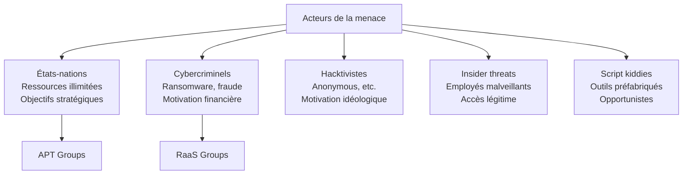
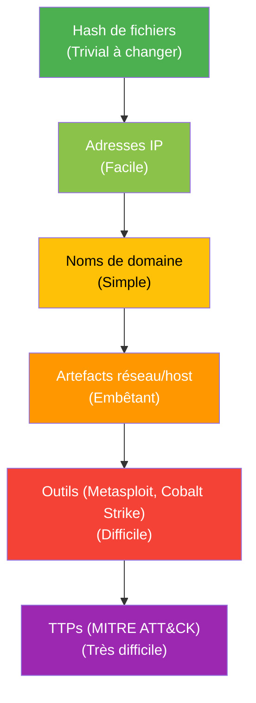

# APT et Acteurs de la Menace

Les APT (Advanced Persistent Threats) sont des acteurs sophistiqués — généralement étatiques — qui conduisent des campagnes d'espionnage ou de sabotage sur le long terme. Connaître leurs TTPs permet d'orienter la détection et les investissements de sécurité.

## Classification des acteurs



## Nomenclature

Chaque vendor utilise sa propre nomenclature pour les mêmes groupes :

| Origine | Microsoft | Mandiant | CrowdStrike | MITRE |
|---|---|---|---|---|
| Russie | Midnight Blizzard | APT29 | Cozy Bear | G0016 |
| Russie | Forest Blizzard | APT28 | Fancy Bear | G0007 |
| Chine | Volt Typhoon | APT41 | Wicked Panda | G0096 |
| Corée du Nord | Sapphire Sleet | APT38 | Lazarus | G0032 |
| Iran | Mint Sandstorm | APT35 | Charming Kitten | G0059 |

## Groupes APT majeurs

### APT29 — Cozy Bear (Russie / SVR)

**Attributé à :** Service de renseignement extérieur russe (SVR)

**Victimes :** Gouvernements occidentaux, pense-tanks, partis politiques, industrie pharmaceutique

**Opérations notables :**
- SolarWinds (2020) : compromission de la supply chain, 18 000 clients affectés dont DoJ, Treasury, DHS US
- Hack du Comité National Démocrate (2016)
- Campagnes COVID-19 (vol de recherche vaccinale, 2020)
- Microsoft (2024) : accès aux emails d'executives pendant plusieurs mois

**TTPs caractéristiques :**
```
T1195 Supply Chain Compromise       → SolarWinds Orion
T1078 Valid Accounts                → Credentials volés longue durée
T1566 Phishing                      → Spear phishing très ciblé
T1027 Obfuscated Files              → Malwares très sophistiqués
T1090 Proxy / Tor                   → Infrastructure complexe
T1550 Use Alternate Auth Material   → Pass-the-cookie, token theft
```

**Outils :** SUNBURST, TEARDROP, MagicWeb, FOGGYWEB, WellMess

### APT28 — Fancy Bear (Russie / GRU)

**Attributé à :** Direction du renseignement militaire russe (GRU)

**Victimes :** Organisations politiques, militaires, médias, sports (antidopage WADA)

**Opérations notables :**
- NotPetya (2017) : cyberattaque destructrice déguisée en ransomware, 10 Md$ de dommages
- Ingérence élections françaises (2017) : "Macron Leaks"
- Attaque TV5Monde (2015)

**TTPs caractéristiques :**
```
T1566 Spear Phishing               → Emails très ciblés, CVEs zero-day
T1203 Client Execution             → Exploit documents Office
T1055 Process Injection
T1071 Application Layer Protocol  → C2 via HTTP/HTTPS, OneDrive
```

**Outils :** X-Agent (Sofacy), Fancy Bear Implant, CHOPSTICK, GAMEFISH

### Lazarus Group / APT38 (Corée du Nord / RGB)

**Attributé à :** Bureau général de reconnaissance (RGB), sous Kim Jong-un

**Motivation principale : financière** (financement du programme nucléaire) + espionnage

**Opérations notables :**
- Bangladesh Bank Heist (2016) : 81 M$ volés via SWIFT
- Sony Pictures Hack (2014) : sabotage, fuite de données massives
- WannaCry (2017) : ransomware mondial (150 pays)
- Ronin Bridge Hack (2022) : 625 M$ volés en crypto
- Campagnes de phishing LinkedIn (emplois "Dream Job") ciblant les ingénieurs crypto

**TTPs :**
```
T1199 Trusted Relationship         → Compromission de partenaires/prestataires
T1486 Data Encrypted for Impact    → Ransomware destructeur
T1560 Archive Collected Data       → Exfiltration massive avant chiffrement
T1659 Content Injection            → Compromission de chaînes d'approvisionnement
```

### APT41 — Double Dragon (Chine / MSS)

**Particularité :** Combine espionnage étatique et cybercriminalité personnelle (vol de jeux vidéo).

**Victimes :** Santé, télécoms, technologie, jeux vidéo, finance, gouvernements

**Opérations notables :**
- Ingérence électorale US (2020) : tentative via logiciels de campagne
- Exploitation de vulnérabilités 0-day dans Citrix, Cisco, Zoho
- Campagnes COVID-19 (vol données vaccin AstraZeneca)

**TTPs :**
```
T1190 Exploit Public-Facing App    → 0-day systématique sur VPN/Citrix
T1133 External Remote Services     → Exploitation VPN Pulse Secure
T1078 Valid Accounts               → Comptes fournisseurs compromis
T1071 C2 via DNS/HTTPS
```

### Volt Typhoon (Chine / PLA)

Groupe actif depuis 2021, axé sur le **pre-positioning** dans les infrastructures critiques US (énergie, eau, transports, communications) en vue d'une crise potentielle (Taïwan).

**Caractéristique unique :** Living-off-the-land (LOTL) — utilise uniquement les outils natifs Windows pour éviter la détection.

```
Outils natifs utilisés :
- wmic (WMI)
- ntdsutil (extraction AD)
- netsh (configuration réseau)
- cmdkey (credentials cachés)
- Makecab (archivage discret)
- Net commands (énumération)
```

## Pyramid of Pain

Concept de David Bianco : plus un IOC est haut dans la pyramide, plus il est difficile à changer pour l'attaquant.



**Implication pratique :** Construire des règles de détection basées sur les TTPs est plus résilient que bloquer des IP/hashs qui changent quotidiennement.

## Ransomware-as-a-Service (RaaS)

Les groupes criminels modernes opèrent comme des entreprises.

```mermaid
graph LR
    dev[Développeurs\n(core team)\ncréent le malware\n+ infrastructure]
    aff[Affiliés\nconductent les\nattaques]
    vic[Victimes]
    ransom[Rançon payée]

    dev -->|Loue le ransomware| aff
    aff -->|Attaque| vic
    vic -->|Paye| ransom
    ransom -->|70-80%| aff
    ransom -->|20-30%| dev
```

| Groupe | Rançon moyenne | Victimes notables | Statut |
|---|---|---|---|
| LockBit | 1-50 M$ | Royal Mail, Boeing | Démantelé 2024 (Opération Cronos) |
| BlackCat/ALPHV | 1-50 M$ | MGM Resorts, Reddit | Démantelé 2023/2024 |
| Clop | 10-100 M$ | MOVEit (2023 : 2000+ entreprises) | Actif |
| REvil/Sodinokibi | 5-70 M$ | Kaseya (2021), JBS | Démantelé 2022 |
| Play | Variable | Rackspace, Oakland | Actif |

**Double extorsion :** Vol des données AVANT chiffrement → menace de publication même si rançon refusée.
**Triple extorsion :** Ajoute DDoS sur le site de la victime pour augmenter la pression.

## Threat Intelligence — Application pratique

### MITRE ATT&CK Navigator

Outil de visualisation des techniques par groupe :

```
1. Aller sur attack.mitre.org/groups/G0016  (APT29)
2. Voir toutes les techniques documentées
3. Comparer avec ses propres capacités de détection
4. Identifier les angles morts (techniques sans règle de détection)
```

### Enrichissement des IOCs

```python
# Vérifier un hash sur VirusTotal (API)
import requests

def check_virustotal(hash_value):
    url = f"https://www.virustotal.com/api/v3/files/{hash_value}"
    headers = {"x-apikey": VT_API_KEY}
    r = requests.get(url, headers=headers)
    if r.status_code == 200:
        stats = r.json()["data"]["attributes"]["last_analysis_stats"]
        return stats["malicious"], stats["total"]
    return None

# Enrichir une IP avec AbuseIPDB
def check_abuseipdb(ip):
    url = "https://api.abuseipdb.com/api/v2/check"
    r = requests.get(url, headers={"Key": ABUSE_API_KEY},
                     params={"ipAddress": ip, "maxAgeInDays": 90})
    return r.json()["data"]["abuseConfidenceScore"]
```

### Partage de renseignement

| Plateforme | Type | Usage |
|---|---|---|
| **MISP** | Open source | Partage IOCs interne et avec partenaires |
| **OpenCTI** | Open source | Gestion de la Threat Intelligence |
| **ISAC** | Sectoriels | FS-ISAC (finance), H-ISAC (santé)... |
| **FIRST** | International | Coordination CERT/CSIRT |
| **TAXII/STIX** | Protocole/Format | Échange automatisé de TI |
