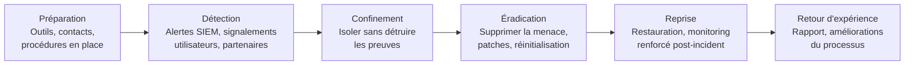

# Playbooks de Réponse à Incident

Un playbook IR est une procédure tactique step-by-step pour répondre à un type d'incident spécifique. Il standardise les actions, réduit le temps de réponse et évite les oublis sous stress.

## Phases générales (NIST SP 800-61)



## Playbook 1 — Ransomware

### Indicateurs de compromission

```
Alertes SIEM :
- Volumes massifs de modifications de fichiers (renomme en .locked, .encrypt...)
- Processus créant/modifiant des milliers de fichiers en peu de temps
- Suppression des Volume Shadow Copies : vssadmin.exe delete shadows /all
- Lecture de fichiers de backup + chiffrement
- Comportement de type "double extorsion" : exfiltration avant chiffrement

Comportements suspects :
- Fichiers README_DECRYPT.txt ou similaires
- Extensions de fichiers inconnues
- Services AD ou sauvegardes inaccessibles
- Ralentissement extrême des serveurs de fichiers
```

### Actions immédiates (0-30 min)

```
1. CONFIRMER l'incident
   → Isoler une machine affectée et examiner les fichiers
   → Identifier l'extension des fichiers chiffrés
   → Vérifier : https://www.nomoreransom.org/ (décrypteur disponible ?)

2. ACTIVER la cellule de crise
   → Décisionnaires, RSSI, DSI, communication, juridique
   → Canal de communication hors réseau (Signal, téléphone)

3. ISOLER — sans éteindre les machines (préserver la RAM)
   → Déconnecter du réseau (débrancher câble Ethernet / désactiver WiFi)
   → NE PAS éteindre → perte des clés en mémoire si chiffrement symétrique
   → Bloquer les communications C2 au niveau firewall (si IP connue)
   → Désactiver les VPNs et accès distants

4. IDENTIFIER le périmètre
   → Quelles machines sont chiffrées ? Quelles données ?
   → L'AD est-il compromis ?
   → Les sauvegardes sont-elles intactes ?
```

### Investigation (30 min - 4h)

```bash
# Identifier le patient zéro (première machine infectée)
# Chercher dans les logs SIEM le premier événement anormal

# Sur une machine isolée (via Velociraptor ou collecte forensique)
# Volatility — analyser la mémoire
volatility3 -f memory.raw windows.pslist.PsList
volatility3 -f memory.raw windows.cmdline.CmdLine
volatility3 -f memory.raw windows.netscan.NetScan

# Identifier le vecteur d'entrée
# - Email de phishing (chercher dans les logs mail)
# - RDP exposé (logs Event 4624/4625)
# - VPN credentials compromis
# - Exploit d'une app exposée

# Event logs Windows
# 4648 : Logon avec credentials explicites
# 4698 : Tâche planifiée créée
# 7045 : Nouveau service installé
# 4104 : Exécution de PowerShell
wevtutil qe Security /q:"*[System[EventID=4648]]" /f:text
```

### Éradication et reprise

```
1. ÉRADICATION
   → Réinitialiser le compte krbtgt 2× (si AD compromis → Golden Ticket)
   → Changer tous les mots de passe (surtout comptes admin)
   → Appliquer les patches manquants
   → Supprimer les backdoors identifiées (tâches planifiées, services, clés Run)

2. REPRISE
   → Restaurer depuis une sauvegarde saine et antérieure à l'infection
   → Vérifier l'intégrité des sauvegardes (hash)
   → Démarrer par les systèmes critiques
   → Monitoring renforcé 72h post-reprise

3. DÉCISION : payer ou ne pas payer ?
   → Ne garantit pas la récupération des données
   → Finance les opérations criminelles
   → Peut exposer à des sanctions (OFAC si groupe sanctionné)
   → Décision légale et stratégique, pas technique
```

## Playbook 2 — Compromission de compte (Account Takeover)

### Indicateurs

```
- Login depuis pays inhabituel
- Login à heure inhabituelle (3h du matin)
- Plusieurs tentatives échouées puis succès (brute force réussi)
- Accès à des ressources inhabituelles après login
- Règles de redirection email créées
- Applications OAuth nouvellement autorisées
- Changement de password ou MFA sans demande utilisateur
```

### Actions

```bash
# 1. CONFIRMER et contenir
# Désactiver immédiatement le compte compromis
# Azure AD
Disable-AzureADUser -ObjectId user@domain.com

# Active Directory
Disable-ADAccount -Identity username
# Ou GUI : ADUC → clic droit → Disable Account

# 2. Révoquer toutes les sessions actives
# Azure AD — révoquer tous les refresh tokens
Revoke-AzureADUserAllRefreshToken -ObjectId user@domain.com

# 3. Collecter les preuves avant désactivation
# Logs d'accès des 30 derniers jours
# Applications OAuth autorisées
# Règles de boîte mail (forwardage potentiel)
Get-InboxRule -Mailbox user@domain.com

# 4. INVESTIGUER
# Quel vecteur ? Phishing, credential stuffing, MFA bypass ?
# Quelles données ont été consultées ?
# Y a-t-il eu des mouvements latéraux ?

# 5. REMÉDIER
# Réinitialiser le mot de passe avec un mot de passe fort temporaire
# Forcer l'inscription MFA (FIDO2 si possible)
# Auditer les applications OAuth autorisées
# Vérifier les règles de redirection mail
# Notifier l'utilisateur et le sensibiliser
```

## Playbook 3 — Data Breach (Fuite de données)

### Critères de qualification

```
Fuite confirmée si :
- Données trouvées sur pastebins, forums, dark web
- Accès non autorisé à une base de données confirmé par logs
- Exfiltration détectée (DLP, logs firewall sortant)
- Signalement externe (journaliste, partenaire, CERT)
```

### Actions légales et réglementaires

```
RGPD — Article 33/34 :
→ Notification à la CNIL dans les 72h si risque pour les personnes
→ Notification aux personnes concernées si risque élevé
→ Documenter même si la notification n'est pas requise

Éléments à documenter pour la CNIL :
- Nature de la violation (nature des données, catégories, volume)
- Conséquences probables
- Mesures prises ou envisagées
- Contact du DPO

# Template de notification rapide
Incident ID : [ID]
Date de détection : [DATE]
Nature des données : [ex: emails, mots de passe hashés, adresses]
Nombre de personnes concernées : [N]
Vecteur probable : [ex: SQL injection sur api.exemple.com]
Mesures immédiates : [ex: base de données isolée, patch appliqué]
```

### Investigation technique

```bash
# Identifier quelles données ont été exfiltrées
# Logs de la base de données (requêtes volumineuses inhabituelles)
# Logs réseau (grand volume de données sortantes)

# Sur MySQL/PostgreSQL — activer l'audit (post-incident)
# Vérifier les exports récents
SHOW PROCESSLIST;  -- Connexions actives
SELECT * FROM information_schema.processlist WHERE time > 60;

# Chercher les signes de SQLi dans les logs Apache/Nginx
grep -i "UNION\|SELECT\|DROP\|INSERT" /var/log/nginx/access.log

# Vérifier les exfiltrations DNS (DNS tunneling)
# Pic de requêtes DNS vers des domaines inhabituels
```

## Playbook 4 — Accès non autorisé (Insider Threat)

### Comportements suspects

```
- Accès à des fichiers hors de son périmètre métier
- Téléchargements massifs avant une démission/licenciement
- Accès en dehors des heures de travail habituelles
- Utilisation de supports amovibles (USB)
- Envoi d'emails avec pièces jointes volumineuses vers boîte perso
- Utilisation de services de partage non autorisés (Dropbox, WeTransfer)
```

### Actions

```
1. Documenter sans alerter (surveillance discrète)
2. Collecter les preuves légalement (logs, DLP)
3. Impliquer les RH et le service juridique dès le début
4. En cas de départ confirmé : révoquer tous les accès simultanément
5. Auditer les accès des 30-90 jours précédents
```

## Communication de crise

```
Parties prenantes à notifier (selon l'incident) :

Interne :
→ Direction / COMEX (immédiatement si critique)
→ Équipes IT/sécurité
→ Communication interne (préparer les messages employés)
→ Service juridique

Externe :
→ ANSSI (si OIV/OSE)
→ CNIL (si données personnelles, 72h)
→ Assureur cyber
→ Prestataire IR externe si nécessaire
→ Clients/partenaires affectés
→ Presse (via communication, pas technique)

À NE PAS FAIRE :
→ Communiquer les détails techniques publiquement pendant l'incident
→ Minimiser la gravité (crédibilité)
→ Payer sans consulter le juridique
→ Éteindre les machines sans capturer la mémoire
→ Effacer des logs (obstruction)
```

## Retour d'expérience (REX)

Structure du rapport post-incident :

```
1. Résumé exécutif (1 page)
   - Chronologie
   - Impact business
   - Coût estimé

2. Chronologie technique détaillée
   - T0 : compromission initiale
   - T+X : progression de l'attaque
   - T+Y : détection
   - T+Z : confinement

3. Analyse des causes racines
   - Vecteur d'entrée
   - Pourquoi n'a-t-on pas détecté plus tôt ?
   - Pourquoi a-t-on mis N heures à confiner ?

4. Plan d'amélioration
   - Actions correctives (avec responsable et deadline)
   - Mesures préventives
   - Formation à prévoir
```
