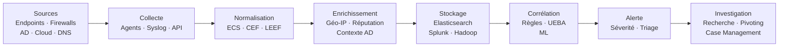

# SIEM (Security Information and Event Management)

Un SIEM centralise, normalise et corrèle les événements de sécurité provenant de sources hétérogènes pour détecter les menaces et faciliter la réponse. C'est le cerveau du SOC.

## Fonctions fondamentales



1. **Collecte** : ingérer les logs depuis des centaines de sources (agents, syslog, API, S3)
2. **Normalisation** : convertir les formats disparates en un schéma commun (ECS, CEF, LEEF)
3. **Enrichissement** : ajouter du contexte (géolocalisation IP, réputation, info utilisateur AD)
4. **Stockage** : indexation pour la recherche rapide (Elasticsearch, Hadoop, objet cloud)
5. **Corrélation** : détecter des patterns multi-sources dans le temps
6. **Alerte** : notifier les analystes selon les règles déclenchées
7. **Investigation** : interface de recherche et de pivoting pour les analystes

## Architecture typique

```
Endpoints (Sysmon, EDR)   ┐
Firewalls / IPS           ├── Collecteurs (Beats, NXLog, Fluentd)
Proxies web               │         ↓
Authentification (AD)     ├── Message Queue (Kafka, Redis)
Applications métier       │         ↓
Cloud (CloudTrail, GCP)   ┘   Indexation (Elasticsearch, Splunk)
                                      ↓
                            Corrélation & Règles de détection
                                      ↓
                            Dashboard / Alertes / Case Management
```

## Sources de logs prioritaires

| Source | Événements clés | Format courant |
|---|---|---|
| Active Directory / LDAP | Auth (4624/4625), créations comptes, groupes | Windows Event Log |
| Endpoints (Sysmon) | Création processus, réseau, fichiers, registre | Windows Event Log |
| Firewall / IPS | Connexions bloquées/autorisées, signatures | CEF, syslog |
| Proxy web | URLs, user-agents, volumes transférés | W3C, JSON |
| DNS | Requêtes, réponses NXDOMAIN | syslog, Zeek |
| VPN | Connexions, déconnexions, durées | syslog |
| Cloud (AWS) | Actions API, changements IAM, accès S3 | JSON (CloudTrail) |
| Serveurs web | Accès, erreurs 4xx/5xx | Combined Log Format |
| EDR | Comportements malveillants, IOCs | API propriétaire |

## Normalisation et schémas

### ECS (Elastic Common Schema)

Schéma universel utilisé par la suite Elastic. Chaque événement a des champs standardisés :

```json
{
  "@timestamp": "2024-01-15T10:23:00.000Z",
  "event": {
    "category": ["authentication"],
    "type": ["start"],
    "outcome": "failure"
  },
  "user": { "name": "alice", "domain": "CORP" },
  "source": { "ip": "192.168.1.100", "geo": { "country_name": "France" } },
  "host": { "name": "WS-ALICE", "os": { "name": "Windows" } },
  "process": { "name": "svchost.exe", "pid": 1234 }
}
```

## Règles de corrélation

### Règles simples (threshold)

```
RÈGLE : Brute Force SSH
SI : 5 échecs de connexion (EventCode=4625) sur le même compte
     dans une fenêtre de 60 secondes
     depuis la même IP source
ALORS : Alerte MEDIUM — "Potential brute force on account {user}"
```

### Règles multi-étapes (séquences)

```
RÈGLE : Compromission de compte suivi d'accès inhabituel
ÉTAPE 1 : Succès d'auth depuis une IP jamais vue (4624)
ÉTAPE 2 : Dans les 15 minutes, accès à un partage sensible (5140)
ÉTAPE 3 : Exécution d'un processus inhabituel (4688)
→ Alerte HIGH — "Potential account takeover"
```

### Exemples de règles Splunk (SPL)

```sql
-- Règle : succès après plusieurs échecs (credential stuffing réussi)
index=windows EventCode=4625
| bucket _time span=5m
| stats count as failures by _time, src_ip, user
| where failures >= 5
| join user [
    search index=windows EventCode=4624
    | rename src_ip as success_ip
    ]
| where src_ip=success_ip
| alert

-- Règle : connexion depuis un pays inhabituel
index=windows EventCode=4624
| iplocation src_ip
| stats values(Country) as pays by user
| where NOT (pays="France" OR pays="")
| table user, pays

-- Règle : processus avec connexion réseau sortante sur port non standard
index=windows EventCode=3
| where NOT (DestinationPort=80 OR DestinationPort=443 OR DestinationPort=53)
| where NOT (Image="*chrome.exe" OR Image="*firefox.exe")
| table _time, ComputerName, Image, DestinationIp, DestinationPort
```

## Gestion des faux positifs

Un SIEM non maintenu génère un volume d'alertes qui noie les vrais incidents — c'est l'**alert fatigue**.

### Stratégies de réduction

```
Whitelisting   : exclure les IPs/comptes/processus légitimes connus
Tuning         : ajuster les seuils selon le comportement réel de l'entreprise
Agrégation     : regrouper 100 alertes identiques en 1 incident
Scoring        : pondérer les alertes selon le contexte (criticité de l'asset, heure)
Enrichissement : ajouter le contexte pour éliminer les FP en amont
```

### Métriques de qualité

| Métrique | Objectif | Calcul |
|---|---|---|
| MTTD (Mean Time to Detect) | < 24h | Temps entre compromission et première alerte |
| MTTR (Mean Time to Respond) | < 4h | Temps entre alerte et confinement |
| True Positive Rate | > 80% | TP / (TP + FP) |
| False Positive Rate | < 20% | FP / (FP + TN) |
| Taux de fermeture | > 95% | Alertes traitées / alertes totales |

## Solutions SIEM du marché

| Produit | Type | Points forts |
|---|---|---|
| **Splunk** | Commercial | Langage SPL puissant, vaste écosystème d'apps |
| **Microsoft Sentinel** | Cloud (Azure) | Intégration native Microsoft 365, KQL |
| **IBM QRadar** | Commercial | Corrélation avancée, UEBA intégré |
| **Elastic SIEM** | Open core | ECS, flexibilité, coût maîtrisé |
| **Wazuh** | Open source | Léger, HIDS + SIEM, idéal PME |
| **Chronicle (Google)** | Cloud (GCP) | Rétention longue durée, UDM |

## Règles de corrélation — bonnes pratiques

- **Documenter** chaque règle : objectif, sources requises, faux positifs connus
- **Versionner** les règles (git)
- **Tester** avec des événements synthétiques avant de mettre en production
- **Réviser** les règles après chaque incident pour les améliorer
- **Privilégier Sigma** pour des règles portables (indépendantes du SIEM)

```yaml
# Règle Sigma — traduite en SPL, KQL, QRadar AQL automatiquement
title: Possible Mimikatz Activity via LSASS Access
status: stable
logsource:
  product: windows
  category: process_access
detection:
  selection:
    TargetImage|endswith: '\lsass.exe'
    GrantedAccess|contains:
      - '0x1010'
      - '0x1410'
      - '0x147a'
      - '0x143a'
  filter_legit:
    SourceImage|startswith:
      - 'C:\Windows\System32\'
      - 'C:\Windows\SysWOW64\'
  condition: selection and not filter_legit
level: high
tags:
  - attack.credential_access
  - attack.t1003.001
```

## UEBA (User and Entity Behavior Analytics)

Extension du SIEM qui établit des profils comportementaux et détecte les anomalies statistiques.

```
Baseline : Alice se connecte en moyenne depuis 2 IPs, entre 8h-18h, depuis la France
Anomalie : Alice se connecte à 3h du matin depuis une IP roumaine
→ Score d'anomalie élevé, alerte automatique
```

Les solutions UEBA utilisent du machine learning (isolation forest, LSTM, clustering) sur les logs d'accès, les déplacements de données et l'activité des comptes.
