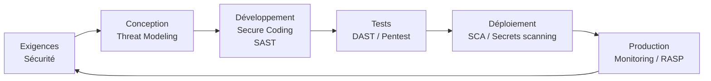

# Secure SDLC — Développement Sécurisé

Le Secure Software Development Lifecycle (Secure SDLC) intègre la sécurité à chaque phase du cycle de développement, plutôt que de l'ajouter en fin de projet. Le coût de correction d'une vulnérabilité est 100× plus faible si détectée en conception qu'en production.

## Intégration de la sécurité dans le SDLC



## Phase 1 — Exigences de sécurité

Définir les exigences de sécurité au même niveau que les exigences fonctionnelles.

**Questions à se poser :**
- Qui peut accéder à quoi ? (matrice de droits)
- Quelles données sont sensibles ? (classification)
- Quelles réglementations s'appliquent ? (RGPD, PCI DSS...)
- Quelles sont les exigences de disponibilité ?
- Faut-il une journalisation à fins légales ?

**Abuse cases** : pour chaque use case, définir le "misuse case" correspondant.
```
Use case : l'utilisateur se connecte
Misuse case : l'attaquant essaie 10 000 mots de passe
→ Exigence : rate limiting 5 tentatives / 15 min, lockout progressif
```

## Phase 2 — Threat Modeling

Processus structuré pour identifier les menaces avant de coder.

### STRIDE

Framework Microsoft pour catégoriser les menaces :

| Lettre | Menace | Propriété violée | Exemple |
|---|---|---|---|
| **S** | Spoofing | Authentification | Usurper l'identité d'un utilisateur |
| **T** | Tampering | Intégrité | Modifier les données en transit |
| **R** | Repudiation | Non-répudiation | Nier avoir effectué une action |
| **I** | Information Disclosure | Confidentialité | Lire les données d'un autre |
| **D** | Denial of Service | Disponibilité | Rendre le service inaccessible |
| **E** | Elevation of Privilege | Autorisation | Obtenir des droits admin |

### Processus de Threat Modeling

```
1. Décomposer le système
   → Diagramme de flux de données (DFD)
   → Identifier : entités, processus, flux, stockages, frontières de confiance

2. Identifier les menaces (par STRIDE ou PASTA)
   → Pour chaque composant : quelle menace STRIDE s'applique ?
   → Librairies comme pytm (Python Threat Modeling) automatisent ça

3. Évaluer les risques
   → DREAD (Damage, Reproducibility, Exploitability, Affected users, Discoverability)
   → Ou score CVSS simplifié

4. Définir les contre-mesures
   → Pour chaque menace : quelle mitigation ?
   → Traduire en tickets de développement
```

```python
# pytm — Threat Modeling as Code
from pytm import TM, Actor, Server, Datastore, Dataflow, Boundary

tm = TM("Application Web")
user = Actor("Utilisateur")
web = Server("Serveur Web")
db = Datastore("Base de données")

internet = Boundary("Internet")
dmz = Boundary("DMZ")

flow1 = Dataflow(user, web, "HTTPS")
flow2 = Dataflow(web, db, "SQL")

# pytm génère automatiquement les menaces STRIDE et un rapport
tm.process()
```

## Phase 3 — Développement sécurisé

### Injection (OWASP #1)

```python
# MAUVAIS — concaténation directe
query = f"SELECT * FROM users WHERE username = '{username}'"

# BIEN — requêtes préparées
cursor.execute("SELECT * FROM users WHERE username = %s", (username,))
```

```javascript
// Node.js — paramètres liés
const query = 'SELECT * FROM users WHERE id = ?';
db.query(query, [userId], (err, results) => { ... });
```

### Authentification et gestion des sessions

```python
# Hachage de mots de passe — Argon2id (recommandé 2024)
from argon2 import PasswordHasher

ph = PasswordHasher(
    time_cost=2,       # Itérations
    memory_cost=65536, # 64 MB
    parallelism=2,     # Threads
)
hash = ph.hash(password)
ph.verify(hash, input_password)  # Lève une exception si invalide

# Génération de tokens de session
import secrets
session_token = secrets.token_urlsafe(32)  # 256 bits

# Cookies sécurisés
response.set_cookie(
    'session',
    value=session_token,
    httponly=True,    # Inaccessible au JavaScript
    secure=True,      # HTTPS seulement
    samesite='Strict',  # Protection CSRF
    max_age=3600
)
```

### Protection XSS

```python
# Python/Jinja2 — échappement automatique
{{ user_input }}          # Échappé automatiquement par Jinja2
{{ user_input | safe }}   # DANGEREUX — désactive l'échappement

# Content Security Policy
response.headers['Content-Security-Policy'] = (
    "default-src 'self'; "
    "script-src 'self' https://cdn.exemple.com; "
    "style-src 'self' 'unsafe-inline'; "
    "img-src 'self' data:; "
    "frame-ancestors 'none';"
)
```

### Protection CSRF

```python
# Flask-WTF — token CSRF automatique
from flask_wtf.csrf import CSRFProtect

csrf = CSRFProtect(app)

# Dans les formulaires HTML
<input type="hidden" name="csrf_token" value="{{ csrf_token() }}"/>

# Pour les APIs : utiliser SameSite=Strict cookies + vérification Origin
```

### Gestion des secrets

```bash
# JAMAIS dans le code source
API_KEY = "sk-1234567890abcdef"  # INTERDIT

# Variables d'environnement
import os
api_key = os.environ.get("API_KEY")

# Gestionnaires de secrets en production
# HashiCorp Vault
import hvac
client = hvac.Client(url='https://vault.exemple.com')
secret = client.secrets.kv.v2.read_secret_version(path='myapp/api-key')

# AWS Secrets Manager
import boto3
client = boto3.client('secretsmanager')
secret = client.get_secret_value(SecretId='myapp/api-key')

# .env pour le développement (jamais commité)
# .gitignore doit contenir : .env, *.key, *.pem, secrets.yml
```

## Phase 4 — Outils d'analyse automatique

### SAST — Static Application Security Testing

Analyse le code source sans exécuter le programme.

| Outil | Langage | Intégration |
|---|---|---|
| **Semgrep** | Multi | CLI, CI/CD, règles custom |
| **Bandit** | Python | Pipelines CI |
| **SonarQube** | Multi | Serveur dédié, PRs |
| **Checkmarx** | Multi | Enterprise, précis |
| **CodeQL** | Multi | GitHub Actions (gratuit open source) |
| **SpotBugs** | Java | Maven/Gradle |
| **ESLint security** | JavaScript | Lint pre-commit |

```bash
# Bandit — Python
pip install bandit
bandit -r ./src -ll  # -ll = seulement medium/high

# Semgrep
semgrep --config=p/python-security ./src
semgrep --config=p/owasp-top-ten ./src

# CodeQL (GitHub Actions)
- uses: github/codeql-action/analyze@v2
  with:
    languages: python
```

### SCA — Software Composition Analysis

Analyse les dépendances tierces pour les vulnérabilités connues (CVE).

```bash
# Python
pip install safety
safety check

# Node.js
npm audit
npm audit fix

# Snyk (multi-langage)
snyk test
snyk monitor  # Surveillance continue

# OWASP Dependency Check
dependency-check.sh --project myapp --scan ./lib
```

### DAST — Dynamic Application Security Testing

Teste l'application en cours d'exécution.

```bash
# OWASP ZAP — scanner automatique
docker run -t owasp/zap2docker-stable zap-baseline.py \
  -t https://staging.monapp.com \
  -r rapport.html

# Nikto — scanner de vulnérabilités web
nikto -h https://staging.monapp.com

# Nuclei — templates de vulnérabilités
nuclei -u https://staging.monapp.com -t cves/ -t exposures/
```

### Secrets Scanning

```bash
# Gitleaks — scanner l'historique git
gitleaks detect --source=. --report-format json

# TruffleHog — profondeur historique
trufflehog git file://. --only-verified

# Pre-commit hook
pip install pre-commit detect-secrets
# .pre-commit-config.yaml :
repos:
  - repo: https://github.com/Yelp/detect-secrets
    hooks:
      - id: detect-secrets
```

## Phase 5 — CI/CD Security Pipeline

```yaml
# GitHub Actions — pipeline sécurisé
name: Security Pipeline

on: [push, pull_request]

jobs:
  sast:
    runs-on: ubuntu-latest
    steps:
      - uses: actions/checkout@v4
      - name: Run Semgrep
        uses: returntocorp/semgrep-action@v1
        with:
          config: p/python-security

  dependency-check:
    runs-on: ubuntu-latest
    steps:
      - uses: actions/checkout@v4
      - name: Run Safety
        run: pip install safety && safety check

  secrets-scan:
    runs-on: ubuntu-latest
    steps:
      - uses: actions/checkout@v4
        with:
          fetch-depth: 0  # Historique complet
      - name: Gitleaks
        uses: gitleaks/gitleaks-action@v2

  container-scan:
    runs-on: ubuntu-latest
    steps:
      - name: Build image
        run: docker build -t myapp:${{ github.sha }} .
      - name: Trivy scan
        uses: aquasecurity/trivy-action@master
        with:
          image-ref: myapp:${{ github.sha }}
          severity: HIGH,CRITICAL
          exit-code: 1  # Fail si vulnérabilité critique
```

## Standards et références

| Standard | Description |
|---|---|
| **OWASP Top 10** | 10 vulnérabilités web les plus critiques |
| **OWASP ASVS** | Application Security Verification Standard (niveaux 1-3) |
| **OWASP SAMM** | Software Assurance Maturity Model |
| **NIST SSDF** | Secure Software Development Framework |
| **SAFECode** | Pratiques fondamentales de développement sécurisé |
| **CWE Top 25** | 25 erreurs de programmation les plus dangereuses |
